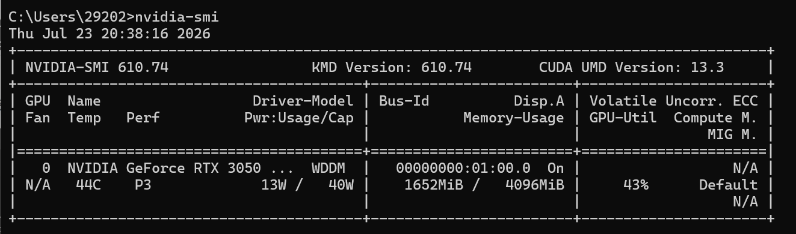
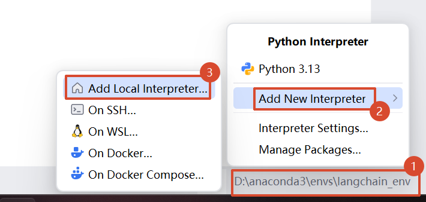
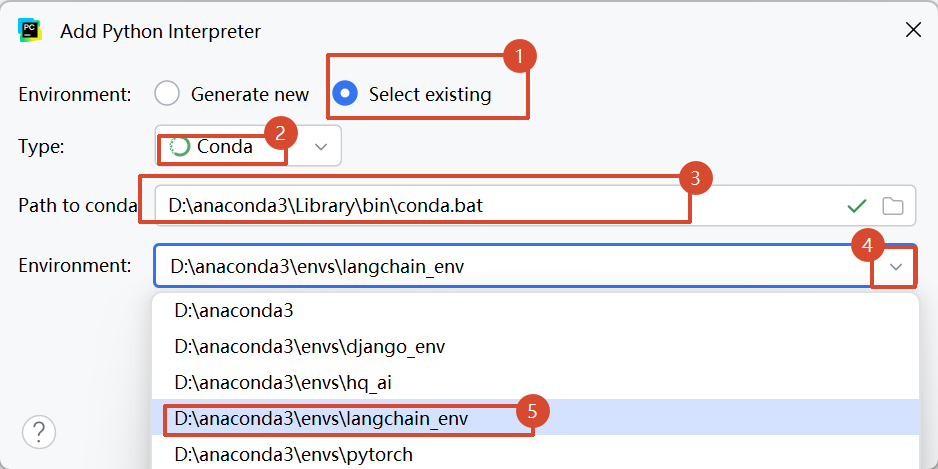
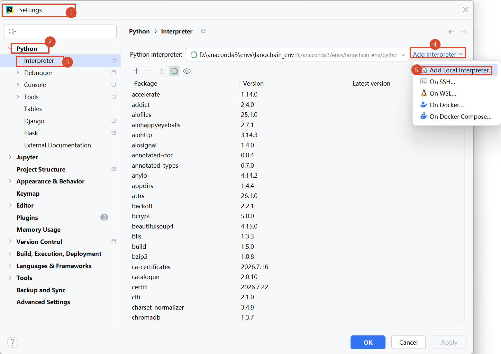

# 一、安装开发环境

开发 IDE 工具：`pycharm` 专业版

虚拟环境：`Anaconda3`

## （一）`pycharm` 专业版

### 安装步骤

[PyCharm 安装 | 菜鸟教程](https://www.runoob.com/pycharm/pycharm-install.html)

### 可能的问题

安装完成之后启动报错 jdk一类的 -- 

- 将之前安装过的 idea、pycharm 清理干净（卸载）
- `C:\Users\cc\AppData\Local\JetBrains、C:\Users\cc\AppData\Roaming\JetBrains`

## （二）`Anaconda3`安装

见文档：[Stu_AI/StuPython/Notbook/python/1_引入.md at main · Clover1105/Stu_AI](https://github.com/Clover1105/Stu_AI/blob/main/StuPython/Notbook/python/1_引入.md)

文档包含了`Anaconda3`安装和`Git Bush`安装过程

# 二、项目开发规则

软件安装在全英文的路径下（不能有中文，容易报错）

项目和文件的创建与保存：

- 命名都遵循大驼峰命名或下划线命名

- 创建好的项目不能直接修改项目名称，以防有同名的内部文件
- 项目应统一管理，存放在专门的项目目录中

# 三、查看计算机硬件情况

1. 英伟达 -- `nvidia-smi`



2. anaconda

环境安装目录：`D:\anaconda3\envs`

常用命令：

```python
# 查看conda版本
conda --version 或 conda -V

# 更新conda
conda update conda

# 创建虚拟环境
conda create -n env_name python_version

# 激活虚拟环境
conda activate env_name

# 退出虚拟环境
conda deactivate

# 删除虚拟环境
conda remove -n env_name --all

# 列出所有虚拟环境
conda env list

# 列出当前环境的所有包
conda list

# 安装第三方包
conda install package_name 或 pip install package_name -i 镜像地址

# 卸载第三方包
conda uninstall package_name 或 pip uninstall package_name
```

# 四、创建虚拟环境

文档中有步骤：[Stu_AI/StuPython/Notbook/python/1_引入.md at main · Clover1105/Stu_AI](https://github.com/Clover1105/Stu_AI/blob/main/StuPython/Notbook/python/1_引入.md)

anaconda 创建出来的环境称为虚拟环境

安装了 anaconda 软件就不需要安装 python.exe，因为 anaconda 自带 python 环境

虚拟环境的作用：

- 开发 python 项目的时候需要环境中的库来解析代码、执行代码， 默认情况下环境中会自带很多的库，这些自带了的我们直接用即可
- 如果环境中没有需要的库，必须先激活虚拟环境后，通过`pip install ...`下载之后再使用

项目开发阶段，python的版本固定为3.12

anaconda 最主要的作用就是：环境隔离

- 由于不同类型的项目可能存在包的保本情况不一致，那么我们就需要针对于某一类型的项目创建一 个开发环境/虚拟环境

# 五、`pycharm`项目中引入虚拟环境

方式一：





方式二：




# 六、项目学习关键点

==用什么技术解决什么问题？遇到什么问题用什么技术解决？==