# 一、大模型的问题

在实际企业应用中，单纯依赖大语言模型（LLM）会面临以下关键问题：

> “幻觉”问题（Hallucination）
>
> 知识时效性不足
>
> 缺乏可解释性与可追溯性
>
> 知识固化问题

同时在真实业务场景中，企业对 AI 系统通常有更高要求：

> 数据可信与权威性
>
> 知识动态更新能力
>
> 可解释与可追溯
>
> 高精度业务支持能力

为了解决大模型面临的幻觉问题、数据时效性问题、私有化数据等问题，我们可以选择以下两种方案来解决：

方案一：

- **微调**，通常使用 `llamafactory` 框架来实现，它需要自己准备数据集、算力、基座模型等，让基座模型学习其能力以外的信息，最后在合并；这个操作过程改变了模型的参数信息

方案二：

- **RAG（检索-增强-生成）**，它是通过在大模型回复用户问题之前，先去基于用户的问题在外部挂载的知识库里面查询相关的信息，然后把==相关信息的前几条和问题一起送入给大模型【大模型在回答问题的时候有参考的数据信息，等价于看着答案回答问题】==，大模型在回复

# 二、RAG

## （一）定义

RAG（Retrieval-Augmented Generation）通过引入**外部知识库**，解决了大模型（LLM）存在的幻觉问题、时效性差以及私有数据匮乏等痛点

- **检索 (Retrieval)：** 像是在查字典，从海量非结构化数据中精准定位与问题相关的“上下文”
- **增强 (Augmentation)：** 将搜到的“标准答案参考资料”塞进 Prompt，给 LLM 开卷考试的机会
- **生成 (Generation)：** LLM 不再盲目猜测，而是基于参考资料进行逻辑归纳和文本润色

## （二）核心思想

==RAG = **检索（Retrieval）+ 生成（Generation）**==

通过结合传统的**生成式语言模型**和**动态检索机制**【不再仅依赖模型“记忆”，而是：**先查资料，再回答问题**】，实时从**外部知识库**中检索信息，增强模型的生成输出

## （三）RAG 工作流程

### 1. 底层基础设施

| **组件**              | **说明**   | **技术关键点**                                          |
| --------------------- | ---------- | ------------------------------------------------------- |
| **Embedding Model**   | 向量化模型 | 将文字转为数学向量（如 OpenAI `text-embedding-3`）      |
| **Vector Database**   | 向量数据库 | 存储和检索向量（如 Chroma, Milvus, Pinecone, Weaviate） |
| **Chunking Strategy** | 分块策略   | 如何切分长文档（固定长度、语义切分、重叠切分）          |
| **Rerank Model**      | 重排序模型 | 对初步检索的结果进行二次精排，提升准确率                |

### 2. 流程

#### （1）**离线数据准备**（摄入）

**文档加载**：读取 PDF、Markdown、Word 等原始格式文件。

**文本切分 (Chunking)**：将长文切成 300-500 字的片段，并保留一定的 **Overlap（重叠度）** 以维持语义连贯。

**向量化 (Embedding)**：调用模型将每个 Chunk 转为高维向量。

**持久化**：将“向量+原始文本+元数据”存入向量数据库。

#### （2）**在线检索生成**（推理）

**用户查询处理：** 对 User Query 进行 Embedding 转化

**向量检索：** 在数据库中执行 **余弦相似度** 或 **欧氏距离** 搜索，获取 Top-k 个片段

**重排序 (Reranking) [推荐增加]：** 使用专门的重排序模型对 Top-k 结果进行相关性打分，过滤掉噪音

**Prompt 构建：** 将检索到的知识按模板拼接

> **模板示例：** "已知信息：{context}。请根据上述信息回答用户问题：{query}。如果信息不足，请直说不知道。"

**LLM 生成：** 投喂给大模型，生成带有事实依据的回复

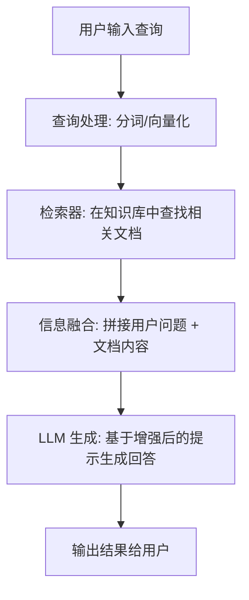

## （四）优势与挑战

### 1. 优势

准确性、时效性、透明度、定制化能力、可扩展性

### 2. 挑战

准确性依赖、多上下文相关信息的处理、计算成本与速度、集成设计与优化、隐私与合规问题、局限性

# 三、RAG的回复过程

## （一）大模型

用户输入问题 \==> 提交给大模型 \==> 大模型生成回复

## （二）大模型 + RAG

用户输入问题 \==> 基于用户的问题做外部知识库的检索 \==> 筛选检索结果 \==> 把筛选后的结果和问题一起提交给大模型 \==> 大模型生成回复

# 四、检索

==文本之间如何计算相关性==

问题：发生家庭暴力后应该怎么办？ 

MySQL 数据库中的数据存储假设： 

- 发生家庭暴力后的处理措施 
- 发生家庭暴力后的解决方案 

如果走 MySQL 搭建知识库，行不通，like 或者 = 匹配不上内容 ，这个时候，应该使用**向量数据库** 

我们需要计算机去处理文本的时候，通过以下操作：**向量化模型处理为向量然后来计算** 

- 先对文本进行切分 —— 分词 —— 得到 token 
- 查询词表【不同的分词模型的词表是不一样的】，得到 token id【数字】 
- 然后把 token id 拿去做计算，最后在基于这个 token id 找到对应的词 

在 LLM 中，处理词语之间的相关性，我们通过使用的是余弦相似度，向量化模型把文本处理为向量之后，如果两个文本之间的相似度高，那么他们就离得近。比如国王与男人离得近；国王与王后离得远 

在我们通过问题检索数据的时候，我们会提前把数据导入到数据库中【向量数据库】，导入的数据 都是向量化后的数据 —— 基于问题检索步骤： 

- 第一步：问题向量化 
- 第二步：问题和向量数据库中的所有问题依次做余弦相似度比对 
- 第三步：返回 top-k

# 五、创建学习RAG的项目

## （一）构建虚拟环境

项目阶段统一创建一个虚拟环境来使用，命名为 langchain_env

整个RAG项目阶段所有安装环境（在虚拟环境中安装）

```python
pip install "unstructured[pptx]" "unstructured[image]" "unstructured[md]" "unstructured[pdf]"

pip install chromadb==1.3.7 langchain==1.1.0 langgraph==1.0.10 neo4j==6.1.0 "fastapi[standard]"

pip install langchain-community==0.4.1 unstructured==0.22.21 unstructured-client==0.43.2 python-magic==0.4.27

pip install langchain-text-splitters

pip install modelscope addict datasets simplejson sortedcontainers

pip install langchain_openai==1.1.11

pip install -U sentence-transformers==5.5.1

pip install sentence-transformers==5.5.1

pip install ragas==0.4.3
```

安装 Tesseract-OCR（开源文字识别引擎）：【https://digi.bib.uni-mannheim.de/tesseract/】

中文需要安装中文包，并配置系统加载路径：chi_sim.traineddata【下载地址：https://github.com/tesseract-ocr/tessdata/】

```cmd
# Tesseract-OCR -- 例如安装在D:\Program Files\tesseract-ocr

# 配置环境变量：D:\Program Files\tesseract-ocr

# 下面两个内容放在D:\Program Files\tesseract-ocr\tessdata
chi_sim.traineddata ：用于简体中文字符识别
chi_tra.traineddata ：用于繁体中文字符识别

# 代码中
import unstructured_pytesseract.pytesseract as pytesseract
pytesseract.tesseract_cmd = r"D:\Program Files\tesseract-ocr\tesseract.exe"
```

处理若图片OCR识别的时候`unstructured_pytesseract`库不存在的问题——安装unstructured相关依赖包——安装之后`pytorch`会被替换为2.13左右的版本，我们在重新安装一遍`pytorch`就行了

```cmd
pip install "unstructured[pptx]" "unstructured[image]" "unstructured[md]" "unstructured[pdf]"
```

基于计算机英伟达显卡支持的最高版本CUDA，下载深度学习框架 `pytorch`

（最后安装`pytorch`，否则会有可能被其他库给覆盖）

```cmd
# 打开网站
https://pytorch.org/

# 如果电脑是50系列显卡的，需要安装pytorch>=2.7
# 50系列显卡安装深度学习框架pytorch库命令：
pip install torch==2.7.0 torchvision==0.22.0 torchaudio==2.7.0 --index-url https://download.pytorch.org/whl/cu126

# 不是50系列的同学：
pip install torch==2.6.0 torchvision==0.21.0 torchaudio==2.6.0 --index-url https://download.pytorch.org/whl/cu126

# 没有英伟达显卡的 -- CPU：
pip install torch==2.6.0 torchvision==0.21.0 torchaudio==2.6.0 --index-url https://download.pytorch.org/whl/cpu
```

## （二）新建项目

新建项目步骤：

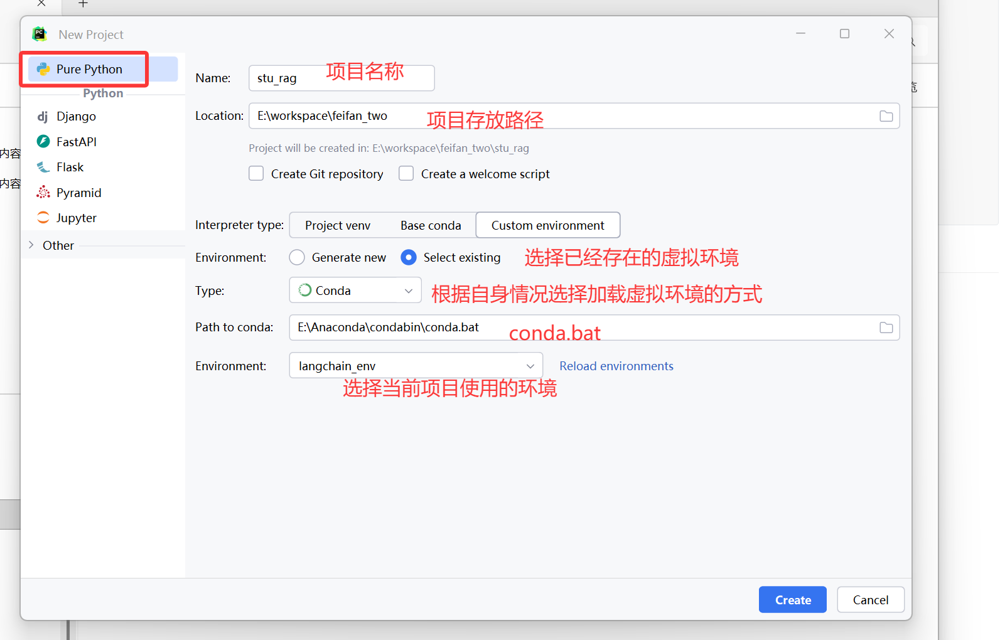

导入数据集：

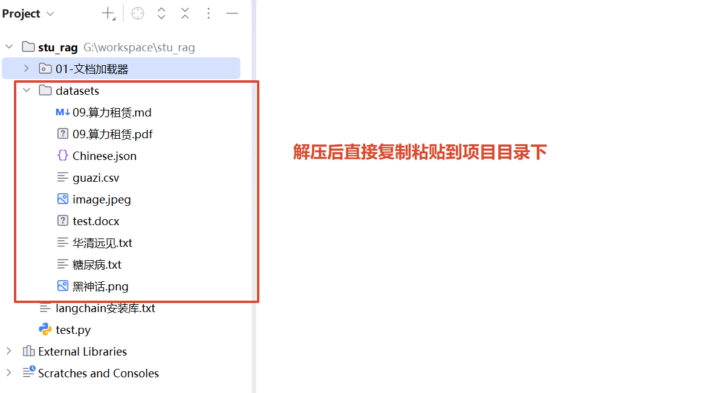

# 六、RAG知识库

## （一）加载器

<span id="方法">**获取路径的方法：**</span>

- 方法一：获取当前文件所在目录的上一级目录

    - `str(Path(os.path.dirname(__file__)).parent)`

     - `__file__`: 当前文件路径 (例如: .../01-文档加载器/01-txt文件加载器.py)

     - `os.path.dirname(...)`: 去掉文件名，只留目录 (.../01-文档加载器)

     - `Path(...).parent`: 获取父目录 (.../stu_rag)

     - `str(...)`: 转换为字符串


- 方法二：获取当前文件所在的绝对路径目录

    - `os.path.dirname(os.path.abspath(__file__))`

     - `__file__`: 当前文件路径

     - `os.path.abspath(...)`: 转为绝对路径 (.../01-文档加载器/01-txt文件加载器.py)

     - `os.path.dirname(...)`: 获取目录 (.../01-文档加载器)

**拼接路径：**

- `os.path.join(...)`: 这是一个智能拼接函数。
- 它会根据操作系统自动添加正确的分隔符（Windows下是 \，Linux/Mac下是 /），避免手动拼接字符串时出现斜杠错误

**为什么需要`Loader`：**

在 RAG 中，第一步不是让大模型读取文件，而是：

- 原始数据 \==> Loader加载 \==> Document对象 \==> 文本切分 \==> 向量化 \==> 存入向量数据库 \==> 检索 \==> 大模型回答

- Loader 的作用就是：

    - 将各种格式的数据（txt、pdf、网页、word等）转换成 `LangChain` 可以统一处理的 Document 对象。

    - 因为不同数据格式读取方式不同，所以 `LangChain` 提供不同 Loader 来处理不同数据
        - txt 文件 \==> 直接读取文本 \==> 
        - pdf \==> 需要解析页面 \==> 
        - 网页 \==> 需要解析HTML \==> 
        - word \==> 需要解析文档结构 \==> 

**`Document` 是 `LangChain` 定义的数据结构，它主要有两个重要部分：**

- page_content：保存真正的文本内容
- metadata：保存文本的额外信息

**注意**：数据集和代码文件处于不同包（文件夹）中

### 1. txt文件加载器

案例代码--teacher：

```python
# 导入加载器类
from langchain_community.document_loaders import TextLoader
```

> `TextLoader` 是 `LangChain` 提供的文本文件加载器。
>
> 主要负责：打开 txt 文件、读取文件内容、创建 Document 对象

```python
# 获取文件路径
import os
from pathlib import Path

# 获取项目根路径
base_path = str(Path(os.path.dirname(__file__)).parent)
# 拼接数据集路径
file_path = os.path.join(base_path, "datasets", "华清远见.txt")
```

> `os`：用于路径连接，文件操作
>
> `os.path.join()`：可以自动生成正确路径
>
> `pathlib`：用于更加方便地处理路径
>
> `Path(__file__)`：获取当前 Python 文件的位置

```python
def main():
    # 加载TextLoader对象
    loader = TextLoader(
        file_path=file_path,  # 加载的文件路径
        encoding="utf-8",  # 文件编码
    )
    # 加载数据
    data = loader.load()
    """
    load() 是文档加载器（Loader）最核心的方法
    读取指定路径的文件内容，并将其转换为程序可以处理的 Document 对象列表
    """
    # 打印数据
    print(data)
    print("*-"*50)
    # 遍历打印
    for index, item in enumerate(data):
        print(index)
        print(item)
```

> 创建 `TextLoader` 加载器对象时密钥读取文件，只是告诉`TextLoader`要读取哪个文件，用什么编码读取
>
> 加载文本/数据，读取文本内容，创建Document对象，最后返回列表
>
> 最后将列表打印输出，或者遍历打印输出

```python
# main + enter
if __name__ == "__main__":
    main()
```

> 只有当该文件为执行文件时，才会调用main函数，创建加载器对象等操作

案例代码--mine：

```python
"""
步骤：
1. 导入加载器类、os、path
2. 获取文件路径
3. 判断是否为执行文档
4. 创建加载器对象，加载数据，输出打印
"""

# 导入
from langchain_community.document_loaders import TextLoader
import os
from pathlib import Path

# 获取
path_base = str(Path(os.path.dirname(__file__)).parent)
file_path = os.path.join(path_base, "datasets","华清远见.txt")

# 加载器对象，加载数据，打印
def txt():
    # 对象
    loader = TextLoader(
        file_path = file_path,
        encoding = "utf-8"
    )
    # 数据
    data = loader.load()
    # 打印
    for index, item in enumerate(data):
        print(f"第{index+1}条数据：")
        # page_content -- 访问 Document 对象中文本内容的属性
        print(item.page_content)    # 只输出文本内容
        print("-"*50)

# 判断
if __name__ == "__main__":
    txt()
```

### 2. 图片加载器

案例代码--teacher：

```python
# 要识别图片中的文件需要借助OCR技术
import unstructured_pytesseract.pytesseract as pytesseract
from langchain_community.document_loaders import UnstructuredImageLoader

# 配置自己安装的tesseract.exe路径
pytesseract.tesseract_cmd = r"D:\MyDownload\tesseract-ocr\Tesseract-OCR\tesseract.exe"
```

> `UnstructuredImageLoader（图片加载器）`：把外部数据加载成 `LangChain` 的 `Document` 对象，供后续 RAG 流程使用，需要借助 OCR 从图片中识别文字，这个 Loader 专门处理（`png`、`jpg`、`jpeg`、`bmp`）
>
> 图片 \==> OCR识别 \==> 文本 \==> Document \==> RAG
>
> 普通文本可以直接通过`TextLoader`加载器直接读取，可图片不行，里面存储的是像素信息，计算机不知道里面写了什么，所以需要 `OCR（Optical Character Recognition）` 即光学字符识别，将图片中的文字转换成计算机可以处理的文本
>
> `pytesseract`：是 Python 调用 Tesseract OCR 的接口，本身不是 OCR 模型，真正干活的是`Tesseract-OCR`这个软件
>
> 配置 Tesseract 路径：告诉 Python， OCR 软件安装在哪里，如果不配置，可能报错：`TesseractNotFoundError`

```python
# 获取文件路径
import os
from pathlib import Path

# 获取项目根路径
base_path = str(Path(os.path.dirname(__file__)).parent)
# 拼接数据集路径
file_path = os.path.join(base_path, "datasets", "黑神话.png")
```

> [跳转到方法]: #方法

```python
if __name__ == "__main__":
    # 加载图片
    loader = UnstructuredImageLoader(
        file_path=file_path,
        mode="elements",    # mode="elements"：指定解析模式。
        # "elements" 模式会将图片中的内容解析为结构化的元素（如标题、段落、表格等），而不是仅仅返回一整段纯文本。
        languages=["chi_sim"]   # 指定 OCR 识别的语言为简体中文（Chinese Simplified）。
        # 如果不指定，Tesseract 默认只识别英文，会导致中文变成乱码。
    )
    data = loader.load()
    print(data)
    print("-" * 100)
    for item in data:
        print(item.page_content, end="")
```

> 判断是否为执行文件，若是，则开始加载图片
>
> 创建`UnstructuredImageLoader`加载器对象（图片路径，指定解析模式，指定 OCR 识别的语言）
>
> 加载图片，识别图片内容，创建Document对象，最后返回列表
>
> 打印输出图片中的内容

案例代码--mine：

```python
"""
步骤：
1. 导入加载器类、 OCR 软件接口、os、path
2. 配置OCR安装路径
3. 获取图片路径
4. 判断是否为执行文档
5. 创建加载器对象，加载数据，输出打印
"""
# 导入
from langchain_community.document_loaders import UnstructuredImageLoader
import unstructured_pytesseract.pytesseract as pytesseract
import os
from pathlib import Path

# 配置安装路径
pytesseract.tesseract_cmd = r"D:\MyDownload\tesseract-ocr\Tesseract-OCR\tesseract.exe"

# 获取图片路径
path_base = str(Path(os.path.dirname(__file__)).parent)
file_path = os.path.join(path_base,"datasets","黑神话.png")

# 判断
if __name__ == "__main__":
    # 创建加载器对象
    loader = UnstructuredImageLoader(
        file_path = file_path,
        mode = "elements",
        languages = ["chi_sim"]
    )
    # 加载数据
    data = loader.load()
    # 打印
    for item in data:
        print(item.page_content)
```

### 3. `json`格式和字典相互转换

`json`：

   1. 满足键值对格式的字符串：{key1: value1, key2: value2}
   2. `json`字符串是需要双引号括起来的

字典 \==> `json`字符串：`json.dumps()`

`json`字符串 \==> 字典：`json.loads()`

==安装`jq`库：`pip install jq`==

```python
import json

if __name__ == "__main__":
    # 定义一个字典
    data_dict = {
        "name": "张三",
        "age":18,
        "is_student": True,
        "courses": ["Math", "Science"],
        "address": {
            "street": "123 Main St",
            "city": "Anytown"
        }
    }
    # 将字典转换为json字符串
    data_json = json.dumps(data_dict)
    print(data_json, type(data_json))
    # 将json字符串转换为字典
    data_dict2 = json.loads(data_json)
    print(data_dict2)
```

### 4. `json`加载器

案例代码--teacher：

```python
from langchain_community.document_loaders import JSONLoader
```

> `JSONLoader`：将 JSON 文件中的数据转换成 `LangChain` 的 Document 对象，供后续 RAG 使用。

```python
import os
from pathlib import Path

# 获取项目根路径
base_path = str(Path(os.path.dirname(__file__)).parent)
# 拼接数据集路径
file_path = os.path.join(base_path, "datasets", "Chinese.json")
```

> [链接到方法]: #方法

```python
if __name__ == "__main__":
    loader = JSONLoader(
        file_path=file_path,
        jq_schema='.[] | "instruction:" +  .instruction  + "\\n" +  "input:" +  .input + "\\n" +  "output:" +  .output',
    )
    data = loader.load()
    for item in data:
        print(item.page_content)
        print("-" * 100)
```

`jq_schema='.[] | "instruction:" + .instruction + "\\n" + "input:" + .input + "\\n" + "output:" + .output'`

> 使用 `jq` 语法告诉 `JSONLoader` 如何提取 JSON 数据。因为 `JSONLoader` 比前两个加载器稍微复杂一些，因为 **JSON 文件结构不固定**，所以需要告诉 Loader：我想从 JSON 哪个字段取数据，以及如何组织成文本。
>
> **`.[]`**：迭代操作符 -- 遍历 JSON 数组中的每一个元素。
>
> - 假设你的 JSON 文件是一个列表（数组），这个符号表示“遍历列表中的每一个元素”。如果不加这个，程序会尝试处理整个列表对象，而不是里面的具体条目。
>
> **`|`**：管道操作符。
>
> - 它将左边 `.[]` 产生的每一个元素传递给右边的表达式进行处理。
>
> **`.[]`**：获取字段
>
> - 原：`"instruction":"什么是RAG"`，获取后：`什么是RAG`
>
> `"instruction:" + .instruction`：字符串拼接。
>
> - `"instruction:"` 是固定的标签前缀。
> - `.instruction` 提取当前元素中名为 `instruction` 的字段值。
> - `+` 将它们连接在一起。
>
> **`"\\n"`**：换行符。
>
> - 在 Python 字符串中写成 `\\n`，传递给 `jq` 解析器后会被识别为 `\n`，即换行。这确保了 instruction、input 和 output 三部分在输出时各占一行，结构清晰。
>
> **整体逻辑**：对于 JSON 列表中的每一条数据，将其重组为如下格式的纯文本：
>
> ```
> instruction: <指令内容>
> input: <输入内容>
> output: <输出内容>
> ```

案例代码--mine：

```python
"""
步骤：
1. 导入加载器类、os、path
2. 获取文件路径
3. 判断是否为执行文档
4. 创建加载器对象，加载数据，输出打印
"""
# 导入
from langchain_community.document_loaders import JSONLoader
import os
from pathlib import Path

# 获取文件路径
path_base = str(Path(os.path.dirname(__file__)).parent)
file_path = os.path.join(path_base, "datasets","Chinese.json")

# 判断
if __name__ == "__main__":
    # 创建加载器对象
    loader = JSONLoader(
        file_path = file_path,
        jq_schema = '.[] | "instruction:" + .instruction + "\\n" + "input:" + .input + "\\n" + "output:" + .output'
    )
    # 加载数据
    data = loader.load()
    # 打印
    for item in data:
        print(item.page_content)
```

### 5. 网页文档加载器

`WebBaseLoader`：从网页 URL 获取网页内容，并转换成 `LangChain` 的 Document 对象

网页不像txt一样直接保存文本，而是HTML结构，因此需要通过`BeautifulSoup`进行解析。

网页URL \==> HTTP请求获取HTML \==> `BeautifulSoup`解析网页 \==> 提取文本 \==> Document对象 \==> 文本切分 \==> Embedding

`SoupStrainer`：网页（HTML）解析，告诉 `BeautifulSoup`，只想解析网页中的某些部分

`bs_kwargs`：全称`BeautifulSoup kwargs`，给 `BeautifulSoup` 传递额外配置

`parse_only`：只解析指定区域

指定具体的标签：`SoupStrainer("div", {"class": "main-content"})`

```python
"""
步骤：
1. 导入加载器类、网页解析、os、path
2. 获取网页路径
3. 判断是否为执行文档
4. 创建加载器对象，加载数据，输出打印
"""
# 导入
from langchain_community.document_loaders import WebBaseLoader
from bs4 import SoupStrainer

# 获取网页路径
url = "https://www.sanxiau.edu.cn/"

# 判断
if __name__ == "__main__":
    # 创建加载器对象
    loader = WebBaseLoader(
        url,
        bs_kwargs = {
            # 只解析标题和div标签
            "parse_only": SoupStrainer(("title","div")),
            # 只解析指定的具体标签
            # "parse_only": SoupStrainer("div",{"class":"wrap"})
        }
    )
    # 加载数据
    data = loader.load()
    # 输出打印
    for items in data:
        print(items.page_content)
```

### 6. PDF加载器

**PDF 文档加载器**：

- PDF 文件不仅包含文本，还可能包含图片、表格、公式等内容，因此需要专门的解析工具读取
- 在 RAG 中，LLM 无法直接理解 PDF 文件，因此需要先将 PDF 中的内容提取出来，再转换为 LangChain 能够处理的 `Document` 对象
- PDF文件 \==> PDF解析工具 \==> Document对象 \==> 文本切分(`TextSplitter`) \==> 向量化(Embedding \==> 向量数据库(Vector Store)
- PDF 加载器的作用就是完成第一步：读取 PDF，并提取其中的文本信息

**常见PDF解析工具**：

| 工具                                  | 主要特点                                     | 适用场景     |
| ------------------------------------- | -------------------------------------------- | ------------ |
| PyPDF2（现已更名为 pypdf）            | 支持读取、拆分、合并 PDF，也可以提取文本     | 普通文本 PDF |
| pdfminer.six（PDF2Text）              | 专注于文本提取，文本解析能力较强             | 文本型 PDF   |
| PyMuPDF（fitz）                       | 解析速度快，兼容性好                         | 大多数 PDF   |
| GROBID                                | 能够识别标题、作者、摘要、参考文献等文档结构 | 学术论文     |
| OCR（PaddleOCR、RapidOCR、Tesseract） | 识别图片中的文字                             | 扫描版 PDF   |

**LangChain 中常见 PDF Loader**：

- LangChain 没有统一的 `PDFLoader`，而是提供了多种 PDF Loader

> ```python
> from langchain_community.document_loaders import PyPDFLoader
> from langchain_community.document_loaders import PyMuPDFLoader
> from langchain_community.document_loaders import PDFMinerLoader
> from langchain_community.document_loaders import UnstructuredPDFLoader
> ```

- **PyPDFLoader**：最常用，适合大多数文本型 PDF。
- PyMuPDFLoader：解析速度快，兼容性较好。
- PDFMinerLoader：文本提取能力较强。
- UnstructuredPDFLoader：可以识别标题、段落等结构信息。

**pdfminer 与 PyPDFLoader 的区别**：

| pdfminer.six           | PyPDFLoader          |
| ---------------------- | -------------------- |
| 返回字符串（str）      | 返回 Document 对象   |
| 不能直接接入 LangChain | 可直接用于 LangChain |
| 没有 metadata          | 包含 metadata        |
| 适合单独提取文本       | 适合 RAG 知识库构建  |

**pdfminer.six**

```python
"""
步骤：
1. 导入extract_text、os、path
2. 获取文件路径
3. 判断是否为执行文档
4. 提取文本，输出打印
"""

# 导入
from pdfminer.high_level import extract_text
import os
from pathlib import Path

# 获取文件路径
path_base = str(Path(os.path.dirname(__file__)).parent)
pdf_path = os.path.join(path_base,"datasets","09.算力租赁.pdf")

# 判断
if __name__ == "__main__":
    # 提取文本
    text = extract_text(pdf_path)
    # 输出打印
    print(text)
```

**PyPDFLoader**

```python
"""
步骤：
1. 导入加载器类、os、path
2. 获取文件路径
3. 判断是否为执行文档
4. 创建加载器对象，加载数据，输出打印
"""

# 导入
from langchain_community.document_loaders import PyPDFLoader
import os
from pathlib import Path

# 获取文件路径
path_base = str(Path(os.path.dirname(__file__)).parent)
pdf_path = os.path.join(path_base,"datasets","09.算力租赁.pdf")

# 判断
if __name__ == "__main__":
    # 创建加载器对象
    loader = PyPDFLoader(
        pdf_path
    )
    # 加载数据
    data = loader.load()
    # 输出打印
    for items in data:
        print(items.page_content)
```

**注意**：

- 普通文本 PDF：可直接使用 `PyPDFLoader`、`PyMuPDFLoader` 等加载器。
- 扫描版 PDF：需要结合 OCR 才能识别图片中的文字。
- `PyPDFLoader` 默认按**页**加载，每一页对应一个 `Document`。

**报错与解决**（目前没有遇到）：

```python
ImportError: cannot import name 'HOCRConverter' from 'pdfminer.converter' (E:\Anaconda\envs\nlp_env\Lib\site-packages\pdfminer\converter.py). Did you mean: 'HTMLConverter'?
```

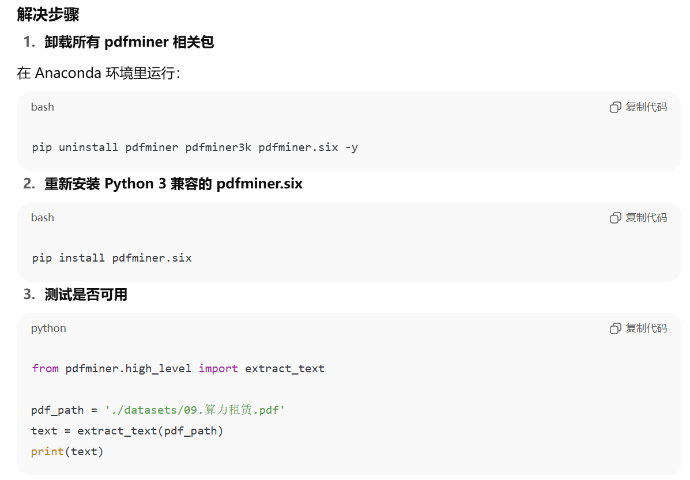

### 7. word加载器

**Word 文档**：

- Word（`.docx`）是一种常见的办公文档格式，可以保存文本、图片、表格、超链接等内容，广泛应用于办公文档、合同、产品说明书等场景。
- 在 RAG 中，需要先将 Word 文档中的内容提取出来，再转换为 `Document` 对象，供后续文本切分、向量化和检索使用。

**Docx2txtLoader（LangChain）**：

- `Docx2txtLoader` 是 LangChain 提供的 Word 文档加载器，用于读取 **.docx** 文件，并将文档内容转换为 `Document` 对象。
- 安装依赖：`pip install docx2txt`
- 导入：`from langchain_community.document_loaders import Docx2txtLoader`

```python
"""
步骤：
1. 导入加载器类、os、path
2. 获取文件路径
3. 判断是否为执行文档
4. 创建加载器对象，加载数据，输出打印
"""
# 导入
from langchain_community.document_loaders import Docx2txtLoader
import os
from pathlib import Path

# 获取文件路径
path_base = str(Path(os.path.dirname(__file__)).parent)
docx_path = os.path.join(path_base, "datasets","test.docx")

# 判断
if __name__ == "__main__":
    # 创建加载器对象
    loader = Docx2txtLoader(
        file_path = docx_path
    )
    # 加载数据
    data = loader.load()
    # 输出打印
    for item in data:
        print(item.page_content)
```

**python-docx（重要）**：

- `python-docx` 是 Python 中专门用于操作 Word 文档的第三方库。
- 不仅可以读取 Word 文档，还支持：读取段落、读取表格、修改文档、创建新的 Word 文档
- 安装：`pip install python-docx`
- 导入：`from docx import Document`
- Document 对象：
    - `Document()`：表示 **python-docx 的 Document 对象**，用于表示一个 Word 文档
    - 它与 LangChain 中的 **Document 对象** 完全不同
    - 创建对象：`doc = Document(file_path)`
    - 执行流程：Word \==> Document() \==> Document对象
    - 创建完成后，可以通过 `doc` 获取 Word 中的各种内容
        - `doc.paragraphs`    # 所有段落
        - `doc.tables`        # 所有表格（tables表格、rows行、cells单元格、text属性--获取单元格文本内容）
        - `doc.sections`      # 所有节

```python
"""
步骤：
1. 导入库、os、path
2. 获取文件路径
3. 判断是否为执行文档
4. 创建 Document 对象，创建打印列表
5. 按 表格==>行==>单元格 遍历 Document 对象，添加到打印列表
6. 打印 -- 打印列表
"""
# 导入
from docx import Document
import os
from pathlib import Path

# 获取文件路径
path_base = str(Path(os.path.dirname(__file__)).parent)
docx_path = os.path.join(path_base, "datasets","test.docx")

# 判断
if __name__ == "__main__":
    # 创建 Document 对象
    doc = Document(docx_path)
    # 创建打印列表
    list = []
    # 遍历
    for table in doc.tables:    # 表格，表格对象
        # print(table,"*-"*10)
        for row in table.rows:  #  行，行对象
            # print(row,"**"*10)
            # 创建行列表
            row_list = []
            for cell in row.cells:  # 单元格，单元格对象
                # print(cell)
                # print(cell.text)    # 获取单元格对象的文本内容
                row_list.append(cell.text)
            list.append(row_list)
    # 打印
    for items in list:
        print(items)
```

**Docx2txtLoader 与 python-docx 对比**：

| Docx2txtLoader          | python-docx                        |
| ----------------------- | ---------------------------------- |
| 属于 LangChain          | 独立第三方库                       |
| 返回 `Document` 对象    | 返回 `Document`（python-docx）对象 |
| 主要提取文本内容        | 可读取文本、表格等结构化内容       |
| 适合 RAG 知识库构建     | 适合 Word 文档解析与编辑           |
| 可直接接入 TextSplitter | 通常需要自行处理数据               |

## （二）文本分割

### 1. 为什么需要文本分割

在 RAG（Retrieval-Augmented Generation）中，**文本分割（Text Splitting）** 是数据处理过程中非常重要的一步。

如果直接把一篇几万字的文档送入向量数据库，会带来很多问题：

- **超出模型上下文长度**
    - Embedding 模型和大语言模型都有输入长度限制，长文档无法一次编码。
- **检索精度下降**
    - 一个文本块包含多个主题时，生成的向量会混合多个语义，降低相似度检索效果。
- **推理成本增加**
    - 每次检索返回的大块文本都会占用更多 Token，增加推理成本和响应时间。

因此，在建立知识库之前，需要将长文档拆分成多个**语义相对完整、长度适中的文本块（Chunk）**。

### 2. 文本分割的两个核心参数

**Chunk Size（块大小）**：

- 表示每个文本块允许的最大长度。
- `chunk_size = 300` -- 表示每个 Chunk 最多约 300 个字符（或 Token）。
- Chunk 太小：上下文不足，信息容易缺失
- Chunk 太大：检索精度下降，容易超过模型输入限制

**Chunk Overlap（块重叠）**：

- 表示相邻两个 Chunk 之间保留多少重复内容。

- `chunk_overlap = 50` 

    ```
    ......ABCDE......
    ```

    ```
    Chunk1：
    ......ABCDE
    
    Chunk2：
    BCDE......
    ```

    其中 **BCDE** 就属于重叠部分

- 目的：保留上下文连续性，避免一句话刚好被切成两半导致语义丢失

- 一般都会设置一定的 Overlap，而不是完全没有重叠

### 3. LangChain 中的文本分割

- LangChain 提供了丰富的文本分割器，其中最常用的是：`RecursiveCharacterTextSplitter`
- 它采用**递归分割**策略，优先按照设定好的分隔符进行切分
- 如果当前文本块仍然超过 `chunk_size`，就继续使用下一层分隔符进行切分，直到满足长度要求
- 因此，它兼顾了：尽量保持语义完整、控制文本块大小
- 也是目前 RAG 项目中使用最广泛的文本分割器之一
- 导入：`from langchain_text_splitters import RecursiveCharacterTextSplitter`

| **参数**             | **类型**  | **默认值**              | **说明**                                    | **适用场景 / 备注**                                      |
| -------------------- | --------- | ----------------------- | ------------------------------------------- | -------------------------------------------------------- |
| `chunk_size`         | int       | 1000                    | 每个文本块的最大长度（字符或 token 数）     | 控制切分粒度，块太小上下文不足，块太大可能超长           |
| `chunk_overlap`      | int       | 200                     | 相邻文本块之间的重叠长度（字符或 token 数） | 避免切分断裂语义                                         |
| `separators`         | list[str] | ["\n\n", "\n", " ", ""] | 按优先级依次尝试的分隔符                    | 中文场景可加入 "。", "，"，先按段落 → 换行 → 空格 → 字符 |
| `length_function`    | callable  | `len`                   | 计算文本长度的方法                          | 可用 token 计数函数，确保与 Embedding 模型输入长度一致   |
| `is_separator_regex` | bool      | False                   | 是否将 `separators` 当作正则表达式处理      | 复杂文本分割时使用                                       |
| `keep_separator`     | bool      | False                   | 是否在生成的文本块中保留分隔符              | 保留分隔符有助于保持段落结构                             |
| `add_start_index`    | bool      | False                   | 是否在文档中添加每个块的起始字符索引        | 用于追踪原始文档位置                                     |

- 常用分割方法：
    - `split_text()`：用于**切分普通字符串（str）**，返回一个字符串列表（`list[str]`）
    - `split_documents()`：用于**切分 LangChain 的 `Document` 对象列表**，返回值仍然是 `Document` 对象列表
    - `create_documents()`：如果已经有多个字符串，希望直接转换成 `Document` 对象并完成切分，可以使用 `create_documents()`，如果提供 `metadatas` 参数，每个 `Document` 会自动携带对应的元数据

| 方法                 | 输入             | 输出             | 是否保留 Metadata | 适用场景                                 |
| -------------------- | ---------------- | ---------------- | ----------------- | ---------------------------------------- |
| `split_text()`       | `str`            | `list[str]`      | ❌ 否              | 已读取到普通字符串时使用                 |
| `split_documents()`  | `list[Document]` | `list[Document]` | ✅ 是              | **RAG 项目最常用**，配合各种 Loader 使用 |
| `create_documents()` | `list[str]`      | `list[Document]` | ✅ 可添加          | 已有多个字符串，希望生成 `Document` 对象 |

### 4.下载模型

进入模型网址：[BERT文本分割-中文-通用领域 · 模型库](https://modelscope.cn/models/iic/nlp_bert_document-segmentation_chinese-base/files)

安装ModelScope：`pip install modelscope`

模型下载方式：

- 命令行下载（选择这个）：
    `modelscope download --model iic/nlp_bert_document-segmentation_chinese-base --local_dir ./dir`
- SDK下载：
    `from modelscope import snapshot_download `
    `model_dir = snapshot_download('iic/nlp_bert_document-segmentation_chinese-base')`

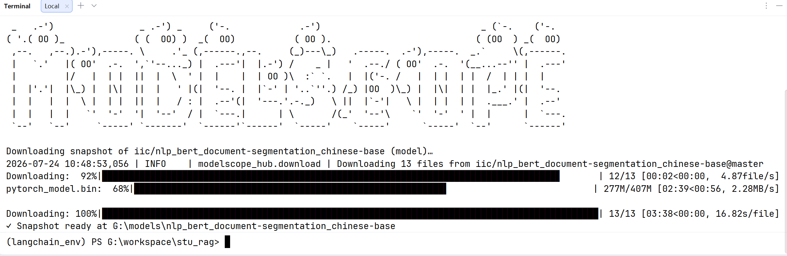

### 5. 文本分割的三种方式

**按照段落或标点符号分割（语义分割）**：

- 最常见、成本最低的一种方式
- 会优先按照：段落、换行、句号、问号、逗号、中文标点等自然语言边界进行切分
- 这种方式虽然没有真正理解文本内容，但**利用了自然语言本身的结构**，因此通常能够较好地保留语义，因此也属于**语义分割**的一种
- 安装：`pip install langchain-text-splitters`
- 优点：实现简单、速度快、成本低、大多数场景都适用
- 缺点：遇到长句或复杂文档时，可能仍然切分得不够合理

思路：

通过直接读取文件或者文档加载器获取文件中的文本，然后加载文件分割的对象（设置块的大小，重叠程度，分割符号，计算块长度等等属性），然后通过分割方法对文本进行分割（方法：`split_text()`），最后将分割后的文本遍历打印

```python
# 导入加载器
from langchain_community.document_loaders import TextLoader
# 导入分割器
from langchain_text_splitters import RecursiveCharacterTextSplitter
# 导入路径包
import os
from pathlib import Path

# 获取文件路径
path_base = str(Path(os.path.dirname(__file__)).parent)
text_path = os.path.join(path_base, "datasets","测试2.txt")

# 文档加载器
loader = TextLoader(text_path,encoding="utf-8")
data = loader.load()
txt = data[0].page_content
# print(txt)  # 获取文本内容

# 创建分割器对象
txt_fg = RecursiveCharacterTextSplitter(
    chunk_size = 300,    # 分割块的大小
    chunk_overlap = 20,   # 块的重叠大小
    # 分割符号
    separators = [    "\n\n","\n",
            "。", "，", "？", "、", "：", "；", "！", "“", "”", "（",
            "）", "《", "》", "……", "——", "‘", "’", "·", "【", "】",
    ],
    # 计算块的长度
    length_function = len
)

# 分割文本
txt_list = txt_fg.split_text(txt)   # 返回的是列表
# 遍历输出
for item in txt_list:
    print(item)
    print("*-"*10)
```

**按固定长度切分（非语义分割）**：

- 这种方式不关心文本内容，只按照长度进行切分
- `chunk_size = 300` -- 每 300 个字符就切一次
- 一句话被截断语义就容易丢失，因此，这种方式**不属于语义分割**
- 安装：`pip install langchain-text-splitters`
- 优点：实现最简单、切分速度最快
- 缺点：容易破坏句子结构、检索效果通常较差
- 实际项目中一般不会单独使用，而是作为最后的兜底策略（在上一个方法有所体现 -- chunk_size）

**使用语义模型进行分割（大模型分割）**：

- 这种方式真正根据**文本内容**决定在哪里切分
- 即使某一段文字很长，也不会简单按字符数截断，而是在**主题**发生变化的位置进行切分，这种方式是真正意义上的**语义分割**
- 练习模型（ModelScope 提供专门用于文档语义分割的模型）：[BERT文本分割-中文-通用领域 · 模型库](https://modelscope.cn/models/iic/nlp_bert_document-segmentation_chinese-base/files)


- 安装依赖包：`pip install modelscope addict datasets simplejson sortedcontainers`
- 优点：能保持完整语义、Chunk 质量高、检索效果最好
- 缺点：需要额外加载模型、推理速度较慢、成本较高
- 因此，更适合高质量知识库或离线数据处理场景

```python
# 导入 ModelScope 相关模块
from modelscope.outputs import OutputKeys
from modelscope.pipelines import pipeline
from modelscope.utils.constant import Tasks
# 导入 TextLoader 文档加载器
from langchain_community.document_loaders import TextLoader
# 导入路径包
import os
from pathlib import Path

# 获取项目根路径
base_path = str(Path(os.path.dirname(__file__)).parent)
# 拼接数据集路径
file_path = os.path.join(base_path, "datasets", "测试.txt")

# 创建 TextLoader 加载器对象
loader = TextLoader(file_path, encoding="utf-8")
data = loader.load()    # 加载文档，返回 Document 对象列表
# print(data)
text = data[0].page_content # 提取文档正文内容

# 本地分割模型路径
model_path = r"G:\models\nlp_bert_document-segmentation_chinese-base"

# 创建文档分割 Pipeline
p = pipeline(
    task=Tasks.document_segmentation,
    model=model_path,
    model_revision='master')

# 使用模型对文档进行语义分割
result = p(
    documents=text,
)

# 输出分割结果
chunks = result[OutputKeys.TEXT].split("\n")    # 按行分割
print(f"共分割得到 {len(chunks)} 个文本块：\n")
for i, chunk in enumerate(chunks, start=1):
    print(f"========== 文本块 {i} ==========")
    print(chunk)
```

- 报错与处理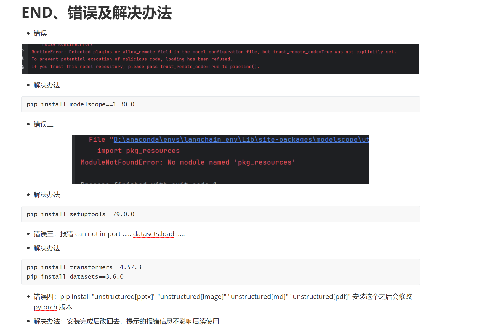

### 6. 三种文本分割方式对比

| 分割方式                   | 是否属于语义分割 | 优点                       | 缺点                         | 适用场景                   |
| -------------------------- | ---------------- | -------------------------- | ---------------------------- | -------------------------- |
| 按段落、标点等自然边界切分 | 是               | 实现简单、速度快、成本低   | 长句或复杂文档切分效果有限   | 大多数 RAG 项目            |
| 按固定长度切分             | 否               | 实现最简单、速度最快       | 容易截断句子，语义丢失       | 作为兜底策略或简单实验     |
| 使用语义模型（大模型）切分 | 是               | 能按主题切分，Chunk 质量高 | 需要额外模型，速度慢、成本高 | 高质量知识库、离线数据处理 |

## （三）Embedding 模型选择

在 RAG 中，Embedding 模型的作用是把文本转换为向量。**检索质量很大程度上取决于 Embedding 模型，而不是大语言模型本身。** 如果向量不能准确表达语义，即使后面的 LLM 很强，也检索不到正确内容。

### 1. 选择时重点看什么

**任务类型（最重要）**：

- MTEB 等评测会分别给出：

    - Classification（文本分类）

    - Clustering（文本聚类）

    - Retrieval（信息检索）

    - Summarization（摘要）等成绩

- **RAG 的核心是“相似文本检索”，因此优先关注 Retrieval 分数，而不是总分。**

**语言支持**：

- 根据知识库语言选择模型：

    - **中文知识库** → 选择中文优化模型

    - **英文知识库** → 选择英文模型

    - **中英混合 / 多语言** → 选择多语言模型

- 不要为了“通用”而盲目选择多语言模型；在纯中文场景下，中文专用模型通常效果更好。

**向量维度（Embedding Dimension）**：

- 向量维度就是输出向量的长度，例如 384、768、1024。

    - **维度高**：语义表达更强，但占用更多存储和内存。

    - **维度低**：速度更快、存储更省。

- RAG 中常见的 **384 或 768 维已经足够**，除非对检索精度要求非常高，一般不必追求更高维度。

**最大输入长度（Max Tokens）**：

- 表示模型一次能处理的最大 Token 数。

    - 超过上限的文本会被**截断**。

    - 因此文本分块时，`chunk_size` 必须小于该上限，并预留一定余量。

- 例如模型最大支持 8192 tokens，实际分块通常控制在 1000~2000 tokens。

 **模型大小与资源**：

- 模型越大，通常效果越好，但：

    - 占用更多显存 / 内存

    - 编码速度更慢

- 本地开发或 CPU 环境下，优先选择 **轻量级模型（约 100M~300M 参数）**；GPU 资源充足时再考虑更大的模型。

### 2. 一个简单的选择流程

**确定语言**：中文 / 英文 / 多语言。

**查看 Retrieval 评测分数**：优先检索成绩高的模型。

**确认资源限制**：CPU、内存、显存是否足够。

**检查维度和最大 Token**：与向量库和文本分块策略保持一致。

# 七、RAG检索器

检索器（Retriever）是 RAG（Retrieval-Augmented Generation）的核心组件之一，它的作用是**从知识库中找到与用户问题最相关的文本片段（Chunk）**，并将这些内容作为上下文提供给大语言模型生成最终答案

过程：用户提问 \==> 检索器 \==> 知识库中最相关的 Top-K 文本 \==> 大语言模型生成回答

因此，检索器并不负责生成答案，而是负责**"找资料"**。

## （一）检索器的工作流程

### 1. 查询向量化

用户输入问题后，会使用 **Embedding 模型** 将问题编码成向量。

需要注意的是，**查询使用的 Embedding 模型必须与构建知识库时使用的模型保持一致**，这样才能保证向量位于同一向量空间，计算出的相似度才具有意义。

### 2. 相似度计算

知识库中的文本已经提前完成向量化并存入向量数据库。

检索器会计算**查询向量**与**文档向量**之间的相似度，常见的方法有：

- 余弦相似度（Cosine Similarity）
- 点积（Dot Product）
- 欧氏距离（Euclidean Distance）

相似度越高，表示两段文本语义越接近。

### 3. 返回检索结果

根据相似度得分进行排序，返回最相关的 **Top-K** 个文本块，例如：

```
Top-1
Top-2
Top-3
...
Top-K
```

这些文本会作为上下文，一起发送给大语言模型进行回答。

## （二）常见检索方式

### 1. 稠密向量检索（Dense Retrieval）

这是现代 RAG 最常用的方法。

它利用 **Embedding 模型** 将文本转换为高维向量，再根据向量之间的相似度完成检索，因此能够理解文本的语义。

```
问题：
如何学习人工智能？

知识库：
AI 学习路线推荐
```

虽然没有出现完全相同的关键词，但由于语义相近，仍然能够成功检索出来。

**特点**：能理解语义、检索效果好、当前 RAG 的主流方案

### 2. 稀疏向量检索（Sparse Retrieval）

稀疏检索主要依赖关键词匹配，最经典的算法就是 **BM25**。

BM25 会根据词频（TF）和逆文档频率（IDF）计算文档与查询之间的相关性，因此对于**专有名词、产品型号、错误代码**等内容通常具有较好的效果。

```
错误代码：0x80070005
```

关键词检索通常比向量检索更加准确。

**特点**：检索速度快、精确匹配能力强、无法理解深层语义

### 3. 混合检索（Hybrid Search）

混合检索结合了**向量检索**和**关键词检索**两种方式。

一般流程：向量检索 \==> 关键词检索 \==> 融合排序 \==> 最终结果

这样既能够理解语义，又能够保证专有名词的准确匹配，因此目前越来越多的 RAG 系统采用混合检索方案。

**RRF（Reciprocal Rank Fusion，倒数排序融合）**：

- 在混合检索（Hybrid Search）中，通常会同时使用：

    - 向量检索（Dense Retrieval）

    - 关键词检索（BM25）

- 由于两种检索方式的**评分标准不同**，它们的分数无法直接进行比较，因此需要一种融合算法对两种检索结果重新排序，**RRF（Reciprocal Rank Fusion）** 就是目前最常用的方法之一。

- 核心思想：

    - RRF **不关注检索得分，而是关注文档在检索结果中的排名（Rank）**。
    - 它会分别计算文档在每个检索器中的排名得分，再将多个得分相加，最终按照总得分重新排序。
    - 可以发现：
        - **同时出现在多个检索结果中的文档**，最终排名通常更靠前。
        - **在多个检索器中排名都较高的文档**，最终得分也会更高。

- 计算方式：

    - $$
        \text{Score}=\frac{1}{k+\text{Rank}}
        $$

        

    - **Rank**：文档在当前检索结果中的排名（第 1 名、第 2 名……）

    - **k**：常数，一般取 **60**，用于减小排名差异带来的影响

    - 如果一个文档同时出现在多个检索器中，则将各自的得分相加作为最终得分

- 优点：

    - 不需要统一不同检索算法的评分标准。
    - 计算简单，执行效率高。
    - 能充分结合向量检索和关键词检索的优势。
    - 是目前混合检索（Hybrid Search）中应用最广泛的融合算法之一。

## （三）检索增强技术

除了基础检索外，为了进一步提高召回质量，实际项目中还会采用一些检索增强技术。

- **Query Rewrite（查询重写）**：利用大语言模型优化用户问题，使其更适合检索。
- **HyDE（Hypothetical Document Embeddings）**：先让大语言模型生成一个假设答案，再使用该答案进行检索，通常比直接检索问题效果更好。
- **Rerank（重排序）**：先召回较多候选文本，再利用重排序模型重新计算相关性，筛选出最相关的 Top-K 结果，是目前提升 RAG 检索质量最有效的方法之一。

# 八、RAG生成器

**什么是生成器**：

RAG（Retrieval-Augmented Generation）由两个核心部分组成：

- *Retriever（检索器）*：负责找到相关知识
- *Generator（生成器）*：负责理解知识并生成最终回答（负责将 *碎片化的信息* 转化为 *逻辑严密的语言* ）

可以理解为：检索器负责"查资料"，生成器负责"整理资料并回答问题"

因此，生成器本质上就是一个 *大语言模型（LLM）* 

核心任务：在检索阶段获得的文档片段或信息的基础上，生成自然语言的回答、摘要或相关文本

过程：用户问题 \==> Retriever（检索） \==> 找到相关文档 \==> Generator（LLM） \==> 理解问题+理解文档 \==> 生成最终回答

因此，在 RAG 中，真正负责输出答案的是 *Generator*，而不是 Retriever

**为什么需要生成器**：

如果只有检索器，那么系统只能返回找到的文档，并不会告诉用户最终答案

例如用户问：Python 是什么？

检索器只能返回：Python 是一种解释型语言……

生成器则会结合这些资料，总结成自然语言：Python 是一种解释执行的高级编程语言，支持面向对象、函数式等多种编程范式。

因此，Generator 的作用不是查找知识，而是：*理解问题、阅读上下文、推理、总结、输出自然语言*

**作用**：

提升回答的准确性：生成器可以利用外部文档中的最新和详细信息，从而提高回答的质量

扩展知识范围：即使生成模型的预训练数据不包含某些信息，检索器仍然可以提供相关的外部资源，使得生成器能够回答更新的、特定领域的问题

处理复杂问题：对于需要综合多方面信息的问题，生成器可以通过整合多个文档片段来生成更加全面和丰富的回答

# （一）注册流程

### 1. 创建千问的账号

直接用淘宝、支付宝等账号登录即可

### 2. 创建api-key

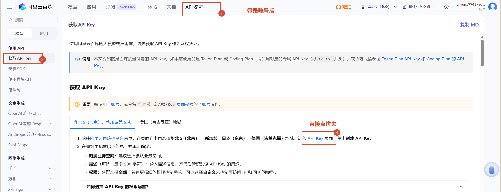

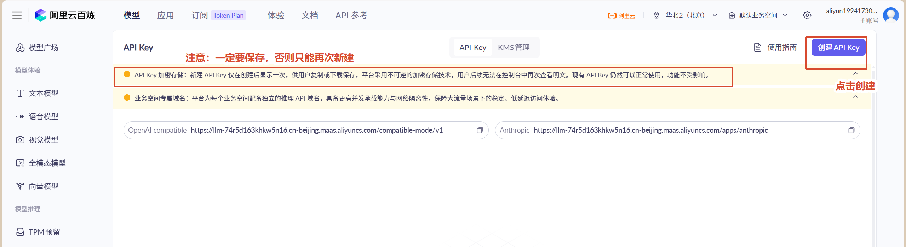

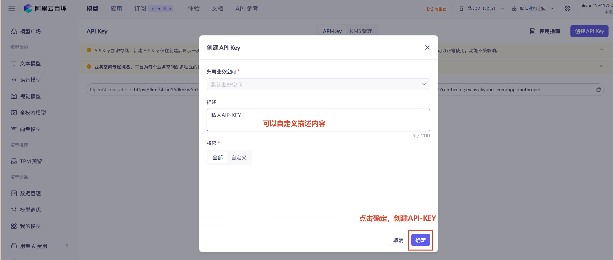

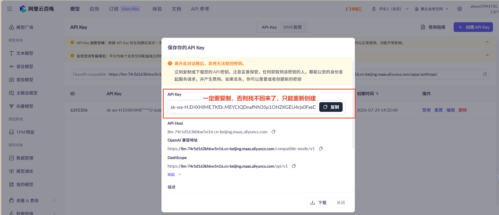

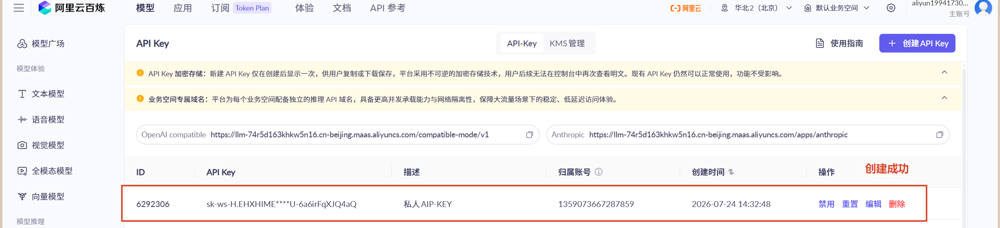

### 3. 将api-key配置到环境变量中

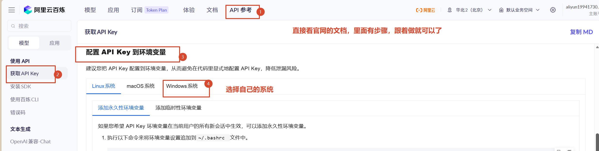

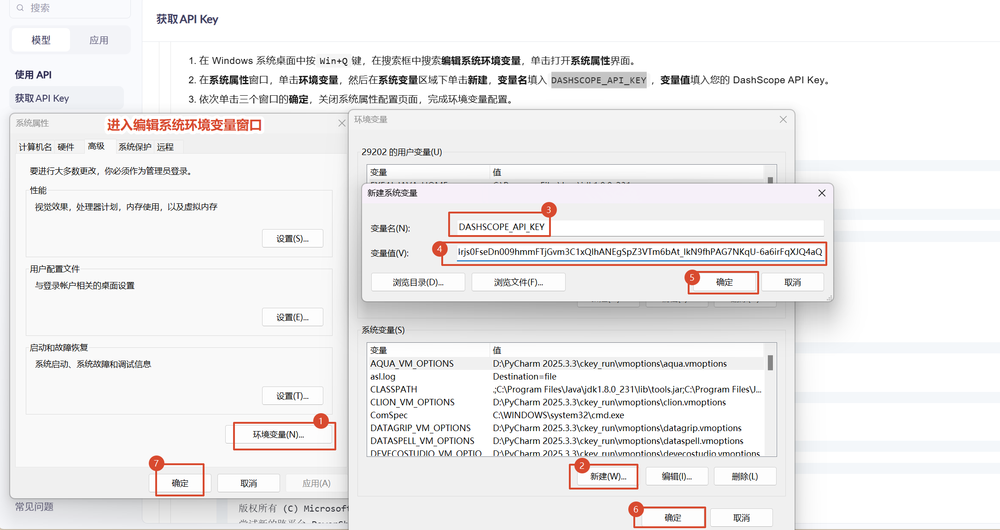

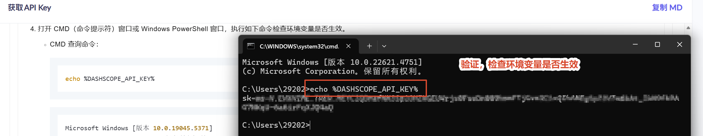

### 4. 批量操作，设置免费额度

回到首页，找到左侧列表下侧的【用量与费用】，点击进入

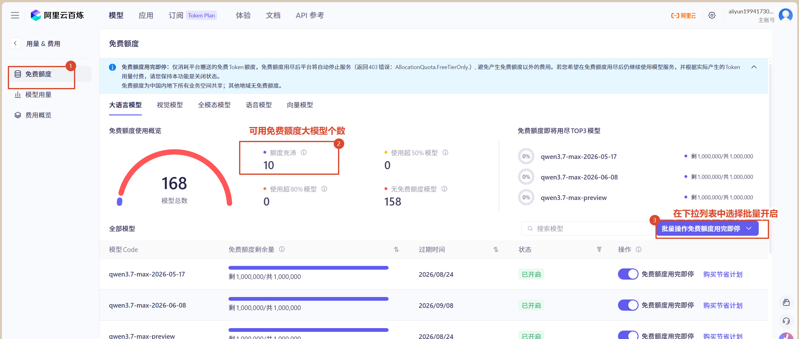

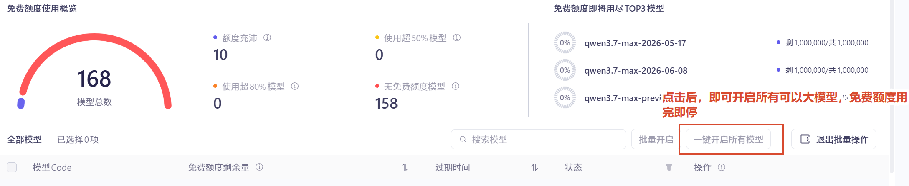

## （二）Generator 的输入

生成器一般不会直接接收用户的问题，而是接收一个完整的 Prompt。

Prompt 通常由多个部分组成：`System Prompt` + `Context（检索结果）` + `Question（用户问题）`

例如：

```text
System：
你是一名AI助手，只能根据参考资料回答问题。

Context：
Python 是一种解释型高级语言。

Question：
Python 是什么？
```

LLM 实际接收到的是：

```text
请根据以下参考资料回答问题：

参考资料：
Python 是一种解释型高级语言。

用户问题：
Python 是什么？
```

可以发现：

> **Generator 实际上就是在处理 Prompt，而不是单独处理用户问题。**

## （三）Generator 的工作流程

**将查询与检索结果合并**：

- 生成器接收到**查询**和**检索结果**之后，会将两者合并在一起。这时，生成器不仅有用户的问题信息，还获得了与该问题相关的外部知识

- 这种合并的方式通常是将查询和文档片段作为输入并传递给生成模型。合并后，生成器会根据这些上下文信息来生成一个更准确和全面的输出

**通过生成模型生成回答**：

- 生成器将合并后的信息传递给大语言模型（如T5、BART等）。该生成模型使用输入的查询和相关的文档片段来推理并生成最终的回答或文本

- 生成模型的输出可能是：
    - **直接回答问题**（例如，“量子计算是研究量子力学原理在计算机科学中的应用”）
    - **生成摘要**（对于长文档或信息密集的输入）
    - **生成建议、推荐或其他类型的文本**

**生成输出**：

- 最终，生成模型会输出一个经过优化的回答或生成文本，用户就能看到最终结果

## （四）Prompt 在 Generator 中的重要性

Generator 是否能够正确回答，很大程度上取决于 Prompt。

Prompt（**Prompt Engineering (提示工程) ：**） 一般包含三个部分（核心逻辑）：

- 角色设定（Role）：告诉模型应该扮演什么角色
- 行为约束（Instruction）：限制模型回答方式
- 输出格式（Output）：规定回复格式，结构化输出便于后续程序解析

## （五）LangChain 调用 Generator

在 LangChain 中，最常用的是 `ChatOpenAI`。

虽然名字叫 **OpenAI**，但它不仅支持 OpenAI 的模型，还兼容许多遵循 OpenAI API 协议的模型服务。

例如：阿里百炼（Qwen）、DeepSeek、智谱 AI（GLM）、火山引擎（豆包）、OpenAI GPT

因此，只需要修改：API Key（调用模型所需的密钥）、Base URL（模型服务地址）、Model（指定使用的大模型），即可切换不同的大模型。

### 1. 选择模型

下载环境（已下载）：`pip install langchain_openai`

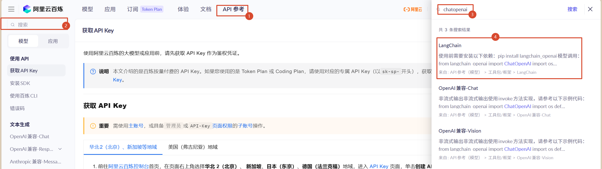

### 2. 复制案例代码

```python
from langchain_openai import ChatOpenAI
import os

# 适用ChatOpenAI加载千问大模型
chatLLM = ChatOpenAI(
    # 通过环境变量读取api-key
    api_key=os.getenv("DASHSCOPE_API_KEY"),
    # 指定基础服务地址 -- 阿里提供的模型访问地址（不能改）
    base_url="https://dashscope.aliyuncs.com/compatible-mode/v1",
    # 指定模型名称 -- 可以改
    model="qwen-plus",  # 此处以qwen-plus为例，您可按需更换模型名称。
    # 模型列表：https://help.aliyun.com/zh/model-studio/getting-started/models
    # other params...
)

# 消息列表
messages = [
    # 系统角色描述 -- 可以不要
    {"role": "system", "content": "You are a helpful assistant."},
    # 用户消息 -- 用户问题（可以改为接收输入信息）
    {"role": "user", "content": "你是谁？"}]

# invoke方法：调用LLM生成回复、非流式输出结果
response = chatLLM.invoke(messages)

# 打印输出结果
print(response.model_dump_json())
```

### 3. 非流式输出

使用 `invoke()` 可以一次性获取完整回复。

特点：

- 等待模型生成完成后统一返回
- 编码简单
- 适合大多数场景

```python
from langchain_openai import ChatOpenAI
import os

chatLLM = ChatOpenAI(
    api_key=os.getenv("DASHSCOPE_API_KEY"),
    base_url="https://dashscope.aliyuncs.com/compatible-mode/v1",
    model="qwen3.7-max",
)

contant = input("请输入内容：\n")

messages = [
    {"role": "system", "content": "You are a helpful assistant."},
    {"role": "user", "content": contant}]

# invoke方法：调用LLM生成回复、非流式输出结果
response = chatLLM.invoke(messages)

# print(response.model_dump_json())   # 返回的是json格式
print(response.content) # 只返回文本内容
```

### 4. 流式输出

如果希望模型边生成边显示，可以使用 `stream()`

相比普通调用：

- 回复速度体验更好
- 用户无需等待全部内容生成完成
- 常用于聊天机器人

```python
from langchain_openai import ChatOpenAI
import os

chatLLM = ChatOpenAI(
    api_key=os.getenv("DASHSCOPE_API_KEY"),
    base_url="https://dashscope.aliyuncs.com/compatible-mode/v1",
    model="qwen3.7-max",
    # 流式输出
    streaming=True,
)

contant = input("请输入内容：\n")

messages = [
    {"role": "system", "content": "You are a helpful assistant."},
    {"role": "user", "content": contant}]

# stream方法：调用LLM生成回复、流式输出结果
for chunk in chatLLM.stream(messages):
    print(chunk.content, end="", flush=True)
```

### 5. 模拟上下文数据进行回复

真正的 RAG 中，上下文（Context）通常来自向量数据库的检索结果。

现在可以先手动构造一段上下文，模拟检索器返回的数据。

```
# 模拟上下文 --- 后期来源于向量数据库中查询出来的结果
context = "cc是一名华清远见成都中心的AI讲师，他擅长用Python开发AI模型。"
# 拼接问题和上下文 --- 后期使用提示词来完成
content = "请根据上下文信息：\n" + context + "\n回答用户问题：\n" + question
```

这里的 `context` 是手动编写的字符串，而在完整的 RAG 系统中，它通常来自：

用户问题 \==> 向量数据库检索 \==> Document1，Document2，Document3 \==> 拼接 Prompt \==> LLM 

因此，这种方式只是对 **"检索结果 + 用户问题 → Generator"** 这一流程的模拟，为后续接入真实检索器做好准备。

```python
from langchain_openai import ChatOpenAI
import os

chatLLM = ChatOpenAI(
    api_key=os.getenv("DASHSCOPE_API_KEY"),
    base_url="https://dashscope.aliyuncs.com/compatible-mode/v1",
    model="qwen3.7-max",
)

# 输入问题
contant = input("请输入内容：\n")
# 模拟上下文
words = "重庆三峡学院正式更名为重庆三峡科技大学"
# 拼接
contant = "请根据上下文：\n" + words + "回答问题：\n" + contant

messages = [
    {"role": "system", "content": "你是一个专业的学校百科全书，什么都知道"},
    {"role": "user", "content": contant}]

response = chatLLM.invoke(messages)
# print(response.model_dump_json())   # 返回的是json格式
print(response.content) # 只返回文本内容
```

