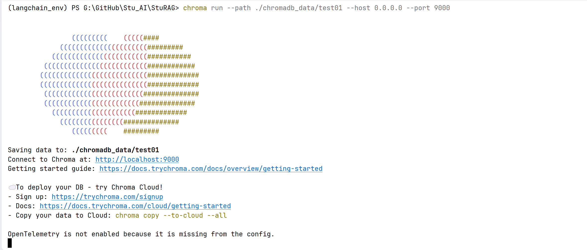
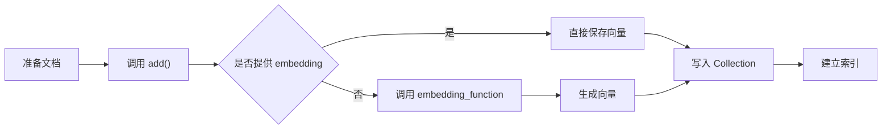
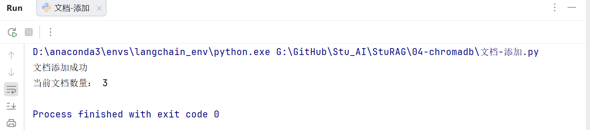
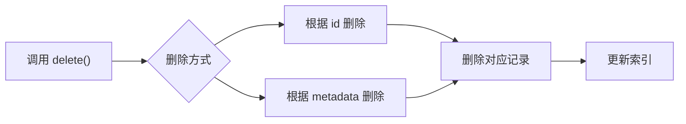
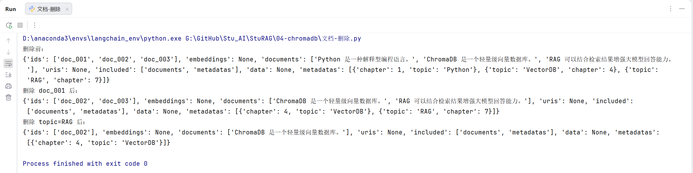
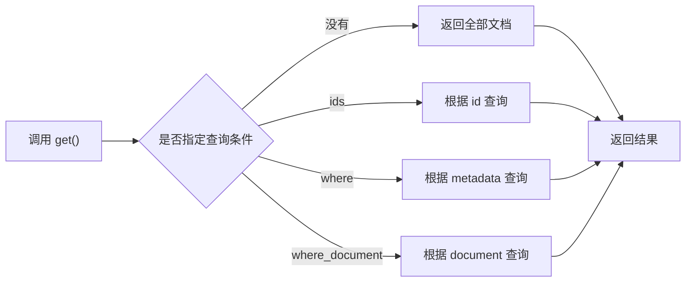
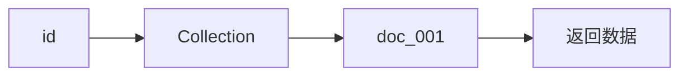

# 一、认识ChromaDB

## （一）为什么需要 ChromaDB

在学习 RAG 之前，我们已经接触过文档加载（Loader）、文本切分（Text Splitter）以及 Embedding 模型。

整个过程可以简单理解为：

> **原始文档 ==> 文本切分 ==> Embedding 向量化 ==> 保存向量 ==> 检索 ==> 大模型生成答案**

其中，Embedding 模型负责将文本转换成向量，例如：

```
"苹果是一种水果" ======> [0.125, -0.384, 0.762, ......]
```

但是，仅仅生成向量还远远不够。

假设一本 PDF 被切分成 5000 个文本块，那么就会生成 5000 个向量；如果企业知识库包含几百万个文本块，就意味着需要管理几百万条向量数据。

此时会出现几个新的问题：

- 如何高效保存海量向量？
- 如何快速找到与问题最相似的向量？
- 如何管理文档、向量和元数据之间的关系？
- 如何支持文档的新增、删除和更新？

普通数据库虽然能够保存这些数据，却无法高效完成**语义相似度检索**。

因此，专门用于管理向量数据的**向量数据库（Vector Database）**应运而生。

## （二）什么是 ChromaDB

**ChromaDB 是一个开源的向量数据库**，专门用于存储和检索 Embedding 向量。

它不仅能够保存文本对应的向量，还能够保存：

**原始文本（Document）、向量（Embedding）、元数据（Metadata）、唯一标识（ID）**

因此，ChromaDB 可以理解为：

> **一个专门管理 AI 知识库的数据管理系统。**

与传统数据库最大的区别在于：普通数据库擅长的是**精确查询**，例如：

```sql
SELECT *
FROM student
WHERE name='Tom'
```

而 ChromaDB 擅长的是：

> **根据语义寻找最相似的数据。**

例如：数据库中存储了 苹果、香蕉、橘子；用户提问：哪些属于水果？

虽然问题中没有出现"苹果"两个字，但 ChromaDB 依然能够找到对应内容，因为它比较的是**向量之间的语义距离**，而不是字符串是否一致。

学习 ChromaDB，首先要明确它的定位。

> **Embedding 负责"生成向量"，而 ChromaDB 负责"保存、管理和检索向量"。**

因此，两者的职责不同：

| 组件      | 主要职责                     |
| --------- | ---------------------------- |
| Embedding | 将文本转换成向量             |
| ChromaDB  | 存储向量、管理文档、完成检索 |
| LLM       | 根据检索结果生成答案         |

## （三）ChromaDB 的作用

对于 RAG 来说，ChromaDB 主要承担四项工作。

**1. 存储向量**

Embedding 模型生成的向量都会保存在 ChromaDB 中。例如：

```text
文本 ==> Embedding ==> 向量 ==> ChromaDB
```

以后无需再次计算，即可直接进行检索。

**2. 保存原始文档**

数据库不仅保存向量，同时也会保存对应的原始文本。

这样，当找到相似向量后，可以直接获取对应文档，而不是只得到一串数字。

**3. 保存元数据（Metadata）**

除了文本外，每条数据还可以保存额外信息，例如：

```python
{
    "chapter": 5,
    "author": "张三",
    "category": "人工智能"
}
```

这些信息可以用于：分类管理、条件过滤、文档追溯

后续检索时可以按照章节、作者、标签等条件进一步筛选结果。

**4. 完成语义检索**

这是 ChromaDB 最重要的能力。

用户提出问题以后：

> 问题 ==> Embedding ==> 查询向量 ==> 与数据库所有向量计算相似度 ==> 返回 TopK 最相似文档

整个过程无需人工编写复杂规则，而是依赖向量之间的距离自动完成。

## （四）ChromaDB 的核心特性

**高效存储向量**

- 使用专门的数据结构（如倒排索引、向量索引）存储文本/图片/音频等的向量表示
- 支持上亿条向量的存储

**相似度检索（Similarity Search）**

- 基于**余弦相似度、内积、欧氏距离**等方式计算文本之间的语义相似度
- 能在**毫秒级**找到和查询最相似的向量

**索引算法优化**

- 常见索引结构：**HNSW**（分层小世界图）、IVF（倒排文件）、PQ（乘积量化）
- 在保证精度的前提下，大幅提升检索速度，降低存储空间

**元数据管理**

- 不仅存储向量，还存储**文档内容和 metadata（来源、页码、标签等）**
- 检索到向量后，可追溯到原始文档

**可扩展性**

- 支持分布式部署，能处理 TB/PB 级别的数据
- 支持动态插入、更新和删除向量

# 二、向量数据库基础

## （一）什么是向量数据库？

向量数据库（Vector Database）是一类专门用于**存储、管理和检索高维向量数据**的数据库。

这里的"向量"，通常来源于 Embedding 模型：文本 \==> Embedding \==> 768维向量

传统数据库存储的是字符串、数字、日期等结构化数据，而向量数据库存储的是高维浮点数组。

因此，两者解决的问题完全不同

## （二）为什么普通数据库不能代替向量数据库

很多初学者都会产生疑问：

> MySQL 也能存数组，为什么还需要 ChromaDB？

原因主要有两点。

**1. 不会计算语义**

MySQL 可以保存：[0.12,0.56,0.88,...]

但是，它不知道两个向量是否相似，也无法完成 TopK 最近邻搜索

**2. 检索效率低**

如果数据库中有一百万条向量。

MySQL：每次都需要全部比较。

ChromaDB：使用专门的向量索引（如 HNSW），可以快速定位最相似的数据，因此检索效率远高于普通数据库。

## （三）向量数据库与关系数据库的区别

| 功能项     | 关系型数据库 | 向量数据库              |
| ---------- | ------------ | ----------------------- |
| 持久化     | 支持本地存储 | 支持本地存储            |
| 增删改查   | 支持         | 支持（侧重查）          |
| 相似度计算 | 无需         | 需要                    |
| 数据存储   | 表/字段      | 集合/文档 + 向量        |
| 索引       | 需要         | 需要（向量索引，IVF等） |
| 数据类型   | 多样         | 字符和数值              |

| 对比项             | 关系数据库   | 向量数据库        |
| ------------------ | ------------ | ----------------- |
| 存储对象           | 表、字段     | 向量、文档        |
| 查询方式           | SQL 精确匹配 | 相似度检索        |
| 是否支持语义       | ✘            | ✔                 |
| 是否需要 Embedding | ✘            | ✔                 |
| 典型应用           | 管理业务数据 | AI、RAG、推荐系统 |

可以简单理解为：

> **关系数据库负责"查一样"，向量数据库负责"查相似"。**

## （四）常见向量数据库

| 数据库   | 特点           | 适用场景           |
| -------- | -------------- | ------------------ |
| FAISS    | 本地库，速度快 | 学习、小项目       |
| ChromaDB | 简单易用       | RAG 学习、中小项目 |
| Milvus   | 分布式         | 企业级项目         |
| Weaviate | 云原生         | AI 平台            |
| Pinecone | 云服务         | 商业 SaaS          |

对于初学者来说：

**ChromaDB 是目前学习成本最低，也是与 LangChain 配合最方便的一种选择。**

## （五）相似度计算方式

向量数据库判断"是否相似"，本质上是在计算向量之间的距离。常见方法有三种。

### 1. 欧式距离（Euclidean Distance）

欧氏距离表示两个向量之间的直线距离。

特点：

- 距离越小，相似度越高。
- 常用于几何空间计算。

$$
d = \sum (A_i - B_i)^2
$$

### 2. 余弦相似度

RAG 中最常使用的方法。

特点：

- 比较方向，而不是长度。
- 两个文本表达相近时，余弦值越接近 1。

$$
\cos(\theta) = \frac{\vec{A} \cdot \vec{B}}{||\vec{A}|| \, ||\vec{B}||} = \frac{\sum_{i=1}^n A_i B_i}{\sqrt{\sum_{i=1}^n A_i^2} \sqrt{\sum_{i=1}^n B_i^2}}
$$

因此，大多数中文 Embedding 模型都会推荐使用 Cosine。

# 三、ChromaDB 的安装与连接

Chromadb 官网：[Getting Started - Chroma Docs](https://docs.trychroma.com/docs/overview/getting-started)

学习任何数据库，第一步都是**建立连接（Connection）**，对于 ChromaDB 来说也是一样。

无论是创建集合、添加文档还是执行检索，都必须先获取一个 **Client（客户端对象）**。

因此，学习 ChromaDB 可以概括为下面三个步骤：

```text
安装 ChromaDB ==> 获取 Client ==> 操作 Collection
```

其中，**Client 是所有操作的入口**。

## （一）安装 ChromaDB

安装（已安）：`pip install chromadb -i https://repo.huaweicloud.com/repository/pypi/simple/`

导入：`import chromadb`

简单部署：服务端部署[Client-Server Mode - Chroma Docs](https://docs.trychroma.com/docs/run-chroma/client-server)

```cmd
chroma run --path 指定 Chromadb 向量数据库持久化数据的存储路径（即数据保存在磁盘上的哪个文件夹），默认 ./chroma
chroma run --path ./rag/chroma_data --host 0.0.0.0 --port 9000
```

参数说明：

| **参数**               | **说明**                                                     | **示例 / 建议**                      |
| ---------------------- | ------------------------------------------------------------ | ------------------------------------ |
| `--path`               | **最重要的参数**。指定数据库文件的持久化存储路径。如果不指定，数据可能在容器/进程重启后丢失。 | `chroma run --path ./my_data`        |
| `--log-path`           | 指定日志文件的输出路径，方便后续排查 OOM 或请求报错。        | `chroma run --log-path ./chroma.log` |
| `--workers`            | 指定工作进程数。在多核 CPU 服务器上，增加 worker 可以提高并发处理能力。 | `--workers 4`                        |
| `--timeout-keep-alive` | 设置保持连接的超时时间（秒）。在高并发长连接场景下有用。     | `--timeout-keep-alive 30`            |

> 在本章学习中，我们直接使用 **chromadb 官方 SDK** 操作数据库，目的是掌握 ChromaDB 的基础 API。
>
> 在后续 RAG 项目中，我们搭建RAG项目使用的是langchain框架来实现的，所以也会使用 LangChain 提供的 `langchain_chroma` 对 ChromaDB 进行封装，两者底层原理相同，只是调用方式不同。
>
> 【重点】学习阶段和项目阶段调用的API的方式不太一样，但是操作的原理都是一样的

## （二）ChromaDB 的三种连接方式

ChromaDB 提供了三种不同的运行方式，它们最大的区别在于：

> **数据保存在哪里，以及如何访问数据库。**

| 连接方式         | 数据是否保存 | 是否需要服务器 | 推荐场景           |
| ---------------- | ------------ | -------------- | ------------------ |
| EphemeralClient  | ❌            | 不需要         | 测试、Demo         |
| PersistentClient | ✅            | 不需要         | 学习、小项目 ⭐     |
| HttpClient       | ✅            | 需要           | 企业项目、多人开发 |

对于初学者来说，重点掌握 **PersistentClient** 即可。

### 1. 内存模式（EphemeralClient）-- 不用

这是最简单、最快的连接方式。数据仅存储在内存中，程序关闭后数据即刻消失。非常适合**单元测试**或**快速原型演示**

内存模式表示：**数据库中的所有数据仅保存在内存中。**

程序运行期间：创建集合 ==> 添加数据 ==> 查询数据，都可以正常完成。

但是，一旦 Python 程序关闭，所有数据都会立即消失。

因此，它最大的特点就是：**速度最快，但无法持久保存数据。**

```python
import chromadb
 # 创建一个临时客户端，不持久化数据
client = chromadb.EphemeralClient()
print(client)
```

适用于：学习 API、临时测试、单元测试、Demo 演示，一般不会用于正式项目

### 2. 本地持久化模式（PersistentClient）-- 小项目

==必须掌握==

这种方式会将数据存储在你本地指定的目录中。当你重新启动程序时，Chroma 会自动加载该目录下的索引数据。这是**个人项目**或**单机应用**最常用的方式

- 过程：设置一个文件夹用于存放数据

所谓**持久化（Persistence）**，就是：**程序关闭以后，数据仍然能够保存在磁盘中。**

例如：

第一次运行程序：创建集合 ==> 添加文档 ==> 关闭程序

第二次运行：重新连接 ==> 数据仍然存在

这就是持久化的意义。

```python
import  chromadb

vector = chromadb.PersistentClient(
    path = "../chromadb_data/test02"
)

print(vector)
```

这里只有一个最重要的参数：`path="../chromadb_data/test02"`

它表示：**数据库文件保存的位置。**

若该目录不存在，ChromaDB 会自动创建，以后所有 Collection、向量索引以及元数据都会保存在该目录中。

**PersistentClient 常用参数**：

目前最常使用的是下面两个参数。

| 参数       | 说明                                                 |
| ---------- | ---------------------------------------------------- |
| `path`     | 数据库存储目录                                       |
| `database` | 数据库名称（一般保持默认即可），并且创建之后才能使用 |

`PersistentClient` 中 **`path`（物理存储）** 和 **`database`（逻辑隔离）** 最本质的区别：

- `path` 决定 ChromaDB 数据在磁盘上的存储位置；`database` 决定数据在 ChromaDB 内部属于哪个逻辑数据库。数据库的数据最终都会存储在 `path` 指定的目录下，但不会以数据库名称创建对应的文件夹。

**PersistentClient 特点**：

数据不会丢失：程序关闭以后仍然保存在磁盘。

无需部署服务器：不像 MySQL，需要启动数据库服务，PersistentClient 可以直接操作本地数据库。

最符合后续学习习惯：Collection、添加文档、向量检索，都会频繁使用 PersistentClient

### 3. Client / Server 模式（HttpClient）

在生产环境中，通常会将 Chroma 作为一个独立的 Docker 容器或服务运行。此时， Python 代码通过 HTTP 协议连接到远程或本地的 Chroma 服务器 -- 【**数据库作为一个独立服务运行、Python 程序只是客户端、两者通过 HTTP 通信**】

- 把向量数据库开发完成后以服务器的方式为需要访问的项目【客户端项目】提供【请求地址】

简单理解就是：Python 程序 ==> HTTP 请求 ==> ChromaDB Server ==> 返回结果

这种模式和：MySQL Server、Redis Server，非常类似

把向量数据库开发完成后以服务器的方式为需要访问的项目【客户端项目】提供【请求地址】

**服务端启动 (终端操作)**： 

```cmd
chroma run --path 数据存储路径 --host 0.0.0.0 --port 9000

--path 数据存储路径
--host 服务器地址
--port 服务器端口
```

关闭服务器：`Ctrl + c`



**连接服务器**：

操作任何数据库的第一项，就是获取连接对象

```python
# 导入 ChromaDB 向量数据库
import chromadb

# 创建 ChromaDB HTTP 客户端（用于连接 Chroma Server）
client = chromadb.HttpClient(
    host="localhost",   # 主机地址，localhost 等价于 127.0.0.1，表示连接本机服务器
    port=9000   # 监听的端口号，需要与启动服务器时指定的端口保持一致
)

# 打印客户端对象
print(client)   # <chromadb.api.client.Client object at 0x0000025393430110>
```

此时：Python 并不直接操作数据库文件，所有操作都会发送到服务器完成。

**什么时候使用 HttpClient**：

前后端分离、多人开发、Docker 部署、企业级项目，例如：

```
Web 项目
        │
        ├────────────┐
        │            │
Python 服务     Java 服务
        │            │
        └────HTTP────┘
             │
        ChromaDB Server
```

多个项目可以共享同一个数据库。

# 四、Collection（集合）

## （一）什么是 Collection

### 1. 介绍

在 ChromaDB 中，**Collection（集合）** 是存储向量数据的基本单位，类似于数据库中的一张表，里面可以存放文档、向量以及元数据信息。

可以简单理解为：

> **Collection 是用于存放文档、向量及其相关信息的容器。**

无论是：文本内容（Document）、向量（Embedding）、元数据（Metadata）、文档 ID

最终都必须存放到某一个 Collection 中。

也就是说，**ChromaDB 不允许数据直接存放到数据库中，而必须属于某个 Collection。**

### 2. 为什么需要 Collection

> 为什么不能直接把向量存进数据库，而要先创建 Collection？

原因其实和关系数据库是一样的，假设我们开发一个 AI 助手，它既要回答公司知识，又要回答法律知识，还要回答医学知识，如果所有数据都混在一起，例如：

```text
Python 教程

糖尿病治疗

劳动法规定

员工管理制度

机器学习基础
```

那么每次检索时，都需要在所有数据中查找，不仅效率低，而且容易检索到不相关的内容。

因此，更合理的方式是按照业务进行分类，例如：

```text
company_docs
    ├── 公司介绍
    ├── 企业文化
    └── 员工制度

medical_docs
    ├── 糖尿病
    ├── 高血压
    └── 心血管疾病

law_docs
    ├── 劳动法
    ├── 民法典
    └── 合同法
```

这样，当用户询问医学问题时，只需要在 **medical_docs** 中进行检索，而不会去搜索公司的文档。

因此：

> **Collection 的本质就是数据分类。**

它不仅让数据更加清晰，也能够提升后续检索效率。

### 3. Collection 与关系数据库的对应关系

| MySQL              | ChromaDB           |
| ------------------ | ------------------ |
| Database（数据库） | Database（数据库） |
| Table（数据表）    | Collection（集合） |
| Row（记录）        | Document（文档）   |

例如：

```text
MySQL

school
    ├── student
    ├── teacher
    └── course
```

对应到 ChromaDB：

```text
ChromaDB

knowledge_base
    ├── student_docs
    ├── teacher_docs
    └── course_docs
```

需要注意的是：

> **Collection 与 Table 只是作用类似，并不是完全相同。**

Table 存储的是结构化数据，而 Collection 存储的是：文档、向量、Metadata，它更适合 AI 应用。

### 4. 一个 Collection 中保存什么

| 数据      | 作用           |
| --------- | -------------- |
| Document  | 原始文本       |
| Embedding | 文本对应的向量 |
| Metadata  | 附加信息       |
| ID        | 唯一标识       |

例如：

```text
ID
doc_001

Document
"苹果富含维生素。"

Embedding
[0.25, -0.61, 0.73, …… ]

Metadata
{
    "category":"水果",
    "chapter":3
}
```

可以看到：

**一个 Collection 管理的是完整的数据，而不是单独管理向量。**

### 5. Collection 的生命周期

从学习角度来看，一个 Collection 通常会经历下面几个阶段。：

创建 Collection \==> 添加文档（自动生成向量） \==> 查询文档 / 相似度检索 \==> 更新或删除文档 \==> 删除 Collection

可以发现：后续所有操作，都是围绕 Collection 展开的。

因此可以说：

> **Collection 是 ChromaDB 中最核心的对象。**

## （二）集合操作

经过前面的学习，我们已经知道：

- `PersistentClient` 用于连接数据库；
- 一个数据库中可以包含多个 `Collection`；
- 每个 `Collection` 相当于一个独立的向量集合，负责保存文档、向量以及元数据。

因此，在实际开发中，我们通常需要完成下面几个操作：

1. 查看数据库中有哪些集合；
2. 判断某个集合是否存在；
3. 创建新的集合；
4. 获取已有集合；
5. 删除不再需要的集合。

可以把整个过程理解成下面这张流程图：

```text
连接数据库（Client）
          │
          ▼
    查找已有 Collection
          │
          ▼
   是否已经存在？
      │        │
     是        否
      │        │
      ▼        ▼
 获取 Collection  创建 Collection
      │
      ▼
增删改查（add / query / get / delete）
      │
      ▼
不再需要时删除 Collection
```

可以发现：

> **Client 负责管理 Collection；Collection 负责管理数据。**

整个集合操作，实际上就是围绕着这两个对象展开。

### 1. 查找集合

在创建新的 Collection 之前，经常需要先查看数据库中已经有哪些集合。

ChromaDB 提供了：`client.list_collections()`

用于获取当前数据库中的所有 Collection。

```python
import chromadb

# 创建客户端对象
client = chromadb.PersistentClient(
    path="../chromadb_data"
)

# 查找集合
list = client.list_collections()

# 打印集合名称
print(list)
```

返回结果类似：

```text
[
    Collection(name="company_docs"),
    Collection(name="medical_docs"),
    Collection(name="student_docs")
]
```

这里返回的并不是字符串，而是一个个 **Collection 对象**。

因此可以继续获取它们的名称：

```python
for collection in collections:
    print(collection.name)
```

输出：

```text
company_docs
medical_docs
student_docs
```

这样得到的才是真正的集合名称。

### 2. 判断是否存在

实际开发中，经常需要先判断集合是否已经存在。

```python
exist = client.get_collection(name="test01")
```

- 如果集合存在：返回对应 Collection。
- 如果不存在：程序会抛出异常。

因此很多项目都会这样写：

```python
try:
    exist = client.get_collection(name="test01")
    print("集合存在")
except:
    print("集合不存在")
```

不过，这种方式仍然属于：**先判断，再创建。**并不是最推荐的

后面创建 Collection 时/实际开发中，我们会学习：`get_or_create_collection()`（更推荐直接使用）

它能够自动完成：**存在就获取Collection，不存在就创建Collection**，这是实际项目中更常见的写法。

### 3. 创建

#### （1）为什么需要创建 Collection

一个 Collection 就像数据库中的一张表，但是它不仅仅保存文档，它还决定了：

- 文档存放在哪里；
- 使用哪个 Embedding 模型；
- 使用哪种向量距离；
- 后续如何进行向量检索。

因此：**Collection 是 ChromaDB 中真正的数据管理者。**

只有创建好 Collection，后面才能添加文档、查询向量以及删除数据。

#### （2）create_collection()

创建 Collection 使用 `create_collection()` 方法，它会在数据库中新建一个集合，并返回对应的 **Collection 对象**。

后续所有的数据管理操作，例如添加文档、查询文档和删除文档，都需要通过这个对象完成。

简单来说，整个创建过程可以理解为：

- 连接数据库 ==> 创建 Collection ==> 返回 Collection 对象 ==> 操作数据

可以看到：**create_collection() 的真正目的，并不是告诉你"创建成功"。**

它真正想做的是：**返回一个 Collection，让后续所有操作都围绕它进行。**

#### （3）常用参数

| 参数名                   | 类型       | 说明                                                         | 示例                                               |
| ------------------------ | ---------- | ------------------------------------------------------------ | -------------------------------------------------- |
| **`name`**               | `str`      | **必填**，集合名称（类似数据库表名），必须唯一               | `"my_collection"`                                  |
| **`metadata`**（偶尔）   | `dict`     | 可选，集合的元数据信息，常用于标注集合用途或来源             | `{"description": "存储用户反馈", "version": "v1"}` |
| **`embedding_function`** | `Callable` | 可选，自定义嵌入函数。如果不提供，需要手动传入向量           | `embedding_function=my_embedder`                   |
| `get_or_create`          | `bool`     | 可选，默认为 `False`。如果为 `True`，当集合已存在时会直接返回该集合，而不是报错 | `get_or_create=True`                               |

#### （4）返回值

疑问：`collection = chromadb.create_collection(......)`：这里返回的不是`True`也不是`创建成功`，而是`Collection 对象`

原因就在于 ChromaDB 的职责划分，整个架构可以理解成：

```
Client
│
├── 创建 Collection
├── 获取 Collection
├── 删除 Collection
└── 查找 Collection

Collection
│
├── add()
├── query()
├── get()
├── update()
└── delete()
```

也就是说：**Client 负责管理数据库；Collection 负责管理集合中的文档和向量数据**，两者职责不同

因此创建成功以后，直接把 Collection 返回给我们

后续所有的数据操作，例如：`collection.add(...)、collection.query(...)、collection.get(...)、collection.delete(...)`，全部都是 Collection 自己完成

#### （5）创建集合

```python
import chromadb
# 创建对象
client = chromadb.PersistentClient(path="../chromadb_data")
# 创建集合
collection = chromadb.create_collection(name="cs01")
print(collection)
```

执行后，数据库中就会新增一个名为 **cs01** 的 Collection。

整个过程可以理解为：连接数据库 ==> 创建 Collection ==> 返回 Collection 对象

这里需要注意：**`create_collection()` 创建成功后，会返回一个 Collection 对象。**

后续所有操作（添加文档、查询、删除等），都是通过这个对象完成的，而不是再次通过 Client 操作。

#### （6）下载模型

`thenlper/gte-small-zh`文本嵌入模型下载地址：[thenlper/gte-small-zh · Hugging Face](https://huggingface.co/thenlper/gte-small-zh)

```python
# 安装 huggingface_hub 库（首次使用时安装）
pip install -U huggingface_hub

# 从 huggingface_hub 导入模型下载函数
from huggingface_hub import snapshot_download

# 下载 Hugging Face 模型到本地目录
snapshot_download(
    # Hugging Face 模型仓库名称
    repo_id="thenlper/gte-small-zh",
    # 本地保存目录
    local_dir=r"G:\models\gte-small-zh"
)
```

问：为什么创建 Collection 时需要指定 Embedding 模型？

答：Collection 内部保存的是向量。如果后续调用：`collection.add(documents=[...])`，那么 ChromaDB 就需要先把文本转换成向量。转换所使用的，就是这里指定的：`embedding_function`

#### （7）完整代码

**一个 Collection 一般对应一种 Embedding 模型。**

创建集合的时候指定了嵌入模型，后续操作就可以不用在指定

```python
# 导入 ChromaDB 包
import chromadb
# 导入 embedding_functions 模块
from chromadb.utils import embedding_functions

# 创建本地数据库客户端，连接本地数据库，后续所有 Collection 都由它管理
client = chromadb.PersistentClient(path="../chromadb_data")

# 创建向量化模型，以后添加文本时，会自动调用它生成向量
embedding_fn = embedding_functions.SentenceTransformerEmbeddingFunction(
    # 模型名称
    model_name="thenlper/gte-small-zh",
    # 运行设备
    device="CUDA",
    # 设置缓存路径，已下载
    # cache_folder=r"G:\models\gte-small-zh"
)

# 设置集合名称
col_name = "cs01"
# 创建集合，返回 Collection 对象
result = client.create_collection(
    # 指定 Collection 名称，同一个数据库中必须唯一
    name=col_name,
    # 指定 Collection 使用的 Embedding 模型，以后无需重复指定
    embedding_function=embedding_fn
)
print(result)
print(type(result))
```

**注意**：

- Collection 名称重复，如果集合名词已经存在，运行`client.create_collection(name="cs01")`，程序会直接报错：`Collection already exists`
- 创建 Collection 后不能随意更换 Embedding 模型
- metadata 不是文档元数据，是**Collection 的元数据**

### 4. 获取

#### （1）为什么需要获取

- Collection 创建完成以后，会一直保存在数据库中。
- 当程序再次启动时，并不需要重新创建。
- 而是：连接数据库 \==> 获取已有 Collection \==> 继续添加数据、查询数据。
- 因此：**create_collection() 用于第一次创建；get_collection() 用于以后继续使用。**

#### （2）get_collection()

```python
import chromadb
# 获取连接对象
client = chromadb.PersistentClient(path="../chromadb_data")
# 集合名称
collection_name = "test01"
# 获取集合对象
collection = client.get_collection(name = collection_name)
print(collection)
```

- 执行过程：连接数据库 \==> 根据名称查找 Collection \==> 找到 \==> 返回 Collection 对象
- 返回的仍然是：Collection 对象，后续可以进行增删改查等操作

**注意**：

- 如果 Collection 不存在，程序会抛出异常，因此，获取之前可以：`try...except...`，或者`get_or_create_collection()`

### 5. 删除

#### （1）为什么需要删除

- 当某个 Collection 已经不再使用，就可以将整个 Collection 删除，例如：
    - 测试数据；
    - 临时索引；
    - 已废弃的数据集；
- 注意：**删除 Collection，并不是删除其中某一条数据，而是删除整个集合。**

#### （2）delete_collection()

```python
import chromadb

# 获取连接对象
client = chromadb.PersistentClient(path="../chromadb_data")
# 集合名称
collection_name = "cs01"
# 获取集合对象
try:
    client.delete_collection(name = collection_name)
    print("删除成功")
except Exception as e:
    print(f"删除失败：{e}")
```

**注意**：

- 删除后无法恢复：会直接删除整个 Collection（文档、向量、元数据、索引）

## （三）文档

### 1. 添加

整个数据进入向量数据库的流程实际上如下：

- 原始数据 \==> 读取文档(txt/pdf/docx...) \==> 文本切分(TextSplitter) \==> 生成 Embedding 向量 \==> add() 保存到 Collection \==> 后续 query() 检索

可以看到，**add() 是整个知识入库（Ingestion）的最后一步**

#### （1）add() 的作用

`add()` 是 Collection 对象最重要的方法之一，它负责向集合中添加文档。

添加的不只是文本，而是一整套数据。

每一条文档实际上由下面几部分组成：**id（唯一编号）、document（文档内容）、metadata（元数据）、embedding（向量）**

因此，一次 `add()` 实际是在向集合中增加若干条这样的记录

#### （2）add() 工作流程



整个过程中真正进入数据库的是：文档、元数据、向量、id

以后所有检索都是基于这些数据完成的。

#### （3）add() 方法

```python
collection.add(
    ids=...,
    documents=...,
    metadatas=...,
    embeddings=...
)
```

需要注意的是：

> **documents 和 embeddings 至少提供一个。**

原因很简单：如果没有文本，也没有向量，数据库根本不知道要保存什么。

如果：`documents + embedding_function`，则 ChromaDB 会自动计算 embedding。

如果：`embeddings`，则直接保存，不再重复计算。

#### （4）参数说明

| 参数       | 是否必须 | 作用             |
| ---------- | -------- | ---------------- |
| ids        | √        | 每条数据唯一编号 |
| documents  | 二选一   | 文本内容         |
| embeddings | 二选一   | 已计算好的向量   |
| metadatas  | ×        | 文档附加信息     |

其中最重要的是 **ids**，每个 id 必须唯一。

#### （5）为什么所有列表长度必须一致

例如：

```python
ids=["doc1","doc2"]
documents=["老师","学生","家长"]
```

数据库就不知道：第三个 document 属于哪个 id？

因此 ChromaDB 要求（所有列表必须一一对应。）：

- len(ids) = len(documents) = len(metadatas) = len(embeddings)

这样数据库才能建立正确映射。

#### （6）完整代码

```python
import chromadb
from chromadb.utils import embedding_functions

# 本地模型
embedding = embedding_functions.SentenceTransformerEmbeddingFunction(
    model_name=r"thenlper/gte-small-zh",
)

# 创建客户端
client = chromadb.PersistentClient(path="../chroma_data")

# 获取集合
collection = client.get_or_create_collection(
    name="cs01",
    embedding_function=embedding
)

# 文档 -- 真正保存的文本，后续检索返回的就是这里面的内容
documents = [
    "Python 是一种解释型编程语言。",
    "ChromaDB 是一个轻量级向量数据库。",
    "RAG 可以结合检索结果增强大模型回答能力。"
]

# 元数据 -- 元数据不会参与语义匹配，主要用于后续过滤
# 开发 RAG 时，通常不会手写 documents，而是来自各种数据源
# metadatas=[{"hobby": "like_fruit"} for _ in range(len(docs))]
metadatas = [
    {"chapter": 1, "topic": "Python"},
    {"chapter": 4, "topic": "VectorDB"},
    {"chapter": 7, "topic": "RAG"}
]

# 唯一 id -- 相当于数据库主键
# ids=[f"doc{str(i)}" for i in range(len(docs))]
ids = ["doc_001", "doc_002", "doc_003"]

# 添加文档 -- 
collection.add(
    ids=ids,
    documents=documents,
    metadatas=metadatas
)

print("文档添加成功")
print("当前文档数量：", collection.count())
```



### 2. 删除

#### （1）delete() 的作用

`delete()` 用于从 Collection 中删除已经存储的数据。

需要注意的是：**删除的是整条记录，而不是只删除 document。**

一条记录包括：id、document、metadata、embedding

删除之后，这四部分都会一起被删除。

执行：==`collection.delete(ids=["doc1"])`==

#### （2）delete() 工作流程



无论采用哪一种方式，本质上都是删除 Collection 中符合条件的记录。

#### （3）delete() 方法

```python
collection.delete(
    ids=...,
    where=...
)
```

常见有两种删除方式：

- 根据 id 删除 （id 是每条文档唯一的标识，因此删除效率最高。）
    - collection.delete(ids=["doc1"])
    - collection.delete(ids=["doc1","doc2","doc3"])

- 根据元数据（where）删除（利用 metadata 过滤）
    - collection.delete(where={"chapter":1})

#### （4）完整代码

```python
import chromadb
from chromadb.utils import embedding_functions

# 本地模型
embedding = embedding_functions.SentenceTransformerEmbeddingFunction(
    model_name=r"thenlper/gte-small-zh",
)

# 创建客户端
client = chromadb.PersistentClient(path="../chroma_data")

# 获取集合
collection = client.get_or_create_collection(
    name="cs01",
    embedding_function=embedding
)

# 查看当前数据
print("删除前：")
print(collection.get(include=["documents", "metadatas"]))

# 根据 id 删除
collection.delete(
    ids=["doc_001"]
)

print("删除 doc_001 后：")
print(collection.get(include=["documents", "metadatas"]))

# 根据元数据删除
collection.delete(
    where={
        "topic":"RAG"
    }
)

print("删除 topic=RAG 后：")
print(collection.get(include=["documents", "metadatas"]))
```



#### （5）删除全部文档

有时候需要重新构建整个知识库。

例如：

- 文档全部更新；
- embedding 模型更换；
- chunk 规则改变。

最简单的方法就是：

先获取全部 id，再统一删除。

```
import chromadb
from chromadb.utils import embedding_functions

# 本地模型
embedding = embedding_functions.SentenceTransformerEmbeddingFunction(
    model_name=r"thenlper/gte-small-zh",
)

client = chromadb.PersistentClient(path="../chroma_data")

collection = client.get_or_create_collection(
    name="cs01",
    embedding_function=embedding
)

# 获取全部数据
result = collection.get()

# 删除所有文档
collection.delete(
    ids=result["ids"]
)

print("当前文档数量：", collection.count())
```

为什么要这样做？

因为 ChromaDB 没有提供：`collection.delete_all()`

因此需要先获取所有 id，再统一删除。

#### （6）delete() 与 delete_collection() 的区别

| 方法                  | 删除对象        | 集合是否保留 |
| --------------------- | --------------- | ------------ |
| `delete()`            | 集合中的文档    | √            |
| `delete_collection()` | 整个 Collection | ×            |

### 3. 检索

文档存进去之后，我们还需要能够把它们取出来，例如：

- 查看知识库中有哪些数据；
- 根据某个 id 查看指定文档；
- 根据元数据筛选文档；
- 根据文档内容查找包含某个关键词的数据。

这些操作都属于**文档检索**。

需要注意的是：

> **这里的检索（get）并不是语义检索，而是条件查询。**

它不会计算向量相似度，也不会调用 Embedding 模型，仅仅是按照指定条件查找符合要求的数据。

#### （1）get() 的作用

`get()` 是 Collection 中用于获取文档的方法。

它可以按照不同条件，从集合中读取已经保存的数据。

例如：

```text
Collection

doc1
├── document：张三是小学生
├── metadata：学生

doc2
├── document：李四是大学生
├── metadata：学生

doc3
├── document：王五是牛马
├── metadata：大人
```

调用：`collection.get()`，会把所有数据返回。

调用：`collection.get(ids=["doc2"])`，则只返回 doc2。

#### （2）get() 工作流程



整个过程中：**不会计算向量，也不会进行语义匹配。**因此执行速度通常非常快。

#### （3）get() 方法

```python
collection.get(
    ids=...,
    where=...,
    where_document=...,
    include=...
)
```

| 参数           | 作用               |
| -------------- | ------------------ |
| ids            | 根据 id 查询       |
| where          | 根据 metadata 查询 |
| where_document | 根据 document 查询 |
| include        | 指定返回哪些内容   |

返回全部数据：

- `collection.get()`：不指定任何条件，返回整个 Collection 中所有文档
- 因此，`get()` 默认就是：获取整个集合的数据。

#### （4）根据 id 查询

如果已经知道文档 id。

例如：`collection.get(ids=["doc_001"])`

数据库会直接找到对应文档，整个过程如下。



由于 id 是唯一的，因此查询速度最快。

实际开发中：删除、修改、查看文档，都优先使用 id。

#### （5）相似向量检索

相似度检索（Similarity Search）是向量数据库的核心功能，通过计算**查询向量**与**数据库中向量**的相似度，返回最相近的文档

基本原理

- 将查询文本（`query_texts`）通过嵌入模型转为向量
- 计算该向量与集合中所有向量的**余弦相似度**（Cosine Similarity）
- 按相似度从高到低排序，返回最相似的 `n_results` 个结果

`query()` 是 Chromadb 中用于**执行相似度检索**的核心方法。它将输入的查询文本转换为向量，并在集合中查找最相似的文档

参数说明：

| 参数名             | 类型                | 是否必需                    | 说明                                                         |
| ------------------ | ------------------- | --------------------------- | ------------------------------------------------------------ |
| `query_texts`      | `List[str]`         | 和`query_embeddings`二选 一 | 要搜索的文本列表，如 `["谁喜欢吃水果？"]`。需配合 `embedding_function` 使用 |
| `query_embeddings` | `List[List[float]]` | 和`query_texts`二选一       | 预计算的查询向量，如 `[[0.1, 0.2, ...]]`。若提供，则跳过文本转嵌入步骤 |
| `n_results`        | `int`               | 否，默认 10                 | 返回最相似的前 `n` 个结果                                    |
| `where`            | `Dict`              | 否                          | 元数据过滤条件，如 `{"category": "水果爱好"}`，仅在匹配元数据的文档中检索 |
| `where_document`   | `Dict`              | 否                          | 文档内容过滤（支持 `$contains`），如 `{"$contains": "苹果"}` |
| `include`          | `List[str]`         | 否                          | 指定返回哪些信息，可选：`"documents"`、`"metadatas"`、`"distances"`、`"embeddings"`默认包含前三项 |

返回值：返回的是一个字典，每个键对应一个**结果列表的列表**

```python
import chromadb

chroma_client = chromadb.PersistentClient(path="../chroma_data")
# 获取集合
collection = chroma_client.get_collection(name="cs01")
# query检索
result = collection.query(
    query_texts=["java"],  # 检索的文档
    n_results=1,  # 检索数量
    include=["metadatas", "documents", "distances"],  # 检索包含的内容
)
print(result)
```

#### （6）根据 metadata 查询（where）

metadata 属于结构化数据。

例如：

```python
{
    "chapter":3,
    "topic":"RAG",
    "author":"张三"
}
```

可以根据这些字段筛选。

例如：

```python
collection.get(
    where={
        "topic":"RAG"
    }
)
```

表示：只返回 topic 为 RAG 的文档。

假设：

```text
doc1 topic=Python
doc2 topic=RAG
doc3 topic=Database
```

最终只返回：doc2

这种方式类似关系型数据库中的：`WHERE topic='RAG'`

**常见比较操作符**：

| 操作符 | 描述                   | 适用数据类型         |
| ------ | ---------------------- | -------------------- |
| `$eq`  | 等于（匹配指定值）     | 字符串、整数、浮点数 |
| `$ne`  | 不等于（不匹配指定值） | 字符串、整数、浮点数 |
| `$gt`  | 大于                   | 整数、浮点数         |
| `$gte` | 大于或等于             | 整数、浮点数         |
| `$lt`  | 小于                   | 整数、浮点数         |
| `$lte` | 小于或等于             | 整数、浮点数         |

#### （7）根据 document 查询（where_document）

除了 metadata，还可以直接按照文档内容查找。

目前仅支持包含：`$contains`

例如：

```python
collection.get(
    where_document={
        "$contains":"大学生"
    }
)
```

表示：查找所有 document 中包含 **大学生** 的数据。

例如：

```text
张三是初中生
李四是大学生
王五是牛马
```

最终返回：

```text
李四是大学生

学生
```

这里需要注意：**它只是字符串包含（contains）匹配，并不是语义搜索。**

例如搜索：中学生，不会找到初中生，因为：中学生 ≠ 初中生，不会进行 Embedding 计算。

#### （8）include 参数

数据库保存的数据包括：id、document、metadata、embedding

但是：并不是每次查询都需要全部返回。

例如：如果只是想查看文档内容：

```python
collection.get(include=["documents"])
```

只返回：documents

如果：

```python
collection.get(
    include=[
        "documents",
        "metadatas"
    ]
)
```

则返回：documents、metadatas

如果：

```python
include=["embeddings"]
```

还会把向量一起返回。

需要注意：**Embedding 通常维度较高（几百到上千维），数据量较大。**

如果不需要，尽量不要返回，这样能够减少内存占用，提高查询效率。

#### （9）完整代码

```python
import chromadb
from chromadb.utils import embedding_functions

# 本地模型
embedding = embedding_functions.SentenceTransformerEmbeddingFunction(
    model_name=r"thenlper/gte-small-zh",
)

# 创建客户端
client = chromadb.PersistentClient(path="../chroma_data")

# 获取集合
collection = client.get_or_create_collection(
    name="cs01",
    embedding_function=embedding
)

# 查询全部文档
result = collection.get()
print(result)
print("*-"*10)

# 根据 id 查询
result = collection.get(
    ids=["doc_002"],
    include=["embeddings","documents", "metadatas"]
)
print(result)
print("*-"*10)

# 根据 metadata 查询
result = collection.get(
    where={"topic":"RAG"},
    include=["documents", "metadatas"]
)
print(result)
print("*-"*10)

# 根据  document 查询
result = collection.get(
    where_document={"$contains":"Python"},
    include=["documents"]
)
print(result)
print("*-"*10)

# 相似向量检索
result = collection.query(
    query_texts=["什么是向量数据库？"],
    n_results=2,
    include=["documents","metadatas","distances"]
)
print(result)
```

#### （10）get() 与 query() 的区别

| 对比项             | get()                  | query()                    |
| ------------------ | ---------------------- | -------------------------- |
| 是否计算向量       | ×                      | √                          |
| 是否调用 Embedding | ×                      | √（使用 `query_texts` 时） |
| 是否进行语义检索   | ×                      | √                          |
| 查询依据           | id、metadata、document | 向量相似度                 |
| 返回结果           | 满足条件的数据         | 最相似的数据               |

可以理解成：

```text
get()
│
├── 精确查找
├── 条件筛选
└── 数据管理


query()
│
├── 语义检索
├── 相似度计算
└── RAG 检索
```

因此：**get() 更偏向数据库管理；query() 才是真正的向量检索**
