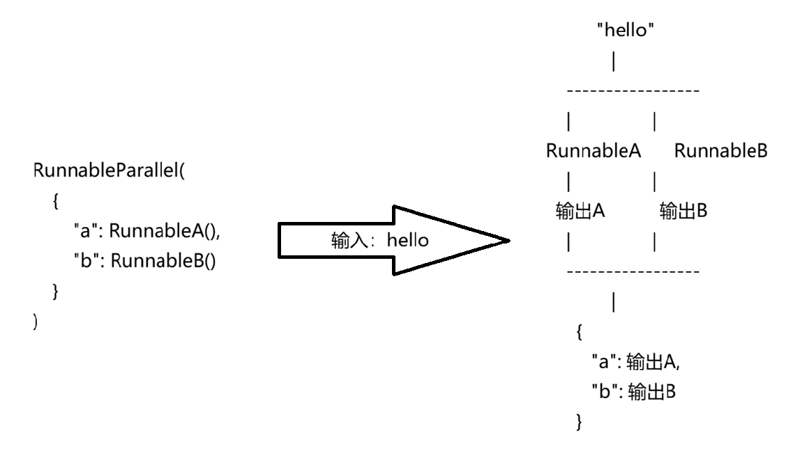

## 代码解答

### 1. 问题一

```
RunnableParallel(
        {
            # 上下文，内容就是检索的内容
            "context": retriever | RunnableLambda(zh_answer),
            "question": RunnablePassthrough(),
        }
    )
```

这段代码是 LangChain LCEL（LangChain Expression Language）里的一个典型写法，用来**并行执行多个 Runnable，然后把结果组合成一个字典传给后续链**。

`RunnableParallel` 接收一个字典：

- `RunnableParallel(
        {
            "key1": runnable1,
            "key2": runnable2,
        }
    )`
- 它会接收一个输入，同时把这个输入传给字典里的每个 Runnable，收集每个 Runnable 的输出，返回一个新的字典



`RunnablePassthrough` 的作用：不做任何处理，把输入原样返回。

“|” 是 LCEL 管道：A | B -- A执行，输出，传递给B，输出

`RunnableLambda(zh_answer)`：等价于`zh_answer(retriever输出的内容)`

### 2. 问题2

```
retriever = vector.as_retriever(search_kwargs={"k": 2})
```

作用是：

- 把一个向量数据库（VectorStore）转换成一个 LangChain 的检索器（Retriever），并设置每次检索返回最相似的 2 个文档。
- 负责根据用户问题找到相关文档的组件。

`as_retriever()`：在 LCEL 管道中，要求左边（retriever）是 Runnable，所以需要`as_retriever()`将 VectorStore（这里指检索器对象vector）包装成 Retriever

`search_kwargs`：搜索时返回最相似的 n 个结果