# 一、服务器

## （一）概念

生活中无处不在：

- 如果存在需要下载客户端后再使用，一般都是基于C/S模式【C/S -- 客户端/服务器模式】
- 如果不需要下载客户端就可以使用，一般都是基于B/S模式【B/S -- 浏览器/服务器模式】

我们项目中做的就是web【通过构造网页来实现项目中的内容和功能的展示】应用开发，是基于B/S模式来实现的

服务器开发的重点：

- **只有通过服务器我们才可以操作数据库中的内容**
- **注意服务器开发的时候分包的思想**
- **注意服务器开发的时候的术语【即通过一个内容可以有不同的称呼】**


## （二）python中服务器开发框架

常见服务器开发框架：

- django：服务器开发框架
- flask：服务器开发框架
- **fastapi：服务器开发框架【项目选型】**

## （三）fastapi

官网：https://fastapi.tiangolo.com/zh/

### 1. 报错

| 报错                      | 常见原因                         |
| ------------------------- | -------------------------------- |
| 404 Not Found             | 接口不存在、路径错误、未注册路由 |
| 405 Method Not Allowed    | 请求方式错误（GET/POST 不匹配）  |
| 422 Unprocessable Entity  | 请求参数校验失败                 |
| 500 Internal Server Error | 接口内部代码异常                 |
| ModuleNotFoundError       | 模块不存在或依赖未安装           |
| ImportError               | 导入对象错误                     |
| Address already in use    | 端口已被占用                     |
| Connection Refused        | 服务未启动或地址错误             |
| NameError                 | 变量或对象未定义                 |

### 2. 分包思想

项目根据功能进行模块划分：

- chat、users：目前考虑到的项目中需要实现的2个模块

- common：所有模块下都需要使用到的工具文件

- ai：关于模型加载配置的工具文件

- static：静态资源，不用它，可以删除掉、main.py的配置同样删除

- templates：页面，不用它，可以删除掉、main.py的配置同样删除


包下文件数量不固定，可以更多、可以更少，不一定所有包下都有代码，根据实际需求创建：

- controller：控制器包，定义接口，（可以提供给客户端访问的接口）
- dao：数据库操作包，操作数据库，负责数据库增删改查
- entity：实体包，定数据模型义类，比如接受json数据的时候需要的类
- service：业务逻辑处理包，就是核心代码。用于实现接口的业务
- utils：仅当前模块下使用的工具文件

其他文件：

- main.py：fastapi服务器启动的主文件，里面就是一些配置和启动设置

- .env：环境信息文件，统一管理环境信息，通过 loadxxxx 函数读取信息

- test.py：写测试代码的文件，没什么实际意义


## （四）接口术语

**服务器中的接口指的就是提供给客户端实现某个功能的函数，这个函数和python中的普通函数定义没有任何区别，只是会多上一个请求路径配置【请求路径配置：告诉客户端通过什么请求地址才能访问到这个函数】**

接口函数不能够像调用普通函数一样的方式去调用，需要通过请求地址去访问 -- 常用工具：

- apipost：接口测试工具

- postman：接口测试工具

在 fastapi 里面可以不用上面的 2 个工具，因为 fastapi 中对 swagger ui 做了集成，直接通过 xxx/docs 地址就可以去到测试的界面，在界面上直接测试

## （五）安装

直接激活虚拟环境，输入命令：

`pip install fastapi "uvicorn[standard]" -i https://repo.huaweicloud.com/repository/pypi/simple/`

## （六）创建fastapi项目

现在的项目不是一个普通的项目，创建方式有一点区别

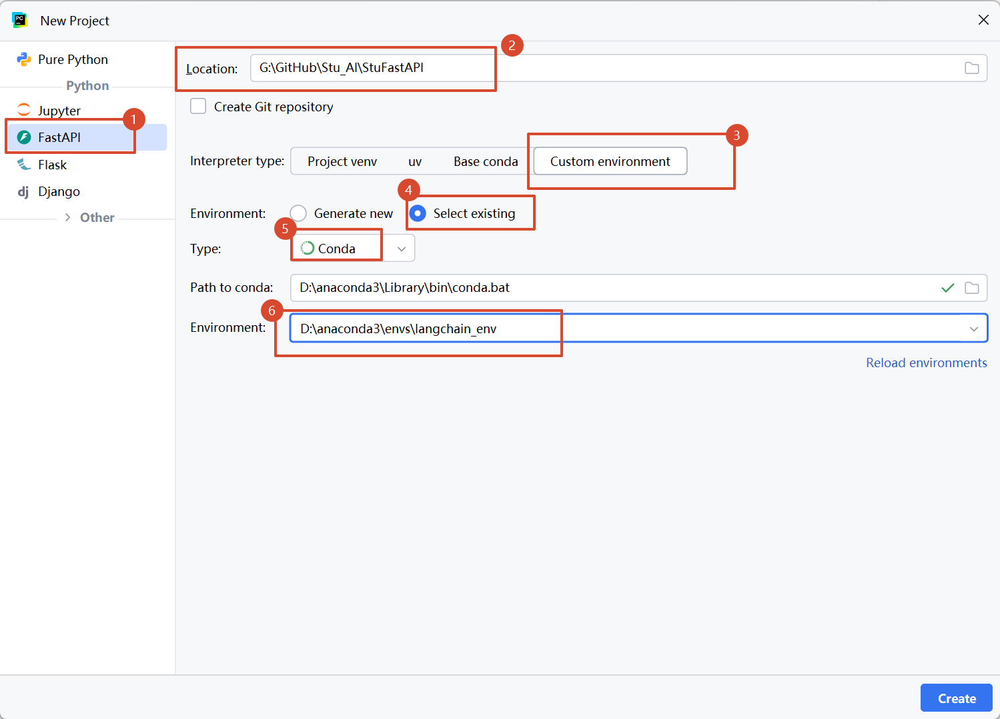

## （七）配置启动方式

方式一：

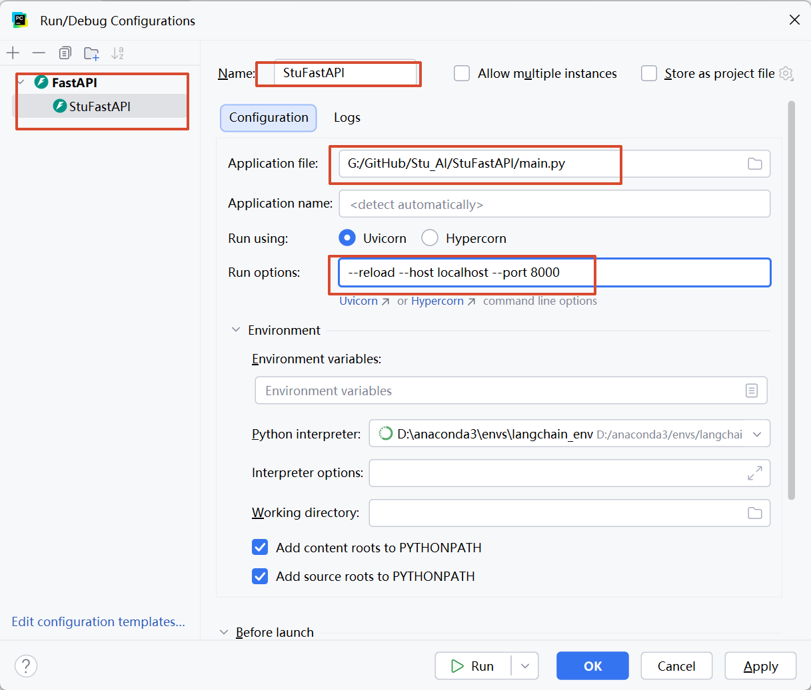

方式二：

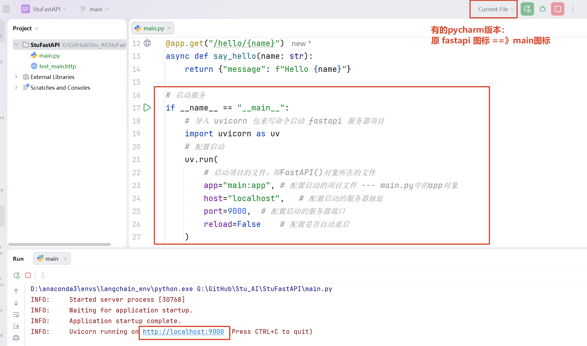

## （八）接口相关的内容

### 1. 接口的定义格式

接口定义分为：

- 第一种：直接在 main.py 中定义接口
- 第二种：在其他文件中定义接口【项目中使用的方案】

请求方式：即规定客户端必须通过什么养的请求方式 + 请求地址来访问接口，常用表达式：

- get：最常见的，比如直接在浏览器地址栏中输入请求地址就属于get请求；通常情况下用于查询任务，客户端提交给服务器的参数信息会拼接在请求地址后面，客户端一表单格式传递参数

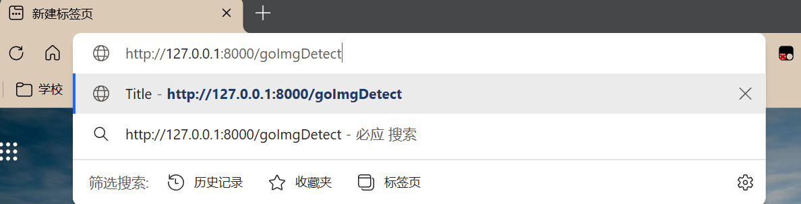

- post：客户端提交给服务器的参数信息包装在请求体里面，这里客户端需要以 json 格式传递参数，常用于新增、登录、参数内容过长等操作

关于接口返回数据据的时候：

- **都是以 json 格式作为返回值，但是我们不需要手动的通过 json.dumps 函数来转换，我们直接把返回值设置为一个字典即可自动完成转换**

定义接口名字、请求路径、接口客户端参数的形参的时候：

- 一般情况下，接口的名字满足 python 函数的命名规则，单词之间下划线隔开。比如 say_hello
- 请求路径按照小驼峰命名，比如 sayHello
- 形参：小驼峰命名规则

main.py 中直接定义接口：

```python
"""
定义一个接口 get 请求的接口：假设这个接口需要返回 msg:hello 给客户端
    1. 先直接定义一个函数 -- python 的普通函数
    2. 定义这个函数的访问路径，使之成为一个接口函数
    3. 设置函数的内容：比如逻辑处理、返回值设置、返回值等
"""

"""
@app:
    @       语法：固定
    app     FastAPI 对象
    get     设置请求方法，可选：get、post
    ()      语法，固定
    "/say"  设置访问这个接口的请求路径，这个路径需要拼接在服务器路径【http://localhost:9000】后面
"""

@app.get("/say")
def say():
    print("say 接口函数执行")
    # 设置返回值 -- 如果是返回数据直接就写入字典中即可，自动转json实现数据传递
    return {"msg": "hello"}

# post请求
@app.post("/say2")
def say2():
    print("say2 函数执行")
    return {"msg": "hello2"}
```

### 2. MVC思想

按照不同的项目模块和功能代码进行分包处理，降低代码耦合度，使得代码分层更清晰，测试更加方便，常见的分包方式：

- 模块划分包名：
    - 控制器包 contro11er ： 用于定义接口、接收客户端和响应客户端请求服务器包
    - 服务器包 service ：用于实现某个 controller 包下的接口的功能代码处理逻辑、返回值配置等，提供给 controller 调用
    - 数据库包 dao ：用于操作数据库的包，只操作数据库，不做任何逻辑处理，通常提供给 service 使用
    - 工具包 uti1s ： 用于抽取当前模块下的冗余代码形成工具
    - 实体包 entity ： 定义类作为实体【用于数据验证、接收客户端的 json 等定义类】
- 公共类型的代码 common ：很多模块都需要使用的二公局代码等，就放在 common 包下
- 同一个模块下，操作不同的业务选择创建不同的文件来实现，我们可以不需要创建类，直接定义函数接口【比如 chat 模块，既有聊天的业务、也有加载历史对话记录的业务，那么我们就创建 2 套文件，分别出来聊天业务和历史对话记录业务】
- 比如：针对于本次项目，实现 rag 对话我们可以按照以下格式分包
    - users： 用户模块
        - controller
        - service
        - dao
        - utils
        - entity
    - chat： 对话模块
        - controller
        - service
        - dao
        - utils
        - entity
    - common： 公共模块
    - ai： ai模块

### 3. 父子路由嵌套（重点）

我们由于采取分包分模块思想，那么我们定义的接口不是在main.py中，而是在对应的模块下的controller包下，那么在对应的模块下的controller包下就没有 FastAPI 的对象，因此定义不了直接给客户端访问的接口

这个时候，我们采取把对应的模块下的 controller 包下接口定义为子路由，然后在 main.py 中注册子路由即可


启动服务器后，进入docs：


- tags：用于为接口指定分组，仅影响 Swagger（/docs）中的接口分类显示，不影响接口的访问地址和功能。
- include_router(tags=[...])：为整个子路由设置默认分组；若接口自身也指定了 tags，则以接口上的 tags 为准。

### 4. 接口接收客户端请求参数信息【重要】

通常情况下分为以下三种情况：

- 表单格式数据【客户端设置的请求头中参数content-type: x-www-form-urlencoded】，配合 get 请求使用【通常情况下】；接
    收这个客户端参数的时候有以下几种办法：
    - 把请求参数通过k=v格式写在请求地址后面 --- 定义形参来接收
    - 把请求参数写在请求路径里面 --- 在请求路径中定义变量 + 接口方法形参来接收
- json格式数据【客户端设置的请求头中参数content-type: application/json】，配合 post 请求使用【通常情况下】；接收这个
    客户端参数的时候的办法：
    - 定义一个类，通过类的对象来接收
- file 文件类型【客户端设置的请求头中参数 content-type: multipart/form-data】，必须使用post 请求，接收的时候使用 UploadFile 对象来接收

明确前提：

- 无论选择什么样的方式传递数据给服务器，一定要满足 key 对的上【客户端和服务器交互数据的时候，基本都是通过 key : value 来实现，只能通过 key 找 value】

案例代码：

```python
"""
方式一：get请求+key = value数据
    直接用形参接收，形参的名字许哟啊和key相同，否则接收不到数据
"""
@users_router.get("/one")
def one(username: str,password:str):
    print(f"接收的数据：username={username}，password={password}")
    return{
        "code":200,
        "msg":"this is one",
        "data":{
            "u_n":username,
            "p_w":password
        }
    }


"""
方式二：get请求+参数直接在请求路径后面（没有key，只有value）
    需要现在接口的请求路径定义中，定义{变量}占位，然后在接口方法中定义和占位变量相同的名字的形参来接收，有顺序问题
    通常情况下，用于查询和删除操作
注意事项：
    接口函数的形参必须和请求路径中的占位符的名字一样，否则422报错
"""
@users_router.get("/two/{username}/{password}")
def teo(username: str, password: str):
    print(f"接收的数据：username={username}，password={password}")
    return{
        "code":200,
        "msg":"this is two",
        "data":{
            "u_n":username,
            "p_w":password
        }
    }


"""
方式三：post 请求 + json 格式数据【application/json】
    需要定义一个类来接收，类的属性的名字必须和json数据中key相同，比如：
        json --- {"username":"admin", "password":"111"}
        类 ---- username: str password: str
"""
from pydantic import BaseModel,Field
# 定义接收数据的类 -- 直接继承BaseModel即可
class tc(BaseModel):
    # 定义属性 -- Field(...,title="用户名") 关于这个属性的说明
    username: str = Field(..., title="用户名")
    password: str = Field(..., title="密码")
@users_router.post("/three")
def three(data: tc):
    print(f"接收的数据：username={data.username}，password={data.password}")
    print(data.username,data.password)
    return {
        "code":200,
        "msg":"this is three",
        "data":data
    }

"""
方式四：post 请求 + 文件 file
    file 类型的数据，必须用 post 请求
    通过接口形参来接收，形参用UploadFile类来接收
    file 以外的数据可以封装在From中，比如 username: str = Form(...) 就是接收变量username
"""
from fastapi import UploadFile,File,Form
import time
@users_router.post("/four")
def four(file: UploadFile = File(..., title="上传的文件"),username: str = Form(..., title="用户名")):
    print(f"接收的数据：username={username}，file={file.filename}")
    # 重定义文件名
    filename = str(int(time.time())) + file.filename.split(".")[-1]
    # 传入文件存储地址
    save_path= r"G:\GitHub\Stu_AI\StuFastAPI\static\upload"+filename
    # 读取并保存文件
    with open(save_path,"wb") as f:
        # 读取文件内容
        f.write(file.file.read())
    return {
        "code":200,
        "msg":"this is four",
        "data":{
            "file_name":filename
        }
    }
```

### 5. 流式输出

案例代码：

```python
"""
流式输出：StreamingResponse
    在 fastapi中，通过设置接口方法的返回值就可以实现流式输出
    参数1：content：一个迭代器（生成器）对象，直接通过yield作为函数的返回值即可创建出来迭代器（生成器）对象
    参数2：media_type: xxxx
"""
from starlette.responses import StreamingResponse

"""
流式输出方案一：直接把结果当前返回值返回，不做任何处理
    优点：服务器代码简单
    缺点：客户端代码非常难写
"""
@users_router.get("/stream_one")
def stream_one():
    # 设置模型返回值
    result = "程序员去医院体检，医生说：“你有点缺钙。”程序员点点头：“难怪最近老报错，原来不是代码有问题，是我这个‘运行环境’该升级了。”"
    # 定义生成器
    def generator():
        for i in result:
            yield f"{i}"
            time.sleep(0.05)
    # 返回结果
    return StreamingResponse(
        content=generator(),    # 迭代器对象
        media_type="text/event-stream",
    )

"""
流式输出方案二：客户端使用SSE请求，服务器必须把数据包装成data：数据内容\n\n 字符串格式，否则报错
    服务器中通常把数据内容转为json格式返回，便于客户处理，并且需要告诉客户但数据输出什么时候结束【给一个标识符】
    缺点：
"""
import json
@users_router.get("/stream_sse")
def stream_sse():
    result = "程序员去医院体检，医生说：“你有点缺钙。”程序员点点头：“难怪最近老报错，原来不是代码有问题，是我这个‘运行环境’该升级了。”"
    def generator():
        for i in result:
            yield f"data:{json.dumps({"content": i})}\n\n"
            time.sleep(0.05)
        yield f"data:{json.dumps({"content": "end_end"})}\n\n"
    return StreamingResponse(
        content=generator(),
        media_type="text/event-stream",
    )
```

## （作业）7.29

### 1. 封装加载 LLM 的工具函数

```python
# 在 ai 包下封装一个加载 LLM 的工具函数
# G:\GitHub\Stu_AI\StuFastAPI\ai\LoadLLM.py

from langchain_openai import ChatOpenAI
import os

# 创建模型对象
def create_model():
    return ChatOpenAI(
        api_key=os.getenv("DASHSCOPE_API_KEY"),
        base_url="https://dashscope.aliyuncs.com/compatible-mode/v1",
        model="qwen3.7-max",
        streaming=True,
    )
```

### 2. 实现 LLM 针对于问题生成回复并流式输出给客户端展示

```python
# main.py

from fastapi import FastAPI
# 创建 FastAPI 对象
app = FastAPI()

# 导入子路由对象
from users.controller.WorkController import work_router
# 注册子路由
app.include_router(
    router=work_router,
    prefix="/users",
    tags=["work"]
)

# 启动服务
if __name__ == "__main__":
    # 导入 uvicorn 包来写命令启动 fastapi 服务器项目
    import uvicorn as uv
    # 配置启动
    uv.run(
        # 启动项目的文件，即FastAPI()对象所在的文件
        app="main:app", # 配置启动的项目文件 --- main.py中的αpp对象
        host="localhost",   # 配置启动的服务器地址
        port=9000,  # 配置启动的服务器端口
        reload=False    # 配置是否自动重启
    )
```

```python
# 在 TestController 包下实现用户输入问题 --> LLM 针对于问题生成回复 --> 流式输出给客户端展示
# G:\GitHub\Stu_AI\StuFastAPI\users\controller\WorkController.py

# 引入子路由类
from fastapi import APIRouter
# 创建子路由对象
work_router = APIRouter()

# 引入 LLM 模型
from ai.LoadLLM import create_model
# 流式输出
from starlette.responses import StreamingResponse
# 引入json包
import json

@work_router.get("/stream")
def stream(question: str):
    # 创建模型对象
    llm = create_model()
    # 接收用户输入的问题
    print(f"接收的问题：question={question}")
    # 角色
    messages = [
        {"role": "system", "content": "You are a helpful assistant."},
        {"role": "user", "content": question}]
    # 创建生成器
    def generator():
        for chunk in llm.stream(messages):
            if chunk.content:
                yield f"data: {json.dumps({'content': chunk.content})}\n\n"
        yield f"data: {json.dumps({'content': 'end_end'})}\n\n"
    # 流式输出
    return StreamingResponse(

        content=generator(),
        media_type="text/event-stream",
    )
```

### 3. 老师讲的

```python
# main.py

from fastapi import FastAPI

# 创建 FastAPI 对象
app = FastAPI()

# 导入子路由对象
from users.controller.WorkController import work_router
# 注册子路由
app.include_router(
    router=work_router,    # 引入子路由对象
    prefix="/users", # 配置访问子路由接口的前缀，默认“”，推荐写为模块的包名作为区分
    tags=["work"]   # 配置swaggerUI中的模块名称
)

# 启动服务
if __name__ == "__main__":
    # 导入 uvicorn 包来写命令启动 fastapi 服务器项目
    import uvicorn as uv
    # 配置启动
    uv.run(
        # 启动项目的文件，即FastAPI()对象所在的文件
        app="main:app", # 配置启动的项目文件 --- main.py中的αpp对象
        host="localhost",   # 配置启动的服务器地址
        port=9000,  # 配置启动的服务器端口
        reload=False    # 配置是否自动重启
    )
```

**方案一：假流式**

```python
# WorkController.py    

from users.service import WorkService

@work_router.get("/chat")   # 定义接口函数的请求路径，提供给客户端访问
def chat(question: str):
    result = WorkService.chat(question)
    def generator():
        for item in result:
            yield f"data: {json.dumps({'content': item})}\n\n"
        yield f"data: {json.dumps({'content': '【end_end】'})}\n\n"
    return StreamingResponse(
        content=generator(),	# 迭代器对象
        media_type="text/event-stream",  # 媒体类型
    )
```

```python
# WorkService.py

from ai import LoadLLM

def chat(question):
    # 假流式输出：等待LLM输出了所有的结果然后再返回
    llm = LoadLLM.create_model()    # 加载大模型
    messages = [
        {"role": "system", "content": "You are a helpful assistant."},
        {"role": "user", "content": question}
    ]
    re = llm.invoke(messages)
    # print(f"re={re}")
    return re.content

if __name__ == '__main__':
    # 测试 -- 假流式
    print(chat("你好"))
```

**方案二：真流式**

```python
# WorkController.py（非SSE）

from users.service import WorkService

@work_router.get("/chat")   # 定义接口函数的请求路径，提供给客户端访问
def chat(question: str):
    # 假设不做任何处理，可以直接把结果返回
    return StreamingResponse(
        content=WorkService.chat(question),  # 迭代器对象
        media_type="text/event-stream",  # 媒体类型
    )
```

```python
# WorkController.py（SSE）

from users.service import WorkService

@work_router.get("/chat")   # 定义接口函数的请求路径，提供给客户端访问
def chat(question: str):
    # 处理数据为sse需要的相应格式
    def generator():
        for item in WorkService.chat(question):
            yield f"data: {json.dumps({'content': item})}\n\n"
        yield f"data: {json.dumps({'content': 'end_end'})}\n\n"
    return StreamingResponse(
        content=generator(),  # 迭代器对象
        media_type="text/event-stream",  # 媒体类型
    )
```

```python
# WorkService.py

from ai import LoadLLM

def chat(question):
    # 真流式输出：LLM每输出一个结果就返回给客户端
    llm = LoadLLM.create_model()
    messages = [
        {"role": "system", "content": "You are a helpful assistant."},
        {"role": "user", "content": question}
    ]
    for chunk in llm.stream(messages):
        if chunk.content:
            yield chunk.content

if __name__ == '__main__':
    # 测试 -- 真流式
    for item in chat("你好"):
        print(item)
```

## （九）关于一体式项目配置

如果客户端不需要构建一个单独的服务来实现，而是 直接把客户端代码放在服务器中，由服务器一并管理，那么就需要做以下基本配置

### 1. 静态资源放行

处理服务器中的代码默认情况下都是受保护的，即**不能够直接通过资源所在的路径去访问**它

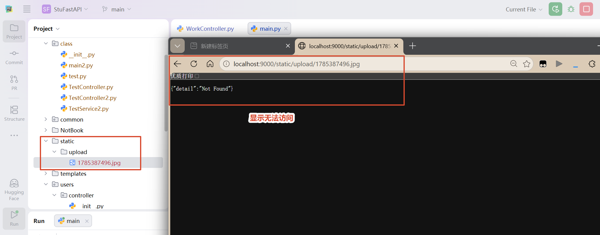

一般情况下，静态资源我们都是需要放行处理，防止客户端开发的时候资源访问不到的问题。静态资源指的是：图片、**js  文件、css 文件**等

明文规定：一般情况下服务器中把所有的静态资源放在 static 文件夹下

```python
# main.py

# 静态资源配置
from fastapi.staticfiles import StaticFiles
app.mount(
    "/static",	# 静态资源访问的前缀 -- 请求路径
    StaticFiles(directory="static"),	# 静态资源目录 -- 放行的文件夹
    name="static"	# 静态资源访问的模块名称
)
```

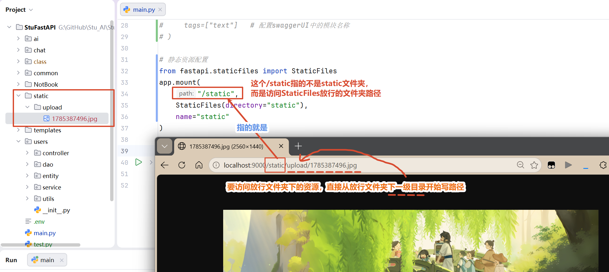

### 2. 页面访问配置

我们通常把一体式项目的所有客户端内容放在 temlates 文件夹这，这个文件夹下的内容也没有办法直接访问，如果想要实现访问某一个页面，按照以下步骤：

- 配置这个页面的访问路径
- 通过这个页面的访问路径去访问这个页面

```python
"""
配置一个访问s.html页面的请求路径
"""
from fastapi.responses import HTMLResponse
from fastapi import Request
from fastapi.templating import Jinja2Templates

# 创建模板对象
templates = Jinja2Templates(directory="templates")
@users_router.get("/s",response_class=HTMLResponse)
def go_s(request: Request): # request 是请求对象，伴随着客户端访问服务器的时候产生的，可以获取客户端传递过来的内容等
    return templates.TemplateResponse(request=request, name="s.html")
```

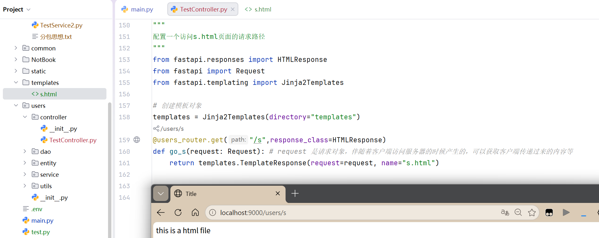

### 3. 启动和关闭执行

```python
"""
配置一个访问s.html页面的请求路径
"""
from fastapi.responses import HTMLResponse
from fastapi import Request
from fastapi.templating import Jinja2Templates

# 创建模板对象
templates = Jinja2Templates(directory="templates")
@users_router.get("/s",response_class=HTMLResponse)
def go_s(request: Request): # request 是请求对象，伴随着客户端访问服务器的时候产生的，可以获取客户端传递过来的内容等
    username = request.app.state.username
    print(f"接收的数据：username={username}")
    return templates.TemplateResponse(request=request, name="s.html")
```

```python
# main.py

from fastapi import FastAPI

# 启动项目和关闭项目分别执行一些内容
from contextlib import asynccontextmanager
@asynccontextmanager
async def start_rnd_run(app):
    """
        app:FastAPI 对象
        yield之前的内容：启动项目执行
        yield 之后的内容：关闭项目执行
        如果想实现一些变量的初始化操作，可以把变量写入到 app.state 属性中，格式如下：
            app.state.变量名 = 初始值
        如果某个接口中需要使用，就用 request 对象取出来，格式如下：
            变量名2 = request.app.state.变量名
    """
    app.state.username = "clovere"
    yield
    print("关闭项目")

# 创建 FastAPI 对象
app = FastAPI(lifespan=start_rnd_run)

# 导入子路由对象
from users.controller.TestController import users_router
# 注册子路由
app.include_router(
    router=users_router,    # 引入子路由对象
    prefix="/users", # 配置访问子路由接口的前缀，默认“”，推荐写为模块的包名作为区分
    tags=["text"]   # 配置swaggerUI中的模块名称
)

# 静态资源配置
from fastapi.staticfiles import StaticFiles
app.mount(
    "/static",	# 静态资源访问的前缀 -- 请求路径
    StaticFiles(directory="static"),	# 静态资源目录 -- 放行的文件夹
    name="static"	# 静态资源访问的模块名称
)

# 启动服务
if __name__ == "__main__":
    # 导入 uvicorn 包来写命令启动 fastapi 服务器项目
    import uvicorn as uv
    # 配置启动
    uv.run(
        # 启动项目的文件，即FastAPI()对象所在的文件
        app="main:app", # 配置启动的项目文件 --- main.py中的αpp对象
        host="localhost",   # 配置启动的服务器地址
        port=9000,  # 配置启动的服务器端口
        reload=False    # 配置是否自动重启
    )
```

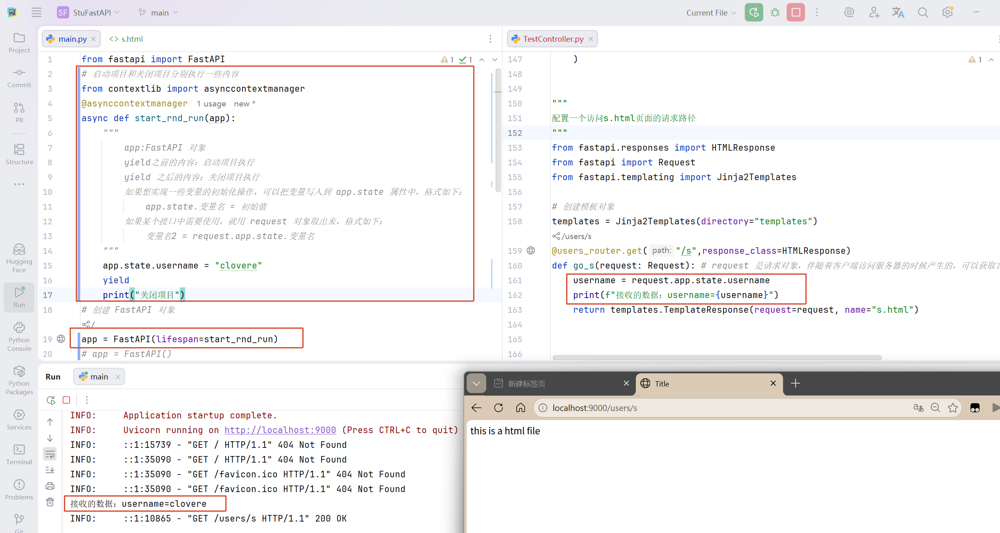

## （十）实现邮件发送功能

第一步:

- 输入自己的邮箱号，点击发送按钮

第二步：

- 服务器接收到客户端需要发送邮件的指令【接收请求】，然后调用发送邮件的代码给客户端传过来的邮箱号发送一封邮件，主题：你的验证码来了~【自己设置】、内容：验证码信息，提示过期时间【过期时间60s】

第三步：

- 发送邮件前的逻辑判断处理：

    - 判断邮箱号是否输出系统用户--- 通过 mysg！ 数据库实现【定义一个表存储用户信息】

    - 验证码过期时间---通过 redis 实现，存入验证码数据的时候设置过期时间为 60s【即60s后这一条数据自动的删除】

第四步：

- 用户输入验证码，点击验证按钮，服务器接收到验证验证码的需求，查询出用户刚才发送验证码操作中存入redis中的验证码数据进行比对，返回对应的结果

### 1. 信息统一管理

我们直接在项目根目录下创建一个.env 文件，里面就通过 key=value的格式配置一些信息，比如数据库的连接信息、邮箱的授权码信息、邮箱号信息等等

value 因为是常量，所以定义这个常量的时候通常 key全部用大写字母【英文单词】

```.env
# 发件方邮箱号
SENDER_EMAIL="2920242909@qq.com"
# 发件方邮箱号对应的授权码
SENDER_EMAIL_PASSWORD="wsreafrsbkqpjjjh"
```

### 2. pymysql

pymysql：是一个 python 用来操作数据库的库，通常用他操作 mysgl

步骤：

安装 `pip install pymysql`

代码操作：

- **查询**：步骤是固定的，只有SQL 语句不一样

`se1ect 查询内容【表对应的列名，也就是字段名字】from 表名where 条件【通常就是列名=xxx】`

- 增删改

准备一张用户表，给上一些测试数据，一定保留一个真实数据【用于项目中发邮件使用】，设计表的时候尽可能针对于项目功能设计好字段，防止后期去修改，比如：

| 列名        | 描述                                                         | 数据类型                 |
| ----------- | ------------------------------------------------------------ | ------------------------ |
| users_id    | 用户ID，主键自增【唯一标识这个用户】                         | int                      |
| username    | 用户名【不是用来做登录的，用于显示当前登录完成后进行问答的人是谁】 | varchar【字符串】        |
| email       | 邮箱号                                                       | varchar【字符串】        |
| create_time | 注册时间                                                     | datatime【年月日时分秒】 |

### 3. navicat 连接

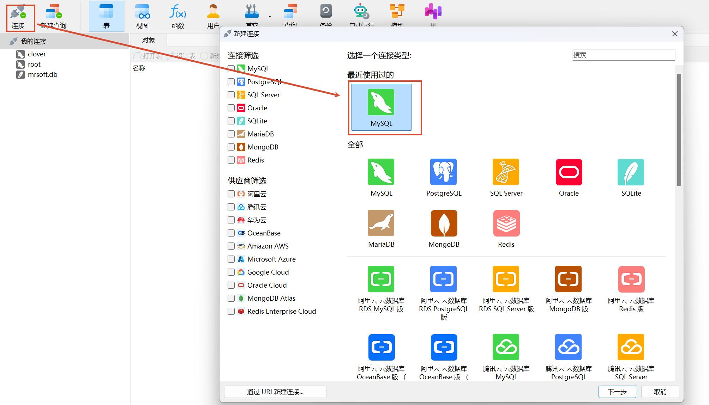

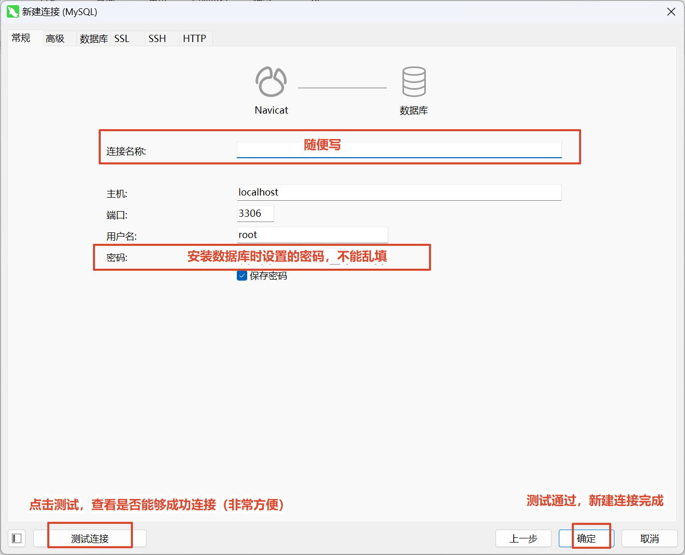

### 4. 创建数据库

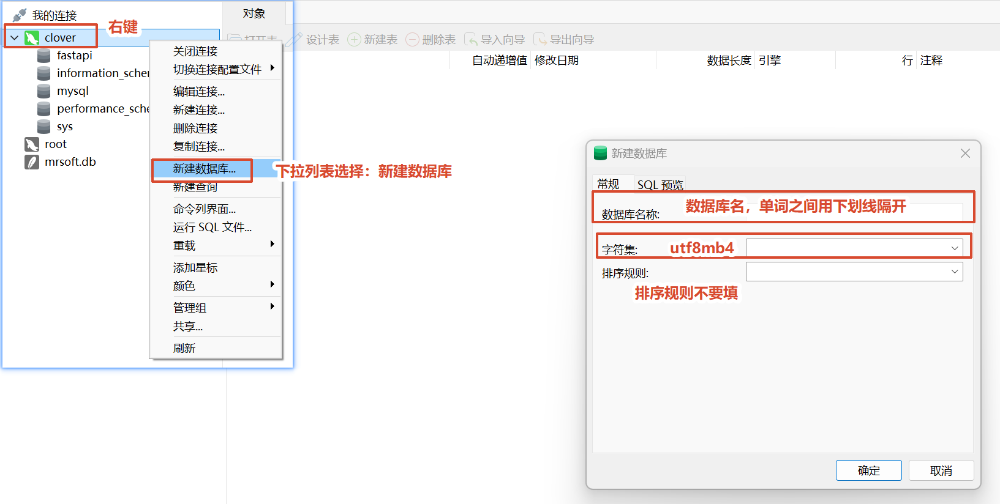

**注意：**图中勾选的数据库一定不要动，否则数据库会出问题

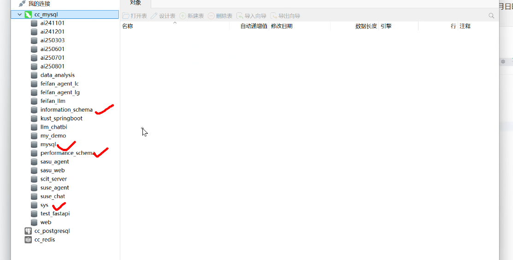

### 5. 创建 users 表

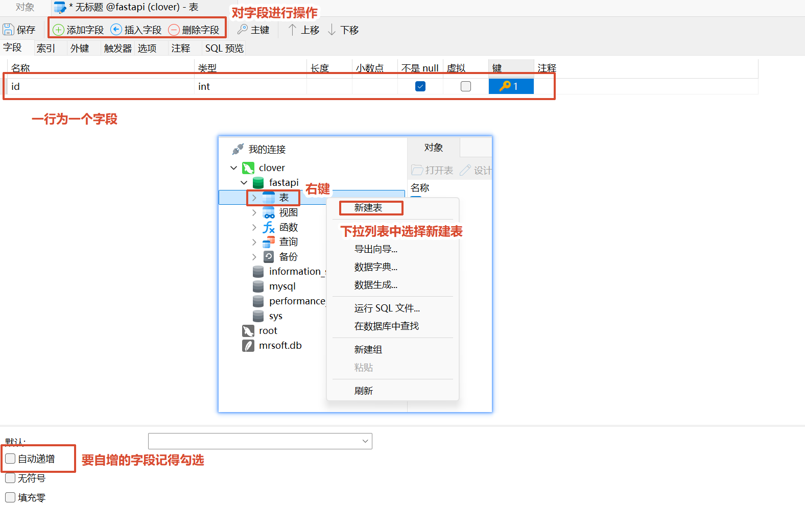

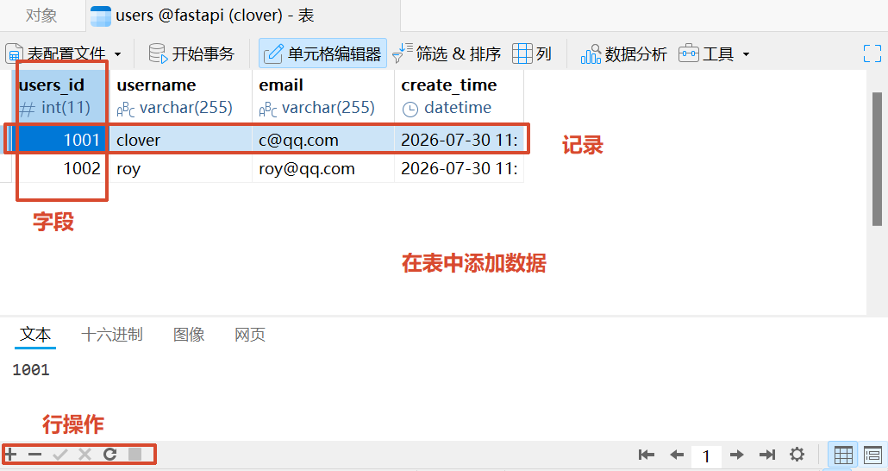

### 6. pymysql 查询案例 - 无参数

步骤几乎是固定的，我们需要改的代码，一般只有SQL语句

```python
# 1、导入 pymysql
import pymysql

# 2、建立连接
conn = pymysql.connect(
    # IP地址
    host="localhost",
    # 端口号
    port=3306,
    # 数据库账户
    user="root",
    # 数据库账户对应的密码
    password="123456",
    # 数据库名称
    database="clover",
    # 字符集
    charset="utf8mb4",
    # 以 dict 的方式返回查询结果
    cursorclass=pymysql.cursors.DictCursor
)
# 3、获取游标对象【操作数据库的对象】
cur = conn.cursor()
# 4、编写SQL语句
sql = "SELECT * FROM users;"
# 5、执行SQL语句
cur.execute(sql)
# 6、获取查询结果
results = cur.fetchall()
# 7、打印结果
print(results)
# 8、关闭游标对象和连接对象
cur.close()
conn.close()
```

### 7. pymysql 查询案例 - 有参数

如果在执行查询操作的时候，涉及到了变量内容，需要在定义 SQL 语句的时候，使用 %s 作为占位符，然后再执行 SQL 语句的时候使用值去替换 %s【有顺序问题】；如果想要在navicat中编写SQL，但是SQL中存在变量，那么就想把变量设置为一个常量

```python
# 1、导入 pymysql
import pymysql

# 2、建立连接，获取数据库连接对象
conn = pymysql.connect(
    # IP地址
    host="localhost",
    # 端口号
    port=3306,
    # 数据库账户
    user="root",
    # 数据库账户对应的密码
    password="123456",
    # 数据库名称
    database="clover",
    # 字符集
    charset="utf8mb4",
    # 以 dict 的方式返回查询结果
    cursorclass=pymysql.cursors.DictCursor
)
# 3、获取游标对象【操作数据库的对象】
cur = conn.cursor()
# 4、编写SQL语句 --- %s 占位符
sql = "SELECT * FROM users WHERE email=%s;"
# 5、执行SQL语句 --- 为 %s 占位符赋值【根据顺序依次赋值】 --- 只能够把值放在列表中
cur.execute(sql, ["2920242909@qq.com"])
# 6、获取查询结果
results = cur.fetchall()
# 7、打印结果
print(results)
# 8、关闭游标对象和连接对象
cur.close()
conn.close()
```

### 8. 封装操作数据库的工具

```.env
# 发件方邮箱号
SENDER_EMAIL="2920242909@qq.com"
# 发件方邮箱号对应的授权码
SENDER_EMAIL_PASSWORD="wsreafrsbkqpjjjh"

# MySQL 连接信息
MYSQL_HOST="localhost"
MYSQL_PORT="3306"
MYSQL_USER="root"
MYSQL_PASSWORD="123456"
MYSQL_DATABASE="clover"
MYSQL_CHARSET="utf8mb4"
```

```python
# common\MySQLUtil.py

import pymysql
import os
from dotenv import load_dotenv

# 加载.env文件中的数据
load_dotenv()

# 获取连接
def get_mysql_conn():
    return pymysql.connect(
        # IP地址
        host=os.getenv("MYSQL_HOST"),
        # 端口号 -- 类型为 int
        # os.getenv("MYSQL_PORT") -- 类型为 str，需要转换为 int
        port=int(os.getenv("MYSQL_PORT")),
        # 数据库账户
        user=os.getenv("MYSQL_USER"),
        # 数据库账户对应的密码
        password=os.getenv("MYSQL_PASSWORD"),
        # 数据库名称
        database=os.getenv("MYSQL_DATABASE"),
        # 字符集
        charset=os.getenv("MYSQL_CHARSET"),
        # 以 dict 的方式返回查询结果
        cursorclass=pymysql.cursors.DictCursor
    )

# 关闭连接
def close_mysql_conn(cursor,conn):
    cursor.close()
    conn.close()
```

```python
# test.py

# 1. 导入工具类
from common import MySQLUtil

# 2.建立连接
conn = MySQLUtil.get_mysql_conn()
# 3、获取游标对象【操作数据库的对象】
cur = conn.cursor()
# 4、编写SQL语句 --- %s 占位符
sql = "SELECT * FROM users WHERE email=%s;"
# 5、执行SQL语句 --- 为 %s 占位符赋值【根据顺序依次赋值】 --- 只能够把值放在列表中
cur.execute(sql, ["2920242909@qq.com"])
# 6、获取查询结果
results = cur.fetchall()
# 7、打印结果
print(results)
# 8、关闭游标对象和连接对象
MySQLUtil.close_mysql_conn(cur, conn)
```

### 9. 实现发送邮件

参考代码 --- UsersController ---- UsersService ---- UsersDao ---- MySQLUtil --- RedisUtil

#### UsersController.py

写一个用户邮箱的接口 -- UsersController.py

**作用：**

邮件属于用户模块下的操作，要发送邮件给用户，那么必然要知道用户方的邮箱，接口需要接收用户邮箱参数

- 创建 APIRouter 子路由对象
- 创建发送邮件接口函数，接收用户邮箱参数：
    - 规定如何接收请求 -- 接收用户邮箱参数，请求路径、接口简要摘要、接口详细描述（规定统一返回格式：code,msg,data）
    - 规定如何响应请求 -- Controller负责接收请求，获取用户邮箱，然后调用 Service，将 Service 返回结果封装成接口响应
- 到main.py里面注册路由

**实现代码：**

```python
# UsersController.py

from fastapi import APIRouter
from users.service import UsersService

# 创建子路由对象
users_router = APIRouter()

@users_router.get(
    # 请求路径
    path="/sendEmail",
    # 接口简短摘要，显示在 Swagger UI 的接口列表中
    summary="发送邮件",
    # 接口详细描述，显示在 Swagger UI 的接口详情中
    description="""
        给用户输入的邮箱号发送验证码
        访问路径：http://localhost:8000/users/sendEmail
        请求参数：
            email：字符串类型，用户输入的邮箱号
        返回值：
            {
                "code": 状态码，成功200、失败500，int
                "msg": 提示信息，字符串
                "data": None，数据内容，Object
            }
    """,
)
def get_users(email):
    # 调用服务层方法 --- 服务层方法的返回值在这里就是直接返回给客户端请求
    return UsersService.send_email(email)
```

```python
# main.py

from fastapi import FastAPI
# 启动项目和关闭项目分别执行一些内容
from contextlib import asynccontextmanager
@asynccontextmanager
async def start_rnd_run(app):
    """
        app:FastAPI 对象
        yield之前的内容：启动项目执行
        yield 之后的内容：关闭项目执行
        如果想实现一些变量的初始化操作，可以把变量写入到 app.state 属性中，格式如下：
            app.state.变量名 = 初始值
        如果某个接口中需要使用，就用 request 对象取出来，格式如下：
            变量名2 = request.app.state.变量名
    """
    print("启动项目")
    yield
    print("关闭项目")
# 创建 FastAPI 对象
app = FastAPI(lifespan=start_rnd_run)
# app = FastAPI()

# 导入子路由对象
from users.controller.UsersController import users_router
# 注册子路由
app.include_router(
    router=users_router,    # 引入子路由对象
    prefix="/users", # 配置访问子路由接口的前缀，默认“”，推荐写为模块的包名作为区分
    tags=["text"]   # 配置swaggerUI中的模块名称
)

# 静态资源配置
from fastapi.staticfiles import StaticFiles
app.mount(
    "/static",	# 静态资源访问的前缀 -- 请求路径
    StaticFiles(directory="static"),	# 静态资源目录 -- 放行的文件夹
    name="static"	# 静态资源访问的模块名称
)

# 启动服务
if __name__ == "__main__":
    # 导入 uvicorn 包来写命令启动 fastapi 服务器项目
    import uvicorn as uv
    # 配置启动
    uv.run(
        # 启动项目的文件，即FastAPI()对象所在的文件
        app="main:app", # 配置启动的项目文件 --- main.py中的αpp对象
        host="localhost",   # 配置启动的服务器地址
        port=9000,  # 配置启动的服务器端口
        reload=False    # 配置是否自动重启
    )
```

**出现的问题与解决：**

问题：数据库不存在：`pymysql.err.OperationalError: (1049, "Unknown database 'clover'")`

原因：.env文件中数据库名称填写错误

解决：修改为`MYSQL_DATABASE="fastapi"`，重新启动后数据库连接成功

#### UsersService.py

处理如何发送邮件业务 -- UsersService.py

**作用：**

负责处理发送邮件的业务流程

因为已经获取了用户邮箱，那么我们就要想到接下来该将验证码发给用户了，但是发送之前为了安全，我们要对用户的邮箱进行确认，因此：

- 创建一个发送邮件的函数（ 参数：用户的邮箱号），实现以下功能：
    - 验证（涉及数据库 ==> 不在service，有专门的地方 ==> 调用 UsersDao 查询邮箱是否存在，返回结果）
    - Service 判断 DAO 返回结果是否为空（判断方法【isinstance】-- 是不是指定的数据类型），确定邮箱是否存在

- 判断是否发送邮件
    - 不发：
        - 返回业务失败信息：500
    - 发送：
        - 随机数生成验证码
        - 配置发送信息【发件放、授权码（从.env文件读取）、主题、邮件内容】
        - 创建邮箱内容，发邮件的api【1.创建一个信封，将发送的信息进行包装；2.在message对象中添加内容】
        - 创建邮件发送服务配置【SMTP】，开启邮件发送服务【TLS  1.验证授权码 2.发送邮件（sendmail） 3.退出】
        - 将验证码存储到redis中 -- 获取连接、存入验证码（过期时间）、关闭连接
        - 返回成功信息200

**实现代码：**

```python
# .env

# 发件方邮箱号
SENDER_EMAIL="2920242909@qq.com"
# 发件方邮箱号对应的授权码
SENDER_EMAIL_PASSWORD="qemjrnlxqgssdeib"

# QQ邮箱服务器地址
SMTP_HOST="smtp.qq.com"
# 端口号
SMTP_PORT="587"
```

```python
# UsersService.py

from users.dao import UsersDao
# 加载环境信息
import os
from dotenv import load_dotenv
load_dotenv()
# 随机数
import random
# api
# 创建信封
from email.mime.text import MIMEText
# 邮件发送服务
import smtplib
# 加载redis工具
from common import RedisUtil

# 发送邮件
def send_email(email):
    # 1. 验证邮箱是否输出注册过的用户
    flag = False
    # isinstance(a,b)：返回布尔，判断a是不是b类型（b的实例）
    if isinstance(UsersDao.check_email(email), list):	# 调用 UsersDao 查询邮箱
        flag = True

    # 2. 根据结果判断是否发送邮箱
    if not flag:    # 不发邮件
        return {
            "code":500,
            "msg":f"该邮箱号 {email} 不存在",
            "data":None
        }

    # 3.发邮件
    # 随机生成6位验证码
    code = ""
    for _ in range(6):
        code += str(random.randint(0, 9))

    # 配置发送信息：发件方、授权码（从.env文件读取）、主题、邮件内容
    sender = os.getenv("SENDER_EMAIL")
    senger_pwd = os.getenv("SENDER_EMAIL_PASSWORD")
    subject = "主题为：发送验证码"
    content = f"验证码为：{code},请在5分钟内使用"

    # 创建邮件对象 -- 将要发送的信息写在这个对象里面
    message = MIMEText(content, "plain", "utf-8")

    # 添加内容在 message对象中
    message["From"] = sender    # 发件人
    message["To"] = email   # 收件人
    message["Subject"] = subject    # 主题

    try:
        # 创建邮件发送服务配置（从.env文件读取）
        smtp = smtplib.SMTP(
            host=os.getenv("SMTP_HOST"),
            port=int(os.getenv("SMTP_PORT"))
        )

        # 开启邮件发送服务 TLS
        smtp.starttls()

        # 验证发送方和发送方的授权码是否能对上
        smtp.login(sender, senger_pwd)

        # 发送邮件 -- 方法：sendmail(发送方，接收方，邮件对象)
        smtp.sendmail(sender, email, message.as_string())

        # 发送成功后退出
        smtp.quit()

        # 将验证码存储到redis中
        # 获取连接
        r = RedisUtil.get_redis_conn()
        # redis存值通过key,value格式存入，取值通过key
        r.setex(email, 300 ,code)  # 300秒后过期，key为email，value为code
        # 关闭连接
        RedisUtil.close_redis_conn(r)

        # 返回成功信息
        return {
            "code": 200,
            "msg": f"邮件已发送成功，到 {email}",
            "data": None
        }

    except Exception as e:
        print(f"发送邮件失败：{e}")
        return {
            "code": 501,
            "msg": f"邮件发送到 {email} 失败",
            "data": None
        }

if __name__ == "__main__":
    print(send_email("c@qq.com"))
```

**出现的问题与解决：**

问题1：接口返回发送失败

原因：`.env` 中邮箱授权码过期

解决：重新生成邮箱授权码`SENDER_EMAIL_PASSWORD=新的授权码`，修改后邮件发送成功

问题2：Redis保存失败

原因：代码中方法写错，错误代码为`r.set(email,60,code)`

解决：修改代码为`r.setex(email,60,code)`

#### UsersDao.py

查询数据库 -- UsersDao.py

**作用：**

负责数据库操作，不处理业务；DAO 只负责查询数据库，返回查询结果

既然我们要验证邮箱号，那么必然要查询数据库，因此我们首先需要一个能够查询数据库的对象，以便于对数

据进行增删改查等操作：

- 创建一个查询用户的函数（参数：用户邮箱）：
    - 功能：获取数据库连接，获取游标对象，编写执行 sql 语句，获取结果，关闭连接，返回结果给 Service

**实现代码：**

```python
from common import MySQLUtil

def check_email(email):
    # 1. 获取数据库连接对象
    conn = MySQLUtil.get_mysql_conn()
    # 2. 获取游标对象
    cur = conn.cursor()
    # 3. 编写sql语句
    sql = "select * from users where email = %s;"
    # 4. 执行sql语句
    cur.execute(sql, [email])
    # 5. 获取结果
    result = cur.fetchall()
    print(f"获取的结果为: {result}")
    # 6. 关闭连接
    MySQLUtil.close_mysql_conn(cur, conn)
    # 返回结果
    return result
```

**出现的问题与解决：**

问题：邮箱存在但是判断不存在，UsersDao返回值不对

原因：fetchone 和 fetchall 使用错误

​			`fetchone()`：获取**查询结果中的第一条数据**，返回单条记录。

​			`fetchall()`：获取**查询结果中的所有数据**，返回多条记录。

​			查询单个邮箱，只需要返回一条用户数据

解决：改为使用`fetchone()`

#### MySQLUtil.py

数据库连接工具类 -- MySQLUtil.py

**作用：**

负责提供数据库连接能力。

在对数据库中的数据进行操作时，光有查询对象不够，还需要建立连接，这样我们才能获取对数据操作的权限，对数据的操作结束后不能忘记关闭连接：

- **数据库操作前**，创建.env文件，配置数据库连接信息
- 创建获取和关闭数据库连接的函数：
    - 加载.env文件中的数据
    - 创建获取数据库连接函数：IP地址、端口号、sql账户和密码、数据库名称、字符集、以字典的方式返回结果
    - 创建关闭数据库连接函数：关闭对象和游标

**实现代码：**

```python
# .env

# MySQL 连接信息
MYSQL_HOST="localhost"
MYSQL_PORT="3306"
MYSQL_USER="root"
MYSQL_PASSWORD="123456"
MYSQL_DATABASE="fastapi"
MYSQL_CHARSET="utf8mb4"
```

```python
# MySQLUtil.py

import pymysql
import os
from dotenv import load_dotenv

# 加载.env文件中的数据
load_dotenv()

# 获取连接
def get_mysql_conn():
    return pymysql.connect(
        # IP地址
        host=os.getenv("MYSQL_HOST"),
        # 端口号 -- 类型为 int
        # os.getenv("MYSQL_PORT") -- 类型为 str，需要转换为 int
        port=int(os.getenv("MYSQL_PORT")),
        # 数据库账户
        user=os.getenv("MYSQL_USER"),
        # 数据库账户对应的密码
        password=os.getenv("MYSQL_PASSWORD"),
        # 数据库名称
        database=os.getenv("MYSQL_DATABASE"),
        # 字符集
        charset=os.getenv("MYSQL_CHARSET"),
        # 以 dict 的方式返回查询结果
        cursorclass=pymysql.cursors.DictCursor
    )

# 关闭连接
def close_mysql_conn(cursor,conn):
    cursor.close()
    conn.close()
```

#### RedisUtil.py

 Redis工具类 -- RedisUtil.py

**作用：**

负责提供 Redis 连接能力。

我们将验证码发给用户后，用户在客户端进行验证，那么我们就需要专门使用 Redis 临时存储验证码数据（过期直接删除），方便在用户进行验证的时候比对数据，因此：

- 安装库：`pip install -i https://repo.huaweicloud.com/repository/pypi/simple/ redis`
- 创建工具类文件，获取redis连接，在.env文件这配置 Redis 连接信息
    - 可以在 navicat 软件中连接redis，方便查看数据内容
    - REDIS_DB="0" -- 指定使用 Redis 的第 0 个数据库空间，一般来说，一个空间就够用了
    - Redis负责：保存验证码、设置过期时间、自动删除
- 回到UsersService.py，连接redis，将验证码存入redis

**实现代码：**

```python
# .env

# Redis 连接信息
REDIS_HOST="localhost"
REDIS_PORT="6379"
REDIS_PASSWORD="123456"
REDIS_DB="0"
```

```python
# RedisUtil.py

import os
from dotenv import load_dotenv
import redis

load_dotenv()

# 获取连接
def get_redis_conn():
    return redis.Redis(
        host=os.getenv("REDIS_HOST"),
        port=int(os.getenv("REDIS_PORT")),
        password=os.getenv("REDIS_PASSWORD"),
        db=int(os.getenv("REDIS_DB")),
        # 如果redis无法存入数据，添加下面的配置protocol=2 3 中的一个，应该是2
        protocol=2,
    )

# 关闭连接
def close_redis_conn(conn):
    conn.close()

if __name__ == "__main__":
    r = get_redis_conn()
    r.setex("key",60,"value")
```

**出现的问题与解决：**

问题：Redis连接报错`redis.exceptions.ResponseError:unknown command 'HELLO'`

原因：redis Python客户端版本较高，Redis服务端版本较低，新版 redis 默认发送：HELLO，但是旧 Redis 不支持

解决：连接配置增加：`protocol=2`，修改后 Redis 连接成功。

## （作业）7.30

启动服务器实现发送邮件、然后编写验证接口，实现验证

**思路：**

以上步骤已经实现了**启动服务器实现发送邮件**的功能，接下来要实现验证码对比功能，先考虑验证码的来源：

- 用户输入，客户端传递给服务器
- 通过 redis 取值，取值的时候需要用到存入数据时使用的邮箱号，所以在用户输入验证码的时候，应该同时将验证码和邮箱号一起传送过来

redis 取值时字节转 str

- 方法一：

```python
from common import RedisUtil

r = RedisUtil.get_redis_conn()
r.setex("key",60,"value")
data = r.get("key")
print(data) # 直接取，类型为字节
# 转码
data1 = str(data, encoding="utf-8")
print(data1)    # 转码后，类型为字符串
data2 = data.decode("utf-8")
print(data2)    # 转码后，类型为字符串
```

方法二：

在获取redis连接的时候，添加一个参数：`decode_responses=True`

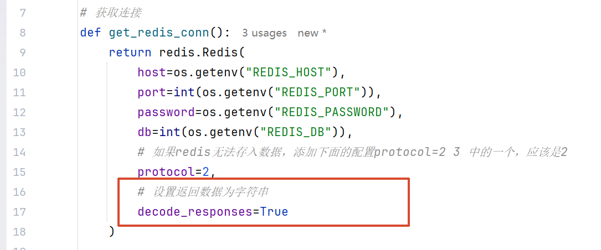

**实现验证码对比功能：**

创建验证验证码的接口函数

```python
from users.entity.CheckCodeEntity import CheckCodeEntity

@users_router.post(
# 请求路径
    path="/checkCode",
    # 接口简短摘要，显示在 Swagger UI 的接口列表中
    summary="验证码的验证",
    # 接口详细描述，显示在 Swagger UI 的接口详情中
    description="""
        验证用户输入的验证码是否正确
        访问路径：http://localhost:8000/users/checkCode
        请求参数：
            CheckCodeModel：一个对象，两个属性
                email：邮箱号，用于去除redis中存入的值作为key
                code：用户输入的验证码，用于和redis中存入的值进行比较
        返回值：
            {
                "code": 状态码，成功200、失败500，int
                "msg": 提示信息，字符串
                "data": None，数据内容，Object
            }
    """,
)
def check_code(checkCodeEntity: CheckCodeEntity):
    return UsersService.check_code(checkCodeEntity)
```

创建一个定义和校验接口请求数据格式的模型文件 -- CheckCodeEntity.py

- 定义验证码验证接口需要接收的数据结构
- 使用 Pydantic 对客户端传入的数据进行类型校验
- 规范 Controller 接收的数据格式

```python
from pydantic import BaseModel, Field

class CheckCodeModel(BaseModel):
    email: str = Field(..., title="邮箱号")
    code: str = Field(..., title="验证码")
```

创建一个验证函数，用于验证验证码 -- UsersService.py

- 取出用户传递过来的验证码和邮箱号
- 通过用户输入的邮箱号，从redis中取出验证码

- 验证码是否过期
    - 过期了 -- 返回失败信息
    - 没有过期 -- 判断验证码是否一致
        - 不一致，返回失败信息
        - 一致，返回成功信息

```python
def check_code(checkCodeModel):
    # 取出用户传递过来的验证码和邮箱号
    email = checkCodeModel.email
    code = checkCodeModel.code
    # 通过用户输入的邮箱号，从redis中取出验证码
    r = RedisUtil.get_redis_conn()
    redis_code = r.get(email)
    RedisUtil.close_redis_conn(r)
    # 判断验证码是否过期
    if redis_code is None:  # 过期
        return {
            "code": 502,
            "msg": "验证码已过期",
            "data": None
        }
    # 没有过期，但验证码不一致
    if redis_code != code:
        return {
            "code": 503,
            "msg": "验证码错误",
            "data": None
        }
    # 没有过期，且验证码一致
    return {
        "code": 200,
        "msg": "验证码验证成功",
        "data": None
    }
```

