# 二、客户端

客户端开发主要负责 **项目成果的可视化展示与用户交互实现**，通过前端页面让用户能够使用后端提供的 RAG 服务功能。

在实际项目开发过程中，重点关注 **功能实现与前后端数据交互**，页面样式部分主要借助 AI 辅助生成，不重点投入人工编写。

**技术选型：**

- **核心框架：Vue3**
    - 使用 Vue3 作为客户端开发框架。
    - 基于 Vite 构建项目，提高开发效率和启动速度。
- **基础技术**
    - HTML：负责页面结构。
    - CSS：负责页面样式。
    - JavaScript：负责页面逻辑与交互。
- **UI 组件库**
    - Element-Plus：提供成熟的 Vue3 组件，实现快速构建后台管理类和应用展示页面。

项目采用 **前后端分离开发模式**：

- 客户端负责页面展示、用户操作以及请求发送。
- 服务器端负责业务逻辑处理、数据处理以及 RAG 核心功能实现。

客户端与服务器端分别维护独立项目，需要分别启动运行：

| 模块   | 技术        | 端口 |
| ------ | ----------- | ---- |
| 客户端 | Vue3 + Vite | 8080 |
| 服务端 | FastAPI     | 8000 |

两端通过 HTTP 请求进行数据通信，实现客户端与服务器之间的功能协作。

## （一）准备工作

### 1.项目前提

node的版本需要安装 node.js 18版本以上

### 2. Vue3

Vue3 是一个用于构建用户界面的渐进式 JavaScript 框架，主要用于开发前端单页面应用（SPA）。

Vue3 通过**组件化开发**方式，将页面拆分为多个独立、可复用的组件，提高项目的维护性和开发效率。相比 Vue2，Vue3 引入了 **Composition API（组合式 API）**、更好的性能优化以及更完善的 TypeScript 支持。

在 RAGAPP 客户端开发中，Vue3 主要负责实现页面展示、用户交互以及与 FastAPI 服务端的数据通信。

### 3. 创建脚手架项目

**脚手架项目**是指通过预先配置好的工具快速生成项目基础结构的开发方式。

它会自动创建项目目录、配置文件以及基础代码环境，帮助开发者避免从零搭建项目。

在 Vue3 开发中，通常使用 **Vite** 作为脚手架工具，通过命令快速创建包含 Vue、JavaScript、依赖配置等内容的项目模板，使开发者可以直接进入业务功能开发阶段。

**步骤：**

进入cmd（管理员）切换到存放项目的目录后再创建项目

```cmd
npm create vite@latest 项目名称 -- --template vue
```


是否安装包 -- 输入：y


确认包名 -- 直接回车G

确认安装 -- 输入：y


创建成功：项目会自动启动，通过给出的地址可以访问到内容


查看页面


### 4. 打开项目


### 5. 项目配置

由于项目基于 Vite 构建，Vite 默认只提供基础的开发环境，因此在项目开发过程中，我们需要根据需求自行配置部分内容，例如项目目录、插件、环境变量以及构建相关配置。

#### 配置启动项目端口

```js
# vite.config.js

import { defineConfig } from 'vite'
import vue from '@vitejs/plugin-vue'

// https://vite.dev/config/
export default defineConfig({
  plugins: [vue()],
  // 设置启动的端口号 -- 默认5173
  server:{
    host:'localhost',
    port:8080
  }
})
```

#### 配置启动项目


### 6. 注意事项

客户端项目启动后，如果不涉及到配置问题，都不需要重启，修改代码之后，按一下ctrl+s【不按也行】页面内容会自动更新

## （二）Vue3项目基础

### 1. Vue3 项目默认页面

通过 Vite 创建 Vue3 项目后，项目默认不会通过路由访问页面，而是直接将 `App.vue` 作为根组件进行渲染。

- Vite 创建的 Vue 项目默认没有集成路由功能，如果没有配置 Vue Router，就无法通过不同 URL 路径访问不同页面。
- 项目启动后，浏览器访问 `http://localhost:8080` 时，首先加载的是 `main.js` 文件，然后由 `main.js` 引入并挂载 `App.vue`。
- `App.vue` 中编写的内容会作为项目首页内容直接展示出来。

**一个 Vue 组件通常由三个部分组成：**

#### `<template>`：页面结构

- 用于编写页面中需要展示的 HTML 内容。

- 可以通过引入其他组件，将组件内容渲染到页面中。

```vue
<template>
  <HelloWorld />
</template>
```

- 表示将 `HelloWorld` 组件中的内容显示在当前页面。

#### `<script setup>`：页面逻辑

- 用于编写页面的业务逻辑代码，使网页具有动态交互性（JavaScript）。

- 主要包括：
    - 引入其他组件
    - 定义变量
    - 定义函数
    - 访问服务器
    - 调用接口获取数据等。

```vue
<script setup>
import HelloWorld from './components/HelloWorld.vue'
</script>
```

- 表示从 `components` 文件夹中导入 `HelloWorld.vue` 组件，使其可以在页面中使用。

#### `<style>`：页面样式

  - 用于编写 CSS 样式代码，实现页面美化。

  - 在当前项目中，样式部分主要借助 AI 辅助生成，不作为重点开发内容。


### 2. 注释全局样式

将文件 style.css 中的所有内容都注释了


## （三）配置客户端路由

### 1. 客户端路由

客户端路由（Client-side Routing）是指在前端项目中，通过路由管理不同页面之间的切换 -- **用来控制如何访问某一个页面的请求路径**。

在传统网页中，访问不同页面通常需要向服务器发送请求，由服务器返回新的 HTML 页面。而在 Vue3 单页面应用（SPA）中，页面切换主要由客户端完成，通过路由根据不同的 URL 地址加载对应的组件，**实现无需刷新页面的页面切换效果**。

在 Vue3 项目中，通常使用 **Vue Router** 实现客户端路由功能。

主要作用：

- 根据访问路径匹配对应的 Vue 组件。
- 实现多个页面之间的跳转。
- 保持单页面应用（SPA）的体验，提高页面切换速度。

在 RAGAPP 客户端开发中，路由主要用于管理不同功能页面，例如登录页面、知识库页面、聊天问答页面等，使整个应用结构更加清晰。

客户端中任何一个页面，都需要通过请求路径来进行访问，配置这个请求路径的方式 --- 引入路由库来实现

**步骤：**

- 安装库（管理员）：`npm install vue-router@4`


- 检查是否安装成功


- 配置路由的定义文件（通常就是在： `src/router/index.js` -- 没有直接新建）：

```js
// 引入路由配置文件
import {createRouter, createWebHistory} from 'vue-router';

// 定义路由配置对象 -- 数组
const routes = [

]

// 设置路由模式为 history 模式 -- 默认 hash 模式，访问路径中间有一个 # 号
const router = createRouter({
    history: createWebHistory(),
    routes
})

// 导出路由实例
export default router
```

- 在全局配置文件中 main.js 注册路由，如果不注册，不生效


- 修改 App.vue 中的代码：直接把 App.vue 中的代码使用一个路由切换标签占位，后面通过路由访问某一个页面的时候，就能够直接替换


- 测试：只要你客户端项目中创建了一个页面，什么都先不考虑，直接去配置路由


### 2. 配置第一次启动项目自动打开浏览器

启动客户端项目的时候，自动的把默认浏览器打开，且地址为 http://localhost:8080

只需要在 vite.config.js 中，添加以下内容


## （四）基础学习

以下的指令都是大家需要掌握的基础语法，指令不是很多，每一个都有其作用，你需要认识他并且会使用他，也知道它是如何工作的

### 1. 属性绑定指令（v-bind）

**作用**：用于动态绑定 HTML 标签的属性，使标签属性的值由 Vue 中定义的变量控制。

**语法：**

```vue
<标签 v-bind:属性名="变量/常量"></标签>
```

**语法糖：**

```vue
<标签 :属性名="变量/常量"></标签>
```

**常见绑定属性：**

| 属性       | 作用                 | 属性    | 作用             |
| ---------- | -------------------- | ------- | ---------------- |
| `disabled` | 控制表单元素是否可用 | `src`   | 控制图片资源地址 |
| `href`     | 控制链接地址         | `class` | 动态控制样式类   |
| `style`    | 动态控制行内样式     |         |                  |

**工作原理：**

- Vue 会监听绑定变量的变化。
- 当变量值发生改变时，自动更新对应 HTML 标签属性。
- 实现数据驱动页面变化。

### 2. 变量定义（ref）

**作用**：用于在 Vue3 中定义响应式变量，使变量值变化时能够触发页面更新。

**使用方式：**

```javascript
import { ref } from "vue";

let 变量名 = ref(初始值);
```

**工作原理：**

- `ref()` 会将普通数据转换为响应式数据。
- Vue 会自动监听变量变化。
- 在 JavaScript 中访问或修改 `ref` 定义的变量，需要通过 `.value`。
- 在模板 `<template>` 中使用时，可以直接使用变量名称。

### 3. 定义函数（function）

**作用：**

用于编写页面中的业务逻辑，例如修改变量、处理数据、调用接口等。

**使用方式：**

```vue
function 函数名(){
    函数内容
}
```

**工作方式：**

- 函数定义在 `<script setup>` 中。
- 可以被模板中的指令调用。
- 函数执行后修改响应式变量，页面会自动更新。

### 4. 事件绑定指令（v-on）

**作用**：用于给 HTML 标签绑定事件，当事件触发时执行对应函数。

**语法：**

```vue
<标签 v-on:事件名称="函数名称"></标签>
```

**语法糖：**

```vue
<标签 @事件名称="函数名称"></标签>
```

**常用事件：**

- `click`：单击事件。
- `dblclick`：双击事件。
- `input`：输入事件
- `change`：内容变化事件

**工作原理：**

- Vue 监听指定 HTML 标签上的事件。
- 当事件发生时，调用绑定的函数。
- 函数内部可以修改响应式变量，从而改变页面内容。

### 5. 显示与隐藏指令

#### `v-show`

**作用：**根据布尔值控制元素显示和隐藏。

**语法：**

```vue
<标签 v-show="布尔变量"></标签>
```

工作方式

- 值为 `true`：显示元素。
- 值为 `false`：隐藏元素。
- 本质是修改 CSS 的 `display` 属性。

#### `v-if`

**作用：**根据条件判断是否创建或销毁元素。

**工作方式：**

- 条件为 `true`：创建元素。
- 条件为 `false`：删除元素。
- 适合不频繁切换的场景。

### 6. 双向绑定指令（v-model）

**作用**：用于实现 HTML 元素内容和 Vue 变量之间的数据双向同步。

**语法：**

```vue
<input v-model="变量">
```

**工作原理：**

- 页面输入内容 → 自动更新 Vue 变量。
- Vue 变量变化 → 自动更新页面内容。

**主要应用：**

- 输入框。
- 单选框。
- 复选框。
- 下拉选择框等表单组件。

### 7. 循环指令（v-for）

**作用：**根据数组或对象数据循环生成多个 HTML 元素。

**语法：**

```vue
<标签 v-for="(元素,索引) in 数据"></标签>
```

**工作方式：**

- Vue 遍历数据集合。
- 每次取出一个数据。
- 根据模板生成对应 HTML 内容。

### 8. 插值表达式：`{{ }}`

**作用：**用于在 HTML 页面中显示 Vue 中的数据。

**语法：**

```vue
{{变量名}}
```

**工作方式：**

- Vue 会读取变量当前值。
- 将变量内容渲染到页面。
- 当变量变化时，页面自动更新。

### 9. 组件引入与使用（import）

**作用：**用于在 Vue 文件中引入其他组件或功能模块。

**工作方式：**

- 从指定路径加载组件。
- 在当前组件中注册并使用。

### 10. 常用标签

基础 HTML 页面标签：

| 标签     | 作用                           | 标签   | 作用                           |
| -------- | ------------------------------ | ------ | ------------------------------ |
| `div`    | 页面布局容器，用于组织页面结构 | `span` | 行内文本容器，用于包裹少量内容 |
| `h1-h6`  | 标题标签，用于定义不同级别标题 | `p`    | 段落标签，用于展示文本内容     |
| `a`      | 超链接标签，用于页面跳转       | `img`  | 图片标签，用于显示图片         |
| `button` | 按钮标签，用于触发用户操作     | `br`   | 换行标签，用于实现内容换行     |

表单相关标签：

| 标签       | 作用                           | 标签     | 作用                         |
| ---------- | ------------------------------ | -------- | ---------------------------- |
| `form`     | 表单容器，用于组织用户输入内容 | `input`  | 输入框标签，用于接收用户输入 |
| `textarea` | 多行文本输入框                 | `select` | 下拉选择框                   |
| `option`   | 下拉选择项                     | `label`  | 表单元素说明标签             |

列表与表格标签：

| 标签    | 作用                       | 标签 | 作用               |
| ------- | -------------------------- | ---- | ------------------ |
| `table` | 表格容器，用于展示表格数据 | `tr` | 表格行             |
| `td`    | 表格单元格                 | `th` | 表格标题单元格     |
| `ul`    | 无序列表容器               | `li` | 列表中的每一项内容 |

Vue 单文件组件标签：

| 标签         | 作用                  | 标签             | 作用                     |
| ------------ | --------------------- | ---------------- | ------------------------ |
| `<template>` | 定义 Vue 组件页面结构 | `<script setup>` | 编写组件逻辑代码         |
| `<style>`    | 编写组件 CSS 样式     | `<style scoped>` | 限制样式只作用于当前组件 |

Vue 特殊组件标签：

| 标签           | 作用                         | 标签                 | 作用                       |
| -------------- | ---------------------------- | -------------------- | -------------------------- |
| `<component>`  | 动态渲染组件                 | `<slot>`             | 定义组件插槽，用于内容传递 |
| `<keep-alive>` | 缓存组件状态                 | `<teleport>`         | 将组件内容渲染到指定位置   |
| `<transition>` | 为单个元素或组件添加过渡效果 | `<transition-group>` | 为多个元素添加列表过渡效果 |

Vue Router 常用标签：

| 标签           | 作用                       | 标签           | 作用               |
| -------------- | -------------------------- | -------------- | ------------------ |
| `<RouterView>` | 显示当前路由对应的页面组件 | `<RouterLink>` | 实现客户端路由跳转 |
| 自定义组件标签 | 引入并使用其他 Vue 组件    | `<App>`        | Vue 项目的根组件   |

```vue
<template>
    <div>
        <h1>属性绑定指令和事件绑定指令</h1>
        <!-- 表单，通常用于需要用户进行输入的时候-->
        <form>
            <!-- 一个输入框，类型为文本，即字符串-->
            <!--
                - 作用：可以为 html 标签中的属性，绑定一个变量【或常量】，从而通过变量【常量】的值来控制这个属性的内容
                - 语法：
                <标签 v-bind:属性名="变量【常量】"></标签>
                - 语法解释：
                  - 标签 --- html 中的标签名称
                  - v-bin:  --- 指令名称，叫做属性绑定指令
                  - 属性名 --- html 中的标签中的属性
                  - 变量【常量】 --- 变量定义在 js 中，常量就直接写
                - 语法糖：对于语法的简化版本
                <标签 :属性名="变量【常量】"></标签>
            -->
            账号：<input type="text" v-bind:disabled="isDisabled">
            <br>	<!-- 换行标签-->
            密码：<input type="password"><br>
            <!--
                点击按钮之后，需要去修改某个变量的值，通常情况我们在函数中来实现
                即点击按钮之后就应该去执行修改变量的值的函数 --- 等价于python中调用函数
                这个过程叫做事件绑定 
					--- 完成事件绑定的事件名称非常多，比如click【单击事件、用得最多的】、dblclick【双击事件】
                在vue中，如果想要点击按钮或者其他标签时去调用函数的执行，就需要使用语法指令 
					--- v-on:事件名称=函数名称(形参)
                语法糖：
                    1、如果函数没有参数，就可以去掉函数名称的括号  --- v-on:事件名称=函数名称
                    2、v-on: 可以缩写为 @ --- @事件名称=函数名称【我们使用的版本】
            -->
            <button type="button" @click="changeInput">点我</button>
        </form>
        
        <h1>控制内容显示与隐藏指令</h1>
        <!--
            控制内容显示与隐藏指令 v-if、v-show 都可以实现，我们选择 v-show
            v-show 指令语法：
                <标签 v-show=布尔值></标签>
            通过布尔值来控制这个标签是否显示在页面上，如果为true显示、false隐藏
        -->
        <div v-show="isShow" style="border: 1px solid red; width: 100%;height: 30px">
            我显示了1
        </div>
        <div v-show="!isShow" style="border: 1px solid blue; width: 100%;height: 30px">
            我显示了2
        </div>
        <button type="button" @click="isShow = !isShow">点我2</button>
        
        <h1>双向绑定指令</h1>
        <!--
            双向绑定指令 --- v-model="变量名称"
            作用：它可以使得html中标签中的内容【一般都是输入、选择】始终和绑定的变量是同一个值
            即：输入内容变量 = 变量变化、变量变化 = 标签中的内容变化
        -->
        <form>
            邮箱号：<input type="text" :disabled="!isCode" id="email" v-model="email"><br>
            验证码：<input type="text" :disabled="isCode" v-model="code"><br>
            <button type="button" @click="sendEmail" v-show="isCode">发送验证码</button>
            <button type="button" @click="checkCode" v-show="!isCode">验证验证码</button>
        </form>
        
        <h1>循环指令</h1>
        <!--
            循环指令 v-for，用法和 for 循环雷同
            语法格式：
                <标签 v-for=(每次得到的内容,索引) in 变量对象变量名称)></标签>
            展示数据：
                在html中用表格，表格的基本组成：
                    <table>
                        <tr>
                            <td></td>
                            <td></td>
                            <td></td>
                        </tr>
                    </table>
        -->
        <div>
            <table>
                <tr v-for="(item,index) in messages">
                    <!-- 在页面中取出js中定义的变量、v-for循环中的变量等，直接用{{变量名称}} {{}}差值表达式-->
                    {{ item.content }}
                </tr>
            </table>
        </div>
        <hr>
        <div>
            <div v-for="(item,index) in messages">
                <!-- 在页面中取出js中定义的变量、v-for循环中的变量等，直接用{{变量名称}} {{}}差值表达式-->
                {{ item.content }}
            </div>
        </div>
    </div>
</template>


<script setup>
// 导入响应式数据 ref 函数 --- 用于定义变量
import {ref, getCurrentInstance} from "vue";

// 定义一个变量，类型为布尔类型，默认值为false
// let：JavaScript 中定义变量的标识符、isDisabled 变量名字、ref 定义变量的函数、false 变量的默认值
let isDisabled = ref(false);

// 定义函数 --- 规则 --- function 函数名称(形参){函数体}
function changeInput() {
    // js中的输出语句：console.log(输出内容);  等价于python中的 print(输出内容)
    // js中的输出语句的输出结果在浏览器的console【控制台】中而不是在 IDE 工具中
    // 在函数中想要ref函数访问定义的变量的值 ---- 变量名称.value
    isDisabled.value = !isDisabled.value;
}

// 定义控制div显示与隐藏的变量
let isShow = ref(true);

// 定义控制验证码输入框是否可以输入的变量
let isCode = ref(true);

// 定义保存邮箱号、验证码的变量
let email = ref("");
let code = ref("");

// 定义登录函数
function sendEmail() {
    isCode.value = !isCode.value;
    // 原生JavaScript语法 --- DOM 对象语法
    // let email = document.getElementById("email").value;
    // console.log(email);
    console.log(email.value);
}

// 定义验证码函数
function checkCode() {
    console.log(email.value, code.value);
}

// 定义一个用户和AI问答的变量 --- 是一个数组，数组里面的元素就是一个js对象
let messages = ref([
    {role: 'assistant', content: '你好，我是AI，你可以向我提问任何问题。'},
    {role: 'user', content: '你叫什么名字？'},
    {role: 'assistant', content: '我叫ChatGPT，一个基于OpenAI的AI模型。'},
    {role: 'user', content: '你喜欢什么书？'},
    {role: 'assistant', content: '我非常喜欢《哈利波特》系列，以及《1984》和《安徒生童话》。'},
    {role: 'user', content: '你喜欢什么电影？'},
    {role: 'assistant', content: '我非常喜欢《唐顿庄园》'}
]);
</script>


<style scoped>
</style>
```

## （五）客户端和服务器交互

客户端与服务器之间通过 **HTTP 请求** 进行数据通信。

客户端（Vue3）负责：

- 页面展示。
- 获取用户输入。
- 发送请求。
- 接收服务器返回的数据。

服务器（FastAPI）负责：

- 接收客户端请求。
- 执行业务逻辑。
- 返回处理结果。

前后端分离项目中，客户端和服务器属于两个不同服务，因此需要通过网络请求完成数据交互。

### 1. axios

axios 是一个基于 Promise 的 HTTP 请求库，用于在客户端向服务器发送请求。

在 Vue3 项目中，通常使用 axios 完成：

- 发送 GET 请求。
- 发送 POST 请求。
- 向服务器发送参数。
- 接收服务器返回数据。

安装（管理员）：`npm install axios`


为了避免每个页面重复创建 axios，需要在 `main.js` 中进行全局配置。

主要配置内容：

- 设置服务器请求公共地址。
- 设置请求头信息。
- 将 axios 挂载到 Vue 全局对象中。

配置完成后，所有 Vue 组件都可以通过全局对象调用 axios 访问服务器接口。


### 2. 配置路由

客户端页面需要通过路由进行访问。

Vue Router 负责：

- 根据 URL 路径匹配对应页面组件。
- 实现多个页面之间的切换。
- 管理单页面应用（SPA）的页面访问。

配置流程：

- 创建页面组件。
- 在路由配置文件中添加访问路径。
- 将路由注册到 Vue 应用。
- 使用路由占位标签显示对应页面。

配置完成后，访问不同路径时，客户端会自动加载对应 Vue 页面。


### 3. 创建登录页面

登录页面主要用于实现用户登录相关功能。

页面功能包括：用户输入邮箱号、用户输入验证码、点击按钮发送验证码、点击按钮验证验证码、

页面数据通过 Vue 响应式变量保存：邮箱号、验证码、当前页面状态

```vue
# Login.vue

<template>
  <div>
    <form>
      邮箱号：<input type="text" v-model="email" :disabled="!isCode"><br>
      验证码：<input type="text" v-model="code" :disabled="isCode"><br>
      <button type="button" v-show="isCode" @click="sendEmail">发送验证码</button>
      <button type="button" v-show="!isCode" @click="checkCode">验证验证码</button>
    </form>
  </div>

</template>

<script setup>
import {ref, getCurrentInstance} from "vue";

// 定义变量
let email = ref("");
let code = ref("");
let isCode = ref(true);

// 定义函数
function sendEmail() {  // 发送验证码的函数
  console.log("发送邮箱：", sendEmail)
  })
}
function checkCode() {
  console.log(email.value, code.value)
}

</script>

<style scoped>

</style>
```

### 4. 跨域配置（同源策略）- 服务器

由于客户端和服务器属于两个不同服务，因此存在跨域问题。

浏览器的**同源策略**要求，两个服务进行通信时必须满足：

- 协议相同。
- IP 地址相同。
- 端口相同。

前后端分离项目中，端口不同，因此违反同源策略：

- Vue 客户端运行在一个端口。
- FastAPI 服务运行在另一个端口。

解决方式：在服务器端配置 CORS 跨域。

服务器允许：

- 指定客户端访问来源。
- 指定请求方法。
- 指定请求头。
- 允许携带身份信息。

配置完成后，客户端才能正常访问服务器接口。


### 5. 邮箱号：客户端发送，服务器接收

客户端发送数据的基本流程：

- 用户在页面输入邮箱号 ==> Vue 获取输入框中的数据 ==> axios 创建 HTTP 请求 ==> 请求发送到服务器接口 ==> FastAPI 接收请求参数 ==> 执行业务逻辑 ==> 返回结果

axios 请求中主要包含：

- 请求地址（url）、请求方式（method）、请求参数（params）。

其中：

- GET 请求使用 `params` 传递参数。
- 参数名称必须与服务器接口接收参数名称保持一致。

例如：

- 客户端发送：email
- 服务器接口接收：email

两者名称必须一致，否则服务器无法正确获取参数。

服务器接收到客户端数据后，可以进行：

- 查询数据库、执行业务逻辑、发送验证码、返回处理结果

```vue
# Login.vue

<script setup>
import {ref, getCurrentInstance} from "vue";

// 定义变量
let email = ref("");
let code = ref("");
let isCode = ref(true);

// 创建当前实例对象 -- 通过这个对象才可以访问到 main.js 中定义的 $axios 变量
let proxy = getCurrentInstance().proxy;
console.log(getCurrentInstance())

// 定义函数
function sendEmail() {  // 发送验证码的函数
  let sendEmail = email.value;  // 获取用户输入的邮箱号
  console.log("发送邮箱：", sendEmail)
  proxy.$axios({  // {}：里面写的就是访问服务器接口的信息，比如请求地址【自动拼接前缀】、请求方式【默认get】、请求参数
    url: 'users/sendEmail', // 请求地址
    method: 'get',  // 请求方式
    params: { // 请求参数
      email: sendEmail  // 参数的key必须和服务器接口的形参一致
    },
  })
}
function checkCode() {
  console.log(email.value, code.value)
}

</script>
```

在服务器的发送邮箱接口函数添加输出代码，方便测试查看接收情况


### 6. 验证码：服务器发送，客户端接收

服务器处理完成后，会将结果返回给客户端，axios 使用 Promise 处理异步请求结果。

请求成功后：

- 执行 `.then()` 中的回调函数。
- 通过回调函数接收服务器返回的数据。

格式：

```js
.then(res => {xxx})
```

其中：

- `res` 表示服务器响应结果。
- `res.data` 表示服务器返回的数据内容。

数据获取流程：

- 服务器返回数据 ==> axios 接收响应 ==> `.then()` 获取响应对象 ==> 通过 `res.data` 获取服务器返回值 ==> 根据结果更新页面

客户端获取返回数据后，可以：

- 修改页面状态。
- 显示提示信息。
- 更新页面内容。

`.then(res => {})`

- 请求成功的回调函数 --- 即请求服务器接口成功后执行这个代码
- 这个代码本质上就是一个函数，只是用了函数的简化写法 ==> 箭头函数
- res 就是函数的形参，=> 固定写法，{}内的内容就是函数体
- res=>{}等价于function a(res){}
- res中的data属性的内容就是我们自己在服务器中定义的返回值


接收成功


### 7. 验证码：客户端发送，服务器接收

服务器需要接收一个对象，对象中包含邮箱号和验证码，也就是说：客户端提交验证码时，需要同时发送：

- 用户邮箱号。
- 用户输入的验证码

由于多个数据需要一起传递，因此需要封装成一个对象，JSON 数据转换：：

- `JSON.stringify(checkCode)` --- 把 checkCode js 对象转为 json
- `JSON.parse(json)` --- 把 json 转为 js 对象

axios 中POST 请求发送参数时：

- 使用 `data` 属性传递请求主体数据，比如 `data:JSON.stringify(checkCode)`
- 适合发送对象、表单数据、JSON 数据等复杂信息。

数据传输过程：

- Vue 将邮箱号和验证码封装成 JavaScript 对象。
- 使用 JSON 格式进行数据转换。
- axios 通过 POST 请求发送数据。
- FastAPI 接收 JSON 数据。
- 服务器解析数据并进行验证码验证。


服务器接收成功


### 8. 验证结果：服务器发送，客户端接收

服务器处理完成后，会将结果返回给客户端，客户端通过 axios 的`.then`回调函数获取服务器响应

处理流程：

- 服务器：验证验证码、生成返回结果。
- 客户端：接收 `res.data`、判断返回状态、根据结果显示提示信息
- 返回数据通常包含：状态码、提示信息、其他业务数据
- 客户端根据服务器返回结果：显示成功信息、显示失败信息、修改页面状态


客户端接收成功


### 9. 完整前后端交互流程总结

（1）客户端发送邮箱

用户输入邮箱 ==> Vue获取数据 ==> axios GET请求 ==> FastAPI接口接收参数 ==> 服务器发送验证码 ==> 返回处理结果

（2）服务器返回验证码发送结果

FastAPI返回数据 ==> axios接收响应 ==> .then(res=>{}) ==> 获取res.data ==> 页面显示结果

（3）客户端提交验证码

用户输入验证码 ==> Vue封装邮箱和验证码对象 ==> JSON.stringify转换JSON ==> axios POST发送数据 ==> FastAPI接收JSON数据 ==> 验证码验证

（4）服务器返回验证结果

服务器验证完成 ==> 返回验证状态 ==> axios接收响应 ==> .then()处理结果 ==> 更新页面状态

## （六）登陆完善

### 1. 登录成功后自动跳转聊天页面

登录验证成功后，需要通过客户端路由跳转到聊天页面。

首先需要在路由配置文件`index.js`中添加聊天页面对应的访问路径，使客户端能够通过指定 URL 访问聊天组件。


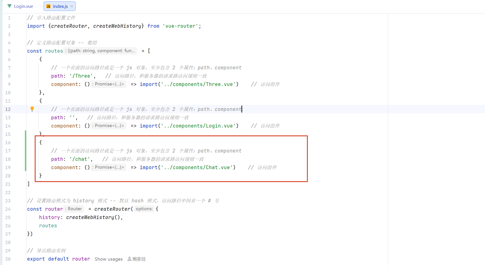

登录页面通过 Vue Router 提供的路由对象完成页面跳转。

在标签`<script setup>`中：

```js
import {useRouter} from "vue-router"; 

// 创建路由跳转对象
let router = useRouter(); 
```

`useRouter()` 用于获取当前项目的路由实例，通过该对象可以实现页面跳转、路由控制等功能。

验证码验证成功后，在验证函数中调用：

```
router.push("/chat");
```

`router.push()` 用于根据指定路径跳转到对应页面。

执行流程：

- 用户输入验证码 → 客户端发送验证码验证请求 → 服务器返回验证结果 → 验证成功 → 路由跳转到聊天页面

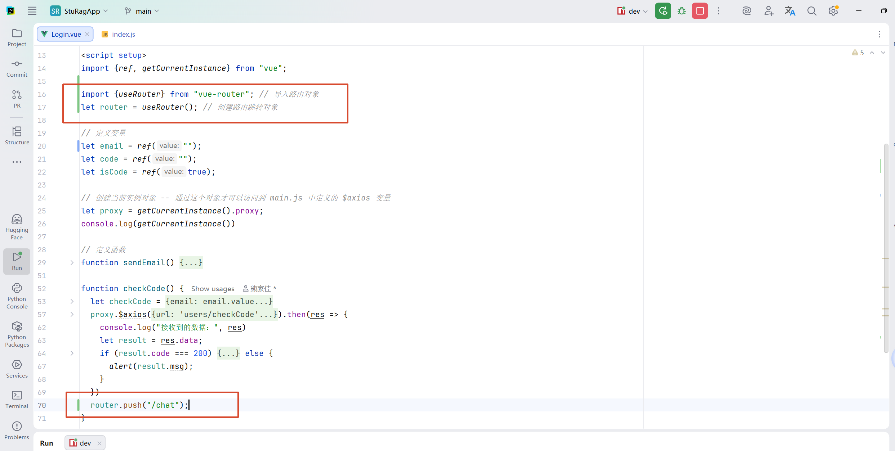

### 2. 使用 Element-Plus 美化消息提示

原始页面中的提示信息通过浏览器默认方式显示，样式较简单。

项目使用 Element-Plus 提供的消息提示组件，对提示信息进行统一美化。

官网：[Message 消息提示 | Element Plus](https://element-plus.org/zh-CN/component/message)

**安装 Element-Plus**：`npm install element-plus --save`

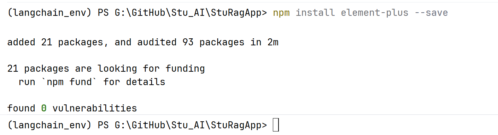

**全局注册 Element-Plus**（完整引入）-- 在 `main.js` 中：：

```js
import { createApp } from 'vue'
import ElementPlus from 'element-plus'
import 'element-plus/dist/index.css'
import App from './App.vue'

const app = createApp(App)

app.use(ElementPlus)
app.mount('#app')
```

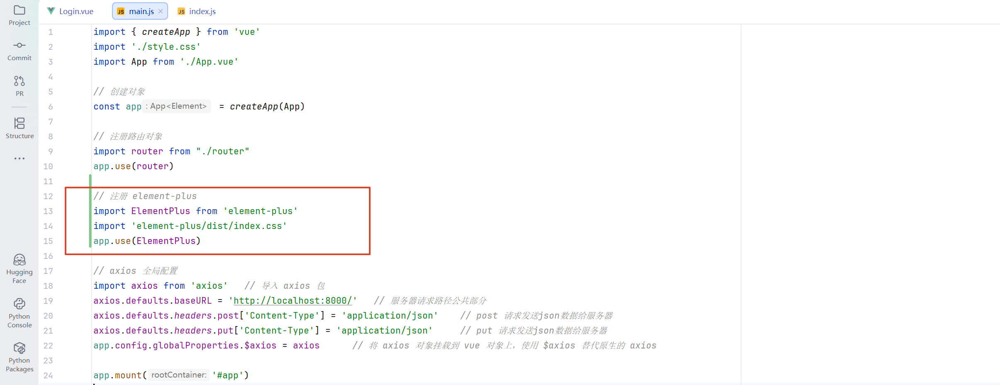

注册完成后，项目中的 Vue 组件可以直接使用 Element-Plus 提供的组件。

**引入消息提示组件**

在登陆页面的标签`<script setup>`中，添加美化消息弹窗组件

```js
import {ElMessage} from "element-plus"; // 导入弹窗组件
```

`ElMessage` 用于创建页面消息提示。

消息提示类型：

- `success`：成功提示。
- `error`：错误提示。
- `warning`：警告提示。
- `info`：普通提示。
- `primary`：主要提示。

修改原有消息提示函数，将普通提示替换为 Element-Plus 消息组件。

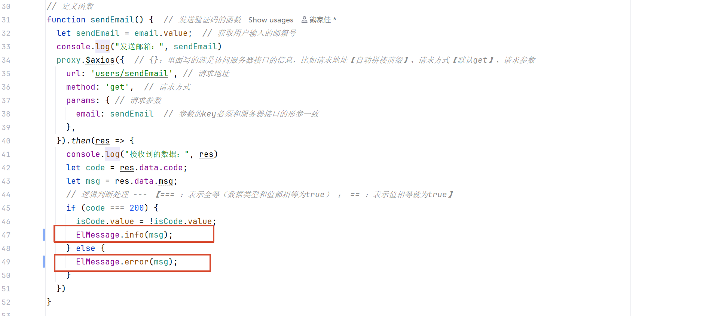

### 3. 优化页面跳转时消息显示

登录验证成功后，如果立即跳转页面，提示信息可能无法完整显示，因此使用延迟函数，让提示信息显示完成后再执行页面跳转。

常用延迟函数：

- `setInterval()`：按照指定时间间隔重复执行函数。
- `setTimeout()`：等待指定时间后执行一次函数。

登录成功后：

```js
setTimeout(() => {
    router.push("/chat");
  }, 1000)
```

执行流程：

- 验证码验证成功 → 显示成功提示 → 等待指定时间 → 跳转聊天页面

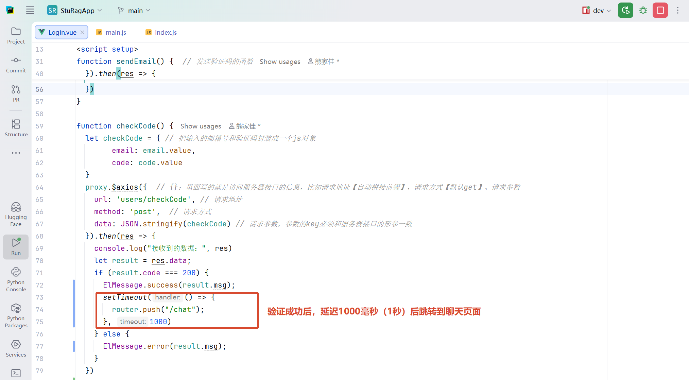

3、美化登录页面（使用AI）

登录页面主要通过 CSS 样式进行优化，提高页面整体视觉效果。

优化内容：

- 调整页面布局。
- 优化登录框大小。
- 调整输入框和按钮样式。
- 增加页面整体美观度。

当前项目页面样式主要借助 AI 辅助生成，不作为重点开发内容。

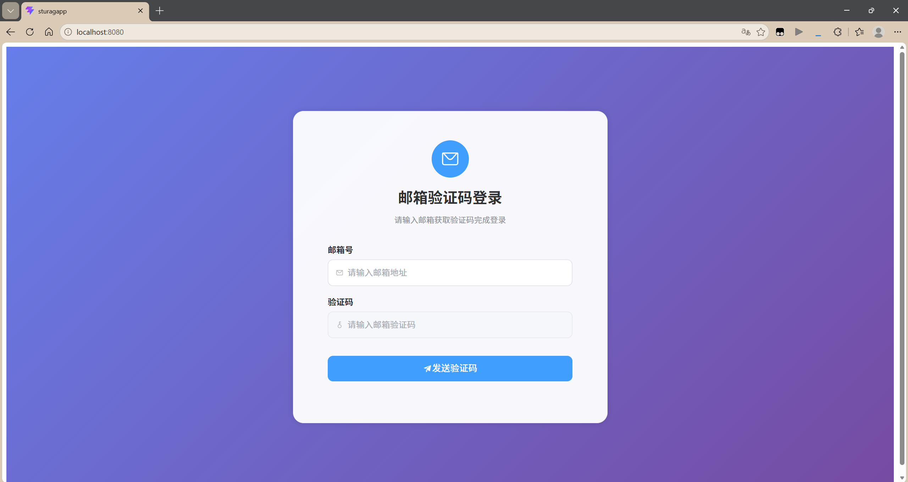

同时需要修改 `index.html` 中默认页面样式配置，调整页面基础边距，使 Vue 页面能够正常占满浏览器窗口。

修改内容：

- 去除浏览器默认边距。
- 统一页面基础显示效果。

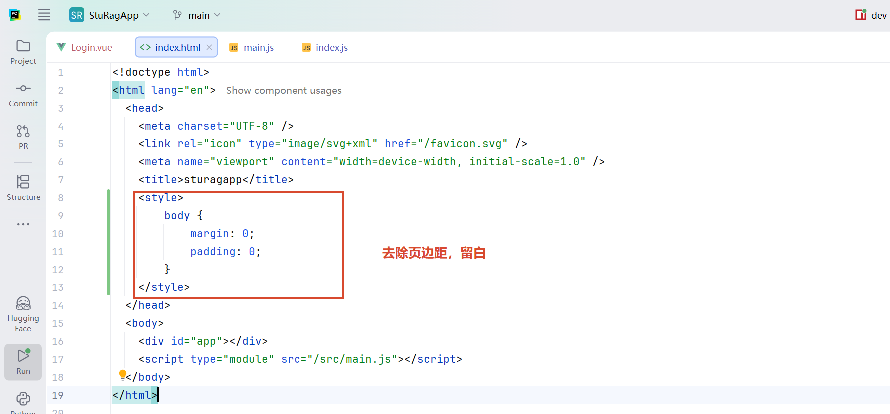

## （七）非流式聊天

非流式聊天指客户端一次性等待服务器生成完整回复，服务器生成完成后，将完整结果返回给客户端。

数据流程：

- 用户输入问题 → Vue 获取输入内容 → axios 发送 HTTP 请求 → FastAPI 接收问题 → 调用大模型生成结果 → 返回完整回复 → Vue 更新聊天页面

### 1. 将用户名显示在聊天页面

登录成功后，需要将当前用户的信息传递到聊天页面进行展示。

由于登录页面和聊天页面属于不同 Vue 组件，因此需要使用浏览器存储实现页面之间的数据传递。

**服务器端获取用户名：**

服务器根据当前邮箱号查询用户信息，获取对应用户名（UsersService.py）

处理流程：

- 客户端发送邮箱号 → 服务器查询用户数据 → 获取用户名 → 将用户名返回给客户端

```python
# 取出当前邮箱号的用户名
result = UsersDao.check_email(email)
username = result[0]["username"]
print(f"取出的用户名为：{username}")
```

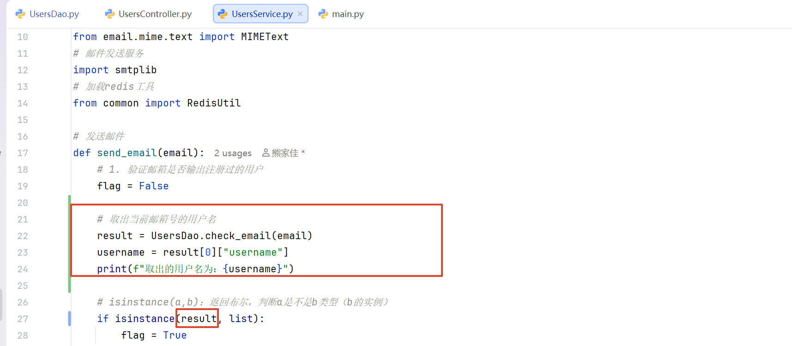

- 取出用户名后要将用户名返回给客户端，便于客户端接收

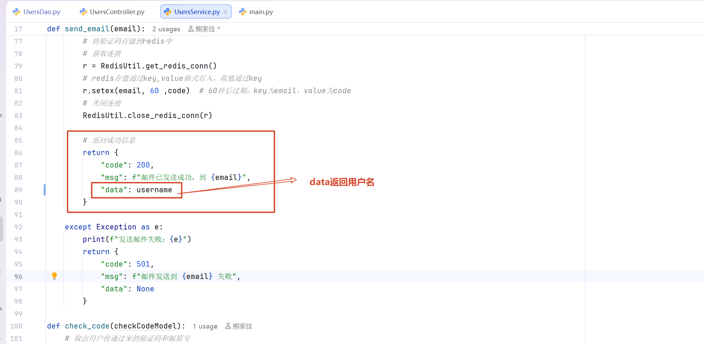

**客户端保存用户名：**

Vue 页面之间传递数据可以使用 `sessionStorage`。

`sessionStorage` 是浏览器提供的临时存储方式：

- 用于保存当前浏览器会话中的数据。
- 数据只在当前标签页有效。
- 关闭浏览器标签页后数据会被清除。

常用方法：

```js
// 保存数据
sessionStorage.setItem("username", data);

// 获取数据
sessionStorage.getItem("username");
```

登录页面：

- 接收服务器返回的用户名。
- 使用 `sessionStorage` 保存用户数据。

聊天页面：

- 页面加载时读取保存的用户名。
- 显示当前登录用户信息。

**生命周期钩子 onMounted：**

Vue 组件具有生命周期，在组件创建、加载、更新和销毁过程中会执行对应阶段的方法。

`onMounted` 表示组件挂载完成后执行。

主要作用：

- 初始化页面数据。
- 获取服务器数据。
- 执行页面加载后的操作。

导入：

```js
import {ref, onMounted, onUnmounted} from "vue"
```

使用：

```js
onMounted(() => {
  console.log('组件已挂载，可以在这里请求数据')
  // 常见操作：调用 API 获取数据
  // fetchData()
})
```

执行流程：

- 进入聊天页面 → 组件挂载完成 → 执行 `onMounted` → 获取 sessionStorage 中的数据 → 更新页面内容

`Login.vue`：

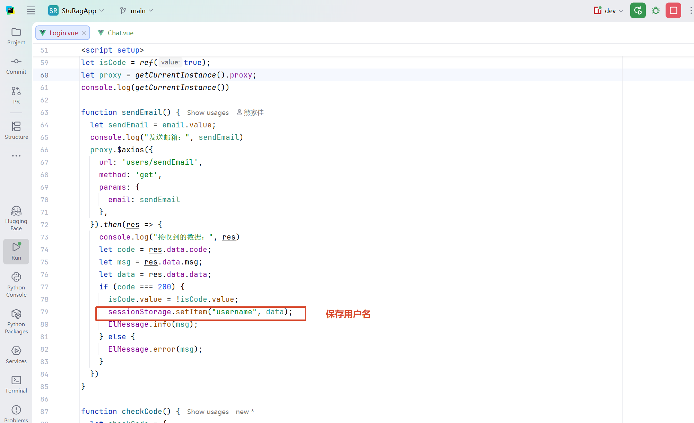

`Chat.vue`（新建的聊天页面）：

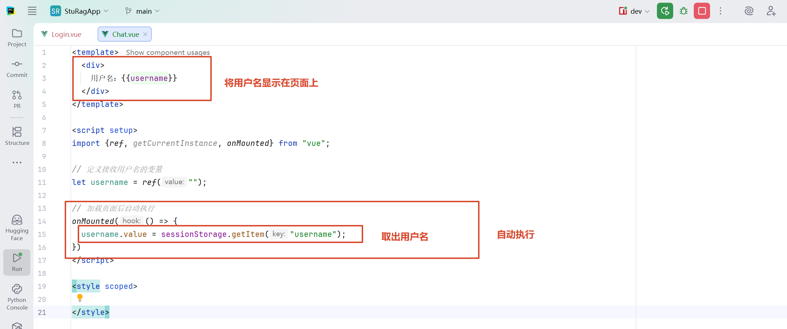

### 2. 创建聊天框 -- `Chat.vue`

聊天页面需要保存用户消息和 AI 回复。

使用 Vue 响应式变量保存聊天记录。

**创建聊天消息对象：**

聊天记录通常使用数组保存，每一条消息包含：

- `role`：消息角色。
- `content`：消息内容。

数据变化时，Vue 会自动更新页面显示。

```js
// 定义保存聊天消息的对象
let messages = ref([
  {role: "user", content: "你好"},
  {role: "assistant", content: "你好，我是AI助手，你可以向我提问任何问题。"},
  {role: "user", content: "你喜欢什么"},
  {role: "assistant", content: "我喜欢聊天，你可以向我提问任何问题。"}
])
```

**页面显示聊天记录：**

使用 `v-for` 遍历聊天消息数组，将每条消息渲染到页面。

执行流程：

消息数组变化 → Vue 监听响应式数据 → 重新渲染页面 → 显示最新聊天内容

```vue
<div style="border: 3px solid green;height: 250px;width: 100%">
      <div v-for="(item,index) in messages" :kind="index">
        <div v-if="index%2==0">问题：{{item.content}}</div>
        <div v-else>回复：{{item.content}}</div>
      </div>
    </div>
```

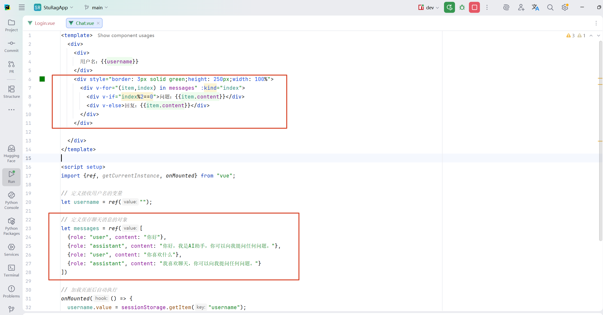

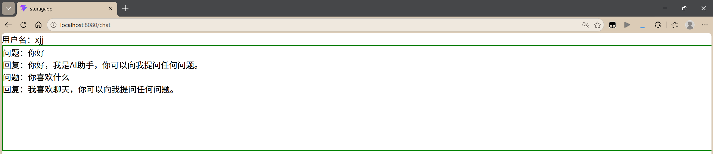

### 3. 将聊天内容添加到消息列表

用户发送问题后，需要将用户输入的问题添加到聊天记录中，同时提前添加 AI 回复占位内容，用于等待服务器返回结果。

处理流程：

- 点击发送按钮 → 调用聊天函数 → 添加用户消息 → 添加 AI 等待消息 → 请求服务器 → 更新 AI 回复内容

发送按钮通过事件绑定调用聊天函数：

添加发送按钮：

```vue
<el-button type="primary" @click="chat">发送</el-button>
```

聊天函数负责：

- 修改消息数组。
- 控制聊天页面显示内容。
- 后续连接服务器获取回复。

```js
// 聊天函数
function chat() {
  messages.value.push({role: 'user', content: "这是一个问题"});
  messages.value.push({role: 'assistant', content: 'AI正在努力的生成回复ing~~~'});
}
```

效果，点击发送按钮后，会在聊天框下面添加聊天函数中的内容：

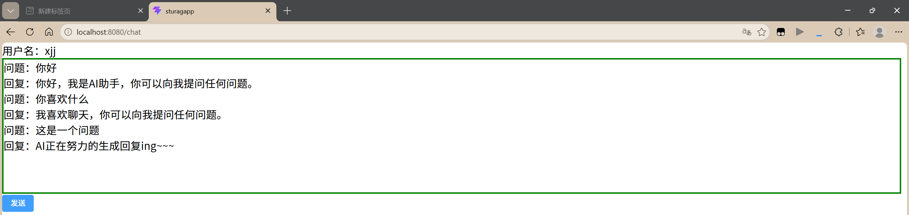

### 4. 非流式聊天测试

为了验证客户端和服务器通信流程，首先实现非流式聊天。

服务器端：

创建聊天接口，用于接收用户问题。

请求流程：

- 客户端发送：用户问题。
- 服务器接收：获取请求参数、调用聊天服务。
- 服务器返回：大模型生成的完整回答。

`UsersController.py`：接收客户端请求、调用业务服务、返回处理结果。

```python
@users_router.get(
# 请求路径
    path="/chat",
    # 接口简短摘要，显示在 Swagger UI 的接口列表中
    summary="聊天",
    # 接口详细描述，显示在 Swagger UI 的接口详情中
    description="""
        聊天
        访问路径：http://localhost:8000/users/chat
        请求参数：
            question：用户问题
        返回值：
            流式输出：sse
    """,
)
// 先使用非流式测试
def chat(question: str):
    print("==========进入chat==========")
    print(f"接收到问题：{question}")
    return UsersService.chat(question)
```

`UsersService.py`：加载大模型、调用模型生成回答、封装返回数据。

```python
# 加载大模型
from ai import LoadLLM
# 
def chat(question):
    # 加载模型
    llm = LoadLLM.create_model()
    # 聊天
    return {
        "code": 200,
        "msg": "成功",
        "data": llm.invoke([
            {"role": "user", "content": question}
        ]).content
    }
```

返回数据通常包含：

- 状态码。
- 提示信息。
- 业务数据。

### 5. 客户端调用聊天接口

聊天页面需要：

- 获取用户输入的问题。
- 发送请求到服务器。
- 接收服务器返回结果。
- 更新聊天消息。

**获取用户输入：**

- 使用 `v-model` 实现输入框和变量之间的数据同步。

```vue
<div>
	<el-input v-model="question" placeholder="请输入问题："></el-input>
</div>
```

```js
// 定义接收用户问题的变量
let question = ref("");
```

**创建 axios 请求：**

请求内容包括：

- 请求地址。
- 请求方式。
- 请求参数。

GET 请求通过 `params` 发送参数。

数据流程：

- 用户输入问题 → Vue 保存问题数据 → axios 发送请求 → FastAPI 接收参数 → 调用大模型 → 返回结果 → 修改 AI 消息内容

**更新聊天内容：**

服务器返回数据后：

- 通过 axios 的 `.then()` 获取响应。
- 使用 `res.data` 获取服务器返回内容。
- 修改消息数组中 AI 回复的数据。

最终效果：

- 用户输入问题 → 点击发送 → 聊天框显示用户问题 → 等待服务器返回 → 替换 AI 等待提示 → 显示完整回答

```js
// 创建代理对象
let proxy = getCurrentInstance().proxy;

// 聊天函数
function chat() {
  messages.value.push({role: 'user', content: question});
  messages.value.push({role: 'assistant', content: 'AI正在努力的生成回复ing~~~'});
  proxy.$axios({
    url: 'users/chat',
    method: 'get',
    params: {
      question: question.value
    }
  }).then(res => {
      messages.value[messages.value.length - 1].content = res.data.data;
  })
}
```

测试完成：

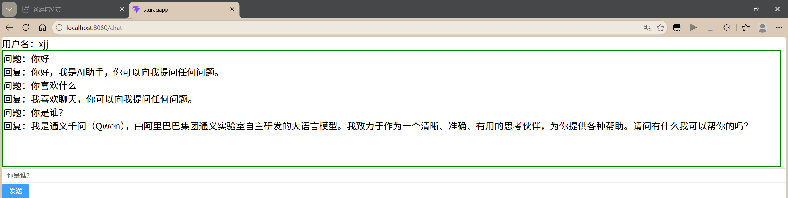

## （八）流式聊天

流式聊天指服务器生成一部分内容后立即返回给客户端，客户端接收到数据后实时更新页面。

与非流式聊天相比：

- 非流式：等待模型全部生成完成后一次返回。
- 流式：模型生成过程中持续返回数据。

流式聊天的数据流程：

- 用户输入问题 → Vue 发送请求 → FastAPI 接收请求 → 调用 RAG 问答链 → 大模型持续生成内容 → 服务器持续发送数据 → Vue 实时接收并更新页面

### 1. 处理数据集

为了实现 RAG 问答，需要提前构造知识库数据。

整体流程：

- 原始数据 → 数据清洗 → 转换为 Document 对象 → 文本向量化 → 存储到 Chroma 向量数据库 → 后续用于知识检索

#### （1）配置向量数据库相关参数

在 `.env` 文件中配置：

- 向量化模型路径。
- Chroma 数据库存储路径。
- 数据库集合名称。
- 原始数据集路径。

环境变量用于统一管理项目配置，避免将固定路径直接写入代码。

```.env
# chromadb 配置
EMBEDDING_MODEL_PATH="G:\\models\\paraphrase-multilingual-MiniLM-L12-v2"
CHROMADB_PATH="G:\\GitHub\\Stu_AI\\StuFastAPI\\law_chromadb"
CHROMADB_NAME="law"
DATABASE_PATH="G:\\GitHub\\Stu_AI\\StuFastAPI\\create_data\\法律数据集.csv"
```

#### （2）创建向量化模型

向量化模型用于将文本内容转换为向量数据。

作用：

- 将文本转换为计算机可以比较的数据形式。
- 支持后续相似度检索。

使用 `HuggingFaceEmbeddings` 加载本地向量模型。

`LoadEmbeddingModel.py`

```python
from langchain_huggingface import HuggingFaceEmbeddings
import os
from dotenv import load_dotenv
load_dotenv()


def load_embedding_model():
    return HuggingFaceEmbeddings(
        model_name=os.getenv("EMBEDDING_MODEL_PATH"),
        model_kwargs={
            "device": "cuda",
            "local_files_only": True,
        },
    )
```

#### （3）构造 RAG 数据集

数据处理流程：

- pandas 读取数据：

    - 使用 pandas 加载原始数据。

- DataFrame 转 List：

    - 将表格数据转换为 Python 列表。

- List 转 Document：

    - LangChain 中使用 `Document` 对象表示文本数据。

    - Document 包含：

        - 文档内容。

        - 文档元数据。

- 保存到 Chroma

    - 将 Document 数据：
        - 通过向量模型转换为向量。
        - 存储到 Chroma 向量数据库。

存储完成后，后续聊天过程中可以通过检索获取相关知识。

`StuFastAPI\create_data\LawDataBuild.py`

```python
# 构造RAG向量数据库数据集
import pandas as pd
from langchain_core.documents import Document
from langchain_chroma import Chroma
from ai import LoadEmbeddingModel
import os
from dotenv import load_dotenv
load_dotenv()


# 数据集路径
database_path = os.getenv("DATABASE_PATH")

# 向量数据库存储路径
vector_database_path = os.getenv("CHROMADB_PATH")

# 集合名称
collection_name = os.getenv("CHROMADB_NAME")

# pandas读取数据
df = pd.read_csv(database_path)
# print(df['text'])
# print(type(df))

# <class 'pandas.core.frame.DataFrame'> 转 list
data_list = df['text'].tolist()
# print(data_list)

# list 转 list[Document]
documents = [Document(page_content=text, metadata={"source": database_path}) for text in data_list]

# 存入向量数据库
try:
    Chroma.from_documents(
        documents=documents,    # 数据
        embedding= LoadEmbeddingModel.load_embedding_model(),   # 向量化模型
        persist_directory=vector_database_path, # 存储路径
        collection_name=collection_name,    # 集合名称
        collection_metadata={"hnsw:space": "cosine"},   # 匹配规则：余弦相似度

    )
    print("数据存入成功！")
except Exception as e:
    print(f"数据存入失败：{e}")
```

### 2. 创建问答链

数据存储完成后，需要创建聊天模块，实现：

- 用户问题 → 知识库检索 → 文档排序 → 拼接提示词 → 调用大模型 → 返回答案

#### （1）创建聊天模块

项目中创建聊天相关目录：

- Controller：负责接口请求。
- Service：负责业务逻辑。

**创建子路由：**`ChatController.py`

FastAPI 使用 `APIRouter` 创建模块化路由。

作用：

- 拆分不同功能接口。
- 方便项目管理。

```python
# 创建子路由对象
from fastapi import APIRouter
chat_router = APIRouter()
```

**注册子路由：**`main.py`

在主程序中注册聊天模块。

注册后：

- FastAPI 才能识别对应接口。
- 客户端可以通过指定路径访问。

```python
# 导入子路由对象
from chat.controller.ChatController import chat_router
# 注册子路由
app.include_router(
    router=chat_router,    # 引入子路由对象
    prefix="/chat", # 配置访问子路由接口的前缀，默认“”，推荐写为模块的包名作为区分
    tags=["chat"]   # 配置swaggerUI中的模块名称
)
```

### 3. 创建流式聊天接口

流式输出使用：`StreamingResponse`

作用：

- 将生成的数据持续发送给客户端。
- 不需要等待全部内容生成完成。

服务器处理流程：

- 接收用户问题 → 调用聊天服务 → 获取模型生成内容 → 循环读取生成结果 → 持续返回数据

#### （1）SSE（Server-Sent Events）：

SSE 是一种服务器向客户端持续推送数据的通信方式。

特点：

- 基于 HTTP。
- 单向通信。
- 服务器主动发送数据。
- 适合实时消息、AI 流式输出等场景。

数据格式：

服务器按照 SSE 格式返回数据：

- 每条数据以 `data:` 开头。
- 每条消息使用空行分隔。

客户端通过 SSE 接收服务器持续发送的数据。

在`ChatController.py`中创建聊天接口 -- 流式输出：

```python
# 创建子路由对象
from fastapi import APIRouter
chat_router = APIRouter()

import json
from chat.service import ChatService
# 导入流式输出模块
from starlette.responses import StreamingResponse

# 创建聊天接口
@chat_router.get(
    path="/chat",
    summary="聊天",
    description="""
        聊天
        访问路径：http://localhost:8000/chat/chat
        请求参数：
            question：用户问题
        返回值：
            流式输出：sse
    """
)
def chat(question: str):
    # 流式输出处理
    def generator():
        for item in ChatService.chat(question):
            yield f"data:{json.dumps({'count':item.content})}\n\n"
        yield f"data:{json.dumps({'count':'end_end'})}\n\n"
    return StreamingResponse(
        content=generator(),
        media_type="text/event-stream"
    )
```

### 4. 创建 RAG 问答链

先在.env文件中添加LLM模型名称和重排序模型路径

```
LLM_MODEL_NAME="qwen3.7-max"
RERANKER_MODEL_PATH="G:\\models\\bge-reranker-large"
```

#### （1）加载大模型

创建LLM模型`LoadLLM.py`：

```python
from langchain_openai import ChatOpenAI
import os
from dotenv import load_dotenv
load_dotenv()

# 创建模型对象
def create_model():
    return ChatOpenAI(
        api_key=os.getenv("DASHSCOPE_API_KEY"),
        base_url="https://dashscope.aliyuncs.com/compatible-mode/v1",
        model=os.getenv("LLM_MODEL_NAME"),
        streaming=True,
    )
```

#### （2）加载重排序模型

创建重排序模型`LoadReranker.py`：

```python
from FlagEmbedding import FlagReranker
import os
from dotenv import load_dotenv
load_dotenv()

# 加载重排序模型
def load_reranker():
    return FlagReranker(
        model_name_or_path=os.getenv("RERANKER_MODEL_PATH"),
        use_fp16=True
    )
```

#### （3）连接向量数据库

创建向量数据库连接对象`LoadChroma.py`：

```python
from langchain_chroma import Chroma
from ai.LoadEmbeddingModel import load_embedding_model
import os
from dotenv import load_dotenv
load_dotenv()


def load_chroma_conn():
    return Chroma(
    collection_name=os.getenv("CHROMADB_NAME"),
    persist_directory= os.getenv("CHROMADB_PATH"),
    embedding_function=load_embedding_model()
)
```

### 5. 自定义问答链流程

```python
# 导入
from langchain_core.prompts import PromptTemplate
from langchain_core.runnables import RunnablePassthrough, RunnableLambda, RunnableParallel
from ai.LoadLLM import create_model
from ai.LoadReranker import load_reranker
from ai.LoadChroma import load_chroma_conn


def chat(question):
    # 创建提示词
    template = """
        你是一名知识库问答助手，请结合提供的知识内容回答用户问题。
        回答要求：
            - 仅依据提供的知识内容进行回答，不补充未出现的信息。
            - 若知识内容无法回答问题，请明确说明当前知识不足，避免推测或编造。
            - 对多个知识片段进行综合分析后再作答，避免简单复制原文。
            - 回答应准确、自然、条理清晰，优先直接回答问题，再补充必要说明。
            - 相同信息无需重复描述。
            - 不要提及"根据参考资料"、"根据检索结果"、"根据上下文"等描述。
            - 若未提供任何知识内容或知识为空，请友好告知暂时无法回答，并建议用户补充信息或换个问题。
        知识内容：
            {context}
        用户问题：
            {question}
        回答：
    """

    # 创建提示词对象
    prompt = PromptTemplate(
        template=template,
        input_variables=["context", "question"],
    )

    # 创建检索器对象
    vector = load_chroma_conn()

    # 转为检索器接口
    retriever = vector.as_retriever(search_kwargs={"k": 10})

    # 打印召回结果
    def zh_answer(run_lambda):
        print("检索到的文档内容：")
        for i in run_lambda:
            print(i.page_content)
            print("*-"*20)
        return run_lambda

    # 重排序
    def re_sort(data):
        print("\n开始重排：")
        # 创建重排序模型
        reranker = load_reranker()
        # 获取召回结果
        cons = data['context']
        # 获取问题
        que = data['question']
        # 问题和召回文档 进行包装 构造reranker输入
        reranker_input = [(que,con.page_content) for con in cons]
        # 调用重排序模型，计算得分
        scores = reranker.compute_score(reranker_input)
        # print(f"得分：\n{scores}\n")
        # 文档和分数进行包装
        con_score = list(zip(cons,scores))
        # print(f"包装后的文档和得分：\n{con_score}\n")
        # 排序
        con_score.sort(key=lambda x: x[1], reverse=True)
        # print(f"重排序后的文档和得分：\n{con_score}\n")
        # 获取排序后的文档
        cons_sorted = [con[0] for con in con_score]
        # print(f"重排序后的文档：")
        for i,item in enumerate(cons_sorted[:3]):
            print(f"【第{i+1}条】：{item.page_content}")

        # 返回排序后的文档
        return {
            "context": cons_sorted,
            "question": que
        }

    # 创建langchain链
    chain = (
        # 并行执行器
        RunnableParallel(
            {
                # 上下文，内容就是检索的内容
                "context": retriever | RunnableLambda(zh_answer),
                # 透明传递，原样返回/输出
                "question": RunnablePassthrough(),
            }
        )
        | RunnableLambda(re_sort) # 重排序
        | prompt   # 提示词
        | create_model() # 大模型
    )
    for chunk in chain.stream(question):
        if chunk:
            yield chunk
```

### 6. 设置聊天输入框

聊天输入框需要实现：

- 获取用户输入。
- 判断输入内容是否有效。
- 点击发送后清空输入框。

处理流程：

- 用户输入问题 → 获取输入内容 → 去除首尾空格 → 判断是否为空 → 有效则继续请求 → 无效则提示用户

`trim()`作用：

- 删除字符串首尾空格。
- 避免无效输入影响判断。

`Chat.vue`：

```js
import {ElMessage} from "element-plus";

function chat() {
  // 基于用户输入的内容判断是否输入的有效内容
  let myQuestion = question.value.trim(); // trim()：去除字符串首尾的空格
  question.value = "";  // 清空输入框
  if (myQuestion.length === 0) { // 判断是否输入了数据
    ElMessage.warning("请输入有效内容");
    return;
  }
}
```

### 7. 访问服务器处理流式输出

发送问题后：

首先将用户问题添加到聊天记录。

同时添加 AI 回复占位内容。

流程：

- 用户发送问题 → 添加用户消息 → 添加 AI 等待消息 → 请求服务器 → 接收流式数据 → 替换等待消息

`chat.vue`：

```js
// 访问服务器
messages.value.push({role: 'user', content: myQuestion});
messages.value.push({role: 'assistant', content: '思考中，请耐心等待^3^......'});
```

### 8. 构造 SSE 请求

客户端使用：`EventSource`创建 SSE 连接。

作用：

- 建立客户端与服务器之间的持续连接。
- 自动接收服务器推送的数据。

处理流程：

- 创建请求参数 → 建立 SSE 连接 → 监听服务器数据 → 解析返回内容 → 更新聊天消息

#### （1）SSE 事件

**onmessage：**监听服务器发送的数据。处理：

- 获取服务器返回内容。
- 更新聊天页面。

**onerror：**监听，发生错误后关闭连接。

- 请求错误。
- 连接异常。

**onopen：**监听连接成功事件，用于确认 SSE 是否建立成功。

`chat.vue`：

```js
// 创建参数对象
let urlSerchParams = new URLSearchParams({
  question: myQuestion, // 这里的key一定叫 question
});
// 创建请求对象
let es = new EventSource("http://localhost:8000/?"+urlSerchParams.toString());
// 定义拼接字符串变量
let s = "";
// 三个监听事件：
// 1. 监听服务器响应的流式数据
es.onmessage = (e) => {
  // 取出数据为json格式，转换为js对象
  let data = JSON.parse(e.data).content;
  if (data === "end_end"){
    es.close();
    return;
  }
  s += data;  // 拼接字符串
  messages.value[messages.value.length - 1].content = s;  // 更新数据，替换思考
};
// 2. 监听错误的发送、连接中断的发生
es.onerror = (e) => {
  console.log("SSE获取数据失败",e);
  es.close();
};
// 3. 监听连接成功
es.onopen = () => {
  console.log("SSE连接成功");
}
```

### 9. 流式聊天优化

#### （1）限制重复发送问题

当 AI 正在生成回答时，不允许用户继续发送新的问题。

原因：

- 避免多个请求同时访问服务器。
- 防止聊天顺序混乱。
- 降低服务器压力。

实现方式：

增加状态变量记录当前聊天状态。

状态：

- 正在生成回答。
- 可以发送新问题。

根据状态控制发送按钮是否可用。

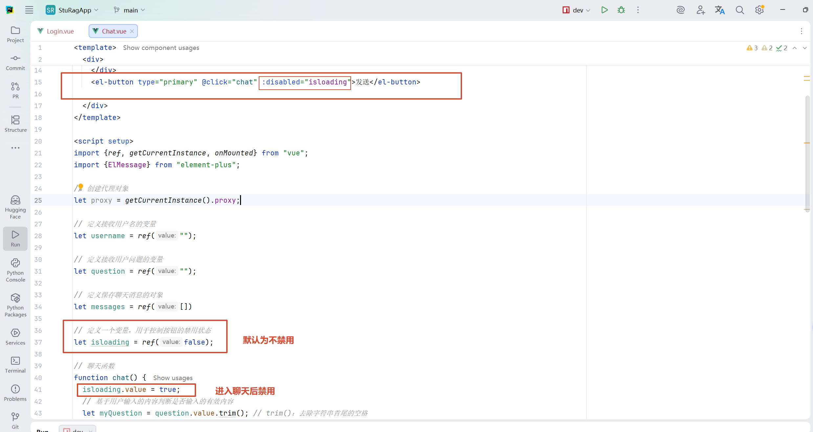

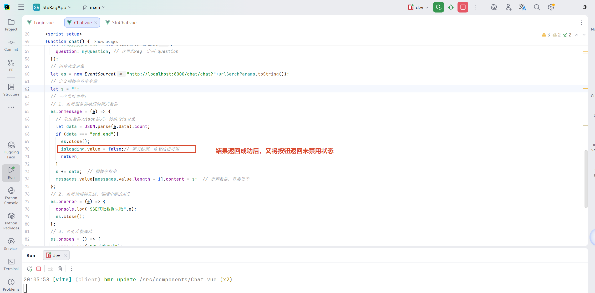

#### （2）聊天页面美化

聊天页面主要优化：

- 调整整体布局。
- 区分用户消息和 AI 消息。
- 优化输入区域。
- 增加历史聊天展示区域。
- 提升页面交互体验。

页面样式主要通过 CSS 实现，当前项目主要借助 AI 辅助生成。

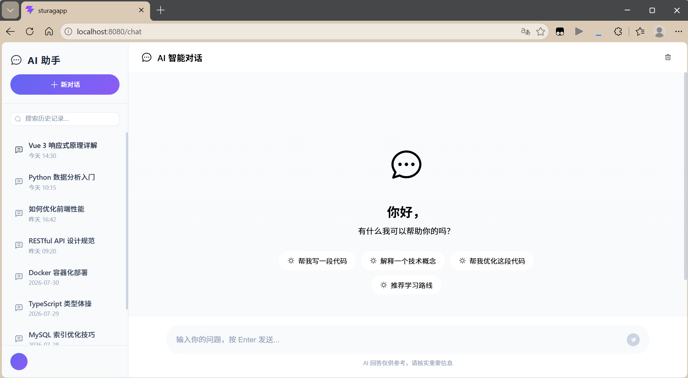

### 10. 流式聊天完整流程总结

完整流程：

- 用户输入问题 → Vue 获取问题 → EventSource 创建 SSE 请求 → FastAPI 接收请求 → 调用 RAG 问答链 → 向量数据库检索知识 → 重排序模型筛选内容 → 大模型生成回答 → StreamingResponse 持续返回数据 → SSE 接收数据 → Vue 实时更新聊天窗口

最终实现：

- 用户提出问题后，AI 回复内容会随着模型生成过程逐步显示，实现类似在线聊天工具的实时回答效果。
