# 二、客户端

客户端开发主要负责 **项目成果的可视化展示与用户交互实现**，通过前端页面让用户能够使用后端提供的 RAG 服务功能。

在实际项目开发过程中，重点关注 **功能实现与前后端数据交互**，页面样式部分主要借助 AI 辅助生成，不重点投入人工编写。

**技术选型：**

- **核心框架：Vue3**
    - 使用 Vue3 作为客户端开发框架。
    - 基于 Vite 构建项目，提高开发效率和启动速度。
- **基础技术**
    - HTML：负责页面结构。
    - CSS：负责页面样式。
    - JavaScript：负责页面逻辑与交互。
- **UI 组件库**
    - Element-Plus：提供成熟的 Vue3 组件，实现快速构建后台管理类和应用展示页面。

项目采用 **前后端分离开发模式**：

- 客户端负责页面展示、用户操作以及请求发送。
- 服务器端负责业务逻辑处理、数据处理以及 RAG 核心功能实现。

客户端与服务器端分别维护独立项目，需要分别启动运行：

| 模块   | 技术        | 端口 |
| ------ | ----------- | ---- |
| 客户端 | Vue3 + Vite | 8080 |
| 服务端 | FastAPI     | 8000 |

两端通过 HTTP 请求进行数据通信，实现客户端与服务器之间的功能协作。

## （一）准备工作

### 1.项目前提

node的版本需要安装 node.js 18版本以上

### 2. Vue3

Vue3 是一个用于构建用户界面的渐进式 JavaScript 框架，主要用于开发前端单页面应用（SPA）。

Vue3 通过**组件化开发**方式，将页面拆分为多个独立、可复用的组件，提高项目的维护性和开发效率。相比 Vue2，Vue3 引入了 **Composition API（组合式 API）**、更好的性能优化以及更完善的 TypeScript 支持。

在 RAGAPP 客户端开发中，Vue3 主要负责实现页面展示、用户交互以及与 FastAPI 服务端的数据通信。

### 3. 创建脚手架项目

**脚手架项目**是指通过预先配置好的工具快速生成项目基础结构的开发方式。

它会自动创建项目目录、配置文件以及基础代码环境，帮助开发者避免从零搭建项目。

在 Vue3 开发中，通常使用 **Vite** 作为脚手架工具，通过命令快速创建包含 Vue、JavaScript、依赖配置等内容的项目模板，使开发者可以直接进入业务功能开发阶段。

**步骤：**

进入cmd（管理员）切换到存放项目的目录后再创建项目

```
npm create vite@latest 项目名称 -- --template vue
```

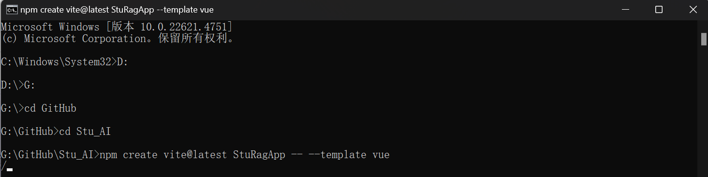

是否安装包 -- 输入：y

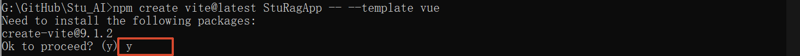

确认包名 -- 直接回车

确认安装 -- 输入：y

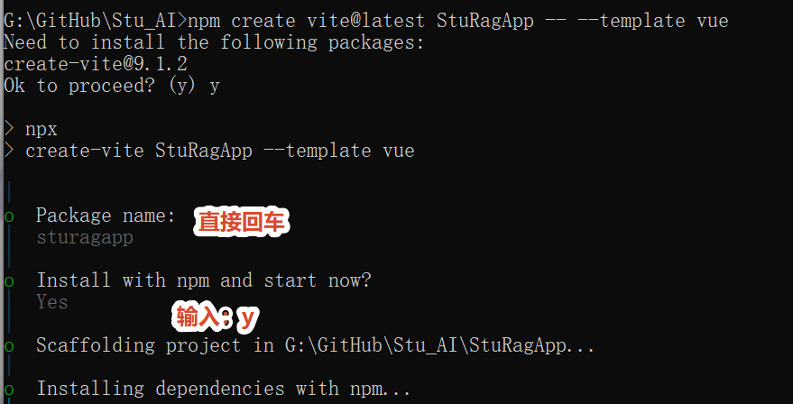

创建成功：项目会自动启动，通过给出的地址可以访问到内容

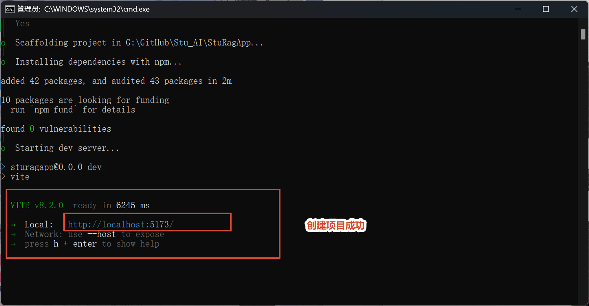

查看页面

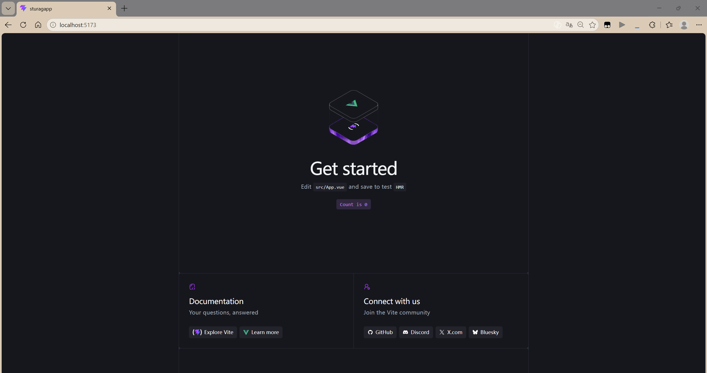

### 4. 打开项目

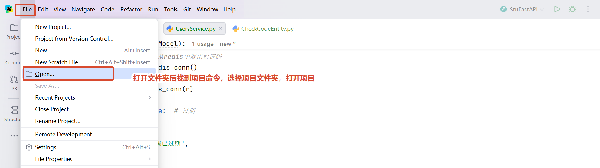

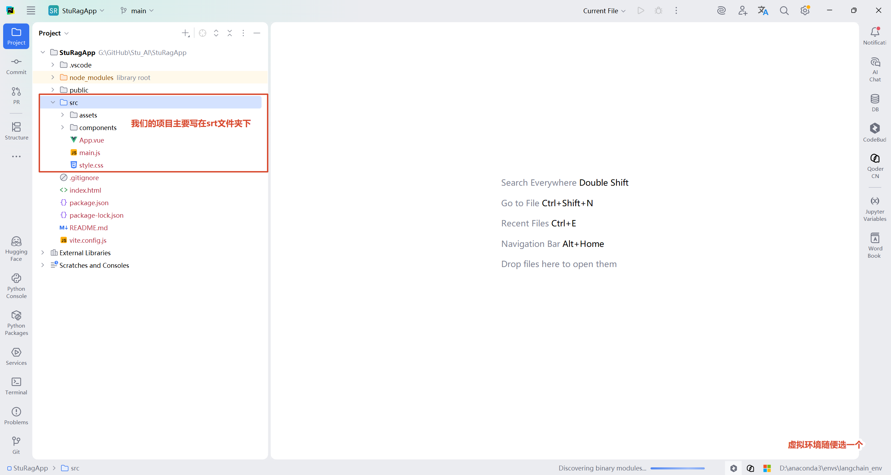

### 5. 项目配置

由于项目基于 Vite 构建，Vite 默认只提供基础的开发环境，因此在项目开发过程中，我们需要根据需求自行配置部分内容，例如项目目录、插件、环境变量以及构建相关配置。

#### 配置启动项目端口

```js
# vite.config.js

import { defineConfig } from 'vite'
import vue from '@vitejs/plugin-vue'

// https://vite.dev/config/
export default defineConfig({
  plugins: [vue()],
  // 设置启动的端口号 -- 默认5173
  server:{
    host:'localhost',
    port:8080
  }
})
```

#### 配置启动项目

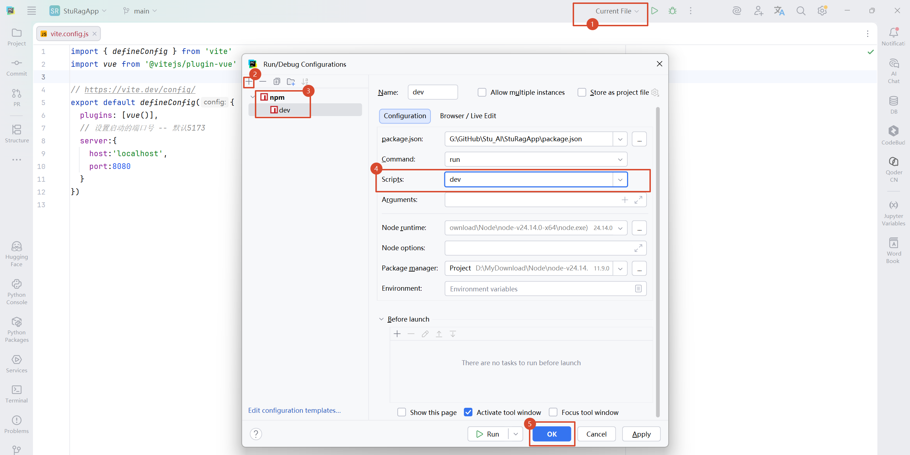

### 6. 注意事项

客户端项目启动后，如果不涉及到配置问题，都不需要重启，修改代码之后，按一下ctrl+s【不按也行】页面内容会自动更新

## （二）Vue3项目基础

### 1. Vue3 项目默认页面

通过 Vite 创建 Vue3 项目后，项目默认不会通过路由访问页面，而是直接将 `App.vue` 作为根组件进行渲染。

- Vite 创建的 Vue 项目默认没有集成路由功能，如果没有配置 Vue Router，就无法通过不同 URL 路径访问不同页面。
- 项目启动后，浏览器访问 `http://localhost:8080` 时，首先加载的是 `main.js` 文件，然后由 `main.js` 引入并挂载 `App.vue`。
- `App.vue` 中编写的内容会作为项目首页内容直接展示出来。

**一个 Vue 组件通常由三个部分组成：**

#### `<template>`：页面结构

- 用于编写页面中需要展示的 HTML 内容。

- 可以通过引入其他组件，将组件内容渲染到页面中。

```vue
<template>
  <HelloWorld />
</template>
```

- 表示将 `HelloWorld` 组件中的内容显示在当前页面。

#### `<script setup>`：页面逻辑

- 用于编写页面的业务逻辑代码，使网页具有动态交互性（JavaScript）。

- 主要包括：
    - 引入其他组件
    - 定义变量
    - 定义函数
    - 访问服务器
    - 调用接口获取数据等。

```vue
<script setup>
import HelloWorld from './components/HelloWorld.vue'
</script>
```

- 表示从 `components` 文件夹中导入 `HelloWorld.vue` 组件，使其可以在页面中使用。

#### `<style>`：页面样式

  - 用于编写 CSS 样式代码，实现页面美化。

  - 在当前项目中，样式部分主要借助 AI 辅助生成，不作为重点开发内容。

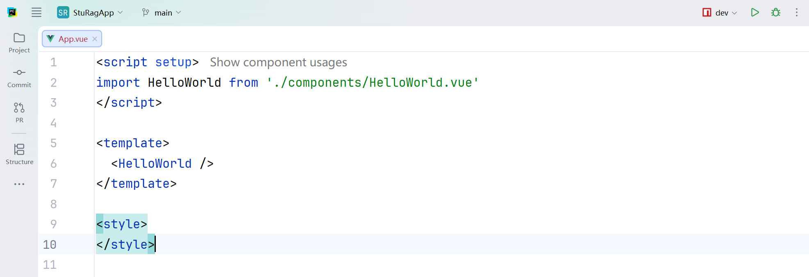

### 2. 注释全局样式

将文件 style.css 中的所有内容都注释了

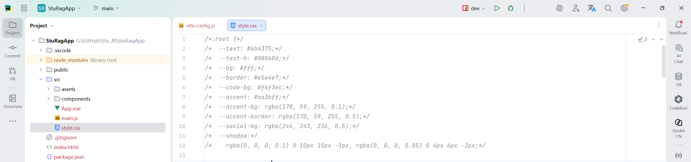

## （三）配置客户端路由

### 1. 客户端路由

客户端路由（Client-side Routing）是指在前端项目中，通过路由管理不同页面之间的切换 -- **用来控制如何访问某一个页面的请求路径**。

在传统网页中，访问不同页面通常需要向服务器发送请求，由服务器返回新的 HTML 页面。而在 Vue3 单页面应用（SPA）中，页面切换主要由客户端完成，通过路由根据不同的 URL 地址加载对应的组件，**实现无需刷新页面的页面切换效果**。

在 Vue3 项目中，通常使用 **Vue Router** 实现客户端路由功能。

主要作用：

- 根据访问路径匹配对应的 Vue 组件。
- 实现多个页面之间的跳转。
- 保持单页面应用（SPA）的体验，提高页面切换速度。

在 RAGAPP 客户端开发中，路由主要用于管理不同功能页面，例如登录页面、知识库页面、聊天问答页面等，使整个应用结构更加清晰。

客户端中任何一个页面，都需要通过请求路径来进行访问，配置这个请求路径的方式 --- 引入路由库来实现

**步骤：**

- 安装库（管理员）：`npm install vue-router@4`

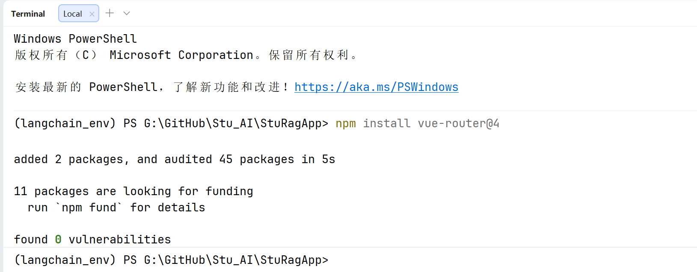

- 检查是否安装成功

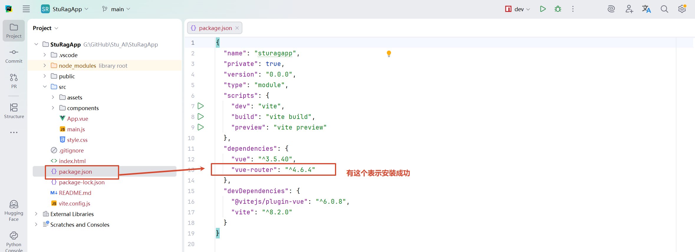

- 配置路由的定义文件（通常就是在： `src/router/index.js` -- 没有直接新建）：

```js
// 引入路由配置文件
import {createRouter, createWebHistory} from 'vue-router';

// 定义路由配置对象 -- 数组
const routes = [

]

// 设置路由模式为 history 模式 -- 默认 hash 模式，访问路径中间有一个 # 号
const router = createRouter({
    history: createWebHistory(),
    routes
})

// 导出路由实例
export default router
```

- 在全局配置文件中 main.py 注册路由，如果不注册，不生效

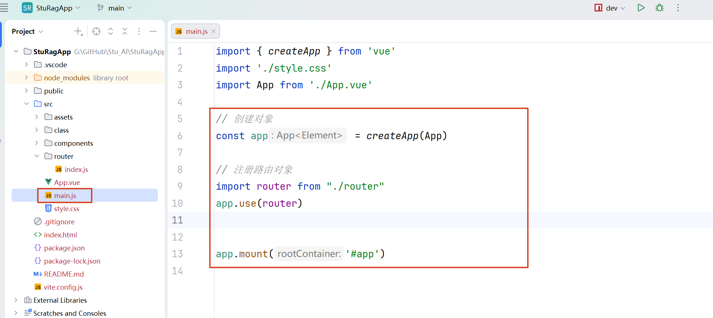

- 修改 App.vue 中的代码：直接把 App.vue 中的代码使用一个路由切换标签占位，后面通过路由访问某一个页面的时候，就能够直接替换

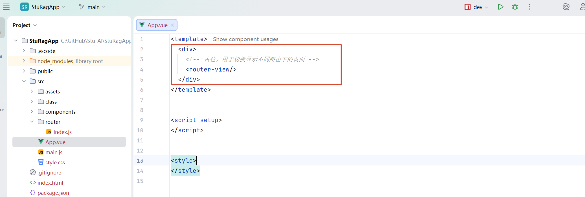

- 测试：只要你客户端项目中创建了一个页面，什么都先不考虑，直接去配置路由


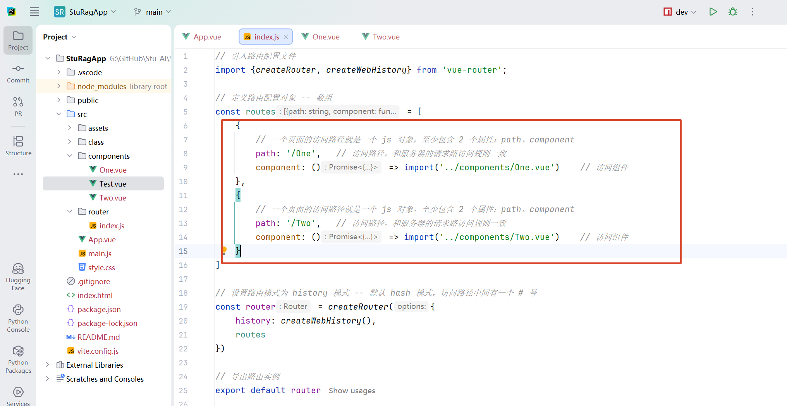

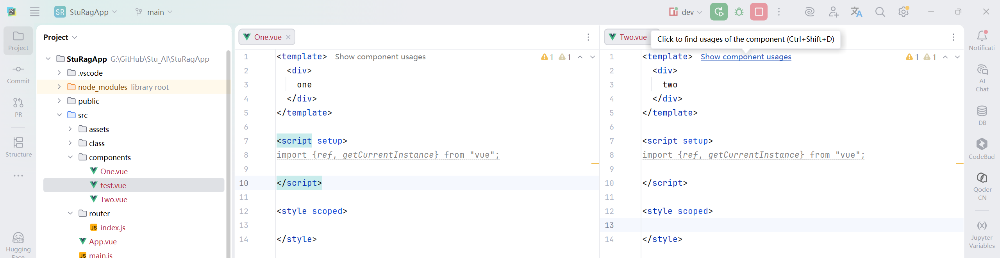

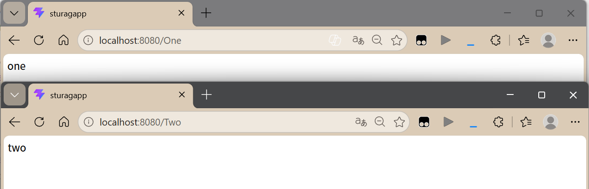

### 2. 配置第一次启动项目自动打开浏览器

启动客户端项目的时候，自动的把默认浏览器打开，且地址为 http://localhost:8080

只需要在 vite.config.js 中，添加以下内容

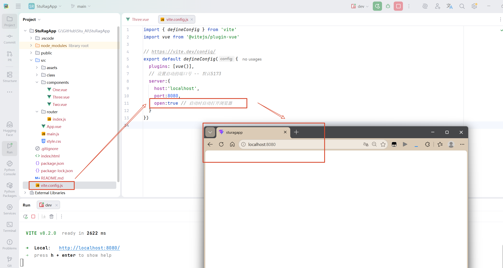

## （四）基础学习

以下的指令都是大家需要掌握的基础语法，指令不是很多，每一个都有其作用，你需要认识他并且会使用他，也知道它是如何工作的

### 1. 属性绑定指令（v-bind）

**作用**：用于动态绑定 HTML 标签的属性，使标签属性的值由 Vue 中定义的变量控制。

**语法：**

```vue
<标签 v-bind:属性名="变量/常量"></标签>
```

**语法糖：**

```vue
<标签 :属性名="变量/常量"></标签>
```

**常见绑定属性：**

| 属性       | 作用                 | 属性    | 作用             |
| ---------- | -------------------- | ------- | ---------------- |
| `disabled` | 控制表单元素是否可用 | `src`   | 控制图片资源地址 |
| `href`     | 控制链接地址         | `class` | 动态控制样式类   |
| `style`    | 动态控制行内样式     |         |                  |

**工作原理：**

- Vue 会监听绑定变量的变化。
- 当变量值发生改变时，自动更新对应 HTML 标签属性。
- 实现数据驱动页面变化。

### 2. 变量定义（ref）

**作用**：用于在 Vue3 中定义响应式变量，使变量值变化时能够触发页面更新。

**使用方式：**

```javascript
import { ref } from "vue";

let 变量名 = ref(初始值);
```

**工作原理：**

- `ref()` 会将普通数据转换为响应式数据。
- Vue 会自动监听变量变化。
- 在 JavaScript 中访问或修改 `ref` 定义的变量，需要通过 `.value`。
- 在模板 `<template>` 中使用时，可以直接使用变量名称。

### 3. 定义函数（function）

**作用：**

用于编写页面中的业务逻辑，例如修改变量、处理数据、调用接口等。

**使用方式：**

```vue
function 函数名(){
    函数内容
}
```

**工作方式：**

- 函数定义在 `<script setup>` 中。
- 可以被模板中的指令调用。
- 函数执行后修改响应式变量，页面会自动更新。

### 4. 事件绑定指令（v-on）

**作用**：用于给 HTML 标签绑定事件，当事件触发时执行对应函数。

**语法：**

```vue
<标签 v-on:事件名称="函数名称"></标签>
```

**语法糖：**

```vue
<标签 @事件名称="函数名称"></标签>
```

**常用事件：**

- `click`：单击事件。
- `dblclick`：双击事件。
- `input`：输入事件
- `change`：内容变化事件

**工作原理：**

- Vue 监听指定 HTML 标签上的事件。
- 当事件发生时，调用绑定的函数。
- 函数内部可以修改响应式变量，从而改变页面内容。

### 5. 显示与隐藏指令

#### `v-show`

**作用：**根据布尔值控制元素显示和隐藏。

**语法：**

```vue
<标签 v-show="布尔变量"></标签>
```

工作方式

- 值为 `true`：显示元素。
- 值为 `false`：隐藏元素。
- 本质是修改 CSS 的 `display` 属性。

#### `v-if`

**作用：**根据条件判断是否创建或销毁元素。

**工作方式：**

- 条件为 `true`：创建元素。
- 条件为 `false`：删除元素。
- 适合不频繁切换的场景。

### 6. 双向绑定指令（v-model）

**作用**：用于实现 HTML 元素内容和 Vue 变量之间的数据双向同步。

**语法：**

```vue
<input v-model="变量">
```

**工作原理：**

- 页面输入内容 → 自动更新 Vue 变量。
- Vue 变量变化 → 自动更新页面内容。

**主要应用：**

- 输入框。
- 单选框。
- 复选框。
- 下拉选择框等表单组件。

### 7. 循环指令（v-for）

**作用：**

根据数组或对象数据循环生成多个 HTML 元素。

**语法：**

```vue
<标签 v-for="(元素,索引) in 数据"></标签>
```

**工作方式：**

- Vue 遍历数据集合。
- 每次取出一个数据。
- 根据模板生成对应 HTML 内容。

### 8. 插值表达式：`{{ }}`

**作用：**

用于在 HTML 页面中显示 Vue 中的数据。

**语法：**

```vue
{{变量名}}
```

**工作方式：**

- Vue 会读取变量当前值。
- 将变量内容渲染到页面。
- 当变量变化时，页面自动更新。

### 9. 组件引入与使用（import）

**作用：**

用于在 Vue 文件中引入其他组件或功能模块。

**工作方式：**

- 从指定路径加载组件。
- 在当前组件中注册并使用。

### 10. 常用标签

基础 HTML 页面标签：

| 标签     | 作用                           | 标签   | 作用                           |
| -------- | ------------------------------ | ------ | ------------------------------ |
| `div`    | 页面布局容器，用于组织页面结构 | `span` | 行内文本容器，用于包裹少量内容 |
| `h1-h6`  | 标题标签，用于定义不同级别标题 | `p`    | 段落标签，用于展示文本内容     |
| `a`      | 超链接标签，用于页面跳转       | `img`  | 图片标签，用于显示图片         |
| `button` | 按钮标签，用于触发用户操作     | `br`   | 换行标签，用于实现内容换行     |

表单相关标签：

| 标签       | 作用                           | 标签     | 作用                         |
| ---------- | ------------------------------ | -------- | ---------------------------- |
| `form`     | 表单容器，用于组织用户输入内容 | `input`  | 输入框标签，用于接收用户输入 |
| `textarea` | 多行文本输入框                 | `select` | 下拉选择框                   |
| `option`   | 下拉选择项                     | `label`  | 表单元素说明标签             |

列表与表格标签：

| 标签    | 作用                       | 标签 | 作用               |
| ------- | -------------------------- | ---- | ------------------ |
| `table` | 表格容器，用于展示表格数据 | `tr` | 表格行             |
| `td`    | 表格单元格                 | `th` | 表格标题单元格     |
| `ul`    | 无序列表容器               | `li` | 列表中的每一项内容 |

Vue 单文件组件标签：

| 标签         | 作用                  | 标签             | 作用                     |
| ------------ | --------------------- | ---------------- | ------------------------ |
| `<template>` | 定义 Vue 组件页面结构 | `<script setup>` | 编写组件逻辑代码         |
| `<style>`    | 编写组件 CSS 样式     | `<style scoped>` | 限制样式只作用于当前组件 |

Vue 特殊组件标签：

| 标签           | 作用                         | 标签                 | 作用                       |
| -------------- | ---------------------------- | -------------------- | -------------------------- |
| `<component>`  | 动态渲染组件                 | `<slot>`             | 定义组件插槽，用于内容传递 |
| `<keep-alive>` | 缓存组件状态                 | `<teleport>`         | 将组件内容渲染到指定位置   |
| `<transition>` | 为单个元素或组件添加过渡效果 | `<transition-group>` | 为多个元素添加列表过渡效果 |

Vue Router 常用标签：

| 标签           | 作用                       | 标签           | 作用               |
| -------------- | -------------------------- | -------------- | ------------------ |
| `<RouterView>` | 显示当前路由对应的页面组件 | `<RouterLink>` | 实现客户端路由跳转 |
| 自定义组件标签 | 引入并使用其他 Vue 组件    | `<App>`        | Vue 项目的根组件   |

```vue
<template>
    <div>
        <h1>属性绑定指令和事件绑定指令</h1>
        <!-- 表单，通常用于需要用户进行输入的时候-->
        <form>
            <!-- 一个输入框，类型为文本，即字符串-->
            <!--
                - 作用：可以为 html 标签中的属性，绑定一个变量【或常量】，从而通过变量【常量】的值来控制这个属性的内容
                - 语法：
                <标签 v-bind:属性名="变量【常量】"></标签>
                - 语法解释：
                  - 标签 --- html 中的标签名称
                  - v-bin:  --- 指令名称，叫做属性绑定指令
                  - 属性名 --- html 中的标签中的属性
                  - 变量【常量】 --- 变量定义在 js 中，常量就直接写
                - 语法糖：对于语法的简化版本
                <标签 :属性名="变量【常量】"></标签>
            -->
            账号：<input type="text" v-bind:disabled="isDisabled">
            <br>	<!-- 换行标签-->
            密码：<input type="password"><br>
            <!--
                点击按钮之后，需要去修改某个变量的值，通常情况我们在函数中来实现
                即点击按钮之后就应该去执行修改变量的值的函数 --- 等价于python中调用函数
                这个过程叫做事件绑定 
					--- 完成事件绑定的事件名称非常多，比如click【单击事件、用得最多的】、dblclick【双击事件】
                在vue中，如果想要点击按钮或者其他标签时去调用函数的执行，就需要使用语法指令 
					--- v-on:事件名称=函数名称(形参)
                语法糖：
                    1、如果函数没有参数，就可以去掉函数名称的括号  --- v-on:事件名称=函数名称
                    2、v-on: 可以缩写为 @ --- @事件名称=函数名称【我们使用的版本】
            -->
            <button type="button" @click="changeInput">点我</button>
        </form>
        
        <h1>控制内容显示与隐藏指令</h1>
        <!--
            控制内容显示与隐藏指令 v-if、v-show 都可以实现，我们选择 v-show
            v-show 指令语法：
                <标签 v-show=布尔值></标签>
            通过布尔值来控制这个标签是否显示在页面上，如果为true显示、false隐藏
        -->
        <div v-show="isShow" style="border: 1px solid red; width: 100%;height: 30px">
            我显示了1
        </div>
        <div v-show="!isShow" style="border: 1px solid blue; width: 100%;height: 30px">
            我显示了2
        </div>
        <button type="button" @click="isShow = !isShow">点我2</button>
        
        <h1>双向绑定指令</h1>
        <!--
            双向绑定指令 --- v-model="变量名称"
            作用：它可以使得html中标签中的内容【一般都是输入、选择】始终和绑定的变量是同一个值
            即：输入内容变量 = 变量变化、变量变化 = 标签中的内容变化
        -->
        <form>
            邮箱号：<input type="text" :disabled="!isCode" id="email" v-model="email"><br>
            验证码：<input type="text" :disabled="isCode" v-model="code"><br>
            <button type="button" @click="sendEmail" v-show="isCode">发送验证码</button>
            <button type="button" @click="checkCode" v-show="!isCode">验证验证码</button>
        </form>
        
        <h1>循环指令</h1>
        <!--
            循环指令 v-for，用法和 for 循环雷同
            语法格式：
                <标签 v-for=(每次得到的内容,索引) in 变量对象变量名称)></标签>
            展示数据：
                在html中用表格，表格的基本组成：
                    <table>
                        <tr>
                            <td></td>
                            <td></td>
                            <td></td>
                        </tr>
                    </table>
        -->
        <div>
            <table>
                <tr v-for="(item,index) in messages">
                    <!-- 在页面中取出js中定义的变量、v-for循环中的变量等，直接用{{变量名称}} {{}}差值表达式-->
                    {{ item.content }}
                </tr>
            </table>
        </div>
        <hr>
        <div>
            <div v-for="(item,index) in messages">
                <!-- 在页面中取出js中定义的变量、v-for循环中的变量等，直接用{{变量名称}} {{}}差值表达式-->
                {{ item.content }}
            </div>
        </div>
    </div>
</template>


<script setup>
// 导入响应式数据 ref 函数 --- 用于定义变量
import {ref, getCurrentInstance} from "vue";

// 定义一个变量，类型为布尔类型，默认值为false
// let：JavaScript 中定义变量的标识符、isDisabled 变量名字、ref 定义变量的函数、false 变量的默认值
let isDisabled = ref(false);

// 定义函数 --- 规则 --- function 函数名称(形参){函数体}
function changeInput() {
    // js中的输出语句：console.log(输出内容);  等价于python中的 print(输出内容)
    // js中的输出语句的输出结果在浏览器的console【控制台】中而不是在 IDE 工具中
    // 在函数中想要ref函数访问定义的变量的值 ---- 变量名称.value
    isDisabled.value = !isDisabled.value;
}

// 定义控制div显示与隐藏的变量
let isShow = ref(true);

// 定义控制验证码输入框是否可以输入的变量
let isCode = ref(true);

// 定义保存邮箱号、验证码的变量
let email = ref("");
let code = ref("");

// 定义登录函数
function sendEmail() {
    isCode.value = !isCode.value;
    // 原生JavaScript语法 --- DOM 对象语法
    // let email = document.getElementById("email").value;
    // console.log(email);
    console.log(email.value);
}

// 定义验证码函数
function checkCode() {
    console.log(email.value, code.value);
}

// 定义一个用户和AI问答的变量 --- 是一个数组，数组里面的元素就是一个js对象
let messages = ref([
    {role: 'assistant', content: '你好，我是AI，你可以向我提问任何问题。'},
    {role: 'user', content: '你叫什么名字？'},
    {role: 'assistant', content: '我叫ChatGPT，一个基于OpenAI的AI模型。'},
    {role: 'user', content: '你喜欢什么书？'},
    {role: 'assistant', content: '我非常喜欢《哈利波特》系列，以及《1984》和《安徒生童话》。'},
    {role: 'user', content: '你喜欢什么电影？'},
    {role: 'assistant', content: '我非常喜欢《唐顿庄园》'}
]);
</script>


<style scoped>
</style>
```

## （五）客户端和服务器交互

客户端与服务器之间通过 **HTTP 请求** 进行数据通信。

客户端（Vue3）负责：

- 页面展示。
- 获取用户输入。
- 发送请求。
- 接收服务器返回的数据。

服务器（FastAPI）负责：

- 接收客户端请求。
- 执行业务逻辑。
- 返回处理结果。

前后端分离项目中，客户端和服务器属于两个不同服务，因此需要通过网络请求完成数据交互。

### 1. axios

axios 是一个基于 Promise 的 HTTP 请求库，用于在客户端向服务器发送请求。

在 Vue3 项目中，通常使用 axios 完成：

- 发送 GET 请求。
- 发送 POST 请求。
- 向服务器发送参数。
- 接收服务器返回数据。

安装（管理员）`npm install axios`

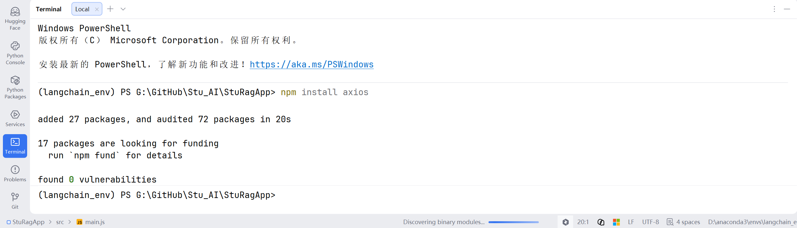

为了避免每个页面重复创建 axios，需要在 `main.js` 中进行全局配置。

主要配置内容：

- 设置服务器请求公共地址。
- 设置请求头信息。
- 将 axios 挂载到 Vue 全局对象中。

配置完成后，所有 Vue 组件都可以通过全局对象调用 axios 访问服务器接口。

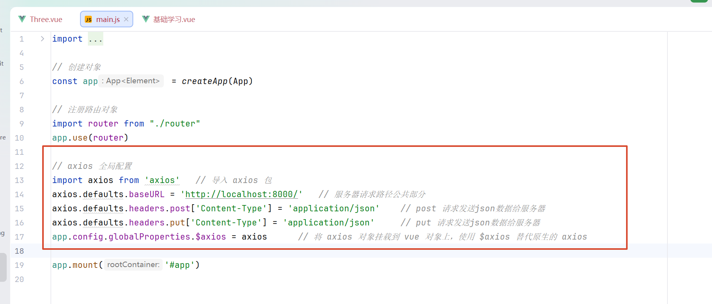

### 2. 配置路由

客户端页面需要通过路由进行访问。

Vue Router 负责：

- 根据 URL 路径匹配对应页面组件。
- 实现多个页面之间的切换。
- 管理单页面应用（SPA）的页面访问。

配置流程：

- 创建页面组件。
- 在路由配置文件中添加访问路径。
- 将路由注册到 Vue 应用。
- 使用路由占位标签显示对应页面。

配置完成后，访问不同路径时，客户端会自动加载对应 Vue 页面。

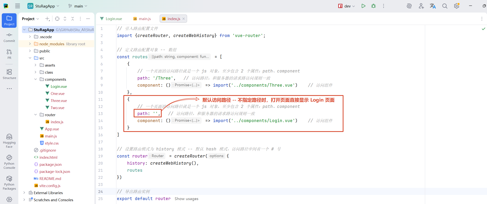

### 3. 创建登录页面

登录页面主要用于实现用户登录相关功能。

页面功能包括：用户输入邮箱号、用户输入验证码、点击按钮发送验证码、点击按钮验证验证码、

页面数据通过 Vue 响应式变量保存：邮箱号、验证码、当前页面状态

```vue
# Login.vue

<template>
  <div>
    <form>
      邮箱号：<input type="text" v-model="email" :disabled="!isCode"><br>
      验证码：<input type="text" v-model="code" :disabled="isCode"><br>
      <button type="button" v-show="isCode" @click="sendEmail">发送验证码</button>
      <button type="button" v-show="!isCode" @click="checkCode">验证验证码</button>
    </form>
  </div>

</template>

<script setup>
import {ref, getCurrentInstance} from "vue";

// 定义变量
let email = ref("");
let code = ref("");
let isCode = ref(true);

// 定义函数
function sendEmail() {  // 发送验证码的函数
  console.log("发送邮箱：", sendEmail)
  })
}
function checkCode() {
  console.log(email.value, code.value)
}

</script>

<style scoped>

</style>
```

### 4. 跨域配置（同源策略）

由于客户端和服务器属于两个不同服务，因此存在跨域问题。

浏览器的**同源策略**要求，两个服务进行通信时必须满足：

- 协议相同。
- IP 地址相同。
- 端口相同。

前后端分离项目中，端口不同，因此违反同源策略：

- Vue 客户端运行在一个端口。
- FastAPI 服务运行在另一个端口。

解决方式：在服务器端配置 CORS 跨域。

服务器允许：

- 指定客户端访问来源。
- 指定请求方法。
- 指定请求头。
- 允许携带身份信息。

配置完成后，客户端才能正常访问服务器接口。

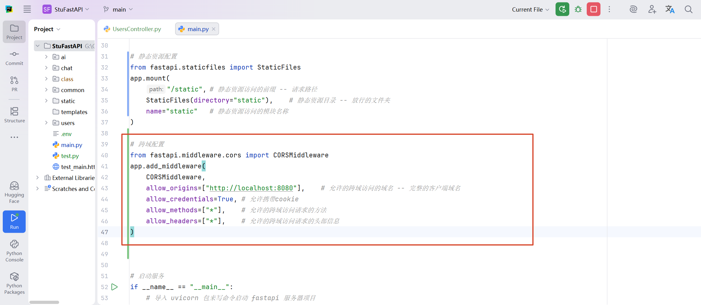

### 5. 邮箱号：客户端发送，服务器接收

客户端发送数据的基本流程：

- 用户在页面输入邮箱号 ==> Vue 获取输入框中的数据 ==> axios 创建 HTTP 请求 ==> 请求发送到服务器接口 ==> FastAPI 接收请求参数 ==> 执行业务逻辑 ==> 返回结果

axios 请求中主要包含：

- 请求地址（url）、请求方式（method）、请求参数（params）。

其中：

- GET 请求使用 `params` 传递参数。
- 参数名称必须与服务器接口接收参数名称保持一致。

例如：

- 客户端发送：email
- 服务器接口接收：email

两者名称必须一致，否则服务器无法正确获取参数。

服务器接收到客户端数据后，可以进行：

- 查询数据库、执行业务逻辑、发送验证码、返回处理结果

```vue
# Login.vue

<script setup>
import {ref, getCurrentInstance} from "vue";

// 定义变量
let email = ref("");
let code = ref("");
let isCode = ref(true);

// 创建当前实例对象 -- 通过这个对象才可以访问到 main.js 中定义的 $axios 变量
let proxy = getCurrentInstance().proxy;
console.log(getCurrentInstance())

// 定义函数
function sendEmail() {  // 发送验证码的函数
  let sendEmail = email.value;  // 获取用户输入的邮箱号
  console.log("发送邮箱：", sendEmail)
  proxy.$axios({  // {}：里面写的就是访问服务器接口的信息，比如请求地址【自动拼接前缀】、请求方式【默认get】、请求参数
    url: 'users/sendEmail', // 请求地址
    method: 'get',  // 请求方式
    params: { // 请求参数
      email: sendEmail  // 参数的key必须和服务器接口的形参一致
    },
  })
}
function checkCode() {
  console.log(email.value, code.value)
}

</script>
```

在服务器的发送邮箱接口函数添加输出代码，方便测试查看接收情况

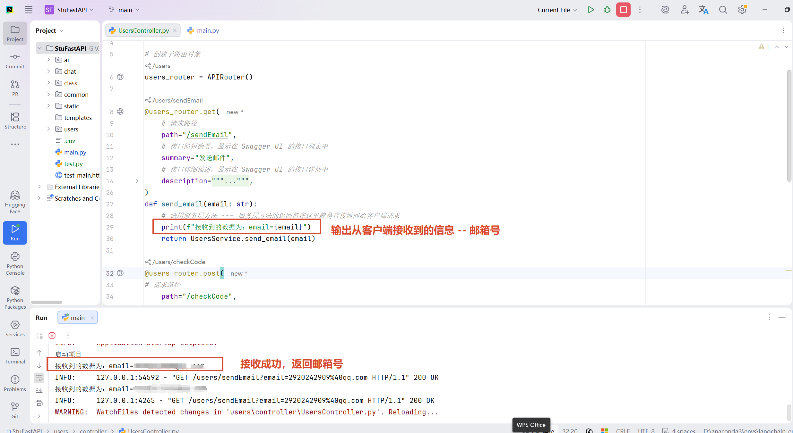

### 6. 验证码：服务器发送，客户端接收

服务器处理完成后，会将结果返回给客户端，axios 使用 Promise 处理异步请求结果。

请求成功后：

- 执行 `.then()` 中的回调函数。
- 通过回调函数接收服务器返回的数据。

格式：

```js
.then(res => {xxx})
```

其中：

- `res` 表示服务器响应结果。
- `res.data` 表示服务器返回的数据内容。

数据获取流程：

- 服务器返回数据 ==> axios 接收响应 ==> `.then()` 获取响应对象 ==> 通过 `res.data` 获取服务器返回值 ==> 根据结果更新页面

客户端获取返回数据后，可以：

- 修改页面状态。
- 显示提示信息。
- 更新页面内容。

`.then(res => {})`

- 请求成功的回调函数 --- 即请求服务器接口成功后执行这个代码
- 这个代码本质上就是一个函数，只是用了函数的简化写法 ==> 箭头函数
- res 就是函数的形参，=> 固定写法，{}内的内容就是函数体
- res=>{}等价于function a(res){}
- res中的data属性的内容就是我们自己在服务器中定义的返回值

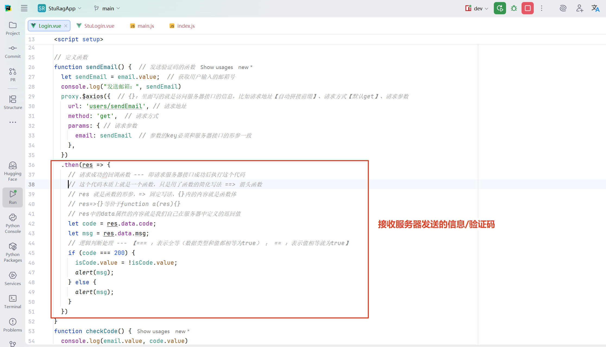

接收成功

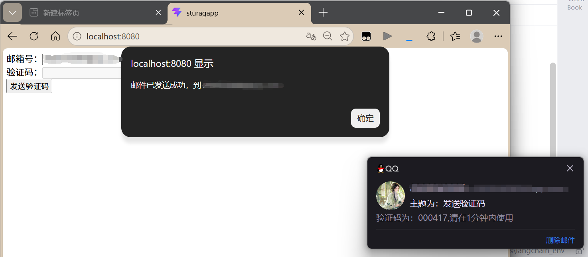

### 7. 验证码：客户端发送，服务器接收

服务器需要接收一个对象，对象中包含邮箱号和验证码，也就是说：客户端提交验证码时，需要同时发送：

- 用户邮箱号。
- 用户输入的验证码

由于多个数据需要一起传递，因此需要封装成一个对象，JSON 数据转换：：

- `JSON.stringify(checkCode)` --- 把 checkCode js 对象转为 json
- `JSON.parse(json)` --- 把 json 转为 js 对象

axios 中POST 请求发送参数时：

- 使用 `data` 属性传递请求主体数据，比如 `data:JSON.stringify(checkCode)`
- 适合发送对象、表单数据、JSON 数据等复杂信息。

数据传输过程：

- Vue 将邮箱号和验证码封装成 JavaScript 对象。
- 使用 JSON 格式进行数据转换。
- axios 通过 POST 请求发送数据。
- FastAPI 接收 JSON 数据。
- 服务器解析数据并进行验证码验证。

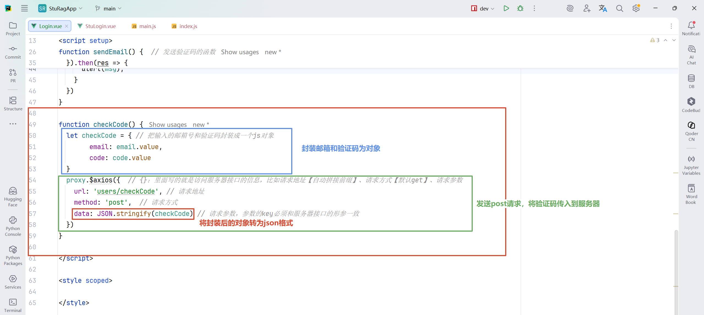

服务器接收成功

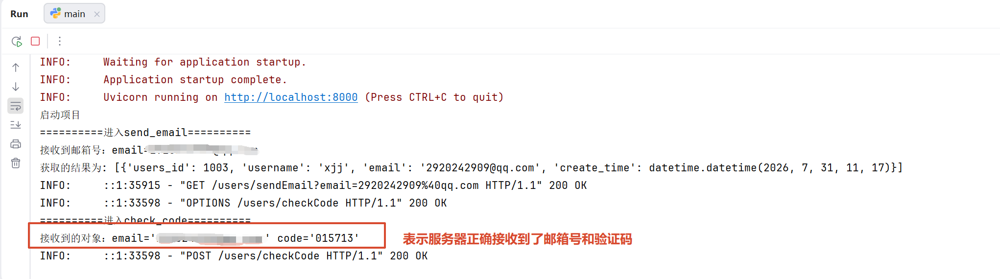

### 8. 验证结果：服务器发送，客户端接收

服务器处理完成后，会将结果返回给客户端，客户端通过 axios 的`.then`回调函数获取服务器响应

处理流程：

- 服务器：验证验证码、生成返回结果。
- 客户端：接收 `res.data`、判断返回状态、根据结果显示提示信息
- 返回数据通常包含：状态码、提示信息、其他业务数据
- 客户端根据服务器返回结果：显示成功信息、显示失败信息、修改页面状态

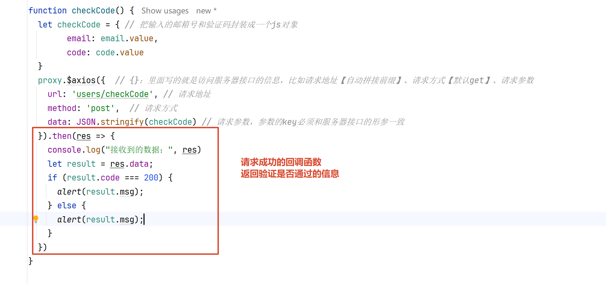

客户端接收成功

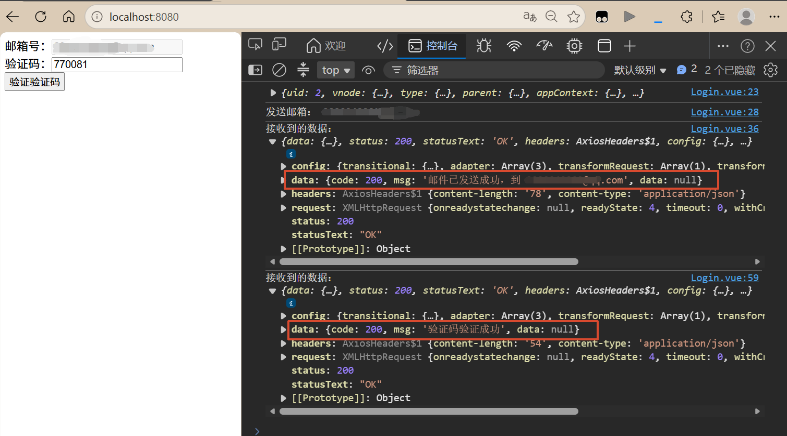

### 9. 完整前后端交互流程总结

（1）客户端发送邮箱

用户输入邮箱 ==> Vue获取数据 ==> axios GET请求 ==> FastAPI接口接收参数 ==> 服务器发送验证码 ==> 返回处理结果

（2）服务器返回验证码发送结果

FastAPI返回数据 ==> axios接收响应 ==> .then(res=>{}) ==> 获取res.data ==> 页面显示结果

（3）客户端提交验证码

用户输入验证码 ==> Vue封装邮箱和验证码对象 ==> JSON.stringify转换JSON ==> axios POST发送数据 ==> FastAPI接收JSON数据 ==> 验证码验证

（4）服务器返回验证结果

服务器验证完成 ==> 返回验证状态 ==> axios接收响应 ==> .then()处理结果 ==> 更新页面状态

