# 三、项目开发

## （一）历史记录

历史记录功能用于保存和查看用户之前的聊天内容。

左侧菜单栏中的每一条数据代表一个独立对话窗口的入口，对应当前用户某一次对话中的第一次提问。

实现逻辑：

当前用户名 → 查询该用户第一次发起的对话 → 显示在左侧历史菜单栏

点击某条历史记录：

历史记录 ID → 查询该对话完整聊天内容 → 返回客户端 → 赋值给 messages 变量 → 显示在右侧聊天窗口。

### 1. 新建聊天历史记录数据表

根据历史记录功能需求，需要创建 `history` 数据表保存用户聊天信息。

表名：history

字段设计：

| 字段名      | 描述                                                       | 数据类型 |
| ----------- | ---------------------------------------------------------- | -------- |
| history_id  | 主键，自增 ID                                              | int      |
| question    | 用户问题                                                   | text     |
| username    | 用户名                                                     | varchar  |
| parent_id   | 父级节点 ID，第一次提问为 0，否则保存对应父节点 history_id | int      |
| answer      | 问题对应答案                                               | text     |
| create_time | 对话创建时间                                               | datetime |

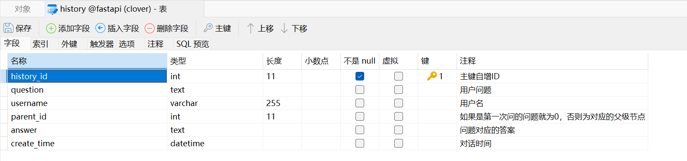

编写测试数据

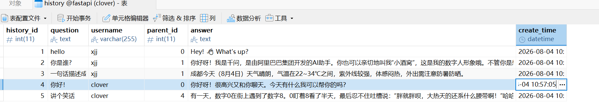

测试查询数据

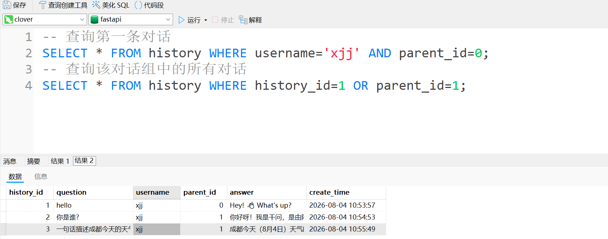

### 2. 查询历史记录菜单栏

左侧菜单栏需要显示：

- 第一次提问内容 -- question（title）
- 创建时间 -- create_time（time）
- 当前用户对应的历史记录 -- active

查询条件：

- 用户名匹配当前登录用户。
- `parent_id = 0`。

原因：

第一次提问没有父级节点，因此 `parent_id` 为 0。

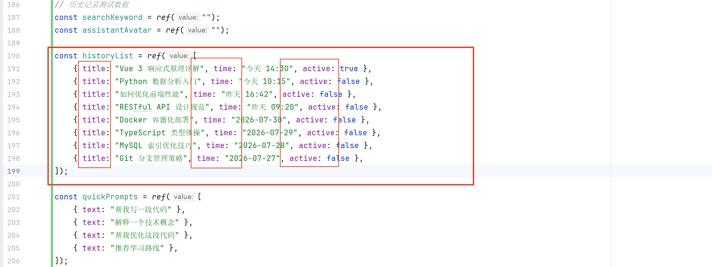

数据库查询：

```sql
select history_id,question,create_time from history where username = %s and parent_id = 0;
```

查询结果：

返回当前用户所有独立聊天窗口的入口数据。

#### （1）服务器处理历史菜单数据

##### `HistoryDao.py` -- 查询数据库数据

DAO 层负责数据库操作，主要功能：

- 连接数据库。
- 执行 SQL 查询。
- 获取历史记录数据。
- 返回查询结果。

查询历史菜单：

```python
def query_history_menu(username):
```

参数：`username`当前登录用户。

返回：当前用户所有第一次提问记录。

```python
from common import MySQLUtil

# 查询历史记录菜单栏
def query_history_menu(username):
    conn = MySQLUtil.get_mysql_conn()
    cur = conn.cursor() # 获取游标
    sql = 'select history_id,question,create_time from history where username = %s and parent_id = 0;'
    cur.execute(sql, [username])    # 执行sql语句
    result = cur.fetchall() # 获取所有结果
    MySQLUtil.close_mysql_conn(cur, conn)   # 关闭连接
    return result

# 测试
if __name__ == '__main__':
    print(query_history_menu('xjj'))
    
# 查询结果
# [{'history_id': 1, 'question': 'hello', 'create_time': datetime.datetime(2026, 8, 4, 10, 53, 57)}]
```

#####  `HistoryService.py` -- 处理查询结果

Service 层负责业务处理，主要功能：

- 调用 DAO 查询数据。
- 对数据库结果进行格式转换。
- 封装统一返回结构。

处理内容：数据库字段转换为客户端需要的数据

- history_id ==> historyId
- question ==> title
- create_time ==> time
- 客户端还需要一个数据为：active

作用：将数据库结构转换为前端页面需要的数据结构。

```python
from chat.dao import HistoryDao

def query_history_menu(username):
    # 获取结果
    results = HistoryDao.query_history_menu(username)
    # 包装结果
    data_list = []
    for item in results:
        data_list.append({
            'historyId': item['history_id'],
            'title': item['question'],
            'time': item['create_time'].strftime('%Y-%m-%d %H:%M:%S'),
            "active": "false"
        })
    return {
        'code': 200,
        'msg': '查询成功',
        'data': data_list
    }

# 测试
if __name__ == '__main__':
    print(query_history_menu('clover'))
    
# 查询结果
# {'code': 200, 'msg': '查询成功', 'data': [{'historyId': 4, 'title': '你好！', 'time': '2026-08-04 10:57:05', 'active': 'false'}]}
```

#### （2）服务器创建历史记录接口

服务器通过 FastAPI 创建历史记录查询接口。

接口作用：客户端请求历史菜单数据。

处理流程：

客户端发送用户名 → Controller 接收请求 → Service 调用业务方法 → Dao 查询数据库 → 返回历史菜单数据

##### `HistoryController.py` -- 返回数据给客户端

创建子路由：

```python
from fastapi import APIRouter
# 创建子路由对象
history_router = APIRouter()
```

注册子路由：

```python
# main.py

# 导入子路由对象
from chat.controller.HistoryController import history_router
# 注册子路由
app.include_router(
    router=history_router,    # 引入子路由对象
    prefix="/history", # 配置访问子路由接口的前缀，默认“”，推荐写为模块的包名作为区分
    tags=["history"]   # 配置swaggerUI中的模块名称
)
```

创建查询接口：

```python
@history_router.get(
    path="/queryHistoryMenu",
    summary="查询历史记录菜单栏",
)
def query_history_menu(username: str):
    return HistoryService.query_history_menu(username)
```

#### （3）客户端加载历史记录菜单栏

删除测试数据：

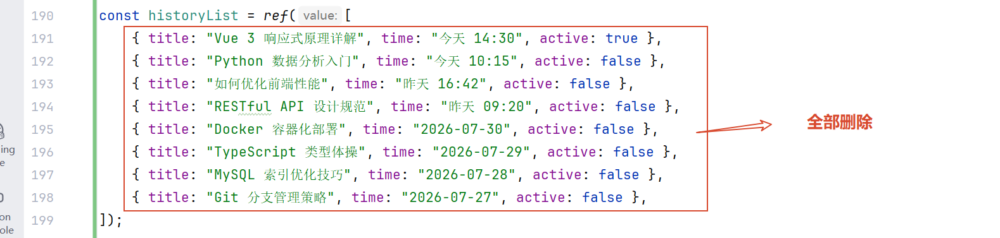

##### `Chat.vue`：

查询函数：`function query_history_menu()`

作用：向服务器发送请求，获取当前用户历史记录。

客户端通过 axios 调用服务器接口，处理流程：

Vue 发送用户名 → Controller 接收请求 → Service 查询数据 → 返回历史记录列表 → Vue 更新页面数据

获取数据后：将服务器返回的数据赋值给历史记录列表变量。

最终效果：左侧菜单栏显示用户历史聊天记录。

```js
// 查询聊天历史记录菜单栏
function query_history_menu() {
    proxy.$axios({
        url: "history/queryHistoryMenu",
        method: "get",
        params: {
          username: username.value
        }
    })
    .then(res => {
      historyList.value = res.data.data;
    })
}
```

进入聊天页面时，需要自动加载历史记录，使用 Vue 生命周期：`onMounted`

作用：组件加载完成后自动执行初始化操作。

执行流程：

进入聊天页面 → 获取 sessionStorage 中用户名 → 调用历史记录查询函数 → 获取服务器返回数据 → 更新 historyList → 显示左侧菜单栏。

```js
// 加载页面后自动执行
onMounted(() => {
  username.value = sessionStorage.getItem("username");
  // 获取历史记录菜单栏
  query_history_menu();
})
```

效果图，菜单栏有历史记录但是点击后没有反应，无法加载信息到聊天框：

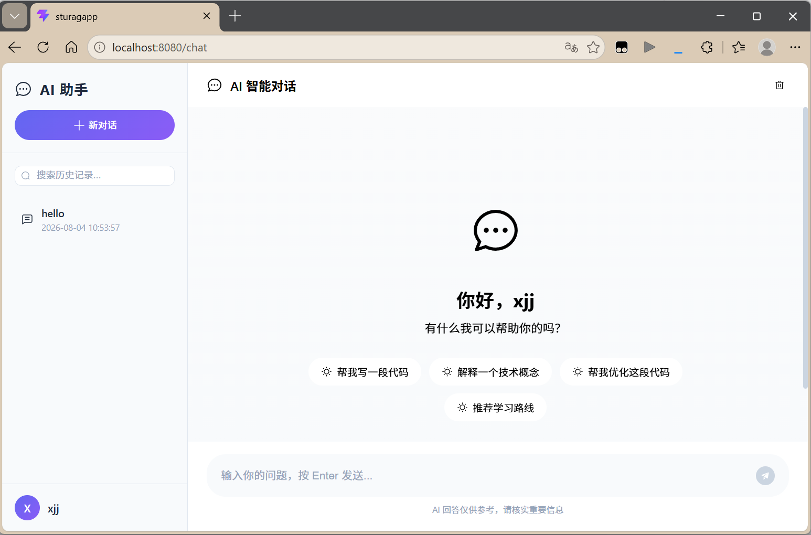

### 3. 查询某条历史记录详情

点击左侧菜单栏中的某条记录后，需要显示完整聊天内容。

实现流程：

点击事件触发 → 获取当前历史记录 historyId → 发送请求给服务器 → 根据 historyId 查询聊天数据 → 返回完整对话 → 赋值给 messages 更新聊天窗口

#### （1）客户端：

历史记录菜单需要绑定点击事件。

作用：

- 获取用户点击的历史记录。
- 调用查询详情函数。

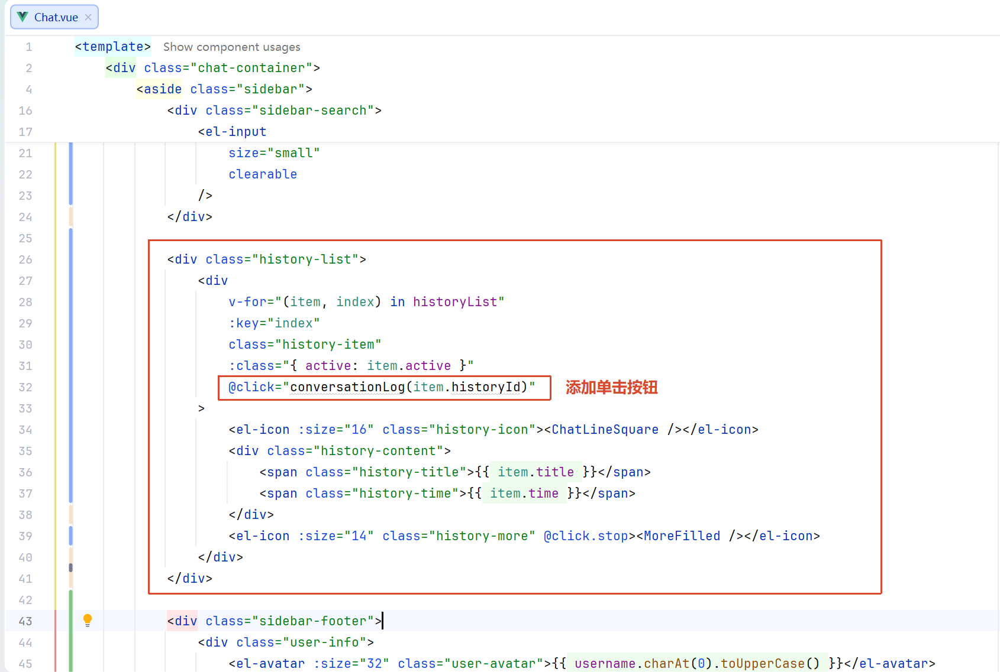

客户端将当前历史记录的唯一标识 `historyId` 传递给服务器。

**注意：**这里是客户端**传递** `historyId`，不是服务器返回，服务器根据该标识查询对应会话内容。

添加查询对话记录函数 -- 测试：

```js
// 查询某一条详细的对话记录
function conversationLog(historyId){
    console.log(historyId);
}
```

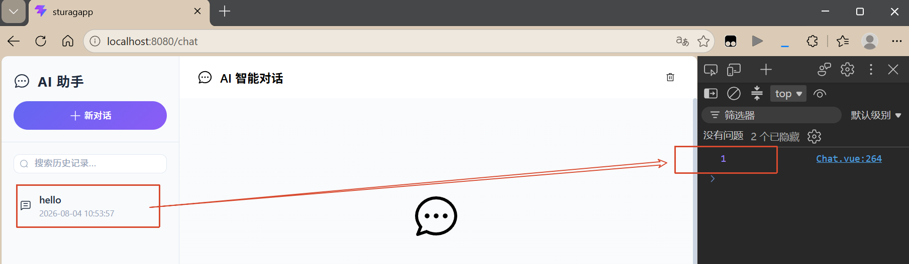

修改 Vue 响应式数据，使聊天窗口重新渲染：

```javascript
messages.value = res.data.data;
```

客户端传递 history_id 给服务器，查询完整消息记录：

```js
// 查询某一条详细的对话记录
function conversationLog(historyId){
    proxy.$axios({
        url: "history/conversationLog",
        method: "get",
        params: {
          historyId: historyId
        }
    }).then(res => { 
        messages.value = res.data.data;
    })
}
```

#### （2）服务器：

##### `HistoryController.py` -- 接收 historyId

服务器创建接口，获取客户端传入的历史记录编号。

作用：

- 接收请求参数。
- 调用 Service 查询详情。

```python
@history_router.get(
    path="/conversationLog",
    summary="查询某条历史记录详情",
)
def conversation_log(historyId: int):
    return HistoryService.conversation_log(historyId)
```

##### `HistoryService.py` -- 处理聊天记录数据

Service 调用 Dao 查询数据库结果，并转换为客户端聊天格式。

客户端聊天数据格式：

- `role`：消息角色。
- `content`：消息内容。

转换原因：聊天页面需要统一的数据结构显示用户消息和 AI 消息。

```python
# 查询某条历史记录详情
def conversation_log(historyId):
    results = HistoryDao.conversation_log(historyId)
    data_list = []
    for item in results:
        data_list.append({
            'role': 'user',
            'content': item['question']
        })
        data_list.append({
            'role': 'assistant',
            'content': item['answer']
        })
    return {
        'code': 200,
        'msg': '查询成功',
        'data': data_list
    }

# 测试
if __name__ == '__main__':
    print(conversation_log(1)['data'])
    
# 查询结果
# [{'role': 'user', 'content': 'hello'}, {'role': 'assistant', 'content': "Hey! 👋 What's up?"}, {'role': 'user', 'content': '你是谁?'}, {'role': 'assistant', 'content': '你好呀！我是千问，是由阿里巴巴集团开发的AI助手。你也可以亲切地叫我“小酒窝”，这是我的数字人形象哦。\r\n不管你是想聊天、查资料，还是需要我帮你办点事，随时都可以找我！'}, {'role': 'user', 'content': '一句话描述成都今天的天气'}, {'role': 'assistant', 'content': '成都今天（8月4日）天气晴朗，气温在22~34℃之间，紫外线较强，体感闷热，外出需注意防暑防晒。'}]
```

##### `HistoryDao.py` -- 查询完整聊天记录

Dao 根据历史记录编号查询对应会话。

查询内容：

- 用户问题。
- AI 回复。

查询结果按照聊天顺序排序，保证客户端显示顺序正确。

```python
# 查询某条历史记录详情
def conversation_log(historyId):
    conn = MySQLUtil.get_mysql_conn()
    cur = conn.cursor() # 获取游标
    sql = 'select question,answer from history where history_id = %s or parent_id = %s order by history_id asc;'
    cur.execute(sql, [historyId, historyId])    # 执行sql语句
    result = cur.fetchall() # 获取所有结果
    MySQLUtil.close_mysql_conn(cur, conn)   # 关闭连接
    return result

# 查询结果
# [{'question': 'hello', 'answer': "Hey! 👋 What's up?"}, {'question': '你是谁?', 'answer': '你好呀！我是千问，是由阿里巴巴集团开发的AI助手。你也可以亲切地叫我“小酒窝”，这是我的数字人形象哦。\r\n不管你是想聊天、查资料，还是需要我帮你办点事，随时都可以找我！'}, {'question': '一句话描述成都今天的天气', 'answer': '成都今天（8月4日）天气晴朗，气温在22~34℃之间，紫外线较强，体感闷热，外出需注意防暑防晒。'}]
```

效果图，点击历史记录菜单栏后，会在聊天框中显示该记录的所有对话：

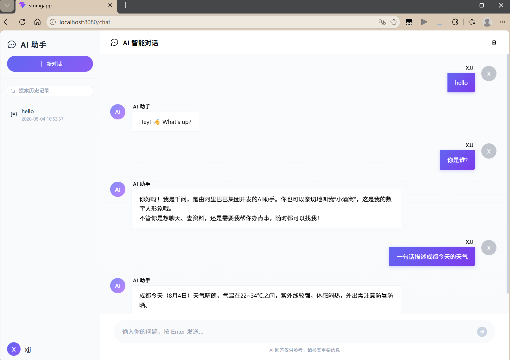

## （二）多轮对话

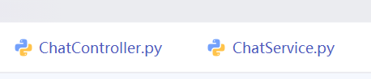

指的就是：LLM 在回答新问题的时候，能够回去到之前的问答内容信息 

我们口中的会话记忆其实就是多轮对话，会话记忆属于应用层，是一个**短期记忆**，通常存入到内存、redis、postgre中【postgre下个阶段学习，我们这里用 mysql来实现】 

**短期记忆：只针对当前对话窗口中生效，不能够跨会话** 

长期记忆：可以跨会话，它属于当前用户的一些信息描述、爱好习惯、让LLM输出内容的习惯 

无论是短期记忆、长期记忆，都可以在应用层把对应的数据信息查询出来，作为模型的上下文

KV 缓存：针对于 transformer 网络结构中的一门技术，主要是缓存已经计算过的注意力机制得分，一句话概括：在进行内容输出的时候，不会计算已经计算过的token的 KV值，而是直接复用之前计算出来的结果，通常情况下通过 GPU的显存来实现，即利用**空间换时间**，属于模型层 

我们实现会话记忆【多轮对话】的时候，需要考虑以下因素：

- 第一个因素：
    - 对话轮次比较多的时候，应该如何处理？【需要压缩处理】 
    - 还是查询全部数据，然后注入到模型上下文？【不可以】
- 第二个因素：
    - 如何优化对话的内容？ 

为什么需要对对话的内容进行处理？因为**模型上下文有窗口限制**，不能够超过预设值 

处理方案： 

- 最简单的：我们在查询历史对话记录的时候，只查询最近几个轮次的内容，忽略掉前面的内容【简单易实现，但是丢失完整的会话信息】
- 压缩内容：我们可以把查询最近几个轮次的内容之外的记录使用模型压缩，提取关键信息；我们存储历史记录的时候，可以考虑向量化存储，针对于当前检索的问题，去进行余弦相似度搜索，只找与当前问题相近的对话记录

我们需要得到当前会话窗口中的对话记录：【不考虑新对话】

- 我们点击某一个对话窗口后，在这个窗口中进行对话，那么就需要根据当前窗口的 history_id 找到对话历史记录

客户端：

创建变量，存储当前点击的是哪一个对话的 historyId：

```js
const currentChatID = ref(0)
```

在查询完整消息记录的函数`function conversationLog(historyId){}`中添加：

```js
currentChatID.value = historyId;  // 存储当前点击的是哪一个对话窗口的 historyId
```

在聊天函数中的构造SSE请求中添加参数 historyId：

```js
// 创建参数对象
let urlSerchParams = new URLSearchParams({
    question: myQuestion,
    historyId: currentChatID.value
});
```

服务器：

创建`ChatEntity.py`：

```python
from pydantic import BaseModel,Field

class ChatEntity(BaseModel):
    question: str = Field(..., title="用户问题")
    historyId: int = Field(..., title="当前对话窗口的ID")
```

在`ChatController.py`中：

修改chat接口，因为现在不仅要传入问题，还要传入id

```python
# 创建聊天接口
@chat_router.get(
    path="/chat",
    summary="聊天",
    description="""
        聊天
        访问路径：http://localhost:8000/chat/chat
        请求参数：
            question：用户问题
        返回值：
            流式输出：sse
    """
)
def chat(question: str, historyId: int):
    # 流式输出处理
    def generator():
        for item in ChatService.chat(question,historyId):
            # print(item.content)
            yield f"data:{json.dumps({'content':item},ensure_ascii=False)}\n\n"
        yield f"data:{json.dumps({'content':'end_end'})}\n\n"
    return StreamingResponse(
        content=generator(),
        media_type="text/event-stream"
    )

if __name__ == "__main__":
    print(chat("你好",1))
```

在`ChatService.py`中：

为chat函数添加形参 -- historyId

```python
def chat(question,historyId):
```

导入处理数据包

```python
from chat.service import HistoryService
```

添加参数 -- history

```python
# 创建提示词
template = """
    你是一名知识库问答助手，请结合提供的知识内容回答用户问题。
    回答要求：
        - 仅依据提供的知识内容进行回答，不补充未出现的信息。
        - 若知识内容无法回答问题，请明确说明当前知识不足，避免推测或编造。
        - 对多个知识片段进行综合分析后再作答，避免简单复制原文。
        - 回答应准确、自然、条理清晰，优先直接回答问题，再补充必要说明。
        - 相同信息无需重复描述。
        - 不要提及"根据参考资料"、"根据检索结果"、"根据上下文"等描述。
        - 若未提供任何知识内容或知识为空，请友好告知暂时无法回答，并建议用户补充信息或换个问题。
    历史记录：
        {history}
    知识内容：
        {context}
    用户问题：
        {question}
    回答：
"""

# 创建提示词对象
prompt = PromptTemplate(
    template=template,
    input_variables=["history","context", "question"],
)
```

```python
# 查询对话历史记录
history = HistoryService.conversation_log(historyId)['data']

# 创建langchain链
chain = (
    # 并行执行器
    RunnableParallel(
        {
            # 上下文，内容就是检索的内容
            "context": retriever | RunnableLambda(zh_answer),
            # 对话历史记录
            "history": RunnableLambda(lambda _: history),
            # 透明传递，原样返回/输出
            "question": RunnablePassthrough(),
        }
    )
    | RunnableLambda(re_sort) # 重排序
    | prompt   # 提示词
    | create_model() # 大模型
    | StrOutputParser()  # 把llm输出的结果转为字符串输出
)
```

```python
# 重排序
def re_sort(data):
	......
	
	# 取出历史记录
    history = data['history']
    
    ......
    
    # 返回排序后的文档
    return {
        "context": cons_sorted,
        "history": history,
        "question": que
    }
```

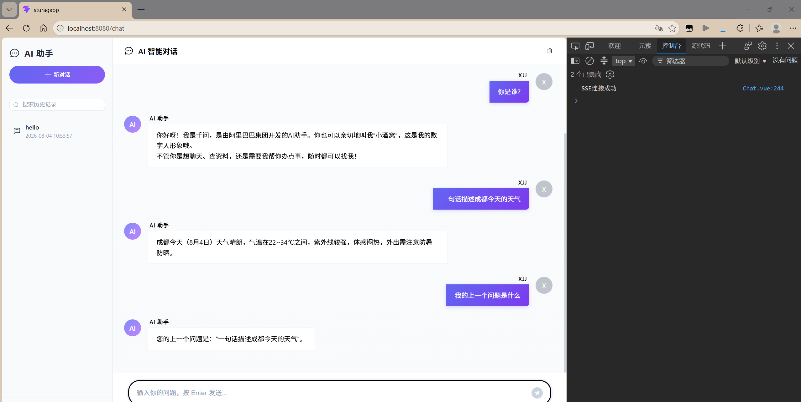

## （三）RAG路由分配

本质上：后期 agent 学习，让 agent 自主去判定是否走 rag 检索就可以了 

现在：没有agent，就需要人为的加以干预，实现就是把问题送入一个小模型【处理速度快】，让这个小模型去做意图识别，即判定当前的问题是否需要走 rag 检索，如果需要就走 rag、不需要就直接用 LLM 回复

在`.env`文件中添加ollama配置

```env
# ollama 配置
OLLAMA_MODAL_NAME="qwen2.5:7b"
OLLAMA_BASE_URL="http://localhost:11434"
```

创建提示词工具 -- `IntentionUtil.py`：

```python
from langchain_ollama import ChatOllama
import json
import os
from dotenv import load_dotenv
load_dotenv()

def instention_recognition(question):
    llm = ChatOllama(
        model=os.getenv("OLLAMA_MODEL_NAME"),
        base_url=os.getenv("OLLAMA_BASE_URL"),
    )

    intention_prompt = """
        角色设定：
            你是一个专业的法律意图识别助手。你的任务是分析用户的输入，判断其是否包含法律相关的内容或诉求。
        判定标准：
            相关：用户的问题涉及法律法规、司法程序、合同协议、纠纷解决、维权咨询、法律责任、行政处罚、婚姻家庭法律事务、知识产权、劳动法等。即使问题表述口语化或存在错别字，只要核心诉求是寻求法律层面的解答或帮助，均判定为“相关”。
            不相关：用户的问题仅涉及日常闲聊、通用知识问答、情感倾诉（无法律诉求）、纯技术问题、娱乐八卦等，不包含任何法律要素。
        输出要求：
            仅输出“相关”或“不相关”这两个词之一。
            不要输出任何解释、标点符号或其他多余的文字。
        示例参考：
            用户输入：老板拖欠工资三个月了，我该怎么办？
            输出：相关
            用户输入：今天天气真好，适合去公园散步。
            输出：不相关
            用户输入：租房合同里写的违约金比例合法吗？
            输出：相关
            用户输入：红烧肉怎么做才好吃？
            输出：不相关
            用户输入：我朋友出轨了，我好难过，不知道该怎么安慰她。
            输出：不相关
            用户输入：离婚时房产怎么分割？
            输出：相关
        待分析的用户输入：
            {question}
        输出：
    """

    rs = llm.invoke([
        {"role": "system", "content": intention_prompt},
        {"role": "user", "content": question},
    ])

    return json.loads(rs.content)
```

在数据处理中调用提示词工具，完成意图识别功能 -- `ChatService.py`

判断用户的问题是否走RAG检索

```python
from Chat.utils import IntentionUtil

def chat(question,historyId):
    # 查询对话历史记录
    history = HistoryService.conversation_log(historyId)['data']
    history.append({"role":"user", "content":question})
    # 意图识别
    is_legal = instention_recognition(question)["is_legal"]
    llm = create_model()    # 创建大模型对象
    # 判断用户的问题是否走RAG检索
    if not is_legal:
        # 直接LLM回复
        for chunk in llm.stream(history):
            if chunk.content:
                yield chunk.content
        return
    
    ......
    
    # 创建langchain链
    chain = (
        # 并行执行器
        RunnableParallel(
            {
                # 上下文，内容就是检索的内容
                "context": retriever | RunnableLambda(zh_answer),
                # 对话历史记录
                "history": RunnableLambda(lambda _: history),
                # 透明传递，原样返回/输出
                "question": RunnablePassthrough(),
            }
        )
        | RunnableLambda(re_sort) # 重排序
        | prompt   # 提示词
        | llm # 大模型
        | StrOutputParser()  # 把llm输出的结果转为字符串输出
    )
    for chunk in chain.stream(question):
        if chunk:
            yield chunk
```

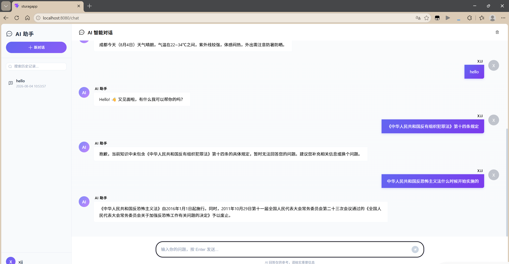

## （四）对话记录存储

客户端：

创建保存聊天对话记录的函数：

```js
// 保存对话聊天记录
function saveConversationResult(question,answer) {
  proxy.$axios({
    url: "chat/saveConversationResult",
    method: "post",
    data: JSON.stringify({
      question: question,
      username: username.value,
      parentId: currentChatID.value,
      answer: answer
    }).then(res => {
      console.log(res.data);
    })
  })
}
```

在聊天函数中，调用保存对话记录函数：

```js
saveConversationResult(myQuestion, s)；//调用保存聊天结果的方法
```

服务器：

创建实体类？ -- `ConversationResultEntity.py`：

```python
from pydantic import BaseModel,Field

# 创建实体类
class ConversationResultEntity(BaseModel):
    question: str = Field(..., description="用户问题")
    username: str = Field(..., description="用户名")
    historyId: int = Field(..., description="对话历史记录ID")
    answer: str = Field(..., description="答案")
```

添加post请求接口，获取xxx数据 -- `ChatController.py`：

```python
from chat.entity.ConversationResultEntity import ConversationResultEntity

# 创建接口，接收要保存的对话
@chat_router.post(
    path="/saveConversationResult",
    summary="保存对话结果",
    description="""
        保存对话结果
        访问路径：http://localhost:8000/chat/saveConversationResult
    """
)
def save_conversation_result(conversationResultEntity: ConversationResultEntity):
    return ChatService.save_conversation_result(conversationResultEntity)
```

处理数据 -- `ChatService.py`：

```python
def save_conversation_result(conversationResultEntity):
    # 取出conversationResultEntity对象中的数据内容
    question = conversationResultEntity.question
    username = conversationResultEntity.username
    parent_id = conversationResultEntity.parentId
    answer = conversationResultEntity.answer
    # 存储
    flag = ChatDao.save_conversation_result(question, username, parent_id, answer)
    if flag:
        return {
            "code": 200,
            "message": "保存成功",
            "data": None
        }
    return {
        "code": 500,
        "message": "保存失败",
        "data": None
    }
```

连接数据库，存入数据 -- `ChatDao.py`：

后面会改一些代码，因为现在的逻辑不兼容新对话，只能在已有对话记录中增加新记录

```python
from common import MySQLUtil
"""
    查询操作不需要做事务管理
    增删改操作需要事务管理
    操作成功 --- commit 提交事务：执行当前操作
    操作失败 --- rollback回滚事务：不执行当前操作
"""
def save_conversation_result(question, username, parent_id, answer):
    # 创建数据库连接对象
    conn = MySQLUtil.get_mysql_conn()
    cur = conn.cursor()
    try:
        # 执行SQL语句
        sql = "INSERT INTO history VALUES (null, %s, %s, %s, %s, now())"
        cur.execute(sql, [question, username, parent_id, answer])
        conn.commit()   # 提交事务
        return True
    except Exception as e:
        print(f"新增对话结果失败：{e}")
        conn.rollback() # 回滚事务
        return False
    finally:
        # 关闭连接
        MySQLUtil.close_mysql_conn(cur, conn)
```

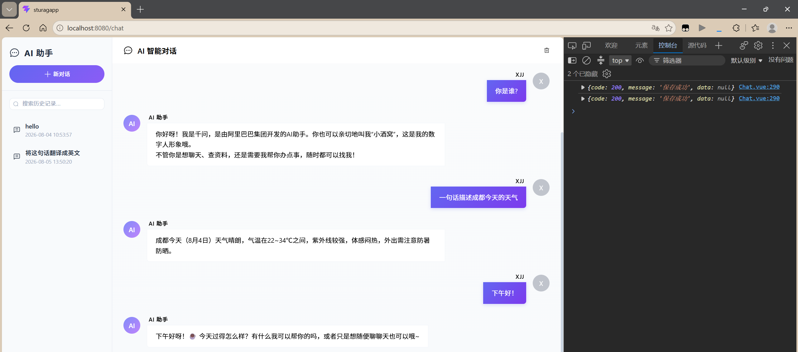

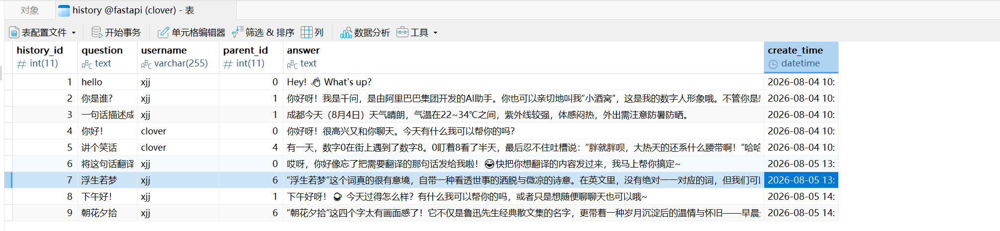

优化兼容性

服务器：

为查询代码添加判断 -- `ChatService.py`：

原代码：

```python
# 查询对话历史记录
history = HistoryService.conversation_log(historyId)['data']
```

修改后：

```python
# 查询对话历史记录，判断是否为新对话
if historyId == 0:  # 若为新对话，id为0
    history = []
else:
    history = HistoryService.conversation_log(historyId)['data']
```

开启新对话后，要获取新对话历史记录id，将客户端中的`currentChatID`给覆盖掉？

修改事务操作 -- `ChatDao.py`：

在提交事务后，返回当前新增数据的主键自增ID：history_id

```python
try:
    # 执行SQL语句
    sql = "INSERT INTO history VALUES (null, %s, %s, %s, %s, now());"
    cur.execute(sql, [question, username, parent_id, answer])
    conn.commit()   # 提交事务
    # 返回当前新增数据的主键自增ID -- history_id
    return cur.lastrowid    # 返回最后一个插入的行ID
except Exception as e:
    print(f"新增对话结果失败：{e}")
    conn.rollback() # 回滚事务
    return 0
finally:
    # 关闭连接
    MySQLUtil.close_mysql_conn(cur, conn)
```

修改处理数据代码 -- `ChatService.py`：

若history_id不为0，则将此id传递给客户端

```python
def save_conversation_result(conversationResultEntity):
    # 取出conversationResultEntity对象中的数据内容
    question = conversationResultEntity.question
    username = conversationResultEntity.username
    parent_id = conversationResultEntity.parentId
    answer = conversationResultEntity.answer
    # 存储
    history_id = ChatDao.save_conversation_result(question, username, parent_id, answer)
    if history_id != 0:
        return {
            "code": 200,
            "message": "保存成功",
            "data": history_id
        }
    return {
        "code": 500,
        "message": "保存失败",
        "data": None
    }
```

客户端：

接收传递回来的history_id：

```js
// 保存对话聊天记录
function saveConversationResult(question,answer) {
  proxy.$axios({
    url: "chat/saveConversationResult",
    method: "post",
    data: JSON.stringify({
      question: question,
      username: username.value,
      parentId: currentChatID.value,
      answer: answer
    })
  }).then(res => {
      // 只有当currentChatId=0的时候，才需要把新增的数据的historyId赋值给它【表示一个新对话的开始】
      // 如果currentChatId!=0，说明当前点击的是一个已有的对话窗口，那么就不需要在赋值了【因为新传过来的historyId是子对话的】
      if (currentChatID.value === 0){
        currentChatID.value = res.data.data;
      }
  })
}
```

添加新对话，将聊天框清空，history_id置为0

为新对话按钮添加单击事件

```vue
<el-button class="new-chat-btn" type="primary" size="small" round @click="newChat">
	<el-icon :size="16"><Plus /></el-icon>
	<span>新对话</span>
</el-button>
```

```js
// 新对话
function newChat(){
  currentChatID.value = 0;  // 设置currentChatId为0，表示一个新对话的开始
  messages.value = [];  // 清空聊天框数据
}
```

```js
# 刷新历史记录栏 -- 在保存对话聊天记录中

// 保存对话聊天记录
function saveConversationResult(question,answer) {
  proxy.$axios({
    url: "chat/saveConversationResult",
    method: "post",
    data: JSON.stringify({
      question: question,
      username: username.value,
      parentId: currentChatID.value,
      answer: answer
    })
  }).then(res => {
      // 只有当currentChatId=0的时候，才需要把新增的数据的historyId赋值给它【表示一个新对话的开始】
      // 如果currentChatId!=0，说明当前点击的是一个已有的对话窗口，那么就不需要在赋值了【因为新传过来的historyId是子对话的】
      if (currentChatID.value === 0){
        currentChatID.value = res.data.data;
      }
      // 刷新历史记录菜单栏
      query_history_menu();
  })
}
```

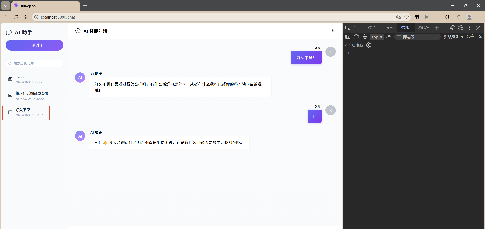

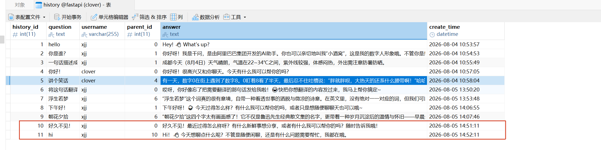

## （五）删除历史记录


## （六）模糊搜索聊天记录

