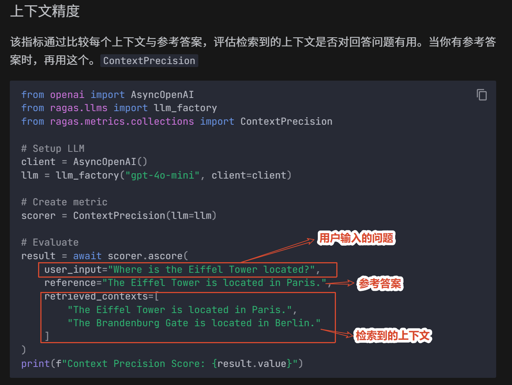

# 一、RAG评估指标


# 二、RAGas评估框架

创建一个新环境 `radas_env` ，导入环境文件 `requirements.txt`

官方文档：[Quick Start - Ragas](https://docs.ragas.io/en/latest/getstarted/quickstart/)

## （一）上下文精确率

### 1. 定义

上下文精度是一种衡量检索器在被检索上下文中，将相关区块排在无关区块之上的能力指标。具体来说，它评估检索上下文中相关片段在排名顶部的位置。

它是作为上下文中每个区块precision@k的平均值计算的。Precision@k 是秩k相关块数与秩k总块数的比值。

### 2. 计算公式

$$
\text{Context Precision@K} = \frac{\sum_{k=1}^{K} (\text{Precision@k} \times v_k)}{\text{前 } K \text{ 个结果中相关项目的总数}}
$$

$$
\text{Precision@k} = \frac{\text{true positives@k}}{(\text{true positives@k} + \text{false positives@k})}
$$

### 3. 代码示例



### 4. 关键理解

**排序敏感性**：即使检索到了相关文档，如果它们排在末尾，分数也会降低

**取值范围**：0~1，越高越好

**核心价值**：鼓励检索器将最相关的信息放在最前面，因为LLM通常对靠前的内容更"关注"

### 5. 两种变体

| 变体                                  | 使用场景     | 需要的输入                                        |
| ------------------------------------- | ------------ | ------------------------------------------------- |
| `LLMContextPrecisionWithReference`    | 有参考答案时 | `user_input` + `retrieved_contexts` + `reference` |
| `LLMContextPrecisionWithoutReference` | 无参考答案时 | `user_input` + `retrieved_contexts` + `response`  |

### 6. 我的代码

```python
from openai import AsyncOpenAI
from ragas.llms import llm_factory
from ragas.metrics import ContextPrecision, ContextUtilization

import os

# 有参考答案的上下文精度
def llm_context_precision_with_reference():
    # Setup LLM
    # 配置调用模型
    client = AsyncOpenAI(
        api_key=os.getenv("DASHSCOPE_API_KEY"),
        base_url="https://dashscope.aliyuncs.com/compatible-mode/v1",
    )
    # 基于配置加载模型
    llm = llm_factory(
        model="qwen3.7-max-preview",
        client=client
    )

    # Create metric
    # 创建指标对象
    scorer = ContextPrecision(llm=llm)

    # Evaluate
    # 评估
    result = scorer.score(
        # 用户输入的问题
        user_input="埃菲尔铁塔位于哪里?",
        # 参考答案
        reference="埃菲尔铁塔位于巴黎。",
        # 检索上下文
        retrieved_contexts=[
            "埃菲尔铁塔位于巴黎。",
            "勃兰登堡门位于柏林。"
        ]
    )

    # 输出结果
    print(f"上下文精确度得分: {result.value}")

# 无参考答案的上下文精度
def llm_context_precision_without_reference():
    # Setup LLM
    # 配置调用模型
    client = AsyncOpenAI(
        api_key=os.getenv("DASHSCOPE_API_KEY"),
        base_url="https://dashscope.aliyuncs.com/compatible-mode/v1",
    )
    # 基于配置加载模型
    llm = llm_factory(
        model="qwen3.7-max-preview",
        client=client
    )

    # Create metric
    # 创建指标对象
    scorer = ContextUtilization(llm=llm)

    # Evaluate
    # 评估
    result = scorer.score(
        # 用户输入的问题
        user_input="埃菲尔铁塔位于哪里?",
        # 生成结果
        response="埃菲尔铁塔位于巴黎。",
        # 检索上下文
        retrieved_contexts=[
            "埃菲尔铁塔位于巴黎。",
            "勃兰登堡门位于柏林。"
        ]
    )

    # 输出结果
    print(f"上下文精确度得分: {result.value}")


if __name__ == '__main__':
    llm_context_precision_with_reference()
    llm_context_precision_without_reference()
```

**问题**：`ModuleNotFoundError: No module named 'langchain_community.chat_models.vertexai'`

**原因**： Ragas 与 LangChain 版本不兼容导致的典型问题

**解决**：未解决

## （二）上下文召回率

### 1. 定义

上下文召回率(Context Recall)衡量的是检索到了多少相关的文档(或信息片段)。它关注的是不遗漏重要的结果。召回率越高，意味着遗漏的相关文档越少。简而言之，召回率就是确保不遗漏任何重要信息。

由于召回率关注的是不遗漏任何信息，因此计算上下文召回率总是需要一个参考标准来进行比较。基于LLM的上下文召回率指标使用`reference` (参考答案)作为`reference_contexts` (参考上下文)的代理，这使得它更易于使用，因为标注参考上下文可能非常耗时。为了从`reference`中估算上下文召回率，参考答案会被分解成多个声明(claims)，然后分析每个声明是否能从检索到的上下文中得到支持。在理想情况下，参考答案中的所有声明都应该能从检索到的上下文中找到依据。

### 2. 公式

$$
\text{上下文召回率} = \frac{\text{参考答案中能被检索上下文支持的声明数量}}{\text{参考答案中的声明总数}}
$$

### 3. 实例代码

```python
"""
声明：
通俗易懂的解释就是把生成的结果解析成多个声明【比如词】
然后去参考答案中找到这些声明，有就有，没有就没有，然后计算结果，得到一个分数
"""
from openai import AsyncOpenAI
from ragas.llms import llm_factory
from ragas.metrics.collections import ContextRecall
import os

# Setup LLM
# 配置调用模型
client = AsyncOpenAI(
    api_key=os.getenv("DASHSCOPE_API_KEY"),
    base_url="https://dashscope.aliyuncs.com/compatible-mode/v1",
)
# 基于配置加载模型
llm = llm_factory(
    model="qwen3.7-max-preview",
    client=client
)

# Create metric
# 创建指标对象
scorer = ContextRecall(llm=llm)

# Evaluate
# 评估
result = scorer.score(
    # 用户输入的问题
    user_input="小明喜欢吃苹果吗？",
    # 参考答案
    reference="小明喜欢吃香蕉，小明也很喜欢吃橘子",
    # 检索到的上下文
    retrieved_contexts=[
        "小明喜欢吃苹果和香蕉。",
        "小红喜欢吃香蕉。",
    ]
)

# 输出结果
print(f"上下文精确度得分: {result.value}")
```

## （三）上下文实体召回率

### 1. 定义

`ContextEntityRecall` 指标基于`reference` (参考答案)和`retrieved_contexts` (检索到的上下文)中共同存在的实体数量，与仅存在于`reference`中的实体数量进行比较，从而衡量检索到的上下文的召回率简而言之，它衡量的是从`reference`中召回了多少比例的实体。此指标在基于事实的用例中非常有用，例如旅游咨询、历史问答等。该指标可以通过与`reference`中存在的实体进行比较，来帮助评估检索机制在实体召回方面的表现，因为在实体很重要的场景下，我们需要`retrieved_contexts` 能够覆盖这些实体。

### 2. 计算公式

为了计算此指标，我们使用两个集合

- RE:参考答案中的实体集合。
- RCE:检索到的上下文中的实体集合。

我们计算两个集合中共同实体的数量(RCE∩RE)，然后除以参考答案中实体的总数(RE)。公式如下：
$$
\text{上下文实体召回率} = \frac{\boldsymbol{RCE} \text{ 和 } \boldsymbol{RE} \text{ 之间的共同实体数量}}{\boldsymbol{RE} \text{ 中的实体总数}}
$$

### 3. 计算步骤

泰姬陵是一座象牙白色的大理石陵墓，位于印度城市阿格拉的亚穆纳河右岸。它由莫卧儿王朝皇帝沙贾汗于1631年下令建造，用于安放其爱妻蒙塔兹·玛哈的陵墓。

第一步: 找出参考答案中存在的实体。

- 基准真相中的实体 (RE) - ['泰姬陵', '亚穆纳河', '阿格拉', '1631', '沙贾汗', '蒙塔兹·玛哈']

第二步: 找出检索到的上下文中存在的实体。

- 上下文中的实体 (RCE1) - ['泰姬陵', '阿格拉', '沙贾汗', '蒙塔兹·玛哈', '印度']
- 上下文中的实体 (RCE2) - ['泰姬陵', '联合国教科文组织', '印度']

第三步: 使用上述公式计算实体召回率
$$
\text{上下文实体召回率 } \mathbf{1} = \frac{|RCE1 \cap RE|}{|RE|} = 4/6 = 0.666
$$

$$
\text{上下文实体召回率 } \mathbf{2} = \frac{|RCE2 \cap RE|}{|RE|} = 1/6
$$

### 4. 示例代码

```python
from openai import AsyncOpenAI
from ragas.llms import llm_factory
from ragas.metrics.collections import ContextEntityRecall
import os

# Setup LLM
# 配置调用的模型
client = AsyncOpenAI(
    api_key=os.getenv("DASHSCOPE_API_KEY"),
    base_url="https://dashscope.aliyuncs.com/compatible-mode/v1",
)
# 基于配置加载模型
llm = llm_factory(
    model="qwen3.7-plus-2026-05-26",
    client=client
)

# 创建指标对象
scorer = ContextEntityRecall(llm=llm)

# 评估
result = scorer.score(
    # 参考答案
    reference="泰姬陵是一座象牙白色的大理石陵墓，位于印度城市阿格拉的亚穆纳河右岸。它由莫卧儿王朝皇帝沙贾汗于1631年下令建造，用于安放其爱妻蒙塔兹·玛哈的陵墓。",
    # 检索到的上下文
    retrieved_contexts=[
        "泰姬陵是位于印度阿格拉的爱情象征和建筑奇迹。它由莫卧儿王朝皇帝沙贾汗为纪念其爱妻蒙塔兹·玛哈而建造。该建筑以其复杂的大理石工艺和周围美丽的花园而闻名。",
    ]
)
# 输出结果
print(f"上下文实体召回率得分: {result.value}")
```

## （四）噪声敏感度

### 1. 定义

`NoiseSensitivity`（噪声敏感度）衡量系统在利用相关或不相关检索文档时，提供不正确响应从而犯错的频率。分数范围从0到1，值越低表示性能越好。噪声敏感度使用 `user_input`（用户输入）、`reference`（参考答案）、`response`（响应）和 `retrieved_contexts`（检索到的上下文）来计算。

为了评估噪声敏感度，需要检查生成响应中的每个声明，以确定它是否基于真实答案是正确的，以及它是否可以归因于相关（或不相关）的检索上下文。理想情况下，答案中的所有声明都应由相关的检索上下文支持。

### 2. 公式

$$
\text{噪声敏感度 (相关)} = \frac{|\text{响应中不正确声明的总数}|}{|\text{响应中声明的总数}|}
$$

### 3. 计算步骤

**第1步：** 识别可以推断出真实答案的相关上下文。

- 真实答案：印度人寿保险公司（LIC）是印度最大的保险公司，成立于1956年，通过保险业的国有化而建立。它以管理庞大的投资组合而闻名。
- 上下文
    - 上下文1：印度人寿保险公司（LIC）成立于1956年，是在印度保险业国有化之后成立的。
    - 上下文2：LIC是印度最大的保险公司，拥有庞大的投保人网络，在金融领域扮演着重要角色。
    - 上下文3：作为印度最大的机构投资者，LIC管理着庞大的基金，为国家的金融稳定做出了贡献。

**第2步：** 验证生成答案中的声明是否可以从相关上下文中推断出来。

- 答案：印度人寿保险公司（LIC）是印度最大的保险公司，以其庞大的投资组合而闻名。LIC为国家的金融稳定做出了贡献。
- 上下文
    - 上下文1：印度人寿保险公司（LIC）成立于1956年，是在印度保险业国有化之后成立的。
    - 上下文2：LIC是印度最大的保险公司，拥有庞大的投保人网络，在金融领域扮演着重要角色。
    - 上下文3：作为印度最大的机构投资者，LIC管理着庞大的基金，为国家的金融稳定做出了贡献。

**第3步：** 识别答案中的任何不正确声明（即，未被真实答案支持的答案陈述）。

- 真实答案：印度人寿保险公司（LIC）是印度最大的保险公司，成立于1956年，通过保险业的国有化而建立。它以管理庞大的投资组合而闻名。
- 答案：印度人寿保险公司（LIC）是印度最大的保险公司，以其庞大的投资组合而闻名。LIC为国家的金融稳定做出了贡献。

解释：真实答案没有提及任何关于LIC为国家金融稳定做出贡献的信息。因此，答案中的这个陈述是不正确的。

不正确的陈述：1 ；总声明数：3

**第4步：** 使用公式计算噪声敏感度

这得出的噪声敏感度分数为0.333，表明答案中三个声明中有一个是不正确的。

### 4. 示例代码

```python
from openai import AsyncOpenAI
from ragas.llms import llm_factory
from ragas.metrics.collections import NoiseSensitivity
import os

# 设置 LLM (大语言模型)
# 配置调用的模型
client = AsyncOpenAI(
    api_key=os.getenv("DASHSCOPE_API_KEY"),
    base_url="https://dashscope.aliyuncs.com/compatible-mode/v1",
)
# 基于配置加载模型
llm = llm_factory(
    model="qwen3.7-plus-2026-05-26",
    client=client
)

# 创建评估指标
scorer = NoiseSensitivity(llm=llm)

# 进行评估
result = scorer.ascore(
    # 用户输入的问题
    user_input="印度人寿保险公司 (LIC) 以什么闻名？",
    # 生成的答案
    response="印度人寿保险公司 (LIC) 是印度最大的保险公司，以其庞大的投资组合而闻名。LIC 为国家的金融稳定做出了贡献。",
    # 参考答案
    reference="印度人寿保险公司 (LIC) 是印度最大的保险公司，于 1956 年通过保险业国有化而成立。它以管理大型投资组合而闻名。",
    # 检索到的上下文
    retrieved_contexts=[
        "印度人寿保险公司 (LIC) 成立于 1956 年，此前印度保险业进行了国有化。",
        "LIC 是印度最大的保险公司，拥有庞大的保单持有人网络和巨额投资。",
        "作为印度最大的机构投资者，LIC 管理着大量资金，为国家的金融稳定做出了贡献。",
        "印度经济是世界上增长最快的主要经济体之一，这得益于金融、科技、制造等行业。"
    ]
)

print(f"噪声敏感度得分: {result.value}")
```

## （五）响应（回答）相关性

### 1. 定义

**回答相关性** (Answer Relevancy) 指标衡量响应与用户输入的相关程度。其取值范围为 0 到 1，分数越高表示与用户输入的对齐程度越好。

如果一个回答直接且恰当地解决了原始问题，那么它就被认为是相关的。该指标关注回答与问题意图的匹配程度，而不评估事实的准确性。它会对不完整或包含不必要细节的回答进行惩罚。

### 2. 公式

该指标使用 `user_input` 和 `response` 按以下方式计算

1. 根据响应生成一组人工问题（默认为 3 个）。这些问题旨在反映响应的内容。
2. 计算用户输入的嵌入 () 与每个生成问题的嵌入 () 之间的余弦相似度。
3. 取这些余弦相似度分数的平均值，得到**回答相关性**

$$
\text{回答相关性} = \frac{1}{N} \sum_{i=1}^{N} \text{cosine similarity}(E_{g_i}, E_o)
\$$
$$

$$
\text{回答相关性} = \frac{1}{N} \sum_{i=1}^{N} \frac{E_{g_i} \cdot E_o}{\|E_{g_i}\| \|E_o\|}
$$

其中 

$E_{g_i}$: 第 $i$ 个生成问题的嵌入。 

$E_o$: 用户输入的嵌入。 

$N$: 生成问题的数量（默认为 3，可通过 `strictness` 参数配置）。 

**注意：** 虽然分数通常在 0 到 1 之间，但由于余弦相似度的数学范围是 -1 到 1，因此不能保证分数一定在此区间内。

### 3. 计算步骤

**第一步：** 使用大型语言模型（LLM）从生成的回答中逆向工程出 'n' 个问题的变体。例如，对于第一个回答，LLM 可能会生成以下可能的问题

- *问题 1：* “法国位于欧洲的哪个部分？”
- *问题 2：* “法国在欧洲的地理位置是什么？”
- *问题 3：* “你能指出法国位于欧洲的哪个区域吗？”

**第二步：** 计算生成的问题与实际问题之间的平均余弦相似度。

其基本概念是，如果回答正确地解决了问题，那么仅从回答中就很有可能重构出原始问题。

### 4. 代码

```python
"""
    计算答案相关性：
        基于结果逆向生成问题
        然后基于生成的问题和用户输入的问题之间计算余弦相似度
        最后取平均值作为结果
"""
from openai import AsyncOpenAI
from ragas.embeddings import embedding_factory
from ragas.llms import llm_factory
from ragas.metrics.collections import AnswerRelevancy
import os

# Setup LLM
# 配置调用的模型
client = AsyncOpenAI(
    api_key=os.getenv("DASHSCOPE_API_KEY"),
    base_url="https://dashscope.aliyuncs.com/compatible-mode/v1",
)
# 基于配置加载模型
llm = llm_factory(
    model="qwen3.7-plus-2026-05-26",
    client=client
)

embeddings = embedding_factory(
    "openai",
    model="qwen3.7-text-embedding",
    client=client
)


# 创建指标对象
scorer = AnswerRelevancy(llm=llm, embeddings=embeddings)

# 评估
result = scorer.score(
    # 用户输入的问题
    user_input="法国在哪里，它的首都是什么？",
    # 生成的回复
    response="法国在西欧，首都是巴黎。",
)
# 输出结果
print(f"答案相关性得分: {result.value}")
```

## （六）忠实度

### 1. 定义

**忠实性** (Faithfulness) 指标衡量`响应`在事实上与`检索到的上下文`的一致程度。其取值范围为 0 到 1，分数越高表示一致性越好。

如果一个响应中的所有声明都能被检索到的上下文所支持，那么它就被认为是**忠实的**。

### 2. 公式

计算方法如下： 

1. 识别响应中的所有声明。 
2. 检查每个声明是否可以从检索到的上下文中推断出来。
3. 使用以下公式计算忠实性分数：

$$
\text{忠实性分数} = \frac{\text{响应中被检索上下文支持的声明数量}}{\text{响应中的总声明数量}}
$$

### 3. 示例代码

```python
from openai import AsyncOpenAI
from ragas.llms import llm_factory
from ragas.metrics.collections import Faithfulness
import os


# Setup LLM
# 配置调用的模型
client = AsyncOpenAI(
    api_key=os.getenv("DASHSCOPE_API_KEY"),
    base_url="https://dashscope.aliyuncs.com/compatible-mode/v1",
)
# 基于配置加载模型
llm = llm_factory(
    model="qwen3.7-plus-2026-05-26",
    client=client
)

# 创建指标对象
scorer = Faithfulness(llm=llm)

# 评估
result = scorer.score(
    # 用户输入的问题
    user_input="爱因斯坦在何时何地出生？",
    # 生成的回复
    response="爱因斯坦于 1879 年 3 月 10 日出生在中国。",
    # 检索到的上下文
    retrieved_contexts=[
        "阿尔伯特·爱因斯坦（生于 1879 年 3 月 14 日）是一位德国出生的理论物理学家，被广泛认为是有史以来最伟大和最有影响力的科学家之一。",
    ]
)
# 输出结果
print(f"忠诚度得分: {result.value}")
```

