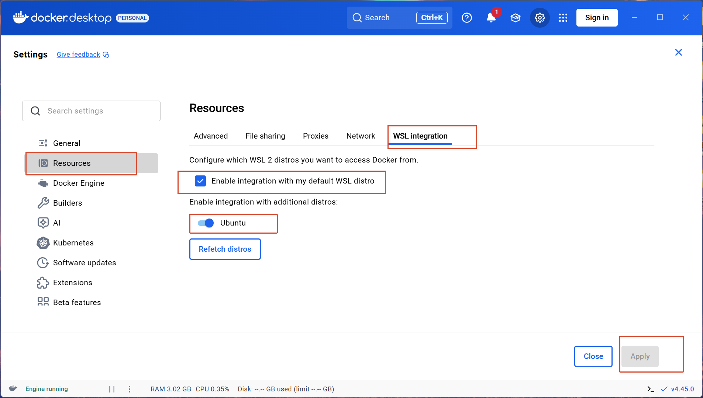
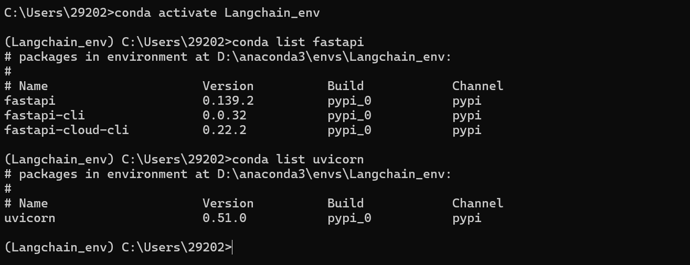
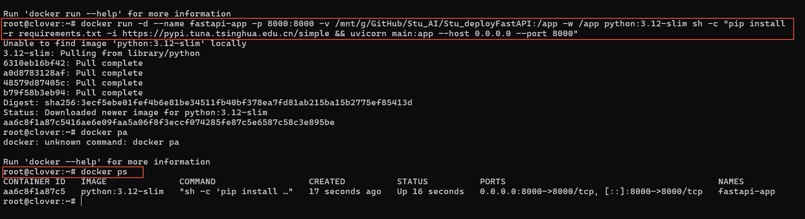
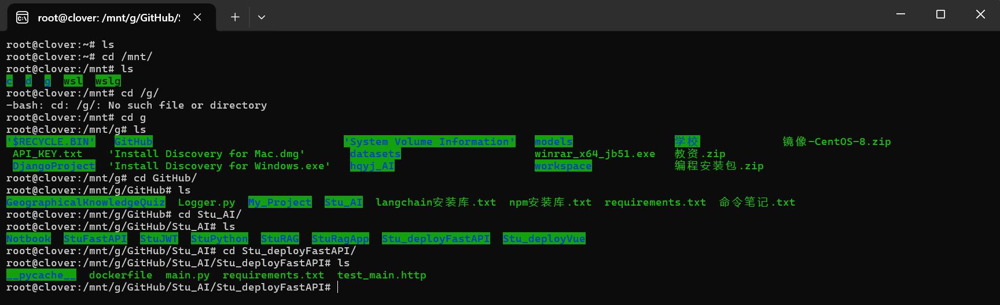
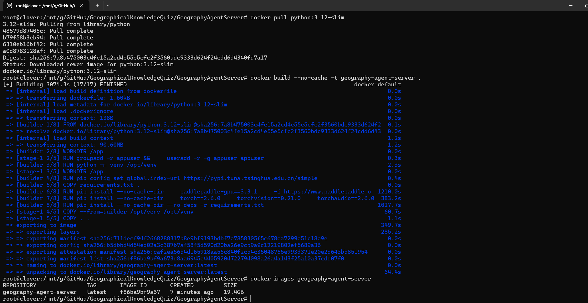
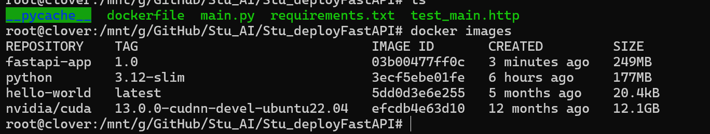
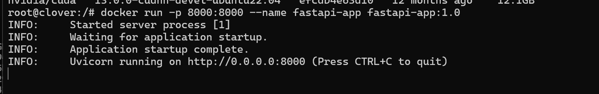

# 一、安装Docker Desktop

### 1. 安装

1. 前往 [Docker Hub](https://www.docker.com/products/docker-desktop/) 下载 Docker Desktop for Windows
2. 双击安装包，按提示完成安装，安装时记得勾选：

    - Enable WSL2
    - 安装默认的 Ubuntu 子系统（Docker 会帮你自动装好），也可以自己提前用微软商店安装好
3. 安装完成后重启电脑
4. 启动 Docker Desktop，等待右下角鲸鱼图标变绿（不一定）

### 2. 验证

```
# 查看 Docker 版本
docker --version

# 查看详细信息
docker info
```

### 3. Docker Desktop 界面简介

- **Containers**：管理运行中的容器，查看日志、终端
- **Images**：查看本地镜像，可拉取、删除
- **Volumes**：管理数据卷

### 4. 配置

安装了Ubuntu之后，去 docker-desktop 设置一下，就可以用 linux 系统命令方式来操作 docker



在 Ubuntu 操作 docker，需要 root 身份：`sudo -i`

测试：`docker images`

# 二、常用命令

掌握常用的：拉取镜像、查看镜像、删除镜像、运行容器、停止容器、删除容器等

## （一）镜像命令

```bash
# 搜索镜像
docker search nginx

# 拉取镜像
docker pull nginx              # 拉取最新版
docker pull nginx:1.25         # 拉取指定版本
docker pull python:3.11-slim   # 拉取 slim 版本（体积更小）

# 查看本地镜像
docker images                  # 列出所有镜像
docker images -a               # 包括中间层镜像

# 查看镜像详细信息
docker inspect nginx:latest

# 查看镜像历史
docker history nginx:latest

# 删除镜像
docker rmi nginx:latest        # 删除指定镜像
docker rmi <镜像ID>            # 按 ID 删除
docker image prune             # 删除所有未使用的镜像
docker image prune -a          # 删除所有未被容器使用的镜像

# 导出/导入镜像
docker save -o nginx.tar nginx:latest        # 导出为 tar 文件
docker load -i nginx.tar                     # 从 tar 文件导入

# 给镜像打标签
docker tag nginx:latest myrepo/nginx:v1.0
```

## （二）容器命令

```
# ===== 运行容器 =====
docker run nginx:latest                        # 前台运行（Ctrl+C 停止）
docker run -d nginx:latest                     # 后台运行
docker run -d --name my-nginx nginx:latest     # 指定容器名称
docker run -d -p 8080:80 nginx:latest          # 端口映射（宿主机:容器）
docker run -d -p 8080:80 -v /host/path:/container/path nginx:latest  # 挂载数据卷
docker run -d -e "DB_HOST=localhost" nginx     # 设置环境变量
docker run -d --restart=always nginx:latest    # 设置重启策略
docker run -d --network mynet nginx:latest     # 指定网络

# 完整示例
docker run -d \
  --name my-web \
  -p 3000:3000 \
  -v $(pwd)/logs:/app/logs \
  -e NODE_ENV=production \
  --restart=unless-stopped \
  my-app:latest

# ===== 查看容器 =====
docker ps                      # 查看运行中的容器
docker ps -a                   # 查看所有容器（包括已停止的）
docker ps -q                   # 只显示容器 ID
docker ps -a --format "table {{.ID}}\t{{.Names}}\t{{.Status}}"  # 自定义输出格式

# ===== 容器生命周期 =====
docker stop my-nginx           # 停止容器（优雅停止）
docker kill my-nginx           # 强制停止容器
docker start my-nginx          # 启动已停止的容器
docker restart my-nginx        # 重启容器
docker rm my-nginx             # 删除已停止的容器
docker rm -f my-znginx          # 强制删除容器（即使正在运行）
docker container prune         # 删除所有已停止的容器

# ===== 进入容器 =====
docker exec -it my-nginx bash          # 进入容器（bash）
docker exec -it my-nginx sh            # 进入容器（sh，Alpine 系统用）
docker exec my-nginx ls /app           # 在容器中执行命令

# ===== 查看日志 =====
docker logs my-nginx                   # 查看日志
docker logs -f my-nginx                # 实时跟踪日志（Ctrl+C 退出）
docker logs --tail 50 my-nginx         # 查看最后 50 行
docker logs --since 10m my-nginx       # 查看最近 10 分钟的日志

# ===== 文件拷贝 =====
docker cp my-nginx:/app/config.json .            # 从容器复制到宿主机
docker cp ./config.json my-nginx:/app/config.json # 从宿主机复制到容器
```

## （三）网络命令

```
# 查看网络列表
docker network ls

# 创建网络
docker network create my-network

# 查看网络详情
docker network inspect my-network

# 连接容器到网络
docker network connect my-network my-container

# 断开容器与网络的连接
docker network disconnect my-network my-container

# 删除网络
docker network rm my-network

# 删除所有未使用的网络
docker network prune
```

## （四）数据卷命令

```bash
# 查看卷列表
docker volume ls

# 创建卷
docker volume create my-data

# 查看卷详情（包括挂载点）
docker volume inspect my-data

# 删除卷
docker volume rm my-data

# 删除所有未使用的卷
docker volume prune
```

## （五）系统命令

```bash
# 查看 Docker 磁盘使用情况
docker system df

# 一键清理（删除所有未使用的镜像、容器、网络、卷）
docker system prune -a --volumes

# 查看 Docker 事件
docker events

# 查看资源使用统计
docker stats                    # 所有容器的实时资源使用
docker stats my-nginx           # 指定容器的实时资源使用
```

# 三、部署服务器项目

命令中可以加入 --name 指定容器名称

## （一）项目结构示例

```
my-fastapi-app/
├── app/
│   ├── __init__.py
│   ├── main.py          # FastAPI 入口
│   ├── routers/         # 路由模块
│   ├── models/          # 数据模型
│   └── services/        # 业务逻辑
├── requirements.txt     # Python 依赖
├── Dockerfile           # Docker 镜像构建文件
├── docker-compose.yml   # Docker Compose 编排
└── .dockerignore        # 忽略文件
```

安装：

```
pip install fastapi "uvicorn[standard]" -i https://repo.huaweicloud.com/repository/pypi/simple/
```

查看启动项目需要的环境：



将项目环境写入到文件`requirements.txt`

```
fastapi==0.139.2
uvicorn[standard]==0.51.0
```

## （二）拉取镜像

要连接外网

### 1. 手动输入命令

```
docker run -d \
  --name fastapi-app \
  -p 8000:8000 \
  -v /mnt/g/GitHub/GeographicalKnowledgeQuiz/GeographyAgentServer:/app \
  -w /app \
  python:3.12-slim \
  sh -c "pip install -r requirements.txt -i https://pypi.tuna.tsinghua.edu.cn/simple && uvicorn main:app --host 0.0.0.0 --port 8000"
```



### 2. 脚本自动运行

利用AI生成脚本 -- 地理知识问答系统运行脚本

```
# ============ 构建阶段 ============
FROM python:3.12-slim AS builder

WORKDIR /app

# 创建虚拟环境
RUN python -m venv /opt/venv

# 使用虚拟环境中的 pip
ENV PATH="/opt/venv/bin:$PATH"

# 设置普通 Python 包国内镜像
RUN pip config set global.index-url https://pypi.tuna.tsinghua.edu.cn/simple

# 先复制依赖文件，利用 Docker 缓存层
COPY requirements.txt .

# 安装 PaddlePaddle GPU（CUDA 12.6）
RUN pip install --no-cache-dir \
    paddlepaddle-gpu==3.3.1 \
    -i https://www.paddlepaddle.org.cn/packages/stable/cu126/

# 安装 PyTorch GPU（CUDA 12.6）
RUN pip install --no-cache-dir \
    torch==2.6.0 \
    torchvision==0.21.0 \
    torchaudio==2.6.0 \
    --index-url https://download.pytorch.org/whl/cu126/

# 安装其他依赖
RUN pip install --no-cache-dir --no-deps -r requirements.txt


# ============ 运行阶段 ============
FROM python:3.12-slim

# 创建非 root 用户
RUN groupadd -r appuser && \
    useradd -r -g appuser appuser

WORKDIR /app

# 从构建阶段复制虚拟环境
COPY --from=builder /opt/venv /opt/venv

# 复制应用代码
COPY . .

# 使用虚拟环境
ENV PATH="/opt/venv/bin:$PATH"

# 切换到非 root 用户
USER appuser

# 暴露端口
EXPOSE 8000

# 健康检查
HEALTHCHECK --interval=30s --timeout=3s --retries=3 \
    CMD python -c "import urllib.request; urllib.request.urlopen('http://localhost:8000/health')" || exit 1

# 启动 FastAPI
CMD ["uvicorn", "main:app", "--host", "0.0.0.0", "--port", "8000"]
```

运行脚本前，先进入项目所在目录（要有环境文件和运行脚本）



构建镜像前先配置`.dockerignore`文件，放入不许需要构建的文件/文件夹

```
processed_data/
scripts/
*.md
test_main.http
*.pyc
wheels/

# 环境变量/敏感配置
.env

# Git
.git
.gitignore

# Python 缓存
__pycache__
*.py[cod]

# Python 虚拟环境
.venv
venv
env

# Docker Compose
compose.yaml
docker-compose.yml

# 本地开发文件
.vscode
.idea

# 日志
*.log

# 测试/临时文件
.pytest_cache
.mypy_cache
```

构建镜像，可以指定版本（:1.0 .）

```
docker build -t geography-agent-server .
```



构建完成后查看镜像

```
docker images
```



非后台运行命令方式：

```
docker run -p 8000:8000 --name fastapi-app fastapi-app:1.0
```



启动容器实际执行命令

```
docker run --rm --gpus all \
  -p 8000:8000 \
  --name geography-agent-server \
  geography-agent-server
```

### 3. Neo4j连接报错

```
ValueError: Could not connect to Neo4j database. Please ensure that the url is correct
```

修改`Neo4jUtil.py`文件为：

```python
import os
from langchain_neo4j import Neo4jGraph


def get_neo4j_conn():
    return Neo4jGraph(
        url=os.getenv("NEO4J_URI", "bolt://127.0.0.1:7687"),
        username=os.getenv("NEO4J_USERNAME", "neo4j"),
        password=os.getenv("NEO4J_PASSWORD", "12345678"),
        database=os.getenv("NEO4J_DATABASE", "neo4j")
    )


if __name__ == '__main__':
    conn = get_neo4j_conn()
    print(f"连接成功：{conn}")
```

在`main.py`文件中添加配置：

```main
# neo4j 相关配置
NEO4J_URI=bolt://host.docker.internal:7687
NEO4J_USERNAME=neo4j
NEO4J_PASSWORD=12345678
NEO4J_DATABASE=neo4j
```

## （三）启动容器

```
docker run --rm --gpus all --add-host=host.docker.internal:host-gateway --env-file .env -p 8000:8000 --name geography-agent-server geography-agent-server
```

### 1. LLM配置

Docker中无法读取本地的环境变量，因此将DASHSCOPE_API_KEY=你的Key放入文件`main.py`中

### 2. 修改localhost

文件`.env`中（注意备份修改前内容，后面有用），原本为`localhost`，可是在在 Docker 容器里`localhost`代表容器自己，因此：

所有`localhost`都需要更换为：`host.docker.internal`

### 3. 环境格式报错

```
ValueError: invalid literal for int() with base 10: '"3306"'
```

`python-dotenv` 读取会直接原样读取，不会去掉引号（应该是），因此将文件`.env`中的引号和有配置信息的行的注释全部去掉，类似于：

```
# 数据库相关配置
MYSQL_HOST=host.docker.internal		【后面不能有注释】
MYSQL_PORT=3306
MYSQL_USER=root
MYSQL_PASSWORD=123456
MYSQL_DATABASE=geography
MYSQL_CHARSET=utf8mb4
```

### 4. 修改Windows路径

docker中无法正确识别到Windows路径，因此要更改为容器中的路径

```
# 向量化相关配置
 # 向量化模型路径
EMBEDDING_MODEL_PATH=/models/paraphrase-multilingual-MiniLM-L12-v2
 # chromadb 向量数据库路径
CHROMADB_PATH=/app/geo_chromadb

# 重排序
RERANKER_MODEL_PATH=/models/bge-reranker-large


```

### 5. 创建`compose.yaml`

因为文件`.env`不方便上传到镜像，因此创建启动配置文件`compose.yaml`里面放入启动容器需要的相关配置

```
services:
  geography-agent-server:
    image: geography-agent-server:latest
    container_name: geography-agent-server

    ports:
      - "8000:8000"

    env_file:
      - .env

    volumes:
      - /mnt/g/models:/models

    extra_hosts:
      - "host.docker.internal:host-gateway"

    gpus: all
```

### 6. 启动容器

因为现在有`compose.yaml`文件，所以以后不能在 Docker Desktop 的 Images 页面直接启动这个镜像（创建容器），否则无法正确识别环境变量，而是使用命令：（后台运行：-d）

```
docker compose up -d
```

### 7. 本地和docker都能运行

创建文件`.env.local`为本地运行环境（放入改之前的.env中的内容）

修改`main.py`文件，在最前面添加

```
import os
from dotenv import load_dotenv

# 本地 Windows / PyCharm 环境加载 .env.local
# Docker 环境由 docker compose 注入 .env，因此不需要加载文件
if os.getenv("DOCKER_ENV") != "true":
    load_dotenv(".env.local")
```

删除其余所有文件中的

```
from dotenv import load_dotenv
load_dotenv()
```

在文件`compose.yaml`中给容器加一个标记

```
environment:
  DOCKER_ENV: "true"
```

