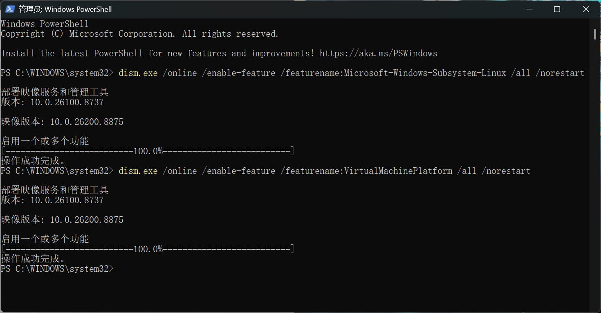
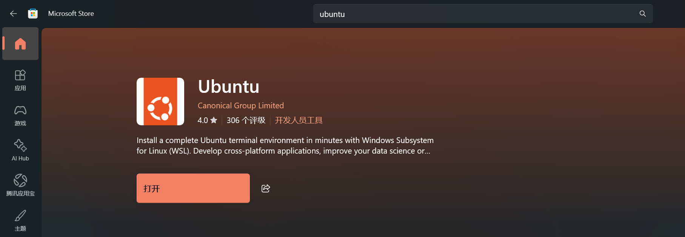
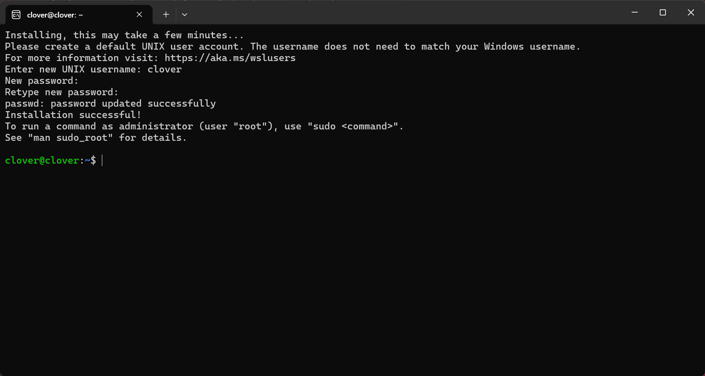
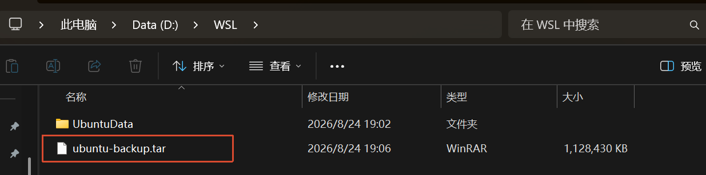
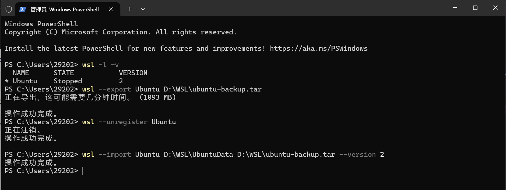
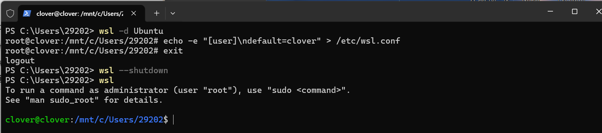
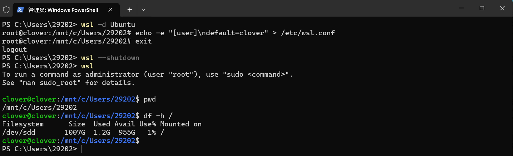

### 环境配置

1. 提前在D盘创建文件夹 D:\WSL（用于存放Ubuntu镜像，迁移非系统盘核心目录）
2. 开启Windows必备虚拟化功能

```
dism.exe /online /enable-feature /featurename:Microsoft-Windows-Subsystem-Linux /all /norestart
dism.exe /online /enable-feature /featurename:VirtualMachinePlatform /all /norestart
```



3. 手动重启电脑
4. 更新WSL内核、设置默认版本

```
wsl --update
```

5. 更新完成后，设置系统默认WSL版本为2，避免自动适配旧版本

```
wsl --set-default-version 2
```

6. 查看可安装的Linux发行版

```
wsl --list --online
```

### 安装Ubuntu

7. 直接去微软商店安装Ubuntu



8. 打开Ubuntu，在黑色窗口输入用户名和密码（密码123456不会显示，直接回车即可）



9. 在该窗口输入exit，退出Linux环境

### 迁移到D盘

10. 把 C 盘里刚装好的 Ubuntu 打包成一个文件导出 (备份到 D 盘)

```
wsl --export Ubuntu D:\WSL\ubuntu-backup.tar
```



11. 把 C 盘里的那个 Ubuntu 实例彻底删掉（注销），释放 C 盘空间

```
wsl --unregister Ubuntu
```

12. 利用刚才的备份包，在 D 盘的 `UbuntuData` 文件夹里重新生成 Ubuntu，导入 (在 D 盘重建)

```
wsl --import Ubuntu D:\WSL\UbuntuData D:\WSL\ubuntu-backup.tar --version 2
```



13. 启动新的 Ubuntu (在 PowerShell 里输)：

```
wsl -d Ubuntu
```

14. 修改配置，*告诉 WSL，下次启动默认登录 clover 用户*

```
echo -e "[user]\ndefault=clover" > /etc/wsl.conf
```

15. 退出：`exit`
16. 重启 WSL 服务 (回到 PowerShell 输)

```
wsl --shutdown
```

### 验证

17. 在 PowerShell 里直接输入`wsl`



迁移成功

