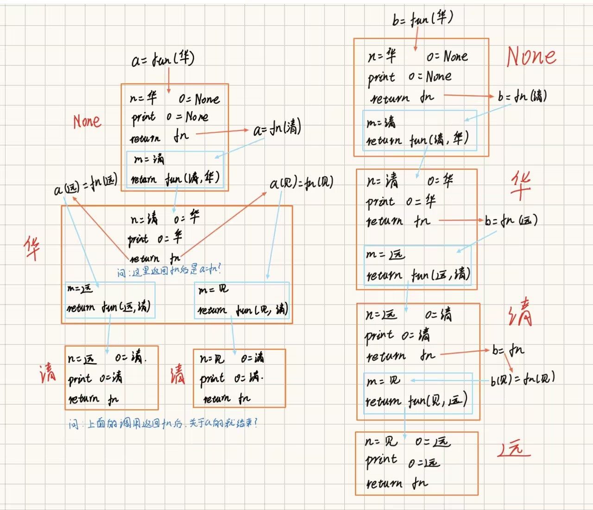

# 五、Python高级技巧

## （一）推导式

Python 推导式是一种独特的数据处理方式，可以从一个数据序列构建另一个新的数据序列的结构体。

Python 支持各种数据结构的推导式：

- 列表(list)推导式
- 字典(dict)推导式
- 集合(set)推导式
- 元组(tuple)推导式

### 1. 列表推导式

语法:
`[表达式 for 变量 in 序列]`
会创建一个列表 然后for循环都，每次循环把表达式的结果添加到列表中

`[表达式 for 变量 in 序列 if 条件]`
会创建一个列表 然后for循环，每次循环时当if条件判断为True时，都把表达式结果添加到列表中

`[表达式 for 变量1 in 容器1 for 变量2 in 容器2(可以是变量1)]`

`[out_exp_res for out_exp in input_list if condition]`

- out_exp_res：列表生成元素表达式，可以是有返回值的函数。
- for out_exp in input_list：迭代 input_list 将 out_exp 传入到 out_exp_res 表达式中。
- if condition：条件语句，可以过滤列表中不符合条件的值。

```python
x = [100 for el in range(5)]
print(x)

ages = [16, 18, 21, 13]
x = [el for el in ages if el >= 18]
print(x)
# 上述代码等价于：
ages = [16, 18, 21, 13]
x = []
for el in ages:
    if el >= 18:
        x.append(el)
print(x)
```

```python
print("\n========== 列表推导式 ==========")

# 基础用法:创建一个包含1-10平方的列表
squares = [x ** 2 for x in range(1, 11)]
print(f"1-10的平方: {squares}")
# 输出: [1, 4, 9, 16, 25, 36, 49, 64, 81, 100]

# 带条件的列表推导式:筛选偶数的平方
even_squares = [x ** 2 for x in range(1, 11) if x % 2 == 0]
print(f"偶数的平方: {even_squares}")
# 输出: [4, 16, 36, 64, 100]

# 字符串处理:将字符串列表转为大写
fruits = ['apple', 'banana', 'orange']
upper_fruits = [fruit.upper() for fruit in fruits]
print(f"转为大写: {upper_fruits}")
# 输出: ['APPLE', 'BANANA', 'ORANGE']

# 嵌套循环:生成所有组合
colors = ['红', '蓝', '绿']
sizes = ['大', '小']
combinations = [f"{color}{size}" for color in colors for size in sizes]
print(f"颜色大小组合: {combinations}")
# 输出: ['红大', '红小', '蓝大', '蓝小', '绿大', '绿小']

# 数据是嵌套容器
x = [("数学", 95), ("语文", 80), ("英语", 90), ("综合", 200)]
y = [j for i in x for j in i]
print('嵌套列表为：', y)

x = [{"name": "张三", "age": 18, "rank": [120, 119, 110]},
     {"name": "李四", "age": 19, "rank": [150, 139, 100]},
     {"name": "王五", "age": 20, "rank": [100, 126, 130]}]
y = [rank for person in x for rank in person["rank"]]
print(f"所有人的成绩: {y}")
y = [key for person in x for key in person]
print(f"所有键名: {y}")

# 推导式如果逻辑太复杂 就不写推导式 而是直接写for循环语句完成程序编写
y = [rank if person["age"] > 18 else person["name"] for person in x for rank in person["rank"]]
print(f"判断年龄大于18的: {y}")

# 思考：把上面的推导式改为正常的for循环语句
for person in x:
    for rank in person["rank"]:
        if person["age"] > 18:
            y.append(rank)
        else:
            y.append(person["name"])
print(f"判断年龄大于18的: {y}")


# 传统方式 vs 推导式对比
print("\n传统方式 vs 推导式:")
# 传统方式
numbers = []
for i in range(1, 6):
    numbers.append(i * 2)
print(f"传统方式: {numbers}")
# 推导式
numbers_new = [i * 2 for i in range(1, 6)]
print(f"推导式: {numbers_new}")
```

### 2. 字典推导式

字典推导基本格式：

`{ key_expr: value_expr for value in collection }`

`{ key_expr: value_expr for value in collection if condition }`

==注==：（所有推导式都适用）

**`if` 在 `for` 后面**：作为**过滤条件**，满足则保留元素，不满足则丢弃（不需要 `else`）

**`if` 在 `for` 前面**（即冒号后面的值表达式）：作为**三元条件表达式**，必须带 `else`，含义是：

- 条件满足 → 返回 `if` 前面的值
- 条件不满足 → 返回 `else` 后面的值

```python
print("\n========== 字典推导式 ==========")

# 基础用法:创建键值对字典
square_dict = {x: x ** 2 for x in range(1, 6)}
print(f"数字-平方字典: {square_dict}")
# 输出: {1: 1, 2: 4, 3: 9, 4: 16, 5: 25}

# enumerate()全局函数,获取序列的索引和元素
x = [100, 200, 300, 400, 500]
x = "hello"
res = enumerate(x)  # 会得到一个元组（下标，元素）
for el in res:
    print(el)

# 字符串处理:创建字符位置字典
text = "hello"
char_position = {char: index for index, char in enumerate(text)}
print(f"字符位置字典: {char_position}")
# 输出: {'h': 0, 'e': 1, 'l': 3, 'o': 4}

# 字典键值交换
original_dict = {'a': 1, 'b': 2, 'c': 3}
swapped_dict = {v: k for k, v in original_dict.items()}
print(f"键值交换后: {swapped_dict}")
# 输出: {1: 'a', 2: 'b', 3: 'c'}

# 筛选满足条件的键值对
scores = {'张三': 85, '李四': 92, '王五': 78, '赵六': 95}
high_scores = {name: score for name, score in scores.items() if score >= 90}
print(f"高分学生: {high_scores}")
# 输出: {'李四': 92, '赵六': 95}
```

`enumerate()`：全局函数，获取序列的索引和元素

```python
x = [100, 200, 300, 400, 500]
x = "hello"
res = enumerate(x)  # 会得到一个元组（下标，元素）
for el in res:
    print(el)
```

### 3. 集合推导式

集合推导式基本格式：

`{ expression for item in Sequence }`

`{ expression for item in Sequence if conditional }`

```python
print("\n========== 集合推导式 ==========")

# 基础用法:创建集合
numbers = [1, 2, 2, 3, 3, 3, 4, 4, 4, 4]
unique_squares = {x ** 2 for x in numbers}
print(f"去重后的平方: {unique_squares}")
# 输出: {16, 1, 4, 9}

# 字符串去重
text = "programming"
unique_chars = {char for char in text}
print(f"唯一字符: {unique_chars}")
# 输出: {'a', 'c', 'g', 'i', 'm', 'n', 'o', 'p', 'r'}

# 带条件的集合推导式
even_numbers = {x for x in range(1, 21) if x % 2 == 0}
print(f"1-20中的偶数: {even_numbers}")
# 输出: {2, 4, 6, 8, 10, 12, 14, 16, 18, 20}
```

### 4. 元组推导式

元组推导式可以利用 range 区间、元组、列表、字典和集合等数据类型，快速生成一个满足指定需求的元组。

元组推导式和列表推导式的用法也完全相同，只是元组推导式是用 () 圆括号将各部分括起来，而列表推导式用的是中括号 []，另外==元组推导式返回的结果是一个生成器对象==。

元组推导式基本格式：

`(expression for item in Sequence )`

`(expression for item in Sequence if conditional )`

```python
#生成一个包含数字 1~9 的元组
a = (x for x in range(1,10))
print(a)#返回的是生成器对象
print(tuple(a))#使用 tuple() 函数，可以直接将生成器对象转换成元组
```

### 5. 生成器表达式

语法: `(表达式 for 变量 in 序列 if 条件)`

注意:使用圆括号,返回生成器对象,节省内存

```python
print("\n========== 生成器表达式 ==========")

# 基础用法
gen = (x ** 2 for x in range(1, 6))
print(f"生成器对象: {gen}")  # 生成器对象可迭代
print(f"生成器类型: {type(gen)}")	# generator -- RAG的G

# 遍历生成器
print("生成器的值:")
for num in gen:
    print(num, end=' ')
print()  # 输出: 1 4 9 16 25

# # 使用next()获取值
# gen2 = (x * 2 for x in range(1, 6))
# print(f"第1个值: {next(gen2)}")  # 2
# print(f"第2个值: {next(gen2)}")  # 4

x = [10, 20, 30, 40]
res = sum(x)	# sum中传入的数据要可迭代，可for循环
print(res)

# 生成器表达式用于函数参数
total = sum(x ** 2 for x in range(1, 11))
print(f"1-10平方和: {total}")  # 385

# 内存对比
print("\n内存对比:")
import sys

# 列表推导式:所有数据存储在内存中
list_comp = [x ** 2 for x in range(1000000)]
list_size = sys.getsizeof(list_comp)
print(f"列表推导式占用内存: {list_size / 1024:.2f} KB")

# 生成器表达式:按需生成,不占用大量内存
gen_comp = (x ** 2 for x in range(1000000))
gen_size = sys.getsizeof(gen_comp)
print(f"生成器表达式占用内存: {gen_size} 字节")
```

### 6. 综合练习

```python
print("\n========== 综合练习 ==========")

# 练习1:找出列表中长度大于3的单词,并转为大写
words = ['cat', 'dog', 'elephant', 'fish', 'giraffe']
long_words = [word.upper() for word in words if len(word) > 3]
print(f"长度大于3的单词(大写): {long_words}")

# 练习2:创建一个字典,键是1-5的数字,值是该数字是否为偶数
even_check = {x: (x % 2 == 0) for x in range(1, 6)}
print(f"数字是否为偶数: {even_check}")

# 练习3:找出两个列表中共有的元素
list1 = [1, 2, 3, 4, 5]
list2 = [4, 5, 6, 7, 8]
common = {x for x in list1 if x in list2}
print(f"共同元素: {common}")

# 练习4:将列表中所有数字字符串转为整数
str_numbers = ['1', '2', '3', '4', '5']
int_numbers = [int(num) for num in str_numbers]
print(f"转为整数: {int_numbers}")

# 练习5:创建一个分数等级字典
scores_dict = {90: 'A', 80: 'B', 70: 'C', 60: 'D', 0: 'F'}
grades = {score: grade for score, grade in scores_dict.items() if score >= 60}
print(f"及格等级: {grades}")

# ==================== 注意事项 ====================
print("\n========== 注意事项 ==========")

print("""
1. 推导式应该简洁易读,过于复杂的逻辑建议使用传统循环
2. 生成器表达式适合大数据量处理,节省内存
3. 集合和字典推导式会自动去重
4. 推导式中的if条件是可选的
5. 嵌套推导式慎用,影响可读性
""")
```

## （二）函数

在python的工程中
最常用的语法：变量（字符串 元组 数字） 函数 类 对象 模块化

函数（重点、难点）
就是一个代码块，给这个代码块取一个名字，以后使用这个名字就相当于把这一大坨代码运行一遍

> def 函数名(变量1，变量2，...... >= 0个变量)：
> 代码1 # 前面必须有缩进 同if for while
> 代码2
> ... 很多代码
>
> 函数名(数据1，数据2，...... >= 0个数据)
>
> 调用函数：这个代码运行后 才会把函数中的代码运行一遍
>
> 调用函数（非常重要）：
> 这个代码运行后 才会把函数中的代码运行一遍 而且相互独立
> 函数调用一次，就会重新运行一次
> 函数不调用 函数中的代码就不会执行

### 1. 函数的定义

定义一个函数的规则：

- 函数代码块以 **def** 关键词开头，后接函数标识符名称和圆括号 **()**。
- 任何传入参数和自变量必须放在圆括号中间，圆括号之间可以用于定义参数。
- 函数的第一行语句可以选择性地使用文档字符串—用于存放函数说明。
- 函数内容以冒号 : 起始，并且缩进。
- **return [表达式]** 结束函数，选择性地返回一个值给调用方，不带表达式的 return 相当于返回 None。

```python
# 函数
def fn():
    print("控制台打印，说明函数被调用了 不调用是不会执行这行代码的")
    a = 10
    b = 20
    c = a + b
    print(c)
fn()
fn()
```

### 2. 参数的调用

参数是函数的输入，它们可以是可选的或必需的。

Python函数支持以下类型的参数：

- 必需参数：这些参数在函数调用时必须提供，没有默认值。
- 默认参数：这些参数有默认值，如果调用时不提供值，则使用默认值。
- 可变参数：函数可以接受不定数量的参数。可以通过==*args==（接受任意数量的位置参数）和==**kwargs==（接受任意数量的关键字参数）来实现。
- 关键字参数：这些参数在调用函数时使用关键字来传递。

参数的参数总结：

1. 位置参数：必须写在关键字参数的前面
2. 关键字参数：必须写在\*修饰符参数的前面
3. \*修饰符参数：必须写在\*\*修饰符参数的前面
4. \**修饰符参数：不能写在任何参数后面，必须写在函数定义的最后一个参数
5. *占位的参数：调用时后面的参数必须传入关键字
6. /占位的参数：调用时后面的参数必须传入位置参数
7. 位置参数和关键字参数：调用时不允许把传入的数据重复给形参变量
8. 函数的默认值参数：必须放在没有默认值参数的后面，调用时可以不传入参数，使用默认值
9. 函数的参数不允许传多或传少
10. 函数不调用就不会被执行 每调用一次重新执行一次

```python
def fn(a,b):
	c = 10
	print(f"使用函数内部的3个变量：局部变量c:{c} 形参变量a:{a} 形参变量b:{b}")
fn(100,200)	# 按照传入时的顺序把数据赋值给形参变量（位置参数）
fn(b=90,a=100)	# 按照变量名赋值给形参变量（关键字参数），可以不用按照顺序传入参数
fn(10,b=90)	# 10没有指定变量，就会按照顺序给第一额参数变量
fn(b=90,10)	# 函数调用时形参变量不能多次赋值，但是执行时可以

# 函数调用时：位置参数（100）必须放在关键字参数（b=100）前面
```

#### 必需参数

必需参数须以正确的顺序传入函数。调用时的数量必须和声明时的一样。

```python
def fn1(x):
    print(x*2)
fn1(10)#20

def fn2(x,y):
    print(x*2,y)
fn2(10,20)#20 20

def fn3(x,y):
    print(x+y)
fn3(10)#报错

def fn4(x):
    print(x*3)
fn4(10,20)#报错
```

#### 形参和实参

- 函数调用时形参变量不能多次赋值，但是执行时可以
- 函数调用时，形参变量必须有值（1.传入 2.默认值）
- 传入的数据不允许超过形参变量的数量
- 调用函数传入的数据叫实际传入的参数,称之为实参

```python
def fn(a,b):
	print(a,b)
# fn()	# 报错
# fn(10)	# 报错
# fn(10,20,30)	# 报错
```

#### 关键字参数和位置参数

关键字参数和函数调用关系紧密，函数调用使用关键字参数来确定传入的参数值。

使用关键字参数允许函数调用时参数的顺序与声明时不一致，因为 Python 解释器能够用参数名匹配参数值。

- ==关键字参数 必须 跟在所有位置参数的后面==

```python
def fn(a, b):	# 形参
    c = 10
    print(f"使用函数内部的3个变量：局部变量c：{c} 形参变量a：{a} 形参变量b：{b}")
fn(100, 200)  # 按照传入时的顺序把（实参）数据赋值给形参变量
fn(b=90, a=80)  # 按照变量名赋值给形参变量(关键字参数)，可以不要按照顺序传入参数
fn(a=10, b=90)
fn(10, b=20)  # 10没有指定变量 就会按照顺序给第一个参数变量

def fn(a, b, c):
    print(a, b, c)
# fn(b = 10,10)
# 关键字参数 必须 跟在所有位置参数的后面


# fn(10,20,b = 30)    # 函调用时形参变量不能多次赋值，但是执行时可以(eError: fn() got multiple values for argument 'b')
fn(10, 20, c=30)
def fn(a, b):
    print(a, b)
# fn()    # 报错 -- 函数调用时 形参变量必须有值（1.传入 2.默认值）
# fn(10)  # 报错
# fn(10, 20, 30)  # 报错 传入的数据不允许超过形参变量的数量
```

#### 案例

```python
# 面试题
# 定义的时候 可以给形参变量一个默认值
# 调用函数时 可以不传入参数 使用默认值
# 调用函数时 可以传入参数 使用传入的值
def fn(a, b=10):
    print(a, b)
fn(10, 20)
fn(10)  # 定义的时候可以给形参一个默认值
```

#### 默认值参数

调用函数时，如果没有传递参数，则会使用默认参数, 默认参数必须写在必须参数后面。

- 必须放在没有默认参数的后面

```python
# 默认值参数 必须放在没有默认参数的后面
# def fn(a=10,b):
#     print(a,b)
# fn(,20)

# 关于默认参数的案例
def load_s(x, h=100, w=100):
    c = x * h * w
    print(c)
load_s(100)
load_s(100, 200)
load_s(100, w=200)
load_s(100, h=200)
load_s(100, 200, 300)
```

#### 强制位置参数(*、/)

- ==*修饰符后面的参数必须传入关键字参数==

```python
def fn(a, b, *, c):
    print(a, b, c)
# fn(10,20,30)    # 报错：*修饰符后面的参数必须传入关键字参数
fn(10, 20, c=30)
fn(a=10, b=20, c=30)
fn(10, b=20, c=30)
fn(10, c=20, b=30)
# 总结 -- 这样设计有个好处，就是这个函数如果经常被程序员使用，我们的位置参数是可以写名字可以不写
#        但是*后面的参数必须写名字 这样能保证某一天，被使用时明确知道这是干嘛


def get_game_person(name, time, *, money=100):
    print(f"游戏玩家：{name} 年龄：{time} 金币：{money}")
# 程序员的某段程序调用1
get_game_person("clover", 5)
# 程序员的某段程序调用2
get_game_person("clo", 9)
# 程序员的某段程序调用3
get_game_person("ver", 3)
# 程序员的某段程序调用4
get_game_person(name="clovers", time=15)
# 程序员的某段程序调用5
get_game_person("cr", 2, money=200)
# def get_game_person(name,time,*,money=100,sex="1"):
#    print(name,time,money,sex)
# get_game_person(name="jack",time=1,sex="2")
```

- ==/修饰符前面的参数必须传入位置参数，不能以关键字参数形式传入==

```python
def fn(a, b, /, c):
    print(a, b, c)
fn(10, 20, 30)
fn(10, 20, c=30)
# fn(a=10, b=20, c=30)    # 报错：/修饰符前面的参数必须传入位置参数，不能以关键字参数形式传入
```

在以下的例子中，形参 a 和 b 必须使用指定位置参数，c 或 d 可以是位置形参或关键字形参，而 e 和 f 要求为关键字形参:

```python
def f(a, b, /, c, d, *, e, f):
    print(a, b, c, d, e, f)
```

以下使用方法是正确的:

```python
f(10, 20, 30, d=40, e=50, f=60)#正确的用法
f(10, b=20, c=30, d=40, e=50, f=60)   # b 不能使用关键字参数的形式
f(10, 20, 30, 40, 50, f=60)           # e 必须使用关键字参数的形式
```

#### 不定长参数

==加了星号 * 的参数会以元组(tuple)的形式导入，存放所有未命名的变量参数==。

**如果在函数调用时没有传入不定长参数，它就是一个空元组**。我们也可以不向函数传递未命名的变量

如果传参的时候也是元组，可以使用***进行解包**

==加了**两个星号 **** **的参数**会以字典的形式导入==(了解)。

声明函数时，参数中星号 * 可以单独出现(了解)。

如果**单独出现星号 ***，则星号 * 后的参数必须用关键字传入

```python
def fn(a, b, *c):
    print(a, b, c)
fn(10, 20, 30, 40)  # 剩余的所有位置参数都存进c这个元组中
fn(10, 20, 30, 40, 50, 60, 70)
# print(10,20,30,40)
x = (10, 20, 30, 40)
fn(10, 20, x[0], x[1], x[2], x[3])
fn(10, 20, *x)
# fn(a=10,b=20,30,40)   # 报错：违背了函数的调用规则--位置参数必须写在关键字参数的前面
# fn(30,40,a=10,b=20)   # 报错：违背了函数的调用规则--调用时不允许把传入的数据重复给形参变量


def fn(a, b, **c):
    print(a, b, c)
    print(type(c))	# dict
fn(10, 20)
# fn(10,20,30)  # 报错：函数只有a,b两个位置参数,c是一个字典 传入的所有剩余的关键字参数都存进c这个字典中
fn(10, 20, c=30)  # c是**修饰的参数 c=30 相当于 c = {"c":30}
# fn(10,20,a=30)  # 报错：违背了函数的调用规则--调用时不允许把传入的数据重复给形参变量
# fn(10,20,d=30,e=40)
fn(a=10, b=20, d=30, e=40)  # a,b是关键字传参，函数内部有形参变量接受 d,e也是关键字传参，函数内部没有形参变量接受 所以是剩余的关键字参数 会存入c这个字典中


def fn(*arge, **kwargs):
    print(arge, kwargs)
fn()
fn(10, 20, 30, 40)
fn(a=10, b=20)
fn(1, 2, a=10, b=20)


# def fn(**kwargs,*args):
#     print(args,kwargs)	# 报错

def fn(a, b, *arge, **kwargs):
    print(a, b, arge, kwargs)
fn(10, 20, 30, d=40)
fn(10, b=20, d=100)
```

#### 可变与不可变

**可更改(mutable)与不可更改(immutable)对象**

在 python 中，`strings`, `tuples`, 和 `numbers` 是不可更改的对象，而 `list`,`dict` 等则是可以修改的对象。

- **不可变类型：**变量赋值 **a=5** 后再赋值 **a=10**，这里实际是新生成一个 int 值对象 10，再让 a 指向它，而 5 被丢弃，不是改变 a 的值，相当于新生成了 a。
- **可变类型：**变量赋值 **la=[1,2,3,4]** 后再赋值 **la[2]=5** 则是将 list la 的第三个元素值更改，本身la没有动，只是其内部的一部分值被修改了。

python 函数的参数传递：

- **不可变类型：**值传递:  如整数、字符串、元组。如 fun(a)，传递的只是 a 的值，没有影响 a 对象本身。如果在 fun(a) 内部修改 a 的值，则是新生成一个 a 的对象。
- **可变类型：**引用传递:  如 列表，字典。如 fun(la)，则是将 la 真正的传过去，修改后 fun 外部的 la 也会受影响

python 中一切都是对象(后面会讲)，严格意义我们不能说值传递还是引用传递，我们应该说传不可变对象和传可变对象。

**传不可变对象实例**

通过内置的 **id()** 函数来查看内存地址变化：

```python
def change(a):
   print(id(a))
a=10
print(id(a))#1428793408
a=1
print(id(a))#1428793264
change(a)#1428793264
#总结:可以看见在调用函数前后，形参和实参指向的是同一个对象（对象 id 相同），在函数内部修改形参后，形参指向的是不同的id。
```

**传可变对象实例**

可变对象在函数里修改了参数，那么在调用这个函数的函数里，原始的参数也被改变了。

```python
def changeme( mylist ):
   mylist.append(40)
   print (mylist)

mylist = [10,20,30]
changeme(mylist)#[10, 20, 30, 40]
print (mylist)#[10, 20, 30, 40]
#总结:传入函数的和在末尾添加新内容的对象用的是同一个引用
```

### 3. 函数的返回值

函数内部无论怎么设计，调用结束后一定会有且只有一个结果

函数可以使用`return`语句来返回一个或多个值。

如果没有明确的`return`语句，函数将默认返回`None`。

```python
# def fn():
#     x = 10
#     a = 20
# y = fn()
# print(y)

# 函数内部的return运行时会把函数的所有程序停止 并让函数产生调用结果 结果就是return后面的数据 没写就是None
def fn():
    x = 10
    print(x)
    return
    a = 100
    print(a)
    return
y = fn()
print(y)

#返回一个值
def fn():
    for i in range(10):
        if i == 5:
            return i
        else:
            return 5
        print(6666)
y = fn()
print(y)

#返回多个值
def fn3(x):
   return x*x,x%3
re3=fn3(100)
print(re3)#(10000, 1)
x,y=fn3(100)
print(x,y)#10000 1
```

#### yeild关键字（函数内部）

**函数 `return` 多个值时，用逗号分隔，Python 自动打包成元组返回**

```python
# 函数内部yeild关键字 会让函数产生生成器对象数据(后面讲)

def fn():
    a = 3
    b = 4
    return (a ** 2 + b ** 2) ** 0.5, a * b / 2
y = fn()
print(y)  # 函数内部无论怎么设计，调用结束后一定会有一个结果
d, s = fn()
print(d, s)
```

### 4. 匿名函数 - lamda函数

**函数定义时没有名字时使用**。

在Python中，匿名函数通常使用`lambda`关键字来创建。匿名函数也被称为lambda函数，它是一种简单的、一行的函数，常用于临时需要一个小函数的地方。匿名函数的语法如下：

**lambda arguments: expression**

==冒号前面是形参的变量名，冒号后面是函数内部要执行的代码，代码结果为函数返回值==

- `lambda`是关键字，表示你正在定义一个匿名函数。
- `arguments`是函数的参数，可以有零个或多个参数，参数之间用逗号分隔。
- `expression`是函数的返回值，通常是一个表达式，匿名函数会计算这个表达式并返回结果。

```python
# 匿名函数（lamda函数）
def fn():
    print(100)
x = fn
x()
print(type(x))  # <class 'function'>

y = lambda x: x ** 2
print(y)  # <function <lambda> at 0x0000015993F0BC40>
z = y(10)
print(z)  # 100

fn = lambda x, y: x + y
print(fn(10, 20))
```

### 5. 函数的作用域（函数最难的）

在函数代码块内部可以定义变量，也可以定义函数

1.一个变量和一个函数在==哪些地方可以被访问使用==，那些地方就是他们起作用的代码区域，也叫作用域

2.函数内部写代码可以使用函数内部的变量和函数，也可以使用函数外部的变量和函数

3.函数外部写代码可以使用函数外部的变量和函数，不能使用函数内部的变量和函数

**什么是变量作用域**

 一个变量声明以后，在哪里能够被访问使用，就是这个变量"起作用"的区域：也就是这个变量的作用域

一般来说，变量的作用域，是在函数内部和外部的区域来体现，因此常常与函数有关

```python
# 函数的作用域（函数最难知识点）

# 案例1：
# def fn():
#     a = 10
# print(a)

# 案例2：
# def fn():
#     a = 10
# fn()
# print(a)

# 案例3：
a = 100
def fn():
    a = 10
fn()
print(a)	# 100

# 案例4：
a = 100
def fn():
    print(a)
fn()	# 100
fn()	# 100

# 案例5：
a = 100
def fn():
    print(a)
fn()
a = 200
fn()

# 案例6：
a = 100
def fn():
    a = 20
    print(a)
fn()
a = 200
fn()

# 案例7：
def fn():
    a = 10
    def fm():
        print(666)
fn()
# fm()    # 函数内部被定义的函数只能在函数内部被调用，否则报错：name 'fm' is not defined. Did you mean: 'fn'?

# 案例8：
def fn():
    a = 10
    def fm():
        print(666)
    fm()
fn()


# 案例9：
def fm():
    print(666)
def fn():
    a = 10
    fm()  # 在fn函数内部找fm函数调用，但是没找到 就在fn的外部去找 找到了 就调用
fn()

# 案例10：
a = 20
def fn():
    a = 10
    def fm():
        print(a)	# 10
    fm()
fn()

# 案例11：
a = 20
def fn():
    def fm():
        print(a)	# 20
    fm()
fn()


# 案例12：
def fn():
    def fm():
        print(a)	# 20
    fm()
a = 20
fn()


# 案例13：
def fn():
    def fm():
        print(a)
    fm()
a = 20
fn()
a = 30
fn()
```

==调用函数传入的数据叫实际传入的参数,称之为实参==

函数也是一种数据

因此它也可以作为参数数据传入一个函数

也可以作为一个数据让别的函数返回

```python
def fn(x):
    print(x)

fn(10)    # fn调用传入了数据：数据的类型是数字数据
fn([10,20,30])    # fn调用传入了数据：数据的类型是列表数据

def fm():
    print(666)
    return 100

fn(fm)    # fn调用传入了数据：数据的类型是函数数据
# fn(fm) -- 只是将fm作为对象传入fn中，并没有调用fm（没有加括号），所以 x 接收的是 fm 函数对象本身，print(x) 打印的是 fm 的内存地址/函数信息。
# 注意：fn 没有 return，所以整个 fn(fm) 的返回值是 None。

fn(fm())  # fn调用传入了数据：数据的类型是fm函数的调用结果：100数字数据
# fn(fm()) -- 先将fm函数执行完毕，再将返回的结果作为实参传入到fn中
```

```python
# 案例
def fn():
    def fm():
        print(666)
        return 10
    return fm
y = fn()
print(y)
z = y()
print(z)
z = fn()()
print(z)


# 案例
def fn():
    def fm():
        print(666)
        return 10
    return fm()
y = fn()
print(y)
```

作用域最难的一句总结：

==函数在A作用域定义 在B作用域中调用 运行代码是在它定义的地方（A作用域）==

```python
def fn():
    a = 20
    def fm():
        print(a)
    return fm
fg = fn()
print(fg)  # <function fn.<locals>.fm at 0x000001AB051BBC40>
# fm()    # 函数内部的 函数和变量 在函数外面不能使用
a = 10
fg()

"""
第1步：def fn(): 
       → 创建函数对象 fn（代码不执行）
       → fn 存储在内存中

第2步：fg = fn()
       → 调用 fn()，创建 fn 的执行环境
       → 在 fn 内部定义 a = 20
       → 在 fn 内部定义 fm 函数
       → return fm，返回 fm 函数对象
       → fn() 执行结束，fn 的执行环境销毁（但 a=20 被 fm 的闭包记住了）
       → fg 指向 fm 函数对象

第3步：print(fg)
       → 打印 fg（即 fm 函数对象）的信息
       → 输出类似：<function fn.<locals>.fm at 0x...>

第4步：a = 10
       → 在全局作用域创建变量 a = 10
       → 不影响 fn 内部的 a=20

第5步：fg()
       → 调用 fg（即 fm 函数）
       → 执行 fm 的函数体：print(a)
       → fm 内部没有 a，去外层 fn 的作用域找，找到 a=20
       → 打印 20
"""


# 案例
def fn(x):
    a = 10
    x()
def fm():
    print(a)
a = 20
fn(fm)
```

#### 局部变量和全局变量

所有地方都能访问的的变量就是全局变量,一般是程序最外面

函数内部的变量只能在函数内部或者函数内部的函数内部访问  函数外部不能访问,函数内部的变量也称为局部变量

> 函数内部访问 -- 变量取值
> 这个变量在当前作用域内部没有
> 就会去外层作用域访问
> 外层没有就去外层的外层
> 直到全局都没有，就报错

```python
# 局部访问和修改 局部和全局变量

# 案例
a = 10
def fn():
    print(a)
fn()

# 案例
a = 10
def fn():
    def fm():
        print(a)	# 10
    fm()
fn()

# 案例
a = 10
def fn():
    a = 20
    def fm():
        print(a)	# 20
    fm()
fn()

# 案例
# def fn():
#     def fm():
#         print(a)
#     fm()
# fn()
```

> 函数内部访问 -- 变量存值
> 如果当前作用域有这个变量：就更新
> 如果当前作用域没有这个变量：无论外层作用域有没有这个变量，都不会使用外层的变量 而是在当前作用域创建这个变量

```python
# 案例
a = 100
def fn():
    a = 20
    c = a + 90
    a = 10
    print(a)	# 10
fn()
print(a)	# 100
```

##### global 和 nonlocal

> 变量取值和存值 遇到了当前作用域没有这个变量时 是不一样的操作
> 如果在函数内部 操作变量给它存值 希望操作的变量时外部的变量 只要使用两个关键字 ==global 和 nonlocal==

```python
# 案例
a = 100
def fn():
    global a  # 提前声明：a变量无论取值还是存值 都是全局变量a
    a = 200
fn()
print(a)

# 案例
a = 100
def fn():
    a = 200
    def fm():
        global a
        a = 500  # 存 是全局变量
        print(a)  # # 取 是全局变量
    fm()
fn()
print(a)

# 案例
a = 100
def fn():
    a = 10
    def fg():
        def fm():
            nonlocal a  # 提前声明：a变量不是当前作用域的变量，无论取值还是存值 都操作上层变量 上层没有就操作上层的上层 直到全局都没有就报错（不会操作全局变量）
            a = 200
            print(a)
        fm()
        print(a)
    fg()
    print(a)
fn()
print(a)

# 案例
a = 100
def fn():
    a = 200
    def fm():
        global a
        a = 300
        def fg():
            # nonlocal a
            # a = 400 # a操作的是所有的上层局部变量a 不允许操作全局变量 但是上一层声明了a变量是全局变量 所以报错
            print(a)
        fg()
        print(a)
    fm()
    print(a)
fn()
print(a)

# 案例
a = 100
def fn():
    a = 200
    def fm():
        nonlocal a
        a = 300
        def fg():
            global a
            a = 400
            print(a)	# 400
        fg()
        print(a)	# 300
    fm()
    print(a)	# 300
fn()
print(a)	# 400
```

思考--案例

```python
# 思考--案例
def fk():
    a = 2	# a=10
    def fn():
        nonlocal a  # 思考
        a = 10
        def fm():
            a = 20	# a=30
            def fg():
                nonlocal a
                a = 30
                print(a)	# 30
            fg()
            print(a)	# 30
        fm()
        print(a)	# 10
    fn()
    print(a)	# 10
fk()


# 案例
def fn():
    a = 10	# a=20 a=30
    def fm():
        nonlocal a
        a = 20
        def fg():
            nonlocal a
            a = 30
            print(a)	# 30
        fg()
    fm()
    print(a)	# 30
fn()
```

### 7. 函数的自调用

```python
# 函数自调用
# def fn():
#     print(1)
#     fn()
# fn()  # 死循环

# 函数自调用 想办法在某一次调用中 不再执行自调用那行代码就可以了

def fn(x):
    x = x - 1
    if x < 0:
        print("end")
    else:
        print(x)
        fn(x)
fn(10)


# 案例 -- 设计一个函数 传入10 返回 ！10
def fn(n):
    """
    判断n是不是小于等于1 --
        如果等于1，就返回1
        如果不等于1，就取出这一次的n的值，然后n-1，然后递归调用fn函数，传入n-1的值
    """
    if n == 1:
        return 1
    return n * fn(n - 1)
res = fn(10)
print(res)  # 10*9*8*7*6*5*4*3*2*1的结果


```

#### 思考题

```python
# 思考题（4.10） -- 用函数自调用 打印斐波那契额数列
# 1 1 2 3 5 8 13 21 34 55 89 144 233 377 610 987 1597 2584 4181 6765
def fib(n):
    if n=1 or n=2:
        return 1
    return fib(n-1)+fib(n-2)
for i in range(20):
    fib(i+1,end="")
  
# 思考题（4.9）
def fun(n=None, o=None):
    print(o)
    def fn(m):
        return fun(m, n)
    return fn
a = fun("华")("清")	# a=fn
a("远")	# 等价于fn("远")，最后返回fn但不使用
a("见")	# 等价于fn("见")，最后返回fn但不使用
b = fun("华")("清")("远")
b("见")
"""
伪代码：用{}表示函数 用[]表示作用域
全局[
fun==>{}
a==>fun("华")("清")==>[n="华",o=None,print(o) 打印None,fn={} return fn
                        fun("华")("清")==>[m="清",return fun("清","华")]
                     ]
fun("清","华")==>[n="清",o="华",print(o) 打印"华",fn={} return fn
                 a("远")==>[m="远",return fun("远","清")]
                 a("见")==>[m="见",return fun("见","清")]
                 ]
a("远")==>fun("远","清")==>[n="远",o="清",print(o) 打印"清",fn={} return fn]
a("见")==>fun("见","清")==>[n="见",o="清",print(o) 打印"清",fn={} return fn]

b=fun("华")("清")("远")==>[n="华",o=None,print(o) 打印None,fn={} return fn
                            fun("华")("清")==>[m="清",return fun("清","华")]
                           ]
fun("清","华")==>[n="清",o="华",print(o) 打印"华",fn={} return fn
                fun("华")("清")("远")==>[m="远",return fun("远","清")]
                ]
fun("远","清")==>[n="远",o="清",print(o) 打印"清",fn={} return fn
                b("见")==>[m="见",return fun("见","远")]
                ]
b("见")
fun("见","远")==>[n="见",o="远",print(o) 打印"远",fn={} return fn]
]

"""
```



### 8. 引用数据和基础数据类型

引用数据（容器类的数据）：列表 字典 集合 元组 类  对象 （函数）
非引用数据：数字 字符串 布尔值 None

不可变类型--值传递:  如整数、字符串、元组、布尔值、None、冻结集合。
可变类型--引用传递：如列表、字典、集合、类实例、对象 、函数（函数属性可变）。

```python
# 不可变：
x = 20
y = x
y = 30
print(x)

# 可变
x = [1, 2, 3]
y = x
y[0] = 100
x[1] = 200
print(x, y)

x = [1, 2, 3]
y = [1, 2, 3]
y[0] = 100
x[1] = 200
print(x, y)


# a = 0
# def fn(arr):
#     nonlocal a
#     a += 1
#     arr[a]=100
#     print(arr)
# x = [10,20,30]
# y = [10,20,30]
# fn(x)
# fn(y)
# print(x,y)
```

### 9. 函数的重复调用

每一次都是独立的 相互不影响 各自是各自的作用域

```python
def app(n):
    a = 10
    def fn():
        nonlocal a
        a -= 1
    for _ in range(n):
        fn()
    return a
    # fn()
    # print(a)    # 9
    # fn()
    # print(a)    # 8
    # fn()
    # print(a)    # 7
a_ = app(3)
print(a_)	# 7
a_ = app(4)
print(a_)	# 6
# app()
# print("=="*10)
# app()

# 案例
a = 10
def fn():
    global a
    a += 1
fn()	# 11
fn()	# 12
fn()	# 13
print(a)


# 实例
def new_alipy():
    money = 0
    def make_money():
        nonlocal money
        money += 100
    def look_money():
        return money
    return make_money, look_money
make2, look2 = new_alipy() 
make, look = new_alipy()
print(look())  # 0
make()  # +100
print(look())  # 100
make()  # +100
make()  # +100
print(look())  # 300
print(look2())  # 0
```

### 10. 回调函数

把一个函数A不调用 而是传入另外一个函数B中 让B函数运行的时候 内部去调用A函数这 个A函数就是回调函数==>callback function
B函数一般就是工具函数 一般是框架函数的团队设计的 A函数一般就是业务函数 一般是开发者自己写的

```python
def tool(data, cb):
    # 工具函数根据用户传入的data数据 去执行某种工具功能 然后产生数据
    # 产生的数据一般 不会在tool工具函数内部直接使用 而是调用业务函数cb 传给它 业务函数去使用产生的数据
    max_num = max(data)
    cb(max_num)

# 这是一个业务函数，她负责把传入的数字 进行平方 并打印
def s(n):
    res = n ** 2
    print(res)
tool([10, 20, 30], s)

# 这是一个业务函数 它负责把传入的数字 进行判断是不是偶数或者奇数 并打印
def ov_en(n):
    if n % 2 == 0:
        print("偶数")
    else:
        print("奇数")
data = [503, 88, 20, 43, 78, 11, 65, 791, 481, 372]
tool(data, ov_en)

# 官方设计的工具函数
x = [1, -5, 6, 8, -3]
def yewu(n):
    print(f"执行了回调函数：{n}")
    return n ** 2
# sorted：排序
y = sorted(x, key=yewu, reverse=True)
print(x, y)
```

#### 思考题

```python
# 将学生的成绩按-60后的绝对值的升序排序
# 到60这个点的距离，越近越靠前，越远越靠后
x = [98, 77, 32, 99, 60, 45, 30]
def yewu(n):
    print(f"执行了回调函数：{n}")
    return abs(n - 60)
y = sorted(x, key=yewu, reverse=False)
print(y)


# 思考
# tool([10,31,5,20,30,40,50],fn)
def tool(data, cb):
    dic = {}  # 定义一个空字典
    for el in data:
        if el % 2 == 0:
            # key = cb(el**2)
            # dic[key] = el
            dic[cb(el ** 2)] = el
    return dic
def fn(n):
    print(n)  # 每一个偶数数据的平方
    return f"key{n}"
res = tool([10, 31, 5, 20, 30, 40, 50], fn)
print(res)  # {"key100":10,"key400":20,"key900":30,"key1600":40,"key2500":50}
```

### 11. 闭包

在函数内部的变量，函数外部不能直接访问，但是有时候又需要访问，可以利用`return`函数返回内部函数，内部的函数可以访问函数内部的变量
闭包就是：一个函数内部返回出来的那个函数，可以通过闭包函数，在外部，间接访问函数内部的变量

```python
def alipay():
    money = 100
    def pay(n):
        nonlocal money
        money -= n
    def show_money():
        return money
    return pay, show_money
def mei_tuan():
    pay, show_money = alipay()
    pay(2)
    print(show_money())
mei_tuan()
```

### 12. 大总结

```
1. 函数怎么定义的基本语法
       2. 函数的调用基本语法
       3. 函数参数 --
           定义函数时：位置参数、关键字参数 /占位符 *占位符 *修饰参数 **修饰参数 默认参数
           调用函数时传参：多传入，少传入数据 位置参数怎么传入 关键字参数怎么传入
       4. 返回值 --
           return 后面不写数据 -- 返回None
           return 后面写数据 -- 返回一个结果，元组
           多个return -- 后面的不执行
           yeild 后面写数据
           没有return和yeild
       5. 函数调用时产生的作用域（只有函数才有作用域 而且必须是调用才产生作用域）
           函数内部变量取值：内部>外部>外部的外部...全局
           函数外部变量取值：不会取函数内部的变量
           函数内部变量存值：直接在函数内部存
           函数调用和定义可以分别在不同的作用域 但是一定是在它定义的地方运行代码 产生它运行时的作用域
           全局作用域 局部作用域
           函数的自调用
           global 修饰的变量 在函数内部存值 会修改全局作用域的变量
           nonlocal 修饰的变量（不能是全局变量） 在函数内部存值 会修改它所在的函数的上一级作用域的变量
           闭包 回调函数
```

## （三）迭代器与生成器

### 1. 迭代器

**迭代**是Python访问集合中元素的一种方式，**迭代器**是一个可以记住遍历的位置的对象。

迭代器对象从集合的第一个元素开始访问，直到所有的元素被访问完结束。==迭代器只能往前不会后退==。

迭代器有两个基本的方法：`iter()` ==【创建迭代器】==和 `next()`==【迭代】==。

**迭代器对象可以使用for循环遍历。**

**创建一个迭代器(了解)**

把一个类作为一个迭代器使用需要在类中实现两个方法` __iter__()` 与 ``__next__() `。

- `__iter__()` 方法返回一个特殊的迭代器对象，这个迭代器对象实现了 `__next__()` 方法并通过 `StopIteration` 异常标识迭代的完成。
- `__next__() `方法会返回下一个迭代器对象。

```python
# 创建一个列表数据
x = [1, 2, 3, 4, 5]
# 创建一个迭代器对象
y = iter(x)
print(y)    # 迭代器数据 其实就是一个对象 -- <list_iterator object at 0x000001E0AFB6AE00>

# 迭代（取数据） 只会往下取 不会倒着取 如果迭代完了 继续迭代会报错
# r1 = next(y)    # 取出一次数据
# print(r1)   # 1
# r2 = next(y)
# print(r2)   # 2
# r3 = next(y)
# print(r3)   # 3
# # r4 = next(y)
# print(next(y))   # 4
# r5 = next(y)
# print(r5)   # 5
# r6 = next(y)
# print(r6)   # 报错 StopIteration

# for迭代（取数据） 只会往下取 不会倒着取 如果迭代完了 自动捕获 StopIteration 异常，结束循环
# for el in y:
#     print(el)
#
# for el in range(10):
#     print(el)
#
# x = iter(range(10))
# print(next(x))
# print(next(x))
# print(next(x))
```

### 2. 生成器

在 Python 中，使用了 `yield` 的函数被称为生成器（**generator**）。

`yield` 是一个关键字，用于定义生成器函数，生成器函数是一种特殊的函数，可以在迭代过程中逐步产生值，而不是一次性返回所有结果。

跟普通函数不同的是，==生成器是一个返回迭代器的函数==，只能用于迭代操作，更简单点理解==生成器就是一个迭代器==。

每次使用 `yield` 语句生产一个值后，函数都将暂停执行，等待被重新唤醒。

yield 语句相比于 return 语句，差别就在于 **yield 语句返回的是可迭代对象，而 return 返回的为不可迭代对象**。

然后，每次调用生成器的 `next()` 方法或使用 `for 循环`进行迭代时，函数会从上次暂停的地方继续执行，直到再次遇到 yield 语句。

```python
# 生成器
def fn():
    print(111)
    yield 10    # 执行到这里暂停
    print(222)
    yield 20
    print(333)
    yield 30
    print(444)
    yield 40
y = fn()    # 函数内部有yield关键字 函数调用得到的结果就是一个生成器数据
print(y)    # 返回生成器对象，<generator object fn at 0x0000011F73FCB950>
print(next(y))
print(next(y))
print(next(y))
print(next(y))  # 到这已经迭代完了
# print(next(y))    # 迭代完了后继续迭代会报错
```

```python
# import time
# print(111)
# time.sleep(2)
# print(222)

import time
def fn():
    print("hhhhh10")
    yield 10    # 执行到这里暂停

    print("qqqqq20")
    time.sleep(2)
    yield 20

    print("wwwww30")
    time.sleep(2)
    yield 30

    print("sssss40")
    time.sleep(2)
    yield 40
y = fn()    # 函数内部有yield关键字 函数调用得到的结果就是一个生成器数据
print(y)    # <generator object fn at 0x0000011F73FCB950>
print(next(y))
print(next(y))
print(next(y))
print(next(y))
# print(next(y))
```

```python
def fn():
    i = 0
    while True:
        if i == 5:
            break
        i += 1
        yield i
y = fn()
# print(y)
# print(next(y))
# print(next(y))
# print(next(y))
# print(next(y))
# print(next(y))
# print(next(y))
# # print(next(y))# 报错
for el in y:
    print(el,"="*10)
```

```python
def fibonacci(n):
    a, b = 0, 1
    for _ in range(n):
        yield b
        a, b = b, a + b
fib_seq = fibonacci(10)
print(next(fib_seq))
print(next(fib_seq))
print(next(fib_seq))
print(next(fib_seq))
print(next(fib_seq))
print(next(fib_seq))
print(next(fib_seq))
print(next(fib_seq))
print(next(fib_seq))
print(next(fib_seq))
# print(next(fib_seq))
for el in fib_seq:
    print(el)
```

## （四）类与对象

跟变量和函数一样，是编程时最常用的语法

### 1. 面向对象技术简介

- **类(Class): **用来描述具有相同的属性和方法的对象的集合。它定义了该集合中每个对象所共有的属性和方法。对象是类的实例。
- **方法：**类中定义的函数。
- **类变量：**类变量在整个实例化的对象中是公用的。类变量定义在类中且在函数体之外。类变量通常不作为实例变量使用。
- **数据成员：**类变量或者实例变量用于处理类及其实例对象的相关的数据。
- **方法重写：**如果从父类继承的方法不能满足子类的需求，可以对其进行改写，这个过程叫方法的覆盖（override），也称为方法的重写。
- **局部变量：**定义在方法中的变量，只作用于当前实例的类。
- **实例变量：**在类的声明中，属性是用变量来表示的，这种变量就称为实例变量，实例变量就是一个用 self 修饰的变量。
- **继承：**即一个派生类（derived class）继承基类（base class）的字段和方法。继承也允许把一个派生类的对象作为一个基类对象对待。例如，有这样一个设计：一个Dog类型的对象派生自Animal类，这是模拟"是一个（is-a）"关系（例图，Dog是一个Animal）。
- **实例化：**创建一个类的实例，类的具体对象。
- **对象：**通过类定义的数据结构实例。对象包括两个数据成员（类变量和实例变量）和方法。

和其它编程语言相比，Python 在尽可能不增加新的语法和语义的情况下加入了类机制。

Python中的类提供了面向对象编程的所有基本功能：类的继承机制允许多个基类，派生类可以覆盖基类中的任何方法，方法中可以调用基类中的同名方法。对象可以包含任意数量和类型的数据。

### 2. 类和对象的基础语法

#### 类的定义

- 类是一种自定义数据类型，用于创建对象。
- 类定义了对象的属性（数据成员）和方法（函数成员）。
- 通过`class`关键字定义类。

```python
# 定义一个类
class student:
    life = 1
    school = "华清远见"
    def sleep(x):
        print(f"睡觉{x}分钟")

print(student)  # 类也是一种数据类型 可以打印出来
print(student.life) # 访问类这个数据中保存的变量 ==》 类的属性
print(student.school)
student.school="西南科技大学" # 修改类中保存的变量 ==》类属性的修改
print(student.school)
student.sleep(10)
```

#### 对象

- 对象是类的实例，具有类定义的属性和方法。
- 通过调用类的构造函数来创建对象。
- 每个对象都有自己的状态，但共享相同的方法定义。

```python
# 定义一个类 并用这个类来 创建一个对象
# 定义一个类
class student:
    life = 1
    school = "华清远见"
    def sleep(x):
        print(f"传入的参数x是：{x}")
# 用类来创建对象
s1 = student() # 类名后面跟小括号 跟调用函数的语法一样 就创建了一个对象
s2 = student()
student.school="西南科技大学" # 修改类的属性
print("s1：",s1.school)
print("s2：",s2.school)
```

#### self

- `self`是类方法的第一个参数，用于引用对象本身。
- `self`不是Python关键字，但是约定俗成的命名，可以使用其他名称代替，但通常不建议。

示例代码：

```python
def __init__(self, name, age):
    self.name = name
    self.age = age
```

### 3. 属性和方法

#### 属性

- 属性是对象的特征或数据成员，用于存储对象的状态信息。
- 可以通过点运算符访问或修改属性。

```python
print(s1)   # 打印了一个对象 对象也是一种数据类型（数据容器）这个数据容器中保存的有数据
print(s1.life)  # 对象.属性 如果是取值 优先在对象这个数据的内存空间中访问 如果没有 再去类中访问
print(s1.school)
# print(s1.age)   # 对象.属性 如果是取值 对象没有这个属性 它的类中也没有这个属性 取值就会报错
s1.school="云南大学"  # 对象.属性 如果是存值 就会修改对象自己的的属性 没有这个属性就会自动创建
s1.age=18
print(s1.age)
# print(s2.age) # 报错
print("s1：",s1.school)
print("s2：",s2.school)
```

#### 方法

- 方法是类中定义的函数成员，用于执行特定操作。
- 方法通常与对象相关联，并可以访问对象的属性。

```python
class student:
    life = 1
    school = "华清远见"
    def sleep(x,y):
        print(x,y)
        print(x==y,id(x),id(y))
        print(f"传入的参数x是：{x}")
```

```python
# 类名 可以访问的属性和方法
print(student.life)
print(student.school)
print(student.sleep)
student.sleep(10,20)

# 对象 可以访问的属性和方法
s1 = student()
print(s1.life)
print(s1.school)
print(s1.sleep)
# 属性和方法统称为成员
# s1.sleep(20)    # def sleep(x): -- TypeError: student.sleep() takes 1 positional argument but 2 were given
s1.sleep(s1)    # 对象调用类中的方法时 会默认传入一个实参 这个参数就是调用这个方法的对象 <__main__.student object at 0x000001DB8502D550>
print(s1)
```

```python
class student:
    life = 1
    school = "华清远见"
    def sleep(x):
        print(f"sleep函数调用 默认传入了调用这个方法的对象age：{x.age}")
    def eat():	# 类可以调用，对象不能调用，无法传入对象参数
        print("eat函数调用：")
    def make_money(self, money):
        """解释下面一行代码在干嘛？"""
        self.money += money
        print(f"make_money函数调用 默认传入的参数是：{money}")

s1 = student()
s2 = student()
s3 = student()
s1.age = 18
s2.age = 20
print(s1.age)
print(s2.age)
# print(s3.age)
s1.sleep()  #  对象调用这个方法时 会默认传入一个实参 这个参数就是调用这个方法的对象
s2.sleep()
# student.sleep()   # 报错：类调用这个方法的时候 不会默认传入数据 没有实参会报错
student.eat()
s1.make_money(100)
s1.make_money(200)
s2.make_money(300)
```

**案例**

```python
# 案例 -- 回头要看一看，再理解一下
class student:
    life = 1
    school = "beijing"
    money = 100
    def make_money(self, money):
        """解释下面一行代码在干嘛？"""
        self.money = self.money + money
          # 第一个self.money是对象中的，第二个self.money是类中的（对象中一开始没有money属性），money是传入的参数
    def look_money(self):
        print(f"{self.name}的money是：{self.money}")
s1 = student()
s2 = student()
s1.name = "小王"
s2.name = "小里"
s1.look_money()	# 100
s2.look_money()	# 100

s1.make_money(10)
s1.look_money()	# 110
s2.look_money()	# 100

s1.make_money(10)
s1.look_money()	# 120
s2.look_money()	# 100
```

#### 类方法

```python
# 类方法
class student:    # 类的名字 见名知意 大驼峰
    life = 1
    def fm(self):
        print(self)

    @classmethod    # 装饰器
    def fn(cls, x):    # cls -- class的缩写
        print(cls, x, cls.life)

student.life = 2
student.fn(10)  # 第一个参数可以不用传 官方默认传入class对象
s1 = student()
s1.life = 100
s1.fn(20)	# 传入fn中的不是对象而是类，因为被装饰器指定了

s2 = student()
s2.fm()
student.fm(100)	# 不会自动传入参数
```

#### 构造函数

构造函数是类中的特殊方法，通常以`__init__`命名，用于在创建对象时初始化对象的属性。

```python
def __init__(self, name, age):
    self.name = name
    self.age = age
```

#### 魔术方法

> 方法的本质是函数：函数的代码块不调用就不执行；每调用一次，都会独立的重新运行一次
> 在类内部实现了一些特殊的函数，它们不用我们手动调用，也会自发的运行
> 什么情况下（时候）运行？ 就是不同的魔术方法的学习

Python中的魔术方法（Magic Methods）是一种特殊的方法，它们以双下划线开头和结尾，例如`__init__`，`__str__`，`__add__`等。这些方法允许您自定义类的行为，以便与内置Python功能（如+运算符、迭代、字符串表示等）交互。

以下是一些常用的Python魔术方法：

1. `__init__(self, ...)`: 初始化对象，通常用于设置对象的属性。
2. `__str__(self)`: 定义对象的字符串表示形式，可通过`str(object)`或`print(object)`调用。例如，您可以返回一个字符串，描述对象的属性。
3. `__repr__(self)`: 定义对象的“官方”字符串表示形式，通常用于调试。可通过`repr(object)`调用。
4. `__len__(self)`: 定义对象的长度，可通过`len(object)`调用。通常在自定义容器类中使用。
5. `__getitem__(self, key)`: 定义对象的索引操作，使对象可被像列表或字典一样索引。例如，`object[key]`。
6. `__setitem__(self, key, value)`: 定义对象的赋值操作，使对象可像列表或字典一样赋值。例如，`object[key] = value`。
7. `__delitem__(self, key)`: 定义对象的删除操作，使对象可像列表或字典一样删除元素。例如，`del object[key]`。
8. `__iter__(self)`: 定义迭代器，使对象可迭代，可用于`for`循环。
9. `__next__(self)`: 定义迭代器的下一个元素，通常与`__iter__`一起使用。
10. `__add__(self, other)`: 定义对象相加的行为，使对象可以使用`+`运算符相加。例如，`object1 + object2`。
11. `__sub__(self, other)`: 定义对象相减的行为，使对象可以使用`-`运算符相减。
12. `__eq__(self, other)`: 定义对象相等性的行为，使对象可以使用`==`运算符比较。
13. `__lt__(self, other)`: 定义对象小于其他对象的行为，使对象可以使用`<`运算符比较。
14. `__gt__(self, other)`: 定义对象大于其他对象的行为，使对象可以使用`>`运算符比较。
15. `__call__()`

```python
# 案例：__add__ 会在对象进行+号运算时，自动调用
class student:
    age = 5
    # def __add__(self,other):
    #     return self.age + other.age
s1 = student()
s2 = student()
s1.age = 10
s2.age = 20
print(s1 + s2)  # 报错 这是两个对象 不是数字，也不是字符串、列表 不能相加


class student:
    age = 5
    def __add__(self,other):
        # return 200
        return self.age + other.age
s1 = student()
s2 = student()
s1.age = 10
s2.age = 20
print(s1 + s2)  # 不报错 用了魔术方法 `__add__(self, other)`: 定义对象相加的行为，使对象可以使用`+`运算符相加。
```

```python
# 案例 __init__ 初始化对象，通常用于设置对象的属性
# 会在类创建对象后自动调用
# 参数为：第一个参数（创建的对象） 和 后面的参数（用类创建对象时传入的参数）
class student:
    life = 1
    def __init__(self, name, age, life = 5):
        # 只要语法正确这里面什么都可以写
        print("__init__方法被调用了")
        # 给对象属性赋值
        self.name = name
        self.age = age
        self.life = self.life+life
s1 = student("小王", 18, 10)
print(s1.name, s1.age, s1.life)
s2 = student("小李", 20)
print(s2.name, s2.age, s2.life)
print(student.life)
```

```python
# 案例 __call__
# 用对象当作函数调用时 自动调用
# 参数为：第一个参数（创建的对象） 和 后面的参数（传入的参数）

class My_model:
    def __call__(self):
        print("把对象当做函数调用时 其实就是调用这个方法")
modef = My_model()	# 创建一个对象
modef() # 对象不是函数 但是当作函数使用 其实就是调用类中的__call__魔术方法

class A:
    def fn(self):
        print("A")
    def fm(self):
        # print("self")
        self.fn()
a1 = A()
a2 = A()
# a1.fn()
a1.fm()

class Model:
    def forward(self,x):
        # print(x)
        x = x + 1   # 11
        x = x ** 2  # 121
        y = x - 10  # 111
        return y
    def __call__(self,x):
        return self.forward(x)
model = Model()
# y = model.forward(10)
y = model(10)
print(y)
```

```python
# 案例 __getitem__ （取）
# 对象索引它的下标取值时 会自动调用
# 索引当作参数传给__getitem__魔术方法
# 参数为：第一个参数（创建的对象） 和 后面的参数（传入的参数）
class A:
    arr = [10, 20, 30, 40, 50]
    def __getitem__(self, item):
        print(f"__getitem__被调用，传入的索引：{item}")
        return self.arr[item]
a1 = A()	# 创建对象
res = a1[3]	# a1[3]的作用仅仅只是调用__getitem__，并接收返回的值
print(res)	# 

class A:
    def __init__(self):
        self.arr = [{"urt":"http://www.baidu.com","title":"百度"},
                    {"urt":"http://www.hqai.com","title":"华清远见"},
                    {"urt":"http://www.taobao.com","title":"淘宝"}]
    def __getitem__(self, item):
        # 统一决定解析数据的方式
        print(f"__getitem__被调用，传入的索引：{item}")
        return self.arr[item]["title"],self.arr[item]["urt"]
a1 = A()
title,url = a1[2]
print(title,url)


class A:
    def __init__(self):
        self.arr = [10, 20, 30, 40, 50, 8, 9, 10]
    def __getitem__(self, item):
        return self.arr[item*2:item*2+2]
a1 = A()
arr = a1[1]
print(arr)
```

```python
# 案例 __setitem__ （存）-- 不是特别重要
# 对象索引它的下标赋值时 会自动调用
# 索引当做参数传给__setitem__魔术方法
# 参数为：第一个参数（创建的对象） 和 后面的参数（传入的参数）
class A:
    arr=[]
    def __setitem__(self, key, value):
        print(f"__setitem__被调用，传入的索引：{key}，传入的值：{value}")
        self.arr.append((key,value))
    def __getitem__(self, item):
        for key,value in self.arr:
            # 每次循环：（解构赋值）
    		# 第1次：key, value = (10, 100)  → key=10, value=100
   		 	# 第2次：key, value = (20, 200)  → key=20, value=200
            if key == item:
                return value
        return None
a1 = A()
a1[10] = 100    # 相当于调用了__setitem__(a1,10,100)，只是调用了该魔术方法，并没有真正的存值
print(a1[10])
```

不那么常用的魔术方法

```python
# 案例 __del__
# 当对象被销毁时 自动调用
# 参数为：第一个参数（创建的对象）
class A:
    def __del__(self):
        print("对象被销毁了")
a1 = A()
del a1
```

```python
# 案例 __sub__
# 对象进行-号运算时 会自动调用
# 参数为：第一个参数（创建的对象） 和 后面的参数（传入的参数）
class A:
    age = 10
    def __sub__(self, other):
        return self.age - other.age
a1 = A()
a1.age = 100
a2 = A()
a2.age = 200
res = a1 - a2   # a1-->self a2-->other
print(res)
```

```python
# 案例 __iter__ 和 __next__
# __iter__：实现该方法的对象是可迭代对象，方法需要返回一个迭代器 -- 当使用 for 循环、`iter()`转换对象时，自动调用该方法
# __next__：仅迭代器拥有此方法，方法返回序列下一个元素，遍历完毕抛出`StopIteration`结束迭代 -- 每次执行`next(迭代器)`、for 循环获取下一个元素（取值）时自动调用
# 当对象被for循环（迭代）时 会自动调用
# 参数为：第一个参数（创建的对象）
class A:
    def __iter__(self):
        print(6666666)
        return self # 固定返回self 这样才能被函数iter()调用 这样实例本身既是可迭代对象又是迭代器
    def __next__(self):   # 每次调用 next() 时返回下一个值。
        return 100
a1 = A()    # 创建的对象可以迭代（因为有__next__） --> 可以被一个一个的取数据
a2 = iter(a1)	# a1可迭代，所以用iter创建时不会报错，且iter(a1)接受的是a1，所以a2
print(a1)
print(a2)   # a1,a2为同一个对象：<__main__.A object at 0x000001F902F2D550>
print(next(a1))
print(next(a1))
print(next(a1))
print(next(a1))

class big_range:
    def __init__(self,x):
        self.end = x
        self.n = 0
    def __iter__(self):
        print(6666666)
        return self # 固定返回self 这样才能被函数iter()调用 这样实例本身既是可迭代对象又是迭代器
    def __next__(self):
        m = self.n
        self.n += 1
        if self.n > self.end:
            raise StopIteration # 抛出错误的固定写法
        else:
            return m**2
a1 = big_range(5)   # 创建的对象可以迭代

# a1被for循环或迭代时调用__iter__
# for i in a1:的i获取值时调用__next__

for i in a1:	# 开始调用__iter__
    # for循环中，每次循环迭代都会调用 __next__
    # 第1次循环：调用 __next__()，返回 0
    # 第2次循环：调用 __next__()，返回 1
    # 第3次循环：调用 __next__()，返回 4
    # ...直到抛出 StopIteration
    print(i)
```

### 4. 继承

Python 支持类的继承，如果一种语言不支持继承，类就没有什么意义。

子类（派生类 `DerivedClassName`）会继承父类（基类 `BaseClassName`）的属性和方法。

```python
#继承的语法结构
class DerivedClassName(BaseClassName):
    <statement-1>
    .
    .
    .
    <statement-N>
```

```python
class A:
    a1 = 100
    a2 = 200
    def fn(self):
        print("A--fn")
# 相当于把A类中的属性和方法 复制一份给B类
class B(A):
    """
    a1 = 100
    a2 = 200
    def fn(self):
        print("A--fn")
    """
    b1 = 90
    b2 = 50
    def fm(self):
        print("B--fm")

a = A()
# a是数据容器（A类型对象） 它有a1属性，a2属性，fn方法
print(a.a1,a.a2)
a.a1 = 1000
a.a2 = 2000
a.fn()
print(a.a1,a.a2)

b = B()
# b是数据容器（B类型对象） 它也有a1属性，a2属性，fn方法
print(b.a1,b.a2)
b.a1 = 3000
b.a2 = 4000
b.fn()
print(b.a1,b.a2)

# 同时b还有b1属性，b2属性，fm方法
print(b.b1,b.b2)
b.b1 = 500
b.b2 = 600
b.fm()
print(b.b1,b.b2)
```

```python
class A:
    x = 111
    a1 = 100
    def fn(self):
        print("A--fn")
class B(A):
    # 初期可以理解为复制过来了，但不是真的复制，A任然存在，不是覆盖
    # x = 111
    # a1 = 100
    # def fn(self):
    #     print("A--fn")
    x = 222
    b1 = 50
    def fm(self):
        print("B--fm")
b = B()
print(b.x) # b对象访问属性时 优先访问b对象中的x属性 没有再去B类中找 再没有就去A类中找
print(b.a1)
```

### 5. 多继承

Python支持多继承形式。多继承的类定义形如下例:

```python
class DerivedClassName(Base1, Base2, Base3):
    <statement-1>
    .
    .
    .
    <statement-N>
```

需要注意圆括号中父类的顺序，若是父类中有相同的方法名，而在子类使用时未指定，python从左至右搜索，即方法在子类中未找到时，从左到右查找父类中是否包含方法。

```python
class safe_pro:
    rule="安全协议的规则"
    date_time="1992-2-3"
    def safe_tes_tool(self):
        print("安全协议的检测工具")
# s1 = safe_pro()

class Game:
    name = "游戏名称"
    life = 100
    def play(self):
        print("玩游戏")
# g1 = Game()

class Card(Game,safe_pro):
    card_type = "卡牌类型"
    num = 54
c1 = Card()

print(c1.name)
print(c1.life)
print(c1.rule)
print(c1.date_time)
```

多继承的属性和方法的访问，按照继承顺序（继承链）依次访问（一条链找完了再找另一条）

```python
class A:
    x = 10
class B(A):
    y = 20
class C1:
    w = 50
    y = 60
class C(C1):
    z = 30
class D(C,B):
    q = 40
d = D()
print(d.y)	# C1
print(d.x)	# A
```

### 6. 重写

如果你的父类方法的功能不能满足你的需求，你可以在子类重写你父类的方法

```python
# 重写（属性、方法）
class A:
    x = 111
    a1 = 100
    def fn(self):
        print("A--fn")
class B(A):
    x = 222 # 重写，不是覆盖
    b1 = 50
    def fn(self):
        print("B--fn")
    def fm(self):
        print("B--fm")
b1 = B()
print(b1.x) # 优先访问对象的属性 没有就访问类中的属性 再没有用就是父类中的属性
b1.fn() # 优先访问对象的方法 没有就访问类中的方法 再没有用就是父类中的方法
```

#### 思考题

```python
# 1.对象用点语法 取属性值获取/调用方法：=obj.x    func(obj.x)    obj.fn()
# 对象访问属性时，优先访问对象中的属性，没有再去类中找
# 再没有就去父类中找（把一个父级类找完了再找第二个）
# 2.对象用点语法 设置属性值：obj.x=
# 直接操作对象（有就更新，没有就添加）
"""
C1(y,fm)   A(x)
C(z)       B(y,fn,fm)
      D(q)
       d
"""
class A:
    x = 10
class B(A):
    y = 20
    def fn(self):
        print(self.y)
    def fm(self):
        print(self.x)
class C1:
    y = 60
    def fm(self):
        print(self.z)
class C(C1):
    z = 30
class D(C,B):
    q = 40
d = D()
d.fm()
# (1)d --> D --> C --> C1中有fm ==> self.z = d.z
# (2)d没有z属性 --> D没有z属性 --> C中有z属性 ==> z=30
d.fn()
# (1)d --> D --> C --> C1 --> B中有fn ==> self.y = d.y
# (2)d没有y属性 --> D没有y属性 --> C中没有y属性 --> C1中有y属性 ==> y=60
```

### 7. super函数

> super 是一个**全局函数**，它调用时传入两个参数
> 参数1：一个类名      参数2：传入的类创建的一个对象
> 返回值：是这个对象，但是这个对象访问的属性或者方法不是它自己这个类，而是参数1的父级类中的
> 如果在类的代码中使用super()函数，可以省略参数1和参数2，默认为当前类和self对象

**super()** 函数是用于调用父类(超类)的一个方法。

**super()** 是用来解决多重继承问题的，直接用类名调用父类方法在使用单继承的时候没问题，但是如果使用多继承，会涉及到查找顺序（MRO）、重复调用（钻石继承）等种种问题。

 super() 方法的语法:

**在子类方法中可以使用super().add()调用父类中已被覆盖的方法**

**可以使用super(Child, obj).myMethod()用子类对象调用父类已被覆盖的方法**

```python
class A:
    x = 10
class B(A):
    x = 20
b1 = B()
# print(b1)	# <__main__.B object at 0x0000027FE2E6E270>
print(b1.x)	# 20
# res = super(B,b1)
# print(res)	# <super: <class 'B'>, <B object>>
# print(res.x)	# 10
print(super(B,b1).x)	# 不会在对象中访问x，也不会在对象所属的类访问x，而是访问对象所属的类的父级类中访问
```

```python
# 案例1
class A:
    x = 10
    def fn(self):
        print(f"第一个人写了一个工具 写了很多有用的代码{self.x}")	# b1.x=10
class B(A):
    y = 20
    def fn(self):	# b1
        super(B,self).fn()    # 方法一，调用A类中的fn
        # A.fn(self)  # 方法二
        print(f"第二个人写了一个工具 写了很多有用的代码{self.y}")	# b1.y=20
b1 = B()
b1.fn()
```

```python
# 案例2
class A:
    def __init__(self):
        print("A--init")
        self.x = 10
class B(A):
    def __init__(self,x,y):
        print("B--init")
        self.y = y	# 200
a1 = A()
print(a1.x)	# 10
# print(a1.y)   # 报错 没有y属性

b1 = B(100,200)
# print(b1.x) # 会报错
# b1对象没有x属性，就去B类中找，B类中也没有x属性，就去A类中找
# 但是因为A类中没有定义类属性x，也没有创建A类的对象，就没有调用A类的__init__方法，所以找不到x属性
print(b1.y)	# 200
```

```python
# 案例3
class A:
    x = 40
    def __init__(self):
        print("A--init")
        self.x = 10
class B(A):
    def __init__(self,x,y):
        print("B--init")
        self.y = y
a1 = A()
print(a1.x)
# print(a1.y)   # 报错 没有y属性

b1 = B(100,200)
print(b1.x) # 不会报错 40
# b1对象中没有x属性，就去B类中找，B类中也没有x属性，就去A类中找
# A类中有x属性，所以b1.x=40
print(b1.y)	# 200
```

```python
# 案例4
class A:
    x = 40
    def __init__(self):
        print("A--init")
        self.x = 10
class B(A):
    def __init__(self,x,y):
        print("B--init")
        super(B,self).__init__()
        self.y = y

a1 = A()
print(a1.x)
# print(a1.y)   # 报错 没有y属性

b1 = B(100,200)
print(b1.x) # 不会报错 10
# 在创建B类对象b1时，会直接调用B类中的__init__方法
# 在B类中的__init__方法中，会先打印"B--init"，再通过super()调用父类（A类）中的__init__方法
# 因此又执行A类中的__init__方法，打印"A--init"，接着self.x = b1.x = 10
# 注意：B.__init__ 接收的参数 x=100 在代码中没有被使用，实际给 b1.x 赋值的是父类中的 10
print(b1.y)
```

```python
# 案例5
class A:
    x = 40
    def __init__(self,x):
        print("A--init")
        self.x = x
class B(A):
    def __init__(self,x,y):
        print("B--init")
        super(B,self).__init__(x)
        self.y = y
  
a1 = A(50)
print(a1.x)
# print(a1.y)   # 报错 没有y属性

b1 = B(100,200)
print(b1.x) # 不会报错 100
# 在创建B类对象b1时，会直接调用B类中的__init__方法
# 在B类中的__init__方法中，会先打印"B--init"，再通过super()调用父类（A类）中的__init__方法，并传入参数x=100
# 因此又执行A类中的__init__方法，打印"A--init"，接着self.x = b1.x = 100
# 注意：B.__init__ 接收的参数 x=100 被传递给了父类的__init__，最终给 b1.x 赋值为 100
print(b1.y)
```

```python
# 案例6
class A:
    x = 40
    def __init__(self,x):
        print("A--init")
        self.x = x
class B(A):
    def __init__(self,x,y):
        print("B--init")
        super().__init__(x) # 3.8版本后的方法
        self.y = y
a1 = A(50)
print(a1.x)
# print(a1.y)   # 报错 没有y属性
b1 = B(100,200)
print(b1.x) # 不会报错 100
# 在创建B类对象b1时，会直接调用B类中的__init__方法
# 在B类中的__init__方法中，会先打印"B--init"，再通过super()调用父类（A类）中的__init__方法，并传入参数x=100
# 因此又执行A类中的__init__方法，打印"A--init"，接着self.x = b1.x = 100
# 注意：B.__init__ 接收的参数 x=100 被传递给了父类的__init__，最终给 b1.x 赋值为 100
print(b1.y)
```

### 8. 类的私有属性与方法

类的私有属性
`__private_attrs`：
    两个下划线开头，声明该属性为私有，不能在类的外部被使用或直接访问。
    在类内部的方法中使用时 `self.__private_attrs`。

类的私有方法
`__private_method`：
    两个下划线开头，声明该方法为私有方法，只能在类的内部调用 ，不能在类的外部调用。
    在类内部的方法中使用时`self.__private_methods`。

```python
# 类内部的 __开头的自定义属性或者方法名 只能在类内部使用 不能在类外部访问使用

# 案例1 -- 访问不了
class A:
    __money = 100
print(A.__money)    # 类中虽然有 但是不能在类外部被访问到 就会报错说没有这个属性
a1 = A()
print(a1.__money)   # 类中虽然有 但是不能在类外部被访问到 就会报错说没有这个属性
```

```python
# 案例2 -- 可以访问
class A:
    __money = 100
    def look(self):
        print(self.__money)	# 在类的内部就可以被访问
        print(A.__money)	# 在类的内部就可以被访问
a1 = A()
a1.look()
```

```python
# 案例3
class A:
    def __tool(self):
        print("工具")
    def tool(self):
        self.__tool()
a1 = A()
# a1.__tool() # 类中虽然有 但是不能在类外部被访问到 就会报错说没有这个方法
a1.tool()	# 可以被访问，tool()不是私有方法，但是tool在类的内部，私有在tool中可以访问__tool()私有方法
```

#### 思考

```python
"""预习，思考"""
class A:	# 11.访问A类，有foo
    def foo(self):	# # 12.d
        print("A.foo")		# 13.打印，结束
class B(A):	# 3.访问B类，有foo
    def foo(self):	# 4.d
        print("B.foo")	# 5.打印
        super().foo()	# 6.super(B,d).foo()，去访问继承链中下一个父类C中的foo
class C(A):	# 7.访问C类，有foo
    def foo(self):	# 8.d
        print("C.foo")	# 9.打印
        super().foo()	# 10.super(B,d).foo()，去访问继承链中下一个父类A中的foo
class D(B, C):	# 2.访问D类，也没有foo，找父类B
    # 默认 MRO: D -> B -> C -> A
    pass
d = D()
d.foo()	# 1.d对象没有foo，访问所属类D
# 输出：
# B.foo
# C.foo
# A.foo
# 解释：Python 使用 C3 线性化，D 的 MRO 为 [D, B, C, A]，
# 所以 B.foo 调用 super().foo() 会找到 C.foo，然后 C.foo 调用 super().foo() 找到 A.foo。
# 若要改变顺序，使 C.foo 先于 B.foo 执行（不修改 B、C），可以调整继承顺序：
class D2(C, B):
    pass
d2 = D2()
d2.foo()
# 输出：
# C.foo
# B.foo
# A.foo
```

## （五）装饰器

装饰器的==本质==：**闭包和回调函数 的语法糖**

装饰器其实是一种**闭包**，其功能就是在不破坏目标函数原有的代码和功能的前提下，为目标函数增加新功能。

1. 日志记录：可以使用装饰器来记录函数的输入、输出或执行时间。
2. 认证和授权：装饰器可以用于检查用户是否有权限执行特定操作。
3. 缓存：装饰器可以缓存函数的结果，从而提高执行效率。
4. 参数验证：可以使用装饰器来验证函数的输入参数是否符合预期。
5. 代码注入：装饰器可以在函数的执行前后注入额外的代码。

### 1. 基本装饰器

- `tool` 是一个接受一个函数 `cb` 作为参数的装饰器。
- `f` 函数在被装饰函数前后添加了额外的操作。
- 使用 `@tool` 将 `fn` 函数装饰，使其在调用前后执行 `f` 中的代码。

```python
def tool(cb):   # 参数 cb 是回调函数
    print("tool装饰器的功能,立即执行")
    def f():
        print("tool公共功能")
        cb()
    return f
@tool
def fn():   # 装饰器执行后会将此函数名改为装饰器返回的函数名
    # tool()
    print("fn函数的功能")
fn()    # f()
```

### 2. 装饰器的使用方式

解释器看到@tool装饰器后会直接执行装饰器，再调用装饰器函数`tool`中的`f()`函数
原始函数不一定被执行，只有当装饰器中的`f()`函数有`cb()`函数调用时，才会执行原始函数

装饰器 `@tool` 等价于：`fn = tool(fn)`
执行过程（上面的代码）：

1. 执行装饰器@tool：`tool(cb) `被调用，此时`cb=原始fn`，打印“tool装饰器的功能,立即执行”
2. `tool` 内部定义内部函数 `f` 并，返回`f`
3. 变量名 `fn` 被重新赋值，指向函数 `f`

此时调用 `fn()` 实际执行的是 `f()`

- `f()` 先打印 "tool公共功能"
- 然后调用 `cb()`（即原始`fn`），打印 "fn函数的功能"
- `f() `没有返回值，所以返回 None

```python
# 案例1
def print_log(cb):
    n = 0
    def f():
        nonlocal n
        n += 1
        print(f"日志：调用了{n}次装饰器所装饰的函数")
        cb()
    return f
@print_log
def fn():
    print("fn函数的功能")
@print_log
def fm():
    print("fm函数的功能")
fn()
fn()
fn()
fm()
fn()
fm()
```

```python
# 案例2
# 原始函数不一定被执行，只有当装饰器中的f()函数有cb()函数调用时，才会执行原始函数
def tool(cb):
    def f():
        # cb()
        print("tool公共功能")
        # cb()
    return f
@tool
def fn():
    print("fn函数的功能")    # 此行代码不会执行
fn()
```

### 3. 带参数的装饰器

带参数的

```python
def tool(cb):
    def f(x,y):
        print("tool公共功能")
        cb(x**2,y**2)
    return f
# 装饰器的作用： 产生数据，将产生的数据传给原始函数fn
@tool
def fn(x,y):
    print(f"fn函数的功能：{x}*{y}={x*y}")
fn(2,3) # 参数是传给f的： fn(2,3)-->def f(2,3)-->cb(2**2,3**2)-->def fn(2,3)-->{4}*{9}={4*9}
fn(3,4)
fn(4,5)
```

```python
# 案例3
def tool(cb):
    def f(x,y):
        cb(x+y)
    return f
@tool
def fn(n):
    print(n)
fn(2,3)	# 传给f的
fn(3,4)
fn(4,5)
```

带参数的装饰器

`@tool` 和 `@tool()` 的区别：
    `@tool` ==》 @会自动调用tool
    `@tool()` ==》 @会自动调用tool()

```python
def tool(n):
    print(n)
    def g(cb):
        print("g")
        def f():
            print("f函数")
            cb()
        return f
    return g
@tool(10)   # @g
def fn():
    print("fn函数的功能")
fn()
```

```python
# 案例
def tool(title):
    urls = {"百度":"baidu.com","腾讯":"qq.com"}
    def g(cb):
        def f():
            print(f"{title}网址是：{urls[title]}")
            cb()
        return f
    return g
@tool("百度")
def fn():
    print("fn函数的功能")
fn()
@tool("腾讯")
def fm():
    print("fm函数的功能")
fm()
```

### 4. 装饰器链

装饰器链的执行顺序：从下往上（离函数近的先执行）
@print_logs      ← 第2步执行
@net_tool        ← 第1步执行
def fn():        ← 原始函数

执行顺序 ≠ 调用顺序
装饰阶段（定义时）：从下往上 @net_tool → @print_logs
调用阶段（执行时）：从上往下 f_print → f_net → 原始fn

关键理解：最后的 fn 指向谁？
\# 装饰完成后
fn = f_print  # fn 最终指向 print_logs 返回的 f_print 函数
\# 当调用 fn() 时，实际调用的是 f_print()
fn()  →  f_print()

关键： f_print 内部的 cb() 调用的是 f_net，不是直接调用原始函数！
fn() 调用
    ↓
执行 f_print()
    ├─ 第1步：print("日志...")     ← 先输出这个！
    ├─ 第2步：cb() = f_net()
    │       ↓
    │   执行 f_net()
    │       ├─ 第1步：print("联网的代码")  ← 再输出这个
    │       ├─ 第2步：cb() = 原始fn()
    │       │       ↓
    │       │   执行原始fn()
    │       │       └─ print("fn函数的功能") ← 最后输出这个
    │       └─ 结束
    └─ 结束

```python
0.定义装饰器和被装饰器，不执行
def print_logs(cb):	# 7.cb=f--net
    def f():	# 8.定义函数，不执行
        print("日志：调用了装饰器所装饰的函数")	# 12.打印
        cb()	# 13.回调 cb()=f()--执行net的f
    return f	# 9.返回print的f
def net_tool(cb):	# 2.cb=fn原始
    def f():	# 3.定义函数，不执行
        print("联网的代码")	# 14.打印
        cb()	# 15.回调，cb()=fn()--执行原始的fn
    return f	# 4.返回net的f
@print_logs # 外层装饰器（离函数远）	# 6.执行   10.fn=f--print
@net_tool   # 内层装饰器（离函数近）	# 1.执行   5.fn=f--net
def fn():
    print("fn函数的功能")
fn()	# 11.执行print的f
```

### 5. 类装饰器

```python
class Tool:
    # @Tool后自动调用
    def __init__(self,n):
        print(n)    # n=fn：<function fn at 0x0000023285B0BC40>
        self.n = n  # fn.n = n ==> fn，将传入的函数（fn）保存为实例的属性，以便后续使用
    # fn()后调用 __call__：用对象当作函数调用时 自动调用
    def __call__(self):
        print("调用被装饰的函数时 其实是调用我")
        self.n()	# ==> n() ==> 原始的fn()
# @Tool 这个语法糖会自动执行 fn=Tool(fn)，而 Tool(fn) 就会创建实例对象
@Tool   # fn = Tool(fn) -- 相当于创建对象，自动调用__init__方法，self=fn，n=fn
def fn():
    print("fn函数的功能")
# 装饰器过后fn就是对象了，所以fn()是对象被当作函数调用，因此会调用__call__方法
fn()	# 将对象当作函数调用，自动调用__call__方法


# 类装饰器--带参数
class Tool:
    def __init__(self,n):   #  __init__(obj, 10)
        print(n)	# 10
        self.n = n	# obj.n = 10 
    def __call__(self,cb):  # __call__(obj, fn)
        print("装饰函数的过程")
        def f():
            # print(cb,123456)
            print("调用被装饰的函数时 其实是调用我")
            cb()
        return f
# 类装饰器带参数的话，
# 先 Tool(10)创建 Tool 实例对象 obj，创建后自动调用__init__方法
# 再 @obj，obj 是实例对象，obj() 调用 __call__ 方法，参数为原始函数 fn
"""
1. obj = tool(10) 创建对象，调用init
	__init__(obj, 10)，打印10，obj.n = 10 
2. @obj等价于fn=obj(fn)
3. obj(fn)相当于将obj对象当作函数调用，自动调用call方法
	__call__(obj, 原始fn)，打印"装饰函数的过程"，定义f函数，返回f。
    此时fn指向f，不再是原始fn
4. 调用装饰后的函数：fn()==>f()
	打印"调用被装饰的函数时 其实是调用我"
    调用cb()==>原始fn()
5. 执行原始函数fn()，打印"fn函数的功能"
"""
@Tool(10)
def fn():
    print("fn函数的功能")
fn()
```

## （六）包和模块

当使用Python编程时，包（Packages）和模块（Modules）是两个关键的概念，它们有助于组织、管理和复用代码。

### 1. 模块

#### 什么是模块

- 模块就是一个python文件。
- 模块可以包含函数、变量、类以及可执行代码等。
- 这样我们就可以将代码划分为更小的单元，提高代码的可读性和可维护性。

> py文件是自己写的，就是自定义模块
> py文件是python官方写的，安装python的时候，会自动将文件下载下来，就是内置模块
> py文件是第三方写的，需要安装第三方模块，才能使用

```Python
# main.py

import opencv1

y = 100
# print(opencv1.version)
opencv1.img_read()
# print(opencv1.PIL.path)
```

```python
# numpy1.py

class Ndarray:
    pass
```

```python
# opencv1.py

import opencv2
version = "1.0.0"
y = 200
def img_read():
    print("读取图片",opencv2.x,y)
class PIL:
    path = "1.jpg"
```

```python
# opencv2.py

x = 123456789
```

#### 导入模块

- 使用`import`关键字可以导入模块，以便在当前模块中使用其定义的函数、变量等。
- 也可以使用`from ... import ...`语法导入指定的函数、类或变量。

> import引入文件的名字，不用写文件后缀名
> 使用时，就用这个文件名作为标识符，使用点语法访问这个文件中的所有标识符
> **import 文件名/模块名
> from 文件名/模块名 import 标识符/变量名**

```python
# main.py

import opencv1
y = 100
opencv1.img_read()  # 函数
print(opencv1.version)  # 变量
print(opencv1.PIL.path) # 类.属性
```

> 利用from xx import xx 来指定引入想使用的标识符，不引入就不能使用
> from 文件名 import 标识符1, 标识符2，...

```python
# 案例    from 文件名 import 标识符1, 标识符2，...
from opencv1 import version,img_read,PIL
from numpy1 import Ndarray
print(version)
# opencv1.img_read()    # 报错 from后跟的标识符不会作为变量名 只有import有
img_read()
print(PIL.path)
print(Ndarray)
```

#### 取别名

```python
# 案例
# 给引入的标识符取别名
import opencv1 as cv1
# print(opencv1.version)    # 报错 没有这个标识符 必须使用别名
print(cv1.version)
print(cv1.y)
cv1.img_read()
print(cv1.PIL())


# 案例
# 给引入的标识符取别名
from opencv1 import version as v,y
print(v,y)
```

#### 内置模块

```python
import sys
print(sys.path)
# sys.path.append("d:\其他\华清远见-人工智能\ai5")
import os
print(os.path.abspath("."))	# 绝对路径
import time
print(time.time())	# 1970.1.1 08:00:00到现在过了多少时间
```

#### 第三方模块

（不能保证下载下来的是一个模块还是一个包 当作是一个模块）

```python
# 案例 
# 安装：pip install numpy
import numpy
print(numpy)	# 这确实是模块（module）
```

### 2. 包

#### 什么是包？

- 包是一种将模块组织成目录结构的方式，以更好地组织和管理相关模块。
- 包是一个包含一个特殊的`__init__.py`文件的目录，这个文件可以为空，但必须存在，以标识目录为Python包。
- 包可以包含子包（子目录）和模块，可以使用点表示法来导入。

> 包 就是一个文件夹 里面装了很多模块（py文件）
> 包这个文件夹有个强制的要求：内容必须有一个__init__.py文件（里面可以不写代码 也可以写代码）
> 导入包的语法 跟模块的使用语法一样
> **import 包名.模块名
> import 包名.文件名 as 别名
> from 包名 import 模块名
> from 包名 import 文件名 as 别名
> from 包名.文件名 import 标识符/变量名**

```Python
# 包/main.py

import torch
print(torch)
print(torch.model1.x)
```

```python
# 包/model4.py

x = 789456123
```

```python
# 包/torch/model1.py
x = 100
y = 200
def z():
    print("model1模块的z函数")
  
  
# 包/torch/model2.py
a = 1
b = 2
def fn():
    print("model2模块的fn函数",a+b)
  
  
# 包/torch/model3.py
# . 代表当前目录
# .. 代表上一级目录
from .model3_1 import model3_1_1
from . import model2
def fn():
    print("model3_1这个包中的model3_1_1模块中的c变量被访问了",model3_1_1.c)
    print(model2.b)
  
  
# 包/torch/__int__.py
# 1. 包被引入时 直接运行一些代码（这些代码往往是导入包的一些初始操作）
print("包被导入了")
print("执行一些初始操作比如：声明变量 网络请求 加载环境变量 加载数据库配置 等等")
def fn():
    print("要执行的一些初始程序")
fn()
# 2. 指定哪些模块可以被导入 -- *批量导入
__all__ = ["model1","model2"]
```

```python
# 包/torch/model3_1/model3_1_1.py

c = 1000
```

#### 导入包和子包

```python
# 包/main.py

import torch
print(torch)
print(torch.model1.x)

# 案例
# from 包名 import 文件名
from torch import model1,model2
# from torch import model2
print(model1.x)
print(model1.z)
model1.z()
print(model2.a)
model2.fn()

# 案例
# import 包名.文件名
import torch.model1
print(torch.model1.y)


# 案例
# import 包名.文件名 as 别名
import torch.model1 as m1
print(m1.y)


# 案例
# from 包名 import 文件名 as 别名
from torch import model1 as m1,model2 as m2
print(m1.x)
print(m1.z)
m1.z()
print(m2.a)
m2.fn()


# 案例
# from 包名.文件名 import 标识符/变量名
from torch.model1 import x
print(x)
```

#### 包的层次结构

- 包可以有多层次的嵌套，以更好地组织大型项目的代码。
- 每个子包都需要包含一个`__init__.py`文件，以被识别为Python包。

#### `__init__.py`文件

`__init__.py` 文件的主要作用是用于初始化Python包（package）或模块（module），它可以实现以下功能：

1. 标识包目录：
   告诉Python解释器所在的目录应被视为一个包或包含模块的包。没有这个文件，目录可能不会被正确识别为包，导致无法导入包内的模块。
2. 执行初始化代码：
   可以包含任何Python代码，通常用于执行包的初始化操作，如变量初始化、导入模块、设定包的属性等。这些代码在包被导入时会被执行。
3. 控制包的导入行为：
   通过定义 `__all__` 变量，可以明确指定哪些模块可以被从包中导入，从而限制包的公开接口，防止不需要的模块被导入。
4. 提供包级别的命名空间：
   `__init__.py` 中定义的变量和函数可以在包的其他模块中共享，提供了一个包级别的命名空间，允许模块之间共享数据和功能。
5. 批量导入模块：
   可以在 `__init__.py` 文件中批量导入系统模块或其他模块，以便在包被导入时，这些模块可以更方便地使用。

```python
# 包/main.py

# 案例 __init__.py文件
import torch

from torch import model1
print(model1.x)
print(model1.z)
model1.z()
from torch import model2
print(model2.a)
model2.fn()

# 用 * 批量导入时 只会导入__all__中指定的模块
# 按需导入时依然可以导入所有模块 但是得自己写导入的模块名字
from torch import *
print(model1.x)
print(model1.z)
model1.z()
print(model2.a)
model2.fn()
```

```python
# 包/torch/__int__.py

# 1. 包被引入时 直接运行一些代码（这些代码往往是导入包的一些初始操作）
print("包被导入了")
print("执行一些初始操作比如：声明变量 网络请求 加载环境变量 加载数据库配置 等等")
def fn():
    print("要执行的一些初始程序")
fn()

# 2. 指定哪些模块可以被导入 -- *批量导入时
__all__ = ["model1","model2"]
```

#### 包的嵌套使用

```python
# 包/model4.py

x = 666
```

```Python
# 包/torch

# 包/torch/model2.py
a = 1
b = 2
def fn():
    print("model2模块的fn函数",a+b)
  
# 包/torch/model3.py
"""
导入包内模块
# . 代表当前目录
# .. 代表上一级目录
"""
from .model3_1 import model3_1_1	# 在当前目录torch中找model3_1
from . import model2
def fn():
    print("model3_1这个包中的model3_1_1模块中的c变量被访问了",model3_1_1.c)
    print(model2.b)
```

```Python
# 包/torch/model3_1/model3_1_1.py

c = 1000
```

```Python
# 包/main.py

# （包平级放到一起没有问题 但是嵌套有问题 -- 已解决 --  . 代表当前目录 .. 代表上一级目录）
import sys
sys.path.append(r"d:\其他\华清远见-人工智能\ai5\直播课笔记\19_包\torch")
print(sys.path)

from torch.model3 import fn
import model4
fn()
print(model4.x)
```

### 3.\__main__的问题

```python
# __main__的问题/model1.py

def fn():
    x = 100
    print(x)

# fn()    # 程序员开发过程中写的测试代码
print(f"model1杠杠name变量:{__name__}")

# 只有当此文件为主文件（正在运行的代码）时，__name__=__main__，否则为该模块的文件名（模块名）
if __name__ == "__main__":
  fn()

'''
比如说：
当我运行此文件（model1.py）时，该文件为主文件
因此__name__=__main__，下面的if条件成立，才会调用fn函数，输出x
当我运行其他文件，例如：main.py，此时该文件（model1.py）不为主文件
因此__name__=model1，为该文件的文件名，if条件不成立，不会调用fn函数，不会输出x
'''
```

有一个全局变量 `__name__`
这个变量中保存了一个字符串

1. 如果当前py文件是主程序（直接用python.exe运行的py文件）
   `__name__ `变量保存的字符串就是"`__main__`"
2. 如果当前py文件是被导入的（import 导入的）
   `__name__ `变量保存的字符串就是 模块名 这个字符串

```python
# __main__的问题/main.py

import model1
print(f"main杠杠name变量:{__name__}")
def load():
    print("主程序的业务1")
    model1.fn()
    print("主程序的业务2")

if __name__ == "__main__":
  	load()
```

### 4. 第三方包

Python第三方包是由Python社区开发的，可用于扩展Python功能和解决各种问题的软件包。这些包提供了各种各样的功能，包括数据分析、机器学习、网络编程、Web开发、图形处理、自然语言处理等。

#### 安装和使用

1. 使用pip：pip是Python的包管理工具，用于安装、升级和管理第三方包。确保你的Python安装中包含了pip。
2. 安装第三方包：

   - 使用pip安装包：在命令行中运行以下命令来安装包，将"package-name"替换为要安装的包的名称。
     `pip install package-name`
   - 安装特定版本的包：如果你需要安装特定版本的包，可以使用以下命令：
     `pip install package-name==version`
   - 通过镜像安装，可以使用以下命令：

     `pip install -i https://pypi.tuna.tsinghua.edu.cn/simple package1 package2 package3 ...`
   - 从requirements文件安装：你可以将要安装的包及其版本记录在一个文本文件中，通常命名为requirements.txt，然后运行以下命令安装其中列出的所有包：

     `pip install -r requirements.txt`
3. 导入包：在Python脚本或交互式环境中，使用`import`语句导入已安装的包，以便在代码中使用它们。

   ```python
   import package_name
   ```
4. 使用包：每个第三方包都有不同的用法和功能，通常伴随着官方文档和示例代码。你可以查阅官方文档，或者使用`help()`函数来了解包的功能和方法。示例：

   ```python
   import package_name
   help(package_name)
   ```
5. 更新和卸载包：

   - 更新包：使用以下命令来更新已安装的包：

     `pip install --upgrade package-name`
   - 卸载包：如果你想卸载包，可以使用以下命令：

     `pip uninstall package-name`

#### 依赖清单

可以使用`pipreqs`来维护requirements.txt文件，以便轻松地重建环境。

`pipreqs`是一个用于管理Python项目依赖清单的工具，它会自动分析项目代码，并生成`requirements.txt`文件，列出项目所需的所有依赖包及其版本。以下是使用`pipreqs`管理依赖清单的步骤：

**安装pipreqs**：

如果你还没有安装`pipreqs`，可以使用pip安装它(比较慢,可能会丢包)：

`pip install pipreqs `

**在项目目录中运行pipreqs**：

进入你的项目目录，然后运行以下命令：

`pipreqs .`

这会分析项目代码，并在当前目录下生成一个名为`requirements.txt`的文件，其中包含了项目所需的所有依赖包及其版本。

如果遇到编码错误UnicodeDecodeError，则将指定编码为utf8：

```text
pipreqs ./ --encoding=utf8
pipreqs ./ --encoding=gbk
pipreqs ./ --encoding='iso-8859-1'
```

**查看生成的requirements.txt文件**：

打开`requirements.txt`文件，你将看到列出的依赖包及其版本，类似于以下内容：

```
package1==1.0.0
package2==2.1.3
...
```

**选择是否要修改requirements.txt文件**：

`pipreqs`生成的`requirements.txt`文件可能包含一些不必要的依赖，或者可能需要手动指定特定版本。

你可以编辑`requirements.txt`文件，根据项目的需要添加、删除或修改依赖项。

1. **安装依赖**：

   一旦你准备好了`requirements.txt`文件，你可以使用`pip`来安装项目的依赖：

   `pip install -r requirements.txt`
2. **定期更新依赖**：

   定期使用`pipreqs`重新生成`requirements.txt`文件，以确保依赖清单保持最新。你可以使用以下命令：

   `pipreqs .`

`pipreqs`是一个方便的工具，它可以帮助你自动创建和维护项目的依赖清单。不过，需要记住，生成的依赖清单可能包含一些不必要的依赖，因此你应该仔细检查和编辑`requirements.txt`文件以确保它反映了项目的真实需求。

## （七）文件操作

文件操作是Python中常见的任务之一，用于创建、读取、写入和管理文件。

流程：

- 打开文件，得到文件句柄并赋值给一个变量
- 通过句柄对文件进行操作
- 关闭文件

判断文件是否可读/写/关闭：

- f.readable() -- 文件是否可读
- f.writable() --文件是否可读
- f.closed -- 文件是否关闭
- f.encoding -- 如果文件打开模式为b,则没有该属性
- f.flush() -- 立刻将文件内容从内存刷到硬盘
- f.name() -- 获取文件的名字

### 1. 打开、读取文件

执行文件操作，首先需要打开文件。使用`open()`函数可以打开文件，指定文件名以及打开模式（读取、写入、追加等）。

**open()** -- 打开文件,不写b/t默认打开文本模式

UnicodeDecodeError:"gbk" ---> 编码错误，gbk编码错误

解决办法 ---> 添加编码格式encoding="utf-8"

**路径两种**：

- 相对路径 -- 处于同一目录下
- 绝对路径 -- 处于不同目录下(3种方式)
  - 1.在字符串前+r：表示该字符串为原始字符串，里面的特殊字符全部失效
  - 2.转义字符：\\\表示\
  - 3.将\改为/ -- 可以直接复制粘贴文件

**打开模式：**

> "r"：只读，文件不存在返回FileNotFoundError，默认值
>
> "w"：覆盖写，不存在则创建，存在则覆盖源文件
>
> "x"：创建写，不存在则创建，存在则返回异常FileExistsError
>
> "a"：追加写，不存在则创建，存在则在原文件最后追加内容
>
> "b"：二进制文本模式--字节流
>
> "t"：文本文件模式，默认值--文本；r/w/x/a都默认为文本文件，加不加t都一样
>
> "+"：与r/w/x/a一同使用，在原功能基础上增加同时读写功能
>
> "u"：通用换行模式（已弃用）

**读取：**

> f.read()：读取整个文件内容 ---》read(5)：表示只读取5个字符
>
> f.readline()：读取一行文件内容
>
> f.readlines()：读取所有行，以每行为元素形成一个列表
>
> f.tell()：读取当前指针的位置--英文占1个，中文（utf-8）占三个（gbk）占2个
>
> f.seek(offset,whence)：改变当前文件操作指针的位置
>
> - whence值：0--文件开头；1--当前位置；2--文件结尾
> - offset：偏移量，正数--向后偏移（字节）；负数--向前偏移（字节），必须以字节流的方式（b）

```python
# 打开文件
f = open("./test.txt", "r", encoding="utf-8") # f是返回的文件对象 它可以读取文件的内容
# 读取文件的内容
res = f.read()
print(res)
# 关闭文件
f.close()


# 打开文件
f = open("./test.txt", "r", encoding="utf-8") # f是返回的文件对象 它可以读取文件的内容
# 读取文件的内容
for i in f:
    print(f"读取一行的内容:{i}")
# 关闭文件
f.close()


# 打开文件
f = open("./test.txt", "r", encoding="utf-8") # f是返回的文件对象 它可以读取文件的内容
# 读取文件的内容
res = f.readlines()
print(res)
# 关闭文件
f.close()


# 打开文件
f = open("./test.txt", "r", encoding="utf-8") # f是返回的文件对象 它可以读取文件的内容
# 读取文件的内容
res = f.read(10)    # 指定读取的字符数量
print(res)
# 关闭文件
f.close()
```

### 2. 关闭文件

完成文件操作后，应该关闭文件，以释放资源和确保文件的完整性。

更安全的方法是使用`with`语句，它会自动关闭文件。

```python
# 常规关闭
f.close()

# 自动关闭文件
with open("./test.txt", "r", encoding="utf-8") as f:
    res = f.read()
    print(res)
```

### 3. 写入文件

> f.write()：向文件写入一个字符串或字节流；连续写入两次，不会换行和空格
>
> f.writelines(lines)：将一个元素为字符串的列表写入文件

```python
# 写入文件 -- 文件不存在则创建，存在则覆盖
f = open("./test.txt", "w", encoding="utf-8")
f.write("-*-测试"*20)
f.close()


# 追加写入文件 -- 文件末尾 -- 文件不存在则创建，存在则在文件末尾追加
f = open("./test.txt", "a", encoding="utf-8")
f.write("测试-*-"*10)
f.close()
```

### 4. 检查是否存在

可以使用`os.path.exists()`来检查文件是否存在。

```python
# 检测文件是否存在
import os
path = "./test.txt"
isex = os.path.exists(path)
print(isex)
if isex:
    print(f"文件{path}存在")
    f = open(path, "r", encoding="utf-8")
    res = f.read()
    print(res)
    f.close()
else:
    print(f"文件{path}不存在")
```

### 5. 异常处理

Python 常见的内置异常类型
一、基类异常


| 异常            | 类型                                     |
| ----------------- | ------------------------------------------ |
| BaseException   | 所有内置异常的基类                       |
| Exception       | 所有常规异常的基类（通常捕获这个就够了） |
| ArithmeticError | 算术计算错误基类                         |
| LookupError     | 索引或键值查找失败基类                   |

二、具体常见异常


| 异常                | 类型                                 |
| --------------------- | -------------------------------------- |
| ZeroDivisionError   | 除零错误                             |
| TypeError           | 类型错误（如对整数进行下标操作）     |
| ValueError          | 值错误（参数类型正确但值不合适）     |
| IndexError          | 索引错误（序列下标越界）             |
| KeyError            | 键错误（字典中不存在该键）           |
| NameError           | 名称错误（变量未定义）               |
| AttributeError      | 属性错误（对象没有该属性或方法）     |
| FileNotFoundError   | 文件未找到错误                       |
| ImportError         | 导入错误（模块导入失败）             |
| ModuleNotFoundError | 模块未找到错误（ImportError 的子类） |
| SyntaxError         | 语法错误（代码书写格式错误）         |
| IndentationError    | 缩进错误（SyntaxError 的子类）       |
| EOFError            | 文件尾错误（输入已结束但还在读取）   |
| IOError             | 输入/输出错误                        |
| OSError             | 操作系统相关错误                     |
| PermissionError     | 权限错误（没有操作权限）             |
| TimeoutError        | 超时错误                             |
| MemoryError         | 内存不足错误                         |
| RecursionError      | 递归错误（递归过深超出限制）         |
| StopIteration       | 迭代停止错误（迭代器没有更多值）     |
| AssertionError      | 断言失败错误                         |
| NotImplementedError | 未实现错误（方法未被子类实现）       |
| RuntimeError        | 运行时错误（其他无法归类的错误）     |

三、系统级异常（通常不建议捕获）


| 异常              | 类型                                 |
| ------------------- | -------------------------------------- |
| KeyboardInterrupt | 用户中断（如按 Ctrl+C）              |
| SystemExit        | 解释器退出请求（由 sys.exit() 触发） |
| GeneratorExit     | 生成器退出时触发                     |

```python
# 异常处理语句
try:
    x = 10+"hello"
except Exception as e:
    print(f"异常信息:{e}")
else:
    print("没有异常")

try:
    f = open("./test2.txt", "r", encoding="utf-8")
except FileNotFoundError as e:
    print(f"文件不存在:{e}")
except NameError as e:
    print(f"文件名错误:{e}")
except Exception as e:
    print(f"其他异常:{e}")
else:
    print("没有异常")

try:
    f = open("./test2.txt", "r", encoding="utf-8")
except FileNotFoundError as e:
    print(f"文件不存在:{e}")
except NameError as e:
    print(f"文件名错误:{e}")
except Exception as e:
    print(f"其他异常:{e}")
else:
    print("没有异常")
    f.close()
finally:
    print("无论是否异常都会执行")

def fn():
    x = 8
    if x < 10:
        # 抛出异常 错误
        raise Exception("x的值不对")
    else:
        print("x的值为10")
try:
    fn()
except Exception as e:
    print(f"异常信息:{e}")
print("程序继续执行")
```

### 6. 复制文件

```python
# 复制文件
import shutil
shutil.copyfile("./test.txt", "./test2.txt")
```

### 7. 删除文件

```python
# 删除文件
import os
os.remove("./test2.txt")
os.rmdir("./a.txt")

f = open("./a.txt", "w", encoding="utf-8")
f.write("测试"*5)
f.close()
```

### 8. 重命名文件

```python
# 重命名文件
import os
os.rename("./test.txt", "./test3.txt")


# 测试
f = open("./test.py", "w", encoding="utf-8")
f.write("print('hello world')")
f.close()
```

## （八）JSON 数据解析

JSON数据 （JavaScript Object Notation）
它就是字符串
我们要学习这种字符串是什么格式
和我们要把python的数据类型 转换为这种格式的字符串

> JSON（JavaScript Object Notation）是一种轻量级数据交换格式，它易于阅读和编写，同时也易于机器解析和生成。Python提供了内置的JSON模块，用于处理JSON数据。

### 1. 导入模块

`import json`

### 2. 序列化和反序列化

```python
import json
s1 = '{"w":null,"name": "alex", "age": 18, "x": [10,20,"hello",{"q":"你好"}]}'
# 把json字符串 转换为 python的数据类型 反序列化
res = json.loads(s1)
print(res)
print(type(res))
print(res["x"][3])
# 把python的数据类型 转换为 json字符串 序列化
arr={"titte":"华清","urt":"https://www.jhqai.com","data":[10,20,30,None]}
s2 = json.dumps(arr)
print(s2)
print(type(s2))
```

### 3. json <--> python

```python
# json文件
import json

# 从文件加载
# 把json文件 转换为 python的数据类型
with open("./test.json", "r", encoding="utf-8") as f:
    res = json.load(f)
    print(res)
    print(type(res))

# 对象存文件
# 把python的数据类型 转换为 json文件
arr = [10,20,30,None]
f = open("./test2.json", "w", encoding="utf-8")
json.dump(arr, f)
```

### 4. 嵌套JSON数据

如果JSON数据包含嵌套结构，您可以使用递归来访问和修改其中的值。

```python
json_data = {
    "name": "Alice",
    "info": {
        "age": 25,
        "location": "Paris"
    }
}

# 获取嵌套的值
age = json_data["info"]["age"]

# 修改嵌套的值
json_data["info"]["location"] = "New York"

# 将更改后的数据转换为JSON字符串
new_json_str = json.dumps(json_data)
```

### 5. JSON中列表

JSON可以包含列表，可以使用索引来访问列表元素。

```python
json_data = {
    "fruits": ["apple", "banana", "cherry"]
}

# 获取列表中的第一个水果
first_fruit = json_data["fruits"][0]

# 添加一个新水果到列表
json_data["fruits"].append("orange")
```

### 6. JSON中空值

JSON允许表示空值（null），在Python中，它通常转换为`None`。

```python
json_data = {
    "value": None
}
```

## （九）正则表达式

正则表达式是一个特殊的字符序列，它能帮助你方便的检查一个字符串是否与某种模式匹配。re模块使 Python 语言拥有全部的正则表达式功能。正则表达式在网络爬虫、数据分析中有着广泛使用，掌握正则表达式能够达到事半功倍的效果。


|  **模式**  | **描述**                                                                                                                                                                  |
| :-----------: | :-------------------------------------------------------------------------------------------------------------------------------------------------------------------------- |
|      ^      | 匹配字符串的开头                                                                                                                                                          |
|      $      | 匹配字符串的末尾。                                                                                                                                                        |
|      .      | 匹配任意字符，除了换行符，当re.DOTALL标记被指定时，则可以匹配包括换行符的任意字符。                                                                                       |
|    […]    | 用来表示一组字符,单独列出：[amk] 匹配 'a'，'m'或'k'                                                                                                                       |
|    [^…]    | 不在[]中的字符：[^abc] 匹配除了a,b,c之外的字符。                                                                                                                          |
|     re*     | 匹配0个或多个的表达式。                                                                                                                                                   |
|     re+     | 匹配1个或多个的表达式。                                                                                                                                                   |
|     re?     | 匹配0个或1个由前面的正则表达式定义的片段，非贪婪方式                                                                                                                      |
|    re{n}    | 匹配n个前面表达式。例如，"o{2}"不能匹配"Bob"中的"o"，但是能匹配"food"中的两个o。                                                                                          |
|   re{n,}   | 精确匹配n个前面表达式。例如，"o{2,}"不能匹配"Bob"中的"o"，但能匹配"foooood"中的所有o。"o{1,}"等价于"o+"。"o{0,}"则等价于"o\*"。                                           |
|  re{n, m}  | 匹配 n 到 m 次由前面的正则表达式定义的片段，贪婪方式                                                                                                                      |
|     \|     | 匹配a或b                                                                                                                                                                  |
|    (re)    | 匹配括号内的表达式，也表示一个组                                                                                                                                          |
|   (?imx)   | 正则表达式包含三种可选标志：i, m, 或 x 。只影响括号中的区域。                                                                                                             |
|   (?-imx)   | 正则表达式关闭 i, m, 或 x 可选标志。只影响括号中的区域。                                                                                                                  |
|   (?: re)   | 类似 (...), 但是不表示一个组                                                                                                                                              |
| (?imx: re) | 在括号中使用i, m, 或 x 可选标志                                                                                                                                           |
| (?-imx: re) | 在括号中不使用i, m, 或 x 可选标志                                                                                                                                         |
|   (?#...)   | 注释.                                                                                                                                                                     |
|   (?= re)   | 前向肯定界定符。如果所含正则表达式，以 ... 表示，在当前位置成功匹配时成功，否则失败。但一旦所含表达式已经尝试，匹配引擎根本没有提高；模式的剩余部分还要尝试界定符的右边。 |
|   (?! re)   | 前向否定界定符。与肯定界定符相反；当所含表达式不能在字符串当前位置匹配时成功。                                                                                            |
|   (?> re)   | 匹配的独立模式，省去回溯。                                                                                                                                                |
|     \w     | 匹配数字字母下划线                                                                                                                                                        |
|     \W     | 匹配非数字字母下划线                                                                                                                                                      |
|     \s     | 匹配任意空白字符，等价于 [\t\n\r\f]。                                                                                                                                     |
|     \S     | 匹配任意非空字符                                                                                                                                                          |
|     \d     | 匹配任意数字，等价于 [0-9]。                                                                                                                                              |
|     \D     | 匹配任意非数字                                                                                                                                                            |
|     \A     | 匹配字符串开始                                                                                                                                                            |
|     \Z     | 匹配字符串结束，如果是存在换行，只匹配到换行前的结束字符串。                                                                                                              |
|     \z     | 匹配字符串结束                                                                                                                                                            |
|     \G     | 匹配最后匹配完成的位置。                                                                                                                                                  |
|     \b     | 匹配一个单词边界，也就是指单词和空格间的位置。例如， 'er\b' 可以匹配"never" 中的 'er'，但不能匹配 "verb" 中的 'er'。                                                      |
|     \B     | 匹配非单词边界。'er\B' 能匹配 "verb" 中的 'er'，但不能匹配 "never" 中的 'er'。                                                                                            |
| \n, \t, 等 | 匹配一个换行符。匹配一个制表符, 等                                                                                                                                        |
|   \1...\9   | 匹配第n个分组的内容。                                                                                                                                                     |
|     \10     | 匹配第n个分组的内容，如果它经匹配。否则指的是八进制字符码的表达式。                                                                                                       |

### 1.字符匹配

#### hqyj匹配文本中的hqyj

```python
import re
text="hqyj牛皮6666,hqyj有个老师也牛皮666"
data=re.findall("hqyj",text)
print(data)#['hqyj', 'hqyj']
```

#### [hqyj]匹配h或者q或者y或者j字符

```python
import re
text="hqyj牛皮6666,hqyj有个老师也牛皮666"
data=re.findall("[hqyj]",text)
print(data)#['h', 'q', 'y', 'j', 'h', 'q', 'y', 'j']
```

```python
import re
text="hqyj牛皮6666,hqyj有个老师也牛皮666"
data=re.findall("[hqyj]牛",text)
print(data)#['j牛']
```

#### [^hqyj]匹配除了hqyj以外的其他字符

```python
import re
text="hqyj牛皮6666,hqyj有个老师也牛皮666"
data=re.findall("[^hqyj]",text)
print(data)#['牛', '皮', '6', '6', '6', '6', ',', '有', '个', '老', '师', '也', '牛', '皮', '6', '6', '6']

```

#### [a-z]匹配a~z的任意字符([0-9]也可以)

```python
import re
text="hqyj牛皮6666,hqyj有个老师abchqyj也牛皮666"
data=re.findall("[a-z]hqyj",text)
print(data)#['chqyj']
```

#### .匹配除了换行符以外的任意字符

```python
import re
text="hqyj牛皮6666,hqyj有个老师abchqyj也牛皮666"
data=re.findall(".hqyj",text)
print(data)#[',hqyj', 'chqyj']
```

```python
import re
text="hqyj牛皮6666,hqyj有个老师abchqyj也牛皮666"
data=re.findall(".+hqyj",text)#贪婪匹配(匹配最长的)
print(data)#['hqyj牛皮6666,hqyj有个老师abchqyj']
```

```python
import re
text="hqyj牛皮6666,hqyj有个老师abchqyj也牛皮666"
data=re.findall(".?hqyj",text)#非贪婪匹配
print(data)#['hqyj', ',hqyj', 'chqyj']
```

#### \w匹配字母数字下划线(汉字)

```python
import re
text="华清_远见abc 华清hqyj远见 华清牛皮远见"
data=re.findall("华清\w+远见",text)
print(data)#['华清_远见', '华清hqyj远见', '华清牛皮远见']
```

#### \d匹配数字

```python
import re
text="hqyj66d6 a1h43d3fd43s43d4 "
data=re.findall("d\d",text)
print(data)#['d6', 'd3', 'd4', 'd4']
```

```python
import re
text="hqyj66d6 a1h43d3fd43s43d4 "
data=re.findall("d\d+",text)
print(data)#['d6', 'd3', 'd43', 'd4']
```

#### \s匹配任意空白符 包括空格,制表符等等

```python
import re
text="hqyj666  jack karen 666"
data=re.findall("\sj\w+\s",text)
print(data)#[' jack ']
```

### 2.数量控制

#### *重复0次或者更多次

```python
import re
text="华清远见 华清666远见"
data=re.findall("华清6*远见",text)
print(data)#['华清远见', '华清666远见']
```

#### +重复1次或者更多次

```python
import re
text="华清远见 华清666远见 华清6远见"
data=re.findall("华清6+远见",text)
print(data)#['华清666远见', '华清6远见']
```

#### ?重复1次或者0次

```python
import re
text="华清远见 华清666远见 华清6远见"
data=re.findall("华清6?远见",text)
print(data)#['华清远见', '华清6远见']
```

#### 重复n次,n是数字

```python
import re
text="华清远见 华清666远见 华清6远见"
data=re.findall("华清6{3}远见",text)
print(data)#['华清666远见']
```

#### 重复n次或者更多次

```python
import re
text="华清远见 华清666远见 华清6远见 华清66远见"
data=re.findall("华清6{2,}远见",text)
print(data)#['华清666远见', '华清66远见']
```

#### 重复n到m次

```python
import re
text="华清远见 华清666远见 华清6远见 华清66远见"
data=re.findall("华清6{0,2}远见",text)
print(data)#['华清远见', '华清6远见', '华清66远见']
```

### 3.分组

#### ()提取兴趣区域

```python
import re
text="谢帝谢帝,我要迪士尼,我的电话号码18282832341,qq号码1817696843"
data=re.findall("号码(\d{10,})",text)
print(data)#['18282832341', '1817696843']
```

```python
import re
text="谢帝谢帝,我要迪士尼,我的电话号码18282832341,qq号码1817696843"
data=re.findall("(\w{2}号码(\d{10,}))",text)
print(data)#['18282832341', '1817696843']
```

#### (|)提取兴趣区域(多种匹配,or)

```python
import re
text="第一名张三 第一名物理149分 第一名数学150分 第一名英语148分 第一名总分740分"
data=re.findall("第一名(\w{2,}|\w{2,}\d{2,}分)",text)
print(data)#['张三', '物理149分', '数学150分', '英语148分', '总分740分']
```

### 4.开始和结束

#### ^开始

```python
import re
text = "hqyj66abc hqyj123"
data = re.findall("^hqyj\d+", text)
print(data)  #['hqyj66']
```

#### $结尾

```python
import re
text = "hqyj66abc hqyj123"
data = re.findall("hqyj\d+$", text)
print(data)  #['hqyj123']
```

### 5.特殊字符

由于正则表达式中* . \  {} () 等等符号具有特殊含义,如果你指定的字符正好就是这些符号,需要用\进行转义

```python
import re
text = "数学中集合的写法是{2}"
data = re.findall("\{2\}", text)
print(data)  #['{2}']
```

### 6.re模块的常用方法

#### re.findall

获取匹配到的所有数据

```python
import re
text="hqyj66d6 a1h43d3fd43s43d4 "
data=re.findall("d\d+",text)
print(data)#['d6', 'd3', 'd43', 'd4']
```

#### re.match

从字符串的起始位置匹配，成功返回一个对象否则返回none。

匹配成功返回对象,对象的方法:

- start() 返回匹配开始的位置
- end() 返回匹配结束的位置
- span() 返回一个元组包含匹配 (开始,结束) 的位置

```python
import re

# 在起始位置匹配，并返回一个包含匹配 (开始,结束) 的位置的元组
print(re.match('www', "www.python.com").span())#(0, 3)
print(re.match('www', "www.python.com").start())#0
print(re.match('www', "www.python.com").end())#3
# 不在起始位置匹配
print(re.match('com', "www.python.com"))# None
```

#### re.search

扫描整个字符串并返回第一个成功匹配的字符串。成功返回一个对象否则返回none

```python
import re

# 在起始位置匹配 
print(re.search('www', 'www.comhqyj.com').span())#(0, 3)
# 不在起始位置匹配
print(re.search('com', 'www.hqai.com').span())#(9, 12)
```

#### re.sub

替换匹配成功的字符

类似与字符串的replace函数

```python
import re
text = "以前华清远见在四川大学旁边,现在华清远见在西南交大旁边"
data = re.sub("华清远见","北京华清远见科技集团成都中心", text)
print(data)#以前北京华清远见科技集团成都中心在四川大学旁边,现在北京华清远见科技集团成都中心在西南交大旁边
```

#### re.split

根据匹配成功的位置对字符串进行分割

```python
import re
text = "python is   very easy"
data = re.split("\s{1,}", text)
print(data)#['python', 'is', 'very', 'easy']
```

#### re.finditer

类似findall 但是不会全部返回出来 而是返回迭代器(比如匹配成功了10万个  全部返回就很吃内存了)

```python
import re
text = "python is   very easy"
data = re.findall("\w+", text)
print(data)#['python', 'is', 'very', 'easy']
```

```python
import re
text = "python is   very easy"
data = re.finditer("\w+", text)
print(data)
for el in data:
    print(el.group())
```

### 7.常见的一些正则

```
QQ号：[1 - 9][0 - 9]{4, }(腾讯QQ号从10000开始)
帐号(字母开头，允许5-16字节，允许字母数字下划线)：^[a-zA-Z_][a-zA-Z0-9_]{4,15}$
手机号码：^(13[0-9]|14[5|7]|15[0|1|2|3|5|6|7|8|9]|18[0|1|2|3|5|6|7|8|9])\d{8}$
Email地址：^\w+([-+.]\w+)*@\w+([-.]\w+)*\.\w+([-.]\w+)*$
密码(以字母开头，长度在6~18之间，只能包含字母、数字和下划线)：^[a-zA-Z]\w{5,17}$
身份证号(15位、18位数字)：^\d{15}|\d{18}$
短身份证号码(数字、字母x结尾)：^([0-9]){7,18}(x|X)?$ 或 ^\d{8,18}|[0-9x]{8,18}|[0-9X]{8,18}?$
```

## （十）日期和时间

> time模块主要是一些关于时间的函数
>
> Python 的 time 模块下有很多函数可以转换常见日期格式。
>
> time 模块时间处理的和转换时间格式的常用API:  [官网链接]([time — 时间访问和转换 — Python 3.12.2 文档](https://docs.python.org/3/library/time.html))

#### time.time()

-- 获取当前时间的时间戳（以秒为单位，浮点数形式，精确到小数点后若干位）

```python
# import time
# # 1776992517.5069685 秒级时间戳
# # 1970-01-01 08:00:00 到现在运行这个程序的时间差 单位秒
# print(time.time())
```

#### time.sleep(secs)

-- 让程序暂停执行指定秒数。

```python
# import time
# time.sleep(5)
# print("hello world")
```

#### time.ctime(timestamp=None)

-- 将时间戳转换为易读的本地时间格式。

```python
# import time
# # 获取当前时间的ctime格式
# t = time.ctime()    # 当前时间：星期 月 日 时:分:秒 年
# print(t)
# # 或者使用特定时间戳
# t = time.ctime(1776952517)
# print(t,type(t))
```

#### time.localtime([secs])

-- 将时间戳转换为本地时区的struct_time元组。

```python
import time

# 获取当前时间的struct_time元组
local_time_tuple = time.localtime()
print("当前时间 (struct_time):", local_time_tuple)

# 或者使用特定时间戳
timestamp = time.time()
converted_tuple = time.localtime(timestamp)
print("时间戳转struct_time:", converted_tuple)
```

#### time.strftime(format[, t])

-- 格式化本地时间。

```python
import time

# 获取当前时间并格式化为“年-月-日 时:分:秒”
formatted_time = time.strftime('%Y-%m-%d %H:%M:%S')
print("格式化当前时间:", formatted_time)

# 使用特定时间戳
timestamp = time.time()
custom_format = time.strftime("%Y%m%d_%H%M%S", time.localtime(timestamp))
print("格式化后的时间戳:", custom_format)
```

#### 格式化符号

- %y 两位数的年份表示（00-99）
- %Y 四位数的年份表示（000-9999）
- %m 月份（01-12）
- %d 月内中的一天（0-31）
- %H 24小时制小时数（0-23）
- %I 12小时制小时数（01-12）
- %M 分钟数（00=59）
- %S 秒（00-59）
- %a 本地简化星期名称
- %A 本地完整星期名称
- %b 本地简化的月份名称
- %B 本地完整的月份名称
- %c 本地相应的日期表示和时间表示
- %j 年内的一天（001-366）
- %p 本地A.M.或P.M.的等价符
- %U 一年中的星期数（00-53）星期天为星期的开始
- %w 星期（0-6），星期天为星期的开始
- %W 一年中的星期数（00-53）星期一为星期的开始
- %x 本地相应的日期表示
- %X 本地相应的时间表示
- %Z 当前时区的名称
- %% %号本身

**属性**（time模块本身没有属性，但可以通过其提供的函数生成的对象来访问属性）

对于struct_time对象（由time.localtime()或time.gmtime()等返回），它是一个元组，可以按索引访问各个时间元素：


| 属性     | 值                                                              |
| ---------- | ----------------------------------------------------------------- |
| tm_year  | 年                                                              |
| tm_mon   | 月:1 到 12                                                      |
| tm_mday  | 日:1 到 31                                                      |
| tm_hour  | 时:0 到 23                                                      |
| tm_min   | 分:0 到 59                                                      |
| tm_sec   | 秒:0 到 61 (60或61 是闰秒)                                      |
| tm_wday  | 星期:0 到 6 (0是周一)                                           |
| tm_yday  | 一年中的第几天，1 到 366                                        |
| tm_isdst | 是否为夏令时，值有：1(夏令时)、0(不是夏令时)、-1(未知)，默认 -1 |

```python
import time
t = time.localtime(1776952517)
print(t)
print(t.tm_year)
print(t.tm_mon)
print(f"{t.tm_year}年{t.tm_mon}月{t.tm_mday}日 是今年的第{t.tm_yday}天")
```

```python
import time

local_time = time.localtime()

# 访问struct_time的属性（索引）
year = local_time.tm_year
month = local_time.tm_mon
day = local_time.tm_mday
hour = local_time.tm_hour
minute = local_time.tm_min
second = local_time.tm_sec
print(f"当前日期和时间：{year}-{month}-{day} {hour}:{minute}:{second}")
```

## （十一）网络

Python requests 是一个常用的 HTTP 请求库，可以方便地向网站发送 HTTP 请求，并获取响应结果。

> url 就是网址
>
> 有固定的格式 协议://ip(或者域名):端口/路径?参数=值&参数=值
>
> http://

使用 requests 发送 HTTP 请求需要先下载并导入 requests 模块：

**import requests**

```python
# 导入 requests 包
import requests
response = requests.get('https://www.baidu.com')# 发送请求
print(response.content)  # 获取响应内容


response2 = requests.get('http://localhost:7001/test')# 发送请求
print(response2.json())  # 获取json数据并解析
```

每次调用 requests 请求之后，会返回一个 response 对象，该对象包含了具体的响应信息，如状态码、响应头、响应内容等：


| response的属性或方法  | 说明                                                                                                                                              |
| ----------------------- | --------------------------------------------------------------------------------------------------------------------------------------------------- |
| apparent_encoding     | 编码方式                                                                                                                                          |
| close()               | 关闭与服务器的连接                                                                                                                                |
| **content**           | 返回响应的内容，以字节为单位                                                                                                                      |
| cookies               | 返回一个 CookieJar 对象，包含了从服务器发回的 cookie                                                                                              |
| elapsed               | 返回一个 timedelta 对象，包含了从发送请求到响应到达之间经过的时间量，可以用于测试响应速度。比如 r.elapsed.microseconds 表示响应到达需要多少微秒。 |
| encoding              | 解码 r.text 的编码方式                                                                                                                            |
| headers               | 返回响应头，字典格式                                                                                                                              |
| history               | 返回包含请求历史的响应对象列表（url）                                                                                                             |
| is_permanent_redirect | 如果响应是永久重定向的 url，则返回 True，否则返回 False                                                                                           |
| is_redirect           | 如果响应被重定向，则返回 True，否则返回 False                                                                                                     |
| iter_content()        | 迭代响应                                                                                                                                          |
| iter_lines()          | 迭代响应的行                                                                                                                                      |
| json()                | 返回结果的 JSON 对象 (结果需要以 JSON 格式编写的，否则会引发错误)                                                                                 |
| links                 | 返回响应的解析头链接                                                                                                                              |
| next                  | 返回重定向链中下一个请求的 PreparedRequest 对象                                                                                                   |
| ok                    | 检查 "status_code" 的值，如果小于400，则返回 True，如果不小于 400，则返回 False                                                                   |
| raise_for_status()    | 如果发生错误，方法返回一个 HTTPError 对象                                                                                                         |
| reason                | 响应状态的描述，比如 "Not Found" 或 "OK"                                                                                                          |
| request               | 返回请求此响应的请求对象                                                                                                                          |
| status_code           | 返回 http 的状态码，比如 404 和 200（200 是 OK，404 是 Not Found）                                                                                |
| text                  | 返回响应的内容，unicode 类型数据                                                                                                                  |
| url                   | 返回响应的 URL                                                                                                                                    |

**requests的方法**


| 方法                             | 描述                            |
| ---------------------------------- | --------------------------------- |
| delete(*url*, *args*)            | 发送 DELETE 请求到指定 url      |
| get(*url*, *params, args*)       | 发送 GET 请求到指定 url         |
| head(*url*, *args*)              | 发送 HEAD 请求到指定 url        |
| patch(*url*, *data, args*)       | 发送 PATCH 请求到指定 url       |
| post(*url*, *data, json, args*)  | 发送 POST 请求到指定 url        |
| put(*url*, *data, args*)         | 发送 PUT 请求到指定 url         |
| request(*method*, *url*, *args*) | 向指定的 url 发送指定的请求方法 |

**requests.get(url, params ={key: value}, args)**

- **url** 请求 url。
- **params ** 参数为要发送到指定 url 的 JSON 对象。
- **args** 为其他参数，比如 cookies、headers、verify等。

```python
import requests

# 图片URL地址
image_url = 'http://localhost:7001/public/1.png'

# 发送GET请求获取图片数据
response = requests.get(image_url)

# 检查请求是否成功（HTTP状态码为200）
if response.status_code == 200:
    # 将图片数据写入本地文件
    with open('image.jpg', 'wb') as f:
        f.write(response.content)
    print("图片已成功下载并保存为 image.jpg")
else:
    print(f"无法下载图片，响应状态码：{response.status_code}")
```

**requests.post(url, data={key: value}, json={key: value}, args)**

- **url** 请求 url。
- **data** 参数为要发送到指定 url 的字典、元组列表、字节或文件对象。
- **json** 参数为要发送到指定 url 的 JSON 对象。
- **args** 为其他参数，比如 cookies、headers、verify等。

```python
import requests
headers = {'User-Agent': 'Mozilla/5.0'}  # 设置请求头
params = {'key1': 'value1', 'key2': 'value2'}  # 设置查询参数
data = {'username': 'jack', 'password': '123456'}  # 设置请求体
with open(imgpath,"rb") as f:
    img=f.read()#设置请求文件
response = requests.post('http://localhost:7001/test', headers=headers, params=params, data=data,files=img)
print(response.text)
```

## （十二）异步

### 1. 同步

```python
import time
# 第一个业务代码
def fn():
    for i in range(3):
        time.sleep(1)
    return i
res = fn()
print("第一个业务代码有100行",res)
# 第二个业务代码
print("第二个业务代码有100行")
```

### 2. 异步

```python
import time
# 第一个业务代码
async def fn():
    for i in range(3):
        time.sleep(1)
    return i
res = fn()  # <coroutine object fn at 0x0000017B909CA9B0>
print("第一个业务代码有100行",res)
# 第二个业务代码
print("第二个业务代码有100行")
```

异步函数 可以直接调用 但是返回的是一个特殊的对象 这个对象背后就是开了一个新的任务执行等它执行完了这个对象就有结果了

异步函数 还可以通过await关键字来调用 会一直等待它产生结果 再执行后面的代码

await关键字 只能写在异步函数中

异步函数 还可以通过asyncio模块的run方法来调用

```python
import asyncio
import time
# 第一个业务代码
async def fn():
    for i in range(3):
        time.sleep(1)
    return i
res =asyncio.run(fn())
print("第一个业务代码有100行",res)
# 第二个业务代码
print("第二个业务代码有100行")


import asyncio
import time
# 第一个业务代码
async def fn():
    for i in range(3):
        time.sleep(1)
    return i
async def yewu1():
    res = await fn()
    print("第一个业务代码有100行",res)
    # 第二个业务代码
    print("第二个业务代码有100行")
asyncio.run(yewu1())
```

## （十三）表达式

表达式不是新知识点 但是最重要的的知识点

表达式 ==> 语句 ==> 代码块 ==> 应用程序(python工程)

```python
# 思考：x等号后面是什么样的代码写法？
x = 10
x = 10+20
a,b = 10,20
x = a*b
x = b
x = "hello"
x = fn()
x = 10 and 200
x = arr[2]

# 思考：冒号前面是什么样的代码写法？
x={10:10}
x={10+20:10}
x={a*b:10}
x={b:10}
x={"hetto":10}
x={fn():10}

# 思考：括号里面写什么
fn(10)
fn(10+20)
fn(a*b)
fn("hetto")
fn(fn())
fn(10 or fn())
fn("jack" if True else "tom")
fn(x)
fn(Person())
fn(arr[10:20])
```

学习表达式：
	1.表达式有哪些写法
	2.在哪些写代码的地方写表达式

x = 表达式   变量的赋值语句后面（等号）可以写表达式

1. **表达式有哪些写法**

   - 数据直接量 -- 就是直接写一个python提供的数据类型对应的数据
   - 数字直接量 比如：x=10
   - 字符串直接量 比如：x="hello"
   - None类型的数据直接量 比如：x=None
   - bool类型的数据直接量 比如：x=True
   - 列表类型的数据直接量 比如：x=[10,20,30]
   - 元组类型的数据直接量 比如：x=(10,)
   - 字典类型的数据直接量 比如：x={"name":"hello"}
   - 集合类型的数据直接量 比如：x={10,20,30}
   - 类创建对象的表达式 比如：x=str() x=list() x=tuple() x=dict() x=bool(10) x=Stuent()
   - 
   - 函数调用表达式 比如：x=fn() x=obj.fn() x=fn()()
   - 算数运算表达式 比如：x=算数运算 x=a+20 x=a+b x=10*20
   - 变量取值表达式：x=y x=Person x=关键字 x=\__name__
   - 成员访问表达式：x=arr[0] x=s1.age x=Student.life x=arr.a.b[1]
   - 逻辑运算表达式：x=10 and 20 x=fn() or fm()
   - 条件表达式：x=100 if 200 else 300
   - 推导式：x={}
   - 布尔运算表达式：x=10>2 x=10 is 10 x=2 in arr
   - lambda表达式：x=lambda x:x+10
   - 等等
2. **在哪些写代码的地方写表达式**

（表达式会运行出一个结果 这个结果就是python的数据类型）

变量的赋值语句后面（等号）可以写表达式 比如：x=表达式

总结：凡是需要写数据的地方（1.直接写一个数据 2.写代数思想的代数的地方）

> x=表达式
>
> fn(表达式)
>
> {表达式:表达式}
>
> (表达式,表达式,表达式)
>
> [表达式,表达式,表达式]
>
> {表达式,表达式,表达式}
>
> s1[表达式] s1[表达式:表达式] s1[表达式:表达式:表达式]

一个表达式内部 能写数据的地方又可以写成其他表达式，比如：x=fn(fn() if (10 is 10) else 300) and (10>fn()()))

3. **语句**

表达式组成了语句 语句是python执行代码时 一个语句就是一个任务 一个任务执行完再执行下一个任务
单语句 复合语句
