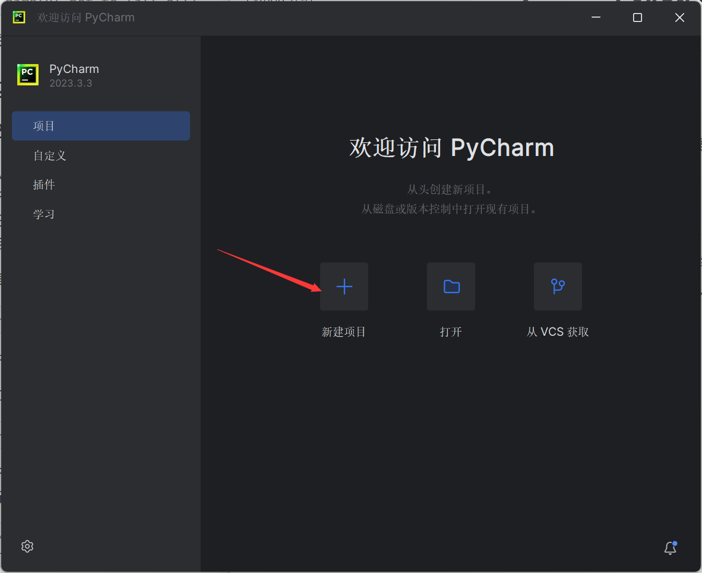
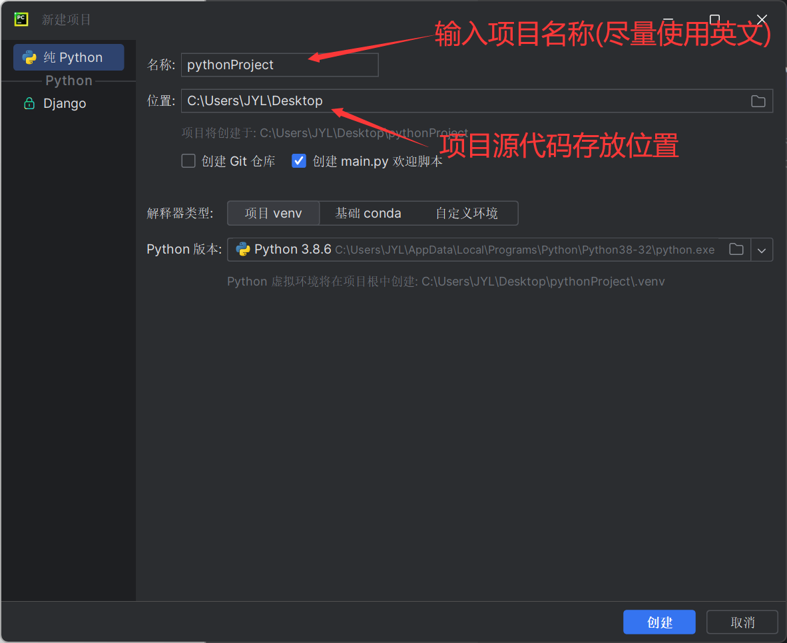
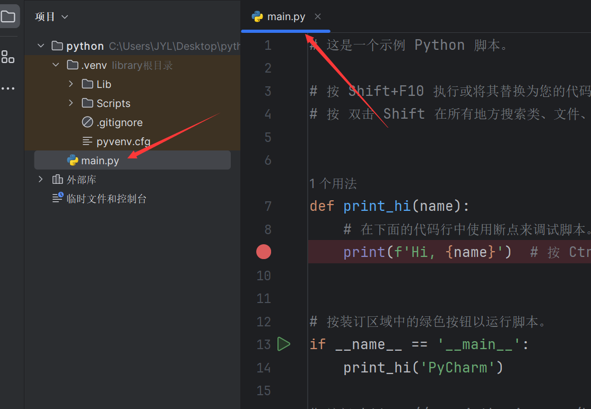
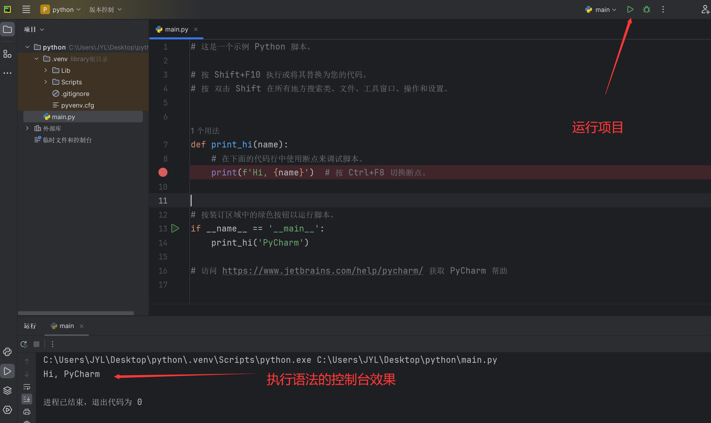
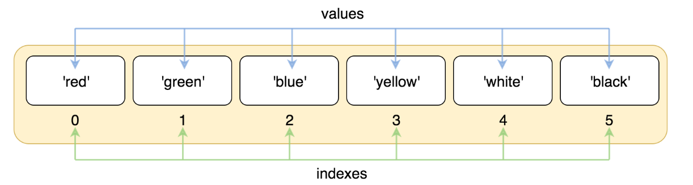
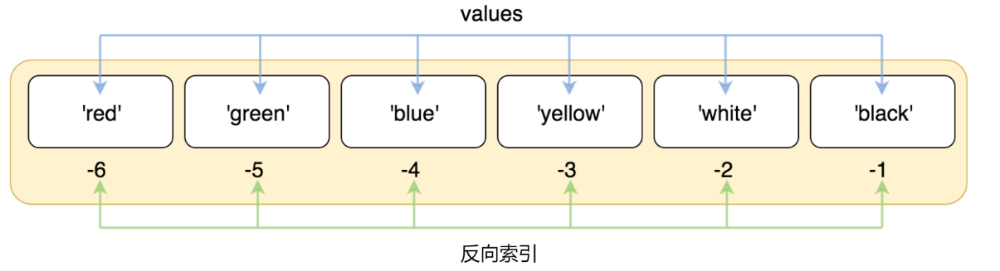
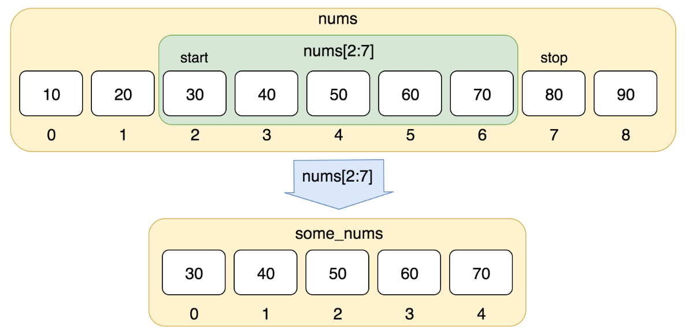

```
非空字符串 中没有符号和数字 就返回TruePython 介绍
```

Python 是由 Guido van Rossum 在八十年代末和九十年代初，在荷兰国家数学和计算机科学研究所设计出来的。

Python 的设计具有很强的可读性，相比其他语言经常使用英文关键字，其他语言的一些标点符号，它具有比其他语言更有特色语法结构。

Python 是一个高层次的结合了解释性、编译性、互动性和面向对象的脚本语言。

现在 Python 是由一个核心开发团队在维护，Guido van Rossum 仍然占据着至关重要的作用，指导其进展。

- **Python 是一种解释型语言：** 这意味着开发过程中没有了编译这个环节。类似于PHP和Perl语言。
- **Python 是交互式语言：** 这意味着，您可以在一个 Python 提示符 >>> 后直接执行代码。
- **Python 是面向对象语言:** 这意味着Python支持面向对象的风格或代码封装在对象的编程技术。
- **Python 是初学者的语言：**Python 对初级程序员而言，是一种伟大的语言，它支持广泛的应用程序开发

**Python 应用**

- **云计算**：云计算最热的语言，典型的应用OpenStack
- **WEB开发**：许多优秀的 WEB 框架，许多大型网站是Python开发、YouTube、Dropbox、Douban……典型的Web框架包括Django
- **科学计算和人工智能**：典型的图书馆NumPy、SciPy、Matplotlib、Enided图书馆、熊猫
- **系统操作和维护**：操作和维护人员的基本语言
- **金融**：定量交易、金融分析，在金融工程领域，Python 不仅使用最多，而且其重要性逐年增加。
- **图形 GUI**：PyQT，WXPython，TkInter

**Python 在一些公司的运用有:**

- **谷歌**：谷歌应用程序引擎，代码。openAI.com、 openAI 爬虫、openAI 广告和其他项目正在广泛使用 Python。
- **CIA**：美国中情局网站是用 Python 开发的。
- **NASA**：美国航天局广泛使用 Python 进行数据分析和计算。
- **YouTube**：世界上最大的视频网站 YouTube 是用 Python 开发的。
- **Dropbox**：美国最大的在线云存储网站，全部用 Python 实现，每天处理 10 亿的文件上传和下载。
- **Instagram**：美国最大的照片共享社交网站，每天有 3000 多万张照片被共享，所有这些都是用 Python 开发的。
- **Facebook**：大量的基本库是通过 Python 实现的
- **Red Hat/Centos**：世界上最流行的 Linux 发行版中的 Yum 包管理工具是用 Python 开发的
- **Douban**：几乎所有公司的业务都是通过 Python 开发的。
- **知乎**：中国最大的 Q＆A 社区，通过 Python 开发（国外 Quora）
- **OpenAI**:人工智能领域前沿技术研发,大量研发代码使用Python 实现的

除此之外，还有搜狐、金山、腾讯、盛大、网易、百度、阿里、淘宝、土豆、新浪、果壳等公司正在使用 Python 来完成各种任务。


# Python 环境安装

见环境安装教程资料


# Python代码执行

## 1.解释器执行

1.电脑的搜索中输入:python

2.找到IDLE(Python 3.8 32-bit)

3.打开python解释器 输入python语法执行


## 2.解释器执行

1.打开任意文件夹输入cmd 来到系统的控制台

2.输入python,打开python的解释器

3.输入python语法执行


## 3.编辑器执行

1.打开python编辑器创建项目环境

2.新建.py文件 

3.输入python语法,执行项目

4.pycharm编辑器为例:











# Python变量

变量是代数的思想，用来代替或缓存数据,可以让程序更加简洁；

等号（=）用来给变量赋值。

等号（=）运算符左边是一个变量名,等号（=）运算符右边是存储在变量中的值。例如：

```python
counter = 100          # 整型变量
miles   = 1000.0       # 浮点型变量
name    = "hqyj"     # 字符串
print (counter)
print (miles)
print (name)
```


## 1. 变量命名

​	在Python中，变量是用来存储数据的标识符，通过给变量赋值来存储数据，并且可以根据需要更改变量的值。以下是有关Python变量命名的总结和特征：

1. 命名规则：
   - 变量名只能包含字母、数字和下划线（_）。
   - 变量名必须以字母（a-z，A-Z）或下划线（_）开头，不能以数字开头。
   - 变量名区分大小写，例如 `myVariable` 和 `myvariable` 是不同的变量。
   - 变量名不应该使用Python关键字，例如 `if`、`while`、`for` 等。
   - **_ **变量应被用户视为只读变量
2. 命名约定：
   - 通常使用小写字母来命名变量，例如 `my_variable`。
   - 对于多个单词组成的变量名，可以使用下划线分隔单词（Snake Case），或者使用驼峰命名法（Camel Case）。
     - Snake Case：`my_variable_name`
     - Camel Case：`myVariableName`
3. 变量名的清晰和描述性：
   - 变量名应该具有描述性，能够清晰地表示变量所存储的数据或其用途。
   - 避免使用单个字母或不明确的缩写作为变量名，除非是在特定上下文中广泛使用的约定，如循环变量 `i`。
4. 合理使用命名空间：
   - 避免定义与Python内置函数或常用模块的名称相同的变量，以防止命名冲突。
   - 模块级别的变量可以使用大写字母，表示为常量，例如 `PI = 3.14159`。

总之，Python中的变量命名需要遵循一定的规则和约定，以编写清晰、可维护的代码。良好的变量命名可以提高代码的可读性和可理解性，帮助其他开发人员更容易理解您的代码。

示例：

```python
# 命名规则示例
my_variable = 32
user_name = "Karen"
counter_1 = 1

# 命名约定示例
hqyj_case_variable = "Hello, World!"
hqyjCaseVariable = "Hello, World!"

# 描述性变量名
total_score = 100
employee_age = 30

#为多个变量赋值
x,y=10,20
```


## 2. 变量类型

在 Python 中，变量就是变量，它没有类型，我们所说的"类型"是变量所指的内存中对象的类型。

使用type小函数用于获取一个变量或值的类型。

简单介绍python常用的类型:

1. 基础类型（内置类型）：
   - 整数（int）：表示整数值，例如1、-5、100等。
   - 浮点数（float）：表示带有小数点的数值，例如3.14、-0.5等。
   - 布尔值（bool）：表示True或False，用于逻辑运算。
   - 字符串（str）：表示文本数据，用单引号（'）或双引号（"）括起来，例如"Hello, World!"。
   - 字节串（bytes）：表示二进制数据，以字节为单位，例如b'hello'。
   - 空值（NoneType）：表示一个特殊的空值，通常用于表示缺失或未定义的值。
2. 引用类型（复合类型）：
   - 列表（list）：可变序列，用于存储一组值，可以包含不同类型的元素。
   - 元组（tuple）：不可变序列，用于存储一组值，元素不能被修改。
   - 字典（dict）：键值对映射，用于存储关联性数据，由键和对应的值组成。
   - 集合（set）：无序集合，用于存储唯一的元素，不允许重复。
   - 枚举类型（Enum）：本质上是一个类，它是标准库中的`enum`模块提供的一个功能，用于创建有限的、命名的枚举类型
   - 自定义类（class）：创建自定义类来表示复杂的数据结构，具有自定义属性和方法。

按照是否可以修改划分:

- 不可变数据：Number（数字）、String（字符串）、Tuple（元组）
- 可变数据：List（列表）、Dictionary（字典）、Set（集合）

## 3. del删除变量

可以通过使用del语句删除单个或多个对象的引用

del var
del var_a, var_b

```python
x=100
del x
print(x)#报错name 'x' is not defined
```


# Python注释

在 Python 中，注释不会影响程序的执行，但是会使代码更易于阅读和理解。


Python 中的注释有**单行注释**和**多行注释**。

## 1、井号 (#)

```python
# 这是一个注释print("Hello, World!")
```


**多行注释用三个单引号 ''' 或者三个双引号 """ 将注释括起来**，例如:

## 2、单引号（'''）

```python
'''这是多行注释，用三个单引号这是多行注释，用三个单引号 这是多行注释，用三个单引号'''

print("Hello, World!")
```


## 3、双引号（"""）

```python
"""这是多行注释，用三个双引号这是多行注释，用三个双引号 这是多行注释，用三个双引号"""

print("Hello, World!")
```

**注意**：多行注释可以嵌套使用，但是单行注释不能嵌套使用。


# Python 数字(Number)

Python 数字数据类型用于存储数值。

数据类型是不允许改变的，这就意味着如果改变数字数据类型的值，将重新分配内存空间。


## 1、四种不同的数字类型

- **整型(int)** -

  通常被称为是整型或整数，是正或负整数，不带小数点。

- **浮点型(float)** -

  浮点型由整数部分与小数部分组成，浮点型也可以使用科学计数法表示（2.5e2 = 2.5 x 102 = 250）

- **复数( complex)** -

  复数由实数部分和虚数部分构成，可以用a + bj,或者complex(a,b)表示， 复数的实部a和虚部b都是浮点型。

- **布尔类型(Bool)**-布尔(bool)是整型的子类型。

  - 表示真假、对错、黑白等；
  - **True**和**False**：他们首字母是大写的，类型转换是为1和0；
  - 类型转换为bool：使用bool()小方法
  - 非0都是True
  - 0、0.0、-0.0、空字符串、空列表、空字典、空集合、空元组、None等都是False；

```python
x1=20#整数
print(x1)#20

x2=3.14#浮点数
print(x2)#3.14

x3=10+3j#复数
print(x3)#(10+3j)

x4=True#布尔值 True
print(x4)#True

n1 = 0xA0F # 十六进制
print(n1)#2575

n2=0o37 # 八进制
print(n2)#31

n3=9 # 10进制
print(n3)#9

n5=0b10 # 2进制
print(n5)#2

```


## 2、Python 数字类型转换

有时候，我们需要对数据内置的类型进行转换，数据类型的转换，你只需要将数据类型作为函数名即可。

- **int(x)** 将x转换为十进制**整数**
- **float(x)** 将x转换到一个浮点数。
- **bin(x)**将x转换为二进制
- **oct(x)**将x转换为八进制
- **hex(x)**将x转换为十六进制
- **complex(x)** 将x转换到一个复数，实数部分为 x，虚数部分为 0。
- **complex(x, y)** 将 x 和 y 转换到一个复数，实数部分为 x，虚数部分为 y。x 和 y 是数字.
- **bool(x)**将 x 转化为布尔值

```python
print(int(20.5))#20
print(float(20))#20.0
print(bin(3))#0b11
print(oct(20))#0o24
print(hex(29))#0x1d
print(complex(29))#(29+0j)
print(complex(10,3))#(10+3j)
```


## 2、Python 数字运算

### a). 算术运算符

- `+`：加法
- `-`：减法
- `*`：乘法
- `/`：除法
- `%`：取模（取余数）
- `**`：幂运算
- `//`：整除（取整数部分）

除法 / 总是返回一个浮点数

整除// 得到的并不一定是整数类型的数，它与分母分子的数据类型有关系。

不同类型的数混合运算时会将整数转换为浮点数：

```python
print(10+20.3)#加法运算:30.3
print(17 / 3)  # 整数除法返回浮点型:5.666666666666667
print(17 // 3)  # 整数除法返回向下取整后的结果:5
print(17.0 // 3)  # 整数除法返回向下取整后的结果:5.0
print(17 // 3.0)  # 整数除法返回向下取整后的结果:5.0
print(17 % 3)  # ％操作符返回除法的余数:2
print(2**3) #幂运算2的3次方: 8
```


### b). 比较运算符

- `==`：等于
- `!=`：不等于
- `<`：小于
- `>`：大于
- `<=`：小于等于
- `>=`：大于等于

比较运算符的运算结果为布尔值

```python
print(10==10.0)#只比较值是否相等:True
print(3.14!=3.1415)#True
print(255>170)#True
print(255<170)#False
print(255>=255)#True
print(255<=255)#True
x=15
print(5<x<20)#注意:两个符号同时参与比较  不会先运算第一个<再运算第二个<

x=100
y=200
z=-10
a=True
print(a is not x is not y < z)#a和x判定 然后和y判定 然后和z判定

```


### c). 逻辑运算符

- `and`：与（逻辑与）
- `or`：或（逻辑或）
- `not`：非（逻辑非）

A and B表达式的结果: 如果A表达式的布尔判定为真则B表达式的结果作为整个表达式的结果,如果A表达式的布尔判定为假则A表达式的结果作为整个表达式的结果

注意:  **如果A判定为假  B将不会执行**

or和not跟and一样

```python
def fn():
    print("执行了fn")  # 打印
    return 10
def fm():
    print("执行了fm")  # 打印
    return 20
re = fn() and fm()
print(re)  #20
```

```python
def fn():
    print("执行了fn")  # 打印
    return 0
def fm():
    print("执行了fm")  # 不打印
    return 20
re = fn() and fm()
print(re)  #0
```


### d). 位运算符

Python中的位运算符主要用于处理整数类型的二进制位操作。以下是Python中的6种主要位运算符：

- `&`：按位与
- `|`：按位或
- `^`：按位异或
- `~`：按位取反
- `<<`：左移位
- `>>`：右移位

1. **按位与（&）**：

   - 表达式：`a & b`
   - 功能：对于每一位，如果a和b的相应位都是1，则结果位为1，否则为0。

   ```python
   # 示例：计算两个二进制数的按位与
   a = 0b1011  # 二进制表示的11
   b = 0b1101  # 二进制表示的13
   result_and = a & b  # 计算两者之间的按位与
   print(bin(result_and))  # 输出：0b1001 （十进制为9）
   ```

   

2. **按位或（|）**：

   - 表达式：`a | b`
   - 功能：对于每一位，只要a和b中至少有一位是1，则结果位为1，否则为0。

   ```python
   # 示例：计算两个二进制数的按位或
   a = 0b1011
   b = 0b1101
   result_or = a | b  # 计算两者之间的按位或
   print(bin(result_or))  # 输出：0b1111 （十进制为15）
   ```

   

3. **按位异或（^）**：

   - 表达式：`a ^ b`
   - 功能：对于每一位，如果a和b的相应位不同（一个为1，另一个为0），则结果位为1，否则为0。

   ```python
   # 示例：计算两个二进制数的按位异或
   a = 0b1011
   b = 0b1101
   result_xor = a ^ b  # 计算两者之间的按位异或
   print(bin(result_xor))  # 输出：0b110 （十进制为6）
   ```

   

4. **按位取反（~）**：

   - 表达式：`~a`
   - 功能：对操作数a的每一个二进制位进行取反，即将1变为0，0变为1。

   ```python
   # 示例：计算一个二进制数的按位取反
   a = 0b1011
   result_not = ~a  # 计算a的按位取反
   print(bin(result_not))  # 输出：-0b1100
   ```

   

5. **左移运算符（<<）**：

   - 表达式：`a << b`
   - 功能：将a的二进制表示向左移动b位，左边移出的部分会被丢弃，右边空出的位置补零。

   ```python
   # 示例：将一个二进制数向左移动两位
   a = 0b1011
   result_left_shift = a << 2  # 将a向左移动两位
   print(bin(result_left_shift))  # 输出：0b101100 （十进制为44）
   ```

   

6. **右移运算符（>>）**：

   - 表达式：`a >> b`
   - 功能：将a的二进制表示向右移动b位，对于无符号整数，右边移出的部分会被丢弃，左边空出的位置补零（通常补0）；对于有符号整数，右移时取决于具体实现，可能是算术右移（符号位扩展）或者逻辑右移（补0）。

```python
# 示例：将一个有符号二进制数向右移动一位
a = -0b1000  # 十进制为-8
result_right_shift = a >> 1  # 将a向右移动一位
print(bin(result_right_shift))  # 输出：-0b100 （十进制为-4）

# 对于无符号数的例子
unsigned_a = 0b1000
unsigned_result_right_shift = unsigned_a >> 1
print(bin(unsigned_result_right_shift))  # 输出：0b100 （十进制为4）
```


### e). 赋值运算符

- `=`：赋值

- `+=`：加法赋值

- `-=`：减法赋值

- `*=`：乘法赋值

- `/=`：除法赋值

- `%=`：取模赋值

- `**=`：幂运算赋值

- `//=`：整除赋值

  **注意：**

  ​	没有 a++、  a-- 这种自增自减运算符；


```python
x=100
x%=3
print(x)#1
```


## 3、数学函数

部分函数是python环境自带的 部分是math模块带的  部分是公共的

先引入math模块:

**import math**

| 函数              | 返回值 ( 描述 )                               |
| --------------- | ---------------------------------------- |
| abs(x)          | 返回数字的绝对值，如abs(-10) 返回 10                 |
| math.ceil(x)    | 返回数字的上入整数，如math.ceil(4.1) 返回 5           |
| cmp(x, y)       | 如果 x < y 返回 -1, 如果 x == y 返回 0, 如果 x > y 返回 1。 **Python 3 已废弃，使用 (x>y)-(x<y) 替换**。 |
| math.exp(x)     | 返回e的x次幂(ex),如math.exp(1) 返回2.718281828459045 |
| math.fabs(x)    | 以浮点数形式返回数字的绝对值，如math.fabs(-10) 返回10.0    |
| math.floor(x)   | 返回数字的下舍整数，如math.floor(4.9)返回 4           |
| math.log(x)     | 如math.log(math.e)返回1.0,math.log(100,10)返回2.0 |
| math.log10(x)   | 返回以10为基数的x的对数，如math.log10(100)返回 2.0     |
| max(x1, x2,...) | 返回给定参数的最大值，参数可以为序列。                      |
| min(x1, x2,...) | 返回给定参数的最小值，参数可以为序列。                      |
| math.modf(x)    | 返回x的整数部分与小数部分，两部分的数值符号与x相同，整数部分以浮点型表示。   |
| math.pow(x, y)  | x**y 运算后的值。                              |
| round(x ,n)     | 返回浮点数 x 的四舍五入值，如给出 n 值，则代表舍入到小数点后的位数。**其实准确的说是保留值将保留到离上一位更近的一端。**  1.保留整数只有一个小数时:4舍6入5看齐,奇进偶不进  2.保留整数或小数超过一个小数时:看保留位的下下位是否存在 |
| math.sqrt(x)    | 返回数字x的平方根。                               |


## 4、随机数

先引入random库基础库:

```python
import random
```

| 函数                                  | 描述                                       |
| ----------------------------------- | ---------------------------------------- |
| random.choice(seq)                  | 从序列的元素中随机挑选一个元素，比如random.choice(range(10))，从0到9中随机挑选一个整数。 |
| random.randrange (start, stop,step) | 从指定范围内，按指定基数递增的集合中获取一个随机数，基数默认值为 1       |
| random.random()                     | 随机生成下一个实数，它在[0,1)范围内。                    |
| random.shuffle(list)                | 将序列的所有元素随机排序,修改原list                     |
| uniform(x, y)                       | 随机生成实数，它在[x,y]范围内.                       |


## 5、三角函数

先引入math库基础库:

```python
import math
```

| 函数               | 描述                                    |
| ---------------- | ------------------------------------- |
| math.acos(x)     | 返回x的反余弦弧度值。                           |
| math.asin(x)     | 返回x的反正弦弧度值。                           |
| math.atan(x)     | 返回x的反正切弧度值。                           |
| math.atan2(y, x) | 返回给定的 X 及 Y 坐标值的反正切值。                 |
| math.cos(x)      | 返回x的弧度的余弦值。                           |
| math.sin(x)      | 返回的x弧度的正弦值。                           |
| math.tan(x)      | 返回x弧度的正切值。                            |
| math.degrees(x)  | 将弧度转换为角度,如degrees(math.pi/2) ， 返回90.0 |
| math.radians(x)  | 将角度转换为弧度                              |


## 6、数学常量

先引入math库基础库:

```python
import math
```

| 常量      | 描述                   |
| ------- | -------------------- |
| math.pi | 数学常量 pi（圆周率，一般以π来表示） |
| math.e  | 数学常量 e，e即自然常数（自然常数）。 |


# Python 字符串(String)

## 1.字符串表达式

引号引起来的单引号、双引号、三引号（三个三引号或双引号）；

```python
x='hello'
y="hqyj"
z="""python"""
a='''人工智能'''

```

## 2.type结果

字符串用type函数检测的结果为str

```python
x="hqyj"
print(type(x))#<class 'str'>
```


## 3.转义字符串

使用反斜杠\对字符进行转义，如\r 回车    \n 换行    \t 缩进     \\\\  表示 \

```python
x="hello\nhqyj"
print(x)
"""
打印
hello
hqyj
"""
```

```python
x="hello\thqyj"
print(x)
"""
打印
hello	hqyj
"""
```

```python
x="hello\\hqyj"
print(x)
"""
打印
hello\hqyj
"""
```

## 4.不转义

字符串前加r表示原始字符串：所见即所得，不转义；

```python
x=r'c:\window\user\data'
print(x)
"""
打印
c:\window\user\data
"""
```

## 5.字符串运算

- 字符串连接：+；

- 相邻的两个或多个 *字符串字面值* （引号标注的字符）会自动合并

  ```python
  x='Py' 'thon'
  print(x)#Python
  ```

- 字符串多次重复， 如 ：

  ```python
  x=3*('a' + 'b')
  print(x)#ababab
  ```

- 可以把字符串看成数组，通过下标访问字符，支持负数：

  ```python
  x='abc'[1]
  print(x)#b
  ```

- 支持通过下标截取子字符串,第一个参数省略表示0，第二个参数省略表示到最后：

  ```python
  x='huaqyj'[0:2]
  print(x)#hu
  y='huaqingyunajian'[6:]
  print(y)#gyunajian
  ```

## 6.f-string

f-string 是 python3.6 之后版本添加的，称之为字面量格式化字符串，是新的格式化字符串的语法(旧的字符串格式化自行了解)。

之前我们习惯用百分号 (%):

实例

```python
name = 'hqyj'
print('Hello %s' % name)#Hello hqyj
```

**f-string** 格式化字符串以 f 开头，后面跟着字符串，字符串中的表达式用大括号 {} 包起来，它会将变量或表达式计算后的值替换进去

用了这种方式明显更简单了，不用再去判断使用 %s，还是 %d。

```python
x = 1
print(f'{x+1}')   #2    
```

```python
x = 1
print(f'{x+1=}')   #x+1=2  
```


## 7.字符串的常用函数API

Python 的字符串常用内建函数如下：

| 序号   | 方法及描述                                    |
| ---- | ---------------------------------------- |
| 1    | **capitalize**()将字符串的第一个字符转换为大写          |
| 2    | **center**(width, fillchar)返回一个指定的宽度 width 居中的字符串，fillchar 为填充的字符，默认为空格。 |
| 3    | **count**(str, beg= 0,end=len(string))返回 str 在 string 里面出现的次数，如果 beg 或者 end 指定则返回指定范围内 str 出现的次数 |
| 4    | **endswith**(suffix, beg=0, end=len(string))检查字符串是否以 suffix 结束，如果 beg 或者 end 指定则检查指定的范围内是否以 suffix 结束，如果是，返回 True,否则返回 False。 |
| 5    | **expandtabs**(tabsize=8)把字符串 string 中的 \t 符号转为空格，tab 符号默认的空格数是 8 。 |
| 6    | **find**(str, beg=0, end=len(string))检测 str 是否包含在字符串中，如果指定范围 beg 和 end ，则检查是否包含在指定范围内，如果包含返回开始的索引值，否则返回-1 |
| 7    | **index**(str, beg=0, end=len(string))跟find()方法一样，只不过如果str不在字符串中会报一个异常。 |
| 8    | **isalnum**()非空字符串 中没有符号 就返回True         |
| 9    | **isalpha**()非空字符串 中没有符号和数字 就返回True      |
| 10   | **isdigit**()如果字符串只包含数字则返回 True 否则返回 False.. |
| 11   | **islower**() 用于检测字符串中的所有字符是否都是小写字母,字符都是小写，则返回 True，否则返回 False |
| 12   | **isnumeric**()如果字符串中只包含数字字符，则返回 True，否则返回 False |
| 13   | **isspace**()如果字符串中只包含空白，则返回 True，否则返回 False. |
| 14   | **istitle**()如果字符串是标题化的(见 title())则返回 True，否则返回 False |
| 15   | **isupper**()用于检测字符串中的所有字符是否都是大写字母,并且都是大写，则返回 True，否则返回 False |
| 16   | **join**(seq)以指定字符串作为分隔符，将 seq 中所有的元素(的字符串表示)合并为一个新的字符串 |
| 17   | **len**(string)返回字符串长度                   |
| 18   | **ljust**(width, fillchar\])返回一个原字符串左对齐,并使用 fillchar 填充至长度 width 的新字符串，fillchar 默认为空格。 |
| 19   | **lower**()转换字符串中所有大写字符为小写.              |
| 20   | **lstrip**()截掉字符串左边的空格,\t,\r,\n或指定字符。    |
| 21   | **maketrans**()创建字符映射的转换表，对于接受两个参数的最简单的调用方式，第一个参数是字符串，表示需要转换的字符，第二个参数也是字符串表示转换的目标。 |
| 22   | **max**(str)返回字符串 str 中最大的字母。            |
| 23   | **min**(str)返回字符串 str 中最小的字母。            |
| 24   | **replace**(old, new , max)把 将字符串中的 old 替换成 new,如果 max 指定，则替换不超过 max 次。 |
| 25   | **rfind**(str, beg=0,end=len(string))类似于 find()函数，不过是从右边开始查找. |
| 26   | **rindex**( str, beg=0, end=len(string))类似于 index()，不过是从右边开始. |
| 27   | **rjust**(width, fillchar)返回一个原字符串右对齐,并使用fillchar(默认空格）填充至长度 width 的新字符串 |
| 38   | **rstrip**()删除字符串末尾的空格\t,\r,\n或指定字符。     |
| 29   | **split**(sep="", maxsplit=string.count(str))以 sep为分隔符截取字符串，如果 maxsplit有指定值，则仅截取 maxsplit+1 个子字符串 |
| 30   | **splitlines**(keepends)按照行('\r', '\r\n', \n')分隔，返回一个包含各行作为元素的列表，如果参数 keepends 为 False，不包含换行符，如果为 True，则保留换行符。 |
| 31   | **startswith**(substr, beg=0,end=len(string))检查字符串是否是以指定子字符串 substr 开头，是则返回 True，否则返回 False。如果beg 和 end 指定值，则在指定范围内检查。 |
| 32   | **strip**(chars)在字符串上执行 lstrip()和 rstrip() |
| 33   | **swapcase**()将字符串中大写转换为小写，小写转换为大写       |
| 34   | **title**()返回"标题化"的字符串,就是说所有单词都是以大写开始，其余字母均为小写 |
| 35   | **upper**()转换字符串中的小写字母为大写                |
| 36   | **zfill** (width) 在字符串左侧填充指定数量的零，确保整个字符串达到指定长度 |

# Python 输入和输出

## 1、输出

print()内置函数提供在控制台输出打印数据

```python
# 基本输出
print("Hello, World!")  # 输出简单的字符串

# 输出变量的值
name = "Alice"
age = 25
print(name, age)  # 直接输出变量

# 使用sep参数设定分隔符
print("apple", "banana", "cherry", sep=", ")  # 以逗号加空格作为分隔符输出多个字符串

# 使用end参数改变输出结束符
print("Line 1", end=" --- ")
print("Line 2")  # 连续打印时，第二行不会自动换行
```


## 2、输入

 input() 内置函数从标准输入读取文本，默认的标准输入是键盘。

```python
str = input("请输入：")#程序到这里不会继续往下执行,等待用户输入完毕后继续执行
print ("你输入的内容是: ", str)
```


# 条件语句

## 1.if

**if condition:**

  **# 当条件为真时执行这里的代码,否则不执行这里**

```python
year=1993
if year%4==0:
    print("year能被4整除")
```


## 2.if-else

**if condition:**

  **# 当条件为真时执行这里的代码**

**else:**

  **# 如果前面的条件都为假，执行这里的代码**

```python
year=1993
if year%4==0:
    print("year能被4整除")
else:
    print("year不能被4,400整除")
```


## 3.if-elif-else

**if condition:**

  **# 当条件为真时执行这里的代码**

**elif another_condition:**

  **# 当上面条件为假，而这个条件为真时执行这里的代码**

**else:**

  **# 如果前面的条件都为假，执行这里的代码**

```python
year=1992
if year%4==0:
    print("year能被4整除")
elif year%400==0:
    print("year能被400整除")
else:
    print("year不能被4,400整除")
```


# 循环语句

## 1.range函数

用于生成一个整数序列，序列中的每个元素按照指定的步长递增（默认步长为1）。这个函数并不会真正创建一个列表，而是返回一个可迭代的对象——`range`对象。当你在循环中使用它时可以遍历内部的元素

**range(stop)**
**range(start, stop)**
**range(start, stop, step)**

参数说明：

- `start`（可选）：序列的起始值，默认是0。
- `stop`：序列的停止值，序列不会包含此值。
- `step`（可选）：每次迭代增加的步长，默认是1。

## 2.for-in 循环

**for 循环** 用于迭代遍历可迭代对象（如列表、字符串、字典等）：

```python
fruit = ['apple', 'pear', 'orange', 'banana']
for item in fruit:
  print(item)
    
#循环数字范围  
for i in range(1, 10, 2):
    print(i)
    i += 2
    
#可以反向递减的   
for i in range(20, 10, -2):
    print(i)
    i += 2  
```

## 3.while 循环

**while 循环** 在条件为真时重复执行代码块

```python
# 某人有100,000元,每经过-次路口,需要交费,规则如下:
#   1)当现金> 50000时每次交5%
#   2)当现金< = 50000时,每次交1000,
#  编程计算该人可以经过多少次路口,

money = 100000
n = 0
while money >= 1000:
    n += 1
    money = 0.95*money if money > 50000 else money - 1000

print('共可以过桥' + str(n) + '次')
```

## 4.循环控制

- **break**：用于跳出当前循环。
- **continue**：用于跳过当前迭代，继续下一次迭代。

```python
for i in range(1,20):
    if i%3==0:
       break
    print(i)
```

```python
for i in range(1,20):
    if i%3==0:
       continue
    print(i)
```


# pass 语句

pass是空语句，是为了保持程序结构的完整性。

pass 不做任何事情，一般用做占位语句

```python
for x in  range(10):
    if x == 7:
        pass
    else:
        print(x)
```


# Python列表(list)

Python 支持多种复合数据类型，可将不同值组合在一起。最常用的**列表** ，是用方括号标注，逗号分隔的一组值。列表可以包含不同类型的元素，但一般情况下，各个元素的类型相同

```python
list1 = ['openAI', 'hqyj', 1997, 2000]
list2 = [1, 2, 3, 4, 5 ]
list3 = ["a", "b", "c", "d"]
list4 = ['red', 'green', 'blue', 'yellow', 'white', 'black']
```


## 1、访问列表中的值

### 1.1 索引

与字符串的索引一样，列表索引从 0 开始，第二个索引是 1，依此类推。




```python
list = ['red', 'green', 'blue', 'yellow', 'white', 'black']
print( list[0] )
print( list[1] )
print( list[2] )
```


### 1.2 反向索引

索引也可以从尾部开始，最后一个元素的索引为 -1，往前一位为 -2，以此类推。



```python
list = ['red', 'green', 'blue', 'yellow', 'white', 'black']
print( list[-1] )
print( list[-2] )
print( list[-3] )
```

### 1.3 切片索引

使用下标索引来访问列表中的值，同样你也可以使用方括号 [] 的形式截取字符

**注意:切片是浅拷贝操作**




```python
nums = [10, 20, 30, 40, 50, 60, 70, 80, 90]
print(nums[0:4])
```

```python
list = ['openAI', 'hqyj', "Zhihu", "Taobao", "Wiki"] 
# 读取第二位
print (list[1])
# 从第二位开始（包含）截取到倒数第二位（不包含）
print (list[1:-2])
# 从下标2开始(包含2)到最后一个
print (list[2:])
# 从下标0开始到下标3结束(左闭右开)
print (list[:3])
```


## 2、更新列表

对列表的数据项进行修改或更新,也可以使用 append() 方法来添加列表项

```python
list = ['openAI', 'hqyj', 1997, 2000]
print (list[2])
list[2] = 2001
print (list[2])
list1 = ['openAI', 'hqyj', 'Taobao']
list1.append('Baidu')
print (list1)
```


## 3、删除列表元素

可以使用 del 语句来删除列表的的元素

```python
list = ['openAI', 'hqyj', 1997, 2004]
print (list)
del list[2]
print (list)
```


## 4、列表操作符

| Python 表达式                   | 结果                           | 描述         |
| ---------------------------- | ---------------------------- | ---------- |
| len([1, 2, 3])               | 3                            | 长度         |
| [1, 2, 3] + [4, 5, 6]        | [1, 2, 3, 4, 5, 6]           | 组合         |
| ['Hi!'] * 4                  | ['Hi!', 'Hi!', 'Hi!', 'Hi!'] | 重复         |
| 3 in [1, 2, 3]               | True                         | 元素是否存在于列表中 |
| for x in [1, 2, 3]: print(x) | 1 2 3                        | 迭代         |


## 5、嵌套列表

使用嵌套列表即在列表里创建其它列表

```python
a = ['a', 'b', 'c']
n = [1, 2, 3]
x = [a, n]
print(x)#[['a', 'b', 'c'], [1, 2, 3]]
print(x[0])#['a', 'b', 'c']
print(x[0][1])#b
```


## 6、Python列表常用API

操作列表的函数

| 序号   | 函数                 |
| ---- | ------------------ |
| 1    | len(list)列表元素个数    |
| 2    | max(list)返回列表元素最大值 |
| 3    | min(list)返回列表元素最小值 |
| 4    | list(seq)将元组转换为列表  |


列表的方法

| 序号   | 方法                                       |
| ---- | ---------------------------------------- |
| 1    | list.append(obj)在列表末尾添加新的对象              |
| 2    | list.count(obj)统计某个元素在列表中出现的次数           |
| 3    | list.extend(seq)在列表末尾一次性追加另一个序列中的多个值（用新列表扩展原来的列表） |
| 4    | list.index(obj)从列表中找出某个值第一个匹配项的索引位置      |
| 5    | list.insert(index, obj)将对象插入列表           |
| 6    | list.pop(index=-1)移除列表中的一个元素（默认最后一个元素），并且返回该元素的值 |
| 7    | list.remove(obj)移除列表中某个值的第一个匹配项          |
| 8    | list.reverse()反向列表中元素                    |
| 9    | list.sort( key=None, reverse=False)对原列表进行排序: x.sort(key=lambda a:abs(a-3), reverse=False) |
| 10   | list.clear()清空列表                         |
| 11   | list.copy()复制列表                          |


# Python元组(tuple)

Python 的元组与列表类似，不同之处在于元组的元素不能修改。

元组使用小括号 ( )，列表使用方括号 [ ]。


## 1、创建元组

元组创建很简单，只需要在括号中添加元素，并使用逗号隔开即可。


### 1.1 存放相同类型的数据

​      

```python
tup1 = (1, 2, 3, 4, 5 )
```


### 1.2 存放不同类型的数据

​      

```python
tup2 = ( 'hqyj', 2004)
```


### 1.3 不需要括号也可以

   

```python
tup3 = "a", "b", "c", "d"
```


### 1.4 只包含一个元素

元组中只包含一个元素时，需要在元素后面添加逗号 ，否则括号会被当作运算符使用：


```python
tup1 = (50)
tup2 = (50,)
```


## 2、访问元组

 元组与字符串类似，下标索引从 0 开始，可以进行截取，组合等。

```python
tup1 = ('python', 'hqyj', 100, 200)
tup2 = (1, 2, 3, 4, 5, 6, 7 )
print (tup1[0])#python
print (tup2[1:5])#(2, 3, 4, 5)
print (tup2[:4])#(1, 2, 3, 4)
print (tup2[2:])#(3, 4, 5, 6, 7)
```


## 3、修改元组

元组中的元素值是不允许修改的，但我们可以对元组进行连接组合

```python
tup1 = (12, 34.56)
tup2 = ('abc', 'xyz') 

# 创建一个新的元组
tup3 = tup1 + tup2
print (tup3)

# 以下修改元组元素操作是非法的。
# tup1[0] = 100 
```


## 4、删除元组

元组中的元素值是不允许删除的，但我们可以使用del语句来删除整个元组

```python
tup = ('openAI', 'hqyj', 100, 200) 
print (tup)
del tup
print (tup)#name 'tup' is not defined
```


## 5、元组运算符

与字符串一样，元组之间可以使用 +、+=和 * 号进行运算。这就意味着他们可以组合和复制，运算后会生成一个新的元组。

| Python 表达式                    | 结果                           | 描述         |
| ----------------------------- | ---------------------------- | ---------- |
| len((1, 2, 3))                | 3                            | 计算元素个数     |
| (1, 2, 3)+(4, 5, 6)           | (1, 2, 3, 4, 5, 6)           | 连接得到一个新的元组 |
| ('Hi!',) * 4                  | ('Hi!', 'Hi!', 'Hi!', 'Hi!') | 复制         |
| 3 in (1, 2, 3)                | True                         | 元素是否存在     |
| for x in (1, 2, 3): print (x) | 1 2 3                        | 迭代         |

## 6、元组不可变

所谓元组的不可变指的是元组所指向的内存中的内容不可变。

```python
tup = (1, 2, 3, 4, 5, 6, 7)
tup[1] = 100
print(tup)#报错'tuple' object does not support item assignment
```


## 7、元组常用API

Python元组包含了以下内置函数

| 序号   | 方法          | 描述          |
| ---- | ----------- | ----------- |
| 1    | len(tuple)  | 返回元组中元素个数。  |
| 2    | max(tuple)  | 返回元组中元素最大值。 |
| 3    | min(tuple)  | 返回元组中元素最小值。 |
| 4    | tuple(list) | 将列表转换为元组。   |


# Python字典(dict )

字典是一种可变容器模型，且可存储任意类型对象。

字典的每个键值对( key:value )用冒号分割，每个对之间用逗号分割，整个字典包括在花括号 {} 中 

d = {key1 : value1, key2 : value2, key3 : value3 }


## 1、创建字典

dict 作为 Python 的关键字和内置函数，变量名不建议命名为 **dict**。

键必须是唯一的，但值则不必。

值可以取任何数据类型，但键必须是不可变的，如字符串，数字。

```python
d1 = {}#创建空字典
d2 = dict()#使用内建函数 dict()创建字典
d3 = {"name":"karen","age":23}
d4 = dict({"name":"jack","age":24})

print(d3)# 打印字典
print(len(d3))# 查看字典的数量
print(type(d3))# 查看类型
```


## 2、访问字典里的值

把相应的键放入到方括号中

```python
mydic = {'Name': 'hqyj', 'Age': 7, 'Class': 'First'} 
print (mydic['Name'])
print (mydic['Age'])
```


如果用字典里没有的键访问数据，会输出错误

```python

mydic = {'Name': 'hqyj', 'Age': 7, 'Class': 'First'} 
print (mydic['Alice'])
```


## 3、修改字典

向字典添加新内容的方法是增加新的键/值对，修改或删除已有键/值对

```python

mydic = {'Name': 'hqyj', 'Age': 7, 'Class': 'First'} 

mydic['Age'] = 8 # 更新
mydic['School'] = "华清" #添加信息  

print (mydic['Age'])
print (mydic['School'])
```


## 4、删除字典元素

能删单一的元素也能清空字典，清空只需一项操作

显式删除一个字典用del命令

```python
mydic = {'Name': 'Runoob', 'Age': 7, 'Class': 'First'}
 
del mydic['Name'] # 删除键 'Name'
mydic.clear()     # 清空字典

 
print (mydic['Age'])
print (mydic['School'])

del mydic         # 删除字典

```


## 5、字典键的特性

字典值可以是任何的 python 对象，既可以是标准的对象，也可以是用户定义的，但键不行。

1）不允许同一个键出现两次。创建时如果同一个键被赋值两次，后一个值会被记住


```python
mydic = {'Name': 'jack', 'Age': 27, 'Name': 'karen'}
print (mydic['Name'])
```


2）键必须不可变，所以可以用数字，字符串或元组充当，而用列表就不行

```python
mydic1 = {97:"a",98:"b"}
mydic2 = {"name":"karen","age":27}
mydic3 = {['Name']: 'karen', 'Age': 27}
print(mydic3[['Name']])#报错unhashable type: 'list'
```


## 6、字典常用API

操作字典的函数：

| 序号   | 函数             | 描述                        |
| ---- | -------------- | ------------------------- |
| 1    | len(dict)      | 计算字典元素个数，即键的总数。           |
| 2    | str(dict)      | 输出字典，可以打印的字符串表示。          |
| 3    | type(variable) | 返回输入的变量类型，如果变量是字典就返回字典类型。 |

字典的方法：

| 序号   | 函数及描述                                    |
| ---- | ---------------------------------------- |
| 1    | dict.clear()删除字典内所有元素                    |
| 2    | dict.copy()返回一个字典的浅复制                    |
| 3    | dict.fromkeys(seq)创建一个新字典，以序列seq中元素做字典的键，val为字典所有键对应的初始值 |
| 4    | dict.get(key, default=None)返回指定键的值，如果键不在字典中返回 default 设置的默认值 |
| 5    | key in dict如果键在字典dict里返回true，否则返回false   |
| 6    | dict.items()以列表返回一个视图对象                  |
| 7    | dict.keys()返回一个视图对象                      |
| 8    | dict.setdefault(key, default=None)和get()类似, 但如果键不存在于字典中，将会添加键并将值设为default |
| 9    | dict.update(dict2)把字典dict2的键/值对更新到dict里  |
| 10   | dict.values()返回一个视图对象                    |
| 11   | pop(key,default)删除字典 key（键）所对应的值，返回被删除的值。 |
| 12   | popitem()返回并删除字典中的最后一对键和值。               |


# Python集合(set)

集合（set）是一个无序的不重复元素序列。

集合中的元素不会重复，并且可以进行交集、并集、差集等常见的集合操作。

## 1、创建集合

可以使用大括号 { } 创建集合，元素之间用逗号 , 分隔， 或者也可以使用 set() 函数创建集合。

**注意：**创建一个空集合必须用 set() 而不是 { }，因为 { } 是用来创建一个空字典。

**parame = {value01,value02,...}**

**set(value)**

```python
set1 = {1, 2, 3, 4}# 直接使用大括号创建集合
set2 = set([4, 5, 6, 7])# 使用 set()函数从列表创建集合
set3 = set((4, 5, 6, 7))# 使用 set()函数从元组创建集合
```


## 2、添加元素

将元素 x 添加到集合 s 中，如果元素已存在，则不进行任何操作。


**s.add( x ) 添加元素到集合** 

**s.update( x ) 添加元素到集合，且参数可以是列表，元组，字典等** ,x 可以有多个，用逗号分开

```python
s1 = set((4, 5, 6, 7))
s1.add(100)
print(s1)
s1.update([200,300])
print(s1)
```


## 3、移除元素

**s.remove( x ):将元素 x 从集合 s 中移除，如果元素不存在，则会发生错误。**

**s.discard( x ):将元素 x 从集合 s 中移除，如果元素不存在，不会发生错误。**

**s.pop():对集合进行无序的排列，然后将这个无序排列集合的左面第一个元素进行删除。** 

```python
s1 = {10, 20, 30}
s1.remove(20)
print(s1)
s1.remove(40)#报错
```

```python
s1 = {10, 20, 30}
s1.discard(20)
print(s1)
s1.discard(40)
```

```python
s1 = {10, 20, 30}
s1.pop()
print(s1)
```


## 4、计算集合元素个数

**len(s):计算集合元素个数**

```python
s1 = {10, 20, 30}
print(len(s1))
```


## 5、清空集合

**s.clear():清空集合**

```python
s1 = {10, 20, 30}
s1.clear()
print(s1)
```


## 6、判断元素是否在集合中存在

**x in s  判断元素 x 是否在集合 s 中，存在返回 True，不存在返回 False。**

```python
s1 = {10, 20, 30}
print(20 in s1)
```


## 7、集合内置方法完整API

集合的方法

| 方法                            | 描述                                       |
| ----------------------------- | ---------------------------------------- |
| add()                         | 为集合添加元素                                  |
| clear()                       | 移除集合中的所有元素                               |
| copy()                        | 拷贝一个集合                                   |
| difference()                  | 返回多个集合的差集                                |
| difference_update()           | 移除集合中的元素，该元素在指定的集合也存在。                   |
| discard()                     | 删除集合中指定的元素                               |
| intersection()                | 返回集合的交集                                  |
| intersection_update()         | 返回集合的交集。                                 |
| isdisjoint()                  | 判断两个集合是否包含相同的元素，如果没有返回 True，否则返回 False。  |
| issubset()                    | 判断指定集合是否为该方法参数集合的子集。                     |
| issuperset()                  | 判断该方法的参数集合是否为指定集合的子集                     |
| pop()                         | 随机移除元素                                   |
| remove()                      | 移除指定元素                                   |
| symmetric_difference()        | 返回两个集合中不重复的元素集合。                         |
| symmetric_difference_update() | 移除当前集合中在另外一个指定集合相同的元素，并将另外一个指定集合中不同的元素插入到当前集合中。 |
| union()                       | 返回两个集合的并集                                |
| update()                      | 给集合添加元素                                  |
| len()                         | 计算集合元素个数                                 |


# Python推导式

Python 推导式是一种独特的数据处理方式，可以从一个数据序列构建另一个新的数据序列的结构体。

Python 支持各种数据结构的推导式：

- 列表(list)推导式
- 字典(dict)推导式
- 集合(set)推导式
- 元组(tuple)推导式

## 1、列表推导式

列表推导式格式为：

**[表达式 for 变量 in 列表]** 

**[表达式 for 变量 in 列表 if 条件]**

[out_exp_res for out_exp in input_list if condition]

- out_exp_res：列表生成元素表达式，可以是有返回值的函数。
- for out_exp in input_list：迭代 input_list 将 out_exp 传入到 out_exp_res 表达式中。
- if condition：条件语句，可以过滤列表中不符合条件的值。

```python
#过滤掉长度小于或等于3的字符串列表，并将剩下的转换成大写字母：
names = ['Bob','Tom','alice','Jerry','Wendy','Smith']
new_names = [name.upper() for name in names if len(name)>3]
print(new_names)

#计算 30 以内可以被 3 整除的整数：
multiples = [i for i in range(30) if i % 3 == 0]
print(multiples)
```


## 2、字典推导式

字典推导基本格式：

**{ key_expr: value_expr for value in collection }**

**{ key_expr: value_expr for value in collection if condition }**

```python
# 将列表中各字符串值为键，各字符串的长度为值，组成键值对
listdemo = ['karen','jack', 'marry']
newdict = {key:len(key) for key in listdemo}
print(newdict)#{'karen': 5, 'jack': 4, 'marry': 5}


#提供三个数字，以三个数字为键，三个数字的平方为值来创建字典：
dic = {x: x**2 for x in (2, 4, 6)}
print(dic)#{2: 4, 4: 16, 6: 36}
```


## 3、集合推导式

集合推导式基本格式：

**{ expression for item in Sequence }**

**{ expression for item in Sequence if conditional }**

```python
#计算数字 1,2,3 的平方数：
setnew = {i**2 for i in (1,2,3)}
print(setnew)#{1, 4, 9}


#判断不是 abc 的字母并输出：
a = {x for x in 'abracadabra' if x not in 'abc'}
print(a)#{'d', 'r'}
```


## 4、元组推导式

元组推导式可以利用 range 区间、元组、列表、字典和集合等数据类型，快速生成一个满足指定需求的元组。

元组推导式和列表推导式的用法也完全相同，只是元组推导式是用 () 圆括号将各部分括起来，而列表推导式用的是中括号 []，另外元组推导式返回的结果是一个生成器对象。

元组推导式基本格式：

**(expression for item in Sequence )**

**(expression for item in Sequence if conditional )**

```python
#生成一个包含数字 1~9 的元组
a = (x for x in range(1,10))
print(a)#返回的是生成器对象
print(tuple(a))#使用 tuple() 函数，可以直接将生成器对象转换成元组
```


# Python函数

## 1、定义一个函数

定义一个函数的规则：

- 函数代码块以 **def** 关键词开头，后接函数标识符名称和圆括号 **()**。
- 任何传入参数和自变量必须放在圆括号中间，圆括号之间可以用于定义参数。
- 函数的第一行语句可以选择性地使用文档字符串—用于存放函数说明。
- 函数内容以冒号 : 起始，并且缩进。
- **return [表达式]** 结束函数，选择性地返回一个值给调用方，不带表达式的 return 相当于返回 None。

```python
def 函数名（参数列表）:
    函数体
```

```python
def fn():
    print('我是函数')
fn()
```


## 2、函数参数

参数是函数的输入，它们可以是可选的或必需的。

Python函数支持以下类型的参数：

- 必需参数：这些参数在函数调用时必须提供，没有默认值。
- 默认参数：这些参数有默认值，如果调用时不提供值，则使用默认值。
- 可变参数：函数可以接受不定数量的参数。可以通过*args（接受任意数量的位置参数）和**kwargs（接受任意数量的关键字参数）来实现。
- 关键字参数：这些参数在调用函数时使用关键字来传递。


### 2.1、必需参数

必需参数须以正确的顺序传入函数。调用时的数量必须和声明时的一样。

```python
def fn1(x):
    print(x*2)
fn1(10)#20

def fn2(x,y):
    print(x*2,y)
fn2(10,20)#20 20

def fn3(x,y):
    print(x+y)
fn3(10)#报错

def fn4(x):
    print(x*3)
fn4(10,20)#报错
```


### 2.2、关键字参数

关键字参数和函数调用关系紧密，函数调用使用关键字参数来确定传入的参数值。

使用关键字参数允许函数调用时参数的顺序与声明时不一致，因为 Python 解释器能够用参数名匹配参数值。

```python
def fn1(x,y):
    print(x,y)
fn1(100,y=200)#100 200


def fn2(x,y):
    print(x,y)
fn2(y=100,x=200)#200 100
```


### 2.3、默认参数

调用函数时，如果没有传递参数，则会使用默认参数, 默认参数必须写在必须参数后面。

```python
def fn1(x,y=0):
    print(x,y)
fn1(100)#100 0

def fn2(x=0,y=1):
    print(x,y)
fn2()#0 1

#错误的函数设计
def fn3(x=0,y):
    print(x,y)
```

### 2.4、不定长参数

你可能需要一个函数能处理比当初声明时更多的参数。这些参数叫做不定长参数

**def functionname([formal_args,] *var_args_tuple ):**

加了星号 * 的参数会以元组(tuple)的形式导入，存放所有未命名的变量参数。

```python
def fn1(x,y,*arg):
    print(x,y,arg)
fn1(10,20,30,40,50)#10 20 (30, 40, 50)
```


如果在函数调用时没有传入不定长参数，它就是一个空元组。我们也可以不向函数传递未命名的变量

```python
def fn1(x,y,*arg):
    print(x,y,arg)
fn1(10,20)#10 20 ()
```


如果传参的时候也是元组，可以使用***进行解包**

```python
def fn1(x,y,*arg):
    print(x,y,arg)
tup1=(30,40,50)
fn1(10,20,tup1)#10 20 ((30, 40, 50),)
fn1(10,20,*tup1)#10 20 10 20 (30, 40, 50)
```


加了**两个星号 **** **的参数**会以字典的形式导入(了解)。

```python
def printinfo(x, **dic):
    print (x,dic)
printinfo(1, a=2,b=3)#1 {'a': 2, 'b': 3}
printinfo(1, y=2,z=3)#1 {'y': 2, 'z': 3}
```


声明函数时，参数中星号 * 可以单独出现(了解)。

如果单**独出现星号 ***，则星号 * 后的参数必须用关键字传入

```python
def f(a,b,*,c):
   print(a+b+c)
f(1,2,c=3) # 正常:6
f(1,2,3)   # 报错:f() takes 2 positional arguments but 3 were given
```

### 2.5、强制位置参数

用/ 来指明函数形参必须使用指定位置参数，不能使用关键字参数的形式。

在以下的例子中，形参 a 和 b 必须使用指定位置参数，c 或 d 可以是位置形参或关键字形参，而 e 和 f 要求为关键字形参:

```python
def f(a, b, /, c, d, *, e, f):
    print(a, b, c, d, e, f)
```

以下使用方法是正确的:

```python
f(10, 20, 30, d=40, e=50, f=60)#正确的用法
f(10, b=20, c=30, d=40, e=50, f=60)   # b 不能使用关键字参数的形式
f(10, 20, 30, 40, 50, f=60)           # e 必须使用关键字参数的形式
```


### 2.6、可变不可变

**可更改(mutable)与不可更改(immutable)对象**

在 python 中，strings, tuples, 和 numbers 是不可更改的对象，而 list,dict 等则是可以修改的对象。

- **不可变类型：**变量赋值 **a=5** 后再赋值 **a=10**，这里实际是新生成一个 int 值对象 10，再让 a 指向它，而 5 被丢弃，不是改变 a 的值，相当于新生成了 a。
- **可变类型：**变量赋值 **la=[1,2,3,4]** 后再赋值 **la[2]=5** 则是将 list la 的第三个元素值更改，本身la没有动，只是其内部的一部分值被修改了。

python 函数的参数传递：

- **不可变类型：**值传递:  如整数、字符串、元组。如 fun(a)，传递的只是 a 的值，没有影响 a 对象本身。如果在 fun(a) 内部修改 a 的值，则是新生成一个 a 的对象。
- **可变类型：**引用传递:  如 列表，字典。如 fun(la)，则是将 la 真正的传过去，修改后 fun 外部的 la 也会受影响

python 中一切都是对象(后面会讲)，严格意义我们不能说值传递还是引用传递，我们应该说传不可变对象和传可变对象。


**传不可变对象实例**

通过内置的 **id()** 函数来查看内存地址变化：

```python
def change(a):
   print(id(a))
a=10
print(id(a))#1428793408
a=1
print(id(a))#1428793264
change(a)#1428793264
#总结:可以看见在调用函数前后，形参和实参指向的是同一个对象（对象 id 相同），在函数内部修改形参后，形参指向的是不同的id。
```


**传可变对象实例**

可变对象在函数里修改了参数，那么在调用这个函数的函数里，原始的参数也被改变了。

```python
def changeme( mylist ):
   mylist.append(40)
   print (mylist)

mylist = [10,20,30]
changeme(mylist)#[10, 20, 30, 40]
print (mylist)#[10, 20, 30, 40]
#总结:传入函数的和在末尾添加新内容的对象用的是同一个引用
```

## 3、返回值

函数可以使用`return`语句来返回一个或多个值。

如果没有明确的`return`语句，函数将默认返回`None`。

```python
#没有return
def fn1():
   print("调用了函数")
re=fn1()
print(re)#None

#返回一个值
def fn2(x):
   return  x+100
re2=fn2(100)
print(re2)#200

#返回多个值
def fn3(x):
   return x*x,x%3
re3=fn3(100)
print(re3)#(10000, 1)
x,y=fn3(100)
print(x,y)#10000 1
```


## 4. 匿名函数

在Python中，匿名函数通常使用`lambda`关键字来创建。匿名函数也被称为lambda函数，它是一种简单的、一行的函数，常用于临时需要一个小函数的地方。匿名函数的语法如下：

**lambda arguments: expression**

- `lambda`是关键字，表示你正在定义一个匿名函数。
- `arguments`是函数的参数，可以有零个或多个参数，参数之间用逗号分隔。
- `expression`是函数的返回值，通常是一个表达式，匿名函数会计算这个表达式并返回结果。


包含一个参数的匿名函数：

```python
square = lambda x: x * x
print(square(5))  # 输出: 25
```

包含多个参数的匿名函数：

```python
add = lambda x, y: x + y
print(add(3, 4))  # 输出: 7
```


## 5.变量作用域

### 5.1什么是变量作用域

 一个变量声明以后,在哪里能够被访问使用,就是这个变量"起作用"的区域:也就是这个变量的作用域

一般来说,变量的作用域,是在函数内部和外部的区域 来体现,因此常常与函数有关

### 5.2局部变量和全局变量

所有地方都能访问的的变量就是全局变量,一般是程序最外面

函数内部的变量只能在函数内部或者函数内部的函数内部访问  函数外部不能访问,函数内部的变量也称为局部变量

```python
def fn():
  x=100
  print(x)
  print(a)
a=200
print(a)
#print(x)#函数外部不能访问函数内部的变量
```


### 5.3局部作用域修改全局变量

在函数内部 提前用global声明 函数内部的某个变量为全局的变量


### 5.4局部作用域修改外部变量

在函数内部 提前用nonlocal声明 函数内部的某个变量为外部的变量


## 6. 高阶函数

在Python中，高阶函数是指可以接受一个或多个函数作为参数，或者返回一个函数作为结果的函数。高阶函数是函数式编程的核心概念之一，它允许你以函数作为"一等公民"来处理和操作函数。

### 6.1、返回函数作为结果

返回一个函数作为结果的函数

```python
def tool(arg):
    def fn(x):
        return x * x
    def fn2(x):
        return x % 9
    if arg == 1:
        return fn
    else:
        return fn2
func=tool(1)
print(func(100))
```


### 6.2、函数作为参数传递

高阶函数也可以接受其他函数作为参数，用于自定义行为。

```python
def tool(arg,fn):
       fn(arg%2==1)
tool(1,lambda x:print(x))
tool(255,print)
```


## 7.函数自调用(递归)


# Python迭代器与生成器

## 1、迭代器

**迭代**是Python访问集合中元素的一种方式，**迭代器**是一个可以记住遍历的位置的对象。

迭代器对象从集合的第一个元素开始访问，直到所有的元素被访问完结束。迭代器只能往前不会后退。

迭代器有两个基本的方法：iter() 和 next()。

```python
# 字符串、列表、元组对象都可以用于创建迭代器
list = 'HQYJ'      # 字符串
# list = ['H', 'Q', 'Y', 'J']    # 列表
# list = ('H', 'Q', 'Y', 'J')    # 元组
it = iter(list)# 创建迭代器对象
print(next(it))# 输出迭代器的下一个元素:H
print(next(it))# 输出迭代器的下一个元素:Q
```

**迭代器对象可以使用for循环遍历。**

```python
a = 'HQYJ'  # 字符串
# a = ['H', 'Q', 'Y', 'J']    # 列表
# a = ('H', 'Q', 'Y', 'J')    # 元组
it = iter(a)  # 创建迭代器对象
for x in it:
    print(x)
```

**创建一个迭代器(了解)**

把一个类作为一个迭代器使用需要在类中实现两个方法 __iter__() 与 __next__() 。

- __iter__() 方法返回一个特殊的迭代器对象，这个迭代器对象实现了 __next__() 方法并通过 StopIteration 异常标识迭代的完成。
- __next__() 方法会返回下一个迭代器对象。

```python
# 创建一个返回数字的迭代器，初始值为 10，逐步递增 10：
class MyNum:
    def __iter__(self):
        self.a = 10
        return self

    def __next__(self):
        x = self.a
        self.a += 10
        return x


my_class = MyNum()
my_iter = iter(my_class)

print(next(my_iter))# 10
print(next(my_iter))# 20
print(next(my_iter))# 30

```


## 2、生成器

在 Python 中，使用了 yield 的函数被称为生成器（generator）。

yield 是一个关键字，用于定义生成器函数，生成器函数是一种特殊的函数，可以在迭代过程中逐步产生值，而不是一次性返回所有结果。

跟普通函数不同的是，生成器是一个返回迭代器的函数，只能用于迭代操作，更简单点理解生成器就是一个迭代器。

每次使用 yield 语句生产一个值后，函数都将暂停执行，等待被重新唤醒。

yield 语句相比于 return 语句，差别就在于 yield 语句返回的是可迭代对象，而 return 返回的为不可迭代对象。

然后，每次调用生成器的 next() 方法或使用 for 循环进行迭代时，函数会从上次暂停的地方继续执行，直到再次遇到 yield 语句。

```python
def Descendorder(n):
    while n > 0:
        yield n
        n -= 1

# 创建生成器对象
generator = Descendorder(5)

# 通过迭代生成器获取值
print(next(generator))#5
print(next(generator))#4

# 使用 for 循环迭代生成器
for i in generator:
    print('for循环：', i)#3  2  1
```

以上实例中，Descendorder 函数是一个生成器函数。它使用 yield 语句逐步产生从 n 到 1 的倒序数字。在每次调用 yield 语句时，函数会返回当前的倒序数字，并在下一次调用时从上次暂停的地方继续执行。

创建生成器对象并使用 next() 函数或 for 循环迭代生成器，我们可以逐步获取生成器函数产生的值。在这个例子中，我们首先使用 next() 函数获取前两个倒序数字，然后通过 for 循环获取剩下的三个倒序数字。

生成器函数的优势是它们可以按需生成值，避免一次性生成大量数据并占用大量内存。此外，生成器还可以与其他迭代工具（如for循环）无缝配合使用，提供简洁和高效的迭代方式。


代码实现斐波那契数列（最少十个数）

```python
def fibonacci(n):
    a, b = 0, 1
    for _ in range(n):
        yield b
        a, b = b, a + b

fib_seq = fibonacci(10)

for i in fib_seq:
    print(i, end=" ")

# 运行结果
# 1 1 2 3 5 8 13 21 34 55 
```


# Python类和对象

Python从设计之初就已经是一门面向对象的语言，正因为如此，在Python中创建一个类和对象是很容易的。

如果你以前没有接触过面向对象的编程语言，那你可能需要先了解一些面向对象语言的一些基本特征，在头脑里头形成一个基本的面向对象的概念，这样有助于你更容易的学习Python的面向对象编程。

接下来我们先来简单的了解下面向对象的一些基本特征。

------

## 1、面向对象技术简介

- **类(Class): **用来描述具有相同的属性和方法的对象的集合。它定义了该集合中每个对象所共有的属性和方法。对象是类的实例。
- **方法：**类中定义的函数。
- **类变量：**类变量在整个实例化的对象中是公用的。类变量定义在类中且在函数体之外。类变量通常不作为实例变量使用。
- **数据成员：**类变量或者实例变量用于处理类及其实例对象的相关的数据。
- **方法重写：**如果从父类继承的方法不能满足子类的需求，可以对其进行改写，这个过程叫方法的覆盖（override），也称为方法的重写。
- **局部变量：**定义在方法中的变量，只作用于当前实例的类。
- **实例变量：**在类的声明中，属性是用变量来表示的，这种变量就称为实例变量，实例变量就是一个用 self 修饰的变量。
- **继承：**即一个派生类（derived class）继承基类（base class）的字段和方法。继承也允许把一个派生类的对象作为一个基类对象对待。例如，有这样一个设计：一个Dog类型的对象派生自Animal类，这是模拟"是一个（is-a）"关系（例图，Dog是一个Animal）。
- **实例化：**创建一个类的实例，类的具体对象。
- **对象：**通过类定义的数据结构实例。对象包括两个数据成员（类变量和实例变量）和方法。

和其它编程语言相比，Python 在尽可能不增加新的语法和语义的情况下加入了类机制。

Python中的类提供了面向对象编程的所有基本功能：类的继承机制允许多个基类，派生类可以覆盖基类中的任何方法，方法中可以调用基类中的同名方法。对象可以包含任意数量和类型的数据。

## 2、类和对象的基础语法

### 2.1、类的定义

- 类是一种自定义数据类型，用于创建对象。
- 类定义了对象的属性（数据成员）和方法（函数成员）。
- 通过`class`关键字定义类。

示例代码：

```python
class Person:
    def __init__(self, name, age):
        self.name = name
        self.age = age

    def introduce(self):
        print(f"My name is {self.name} and I am {self.age} years old.")
```


### 2.2、对象

- 对象是类的实例，具有类定义的属性和方法。
- 通过调用类的构造函数来创建对象。
- 每个对象都有自己的状态，但共享相同的方法定义。

示例代码：

```python
class Person:
    def __init__(self, name, age):
        self.name = name
        self.age = age

    def introduce(self):
        print(f"My name is {self.name} and I am {self.age} years old.")
person1 = Person("Alice", 25)
person2 = Person("Bob", 30)
```

### 2.3、self

- `self`是类方法的第一个参数，用于引用对象本身。
- `self`不是Python关键字，但是约定俗成的命名，可以使用其他名称代替，但通常不建议。

示例代码：

```python
def __init__(self, name, age):
    self.name = name
    self.age = age
```

## 3、属性和方法

### 3.1、属性

- 属性是对象的特征或数据成员，用于存储对象的状态信息。
- 可以通过点运算符访问或修改属性。

示例代码：

```python
print(person1.name)  # 输出："Alice"
print(person2.age)    # 输出：30
```

### 3.2、方法

- 方法是类中定义的函数成员，用于执行特定操作。
- 方法通常与对象相关联，并可以访问对象的属性。

示例代码：

```python
def introduce(self):
    print(f"My name is {self.name} and I am {self.age} years old.")
```

### 3.3、类方法

类方法也称为静态方法（Static Method）, 使用`@classmethod`装饰器来定义类方法。类方法是与类关联的方法，而不是与实例关联的方法。这意味着类方法可以在不创建类的实例的情况下调用，并且通常用于执行与类本身相关的操作。类方法的第一个参数通常被命名为`cls`，表示类本身。

```python
class MyClass:
    class_variable = 0  # 类变量

    def __init__(self, instance_variable):
        self.instance_variable = instance_variable

    @classmethod
    def class_method(cls, x):
        cls.class_variable += x
        print(f"This is a class method. class_variable: {cls.class_variable}")

    def instance_method(self):
        print(f"This is an instance method. instance_variable: {self.instance_variable}")

# 创建类的实例
obj1 = MyClass(10)
obj2 = MyClass(20)

# 调用类方法，不需要创建实例
MyClass.class_method(5)#This is a class method. class_variable: 5


# 访问类变量
print(MyClass.class_variable)  # 输出：5

# 调用实例方法
obj1.instance_method()# This is an instance method. instance_variable: 10

```

在上面的示例中，`class_method`是一个类方法，它可以在不创建`MyClass`的实例的情况下被调用。类方法通过`cls`参数访问类级别的属性（如`class_variable`），而实例方法通过`self`参数访问实例级别的属性（如`instance_variable`）。


### 3.4、构造函数

构造函数是类中的特殊方法，通常以`__init__`命名，用于在创建对象时初始化对象的属性。

```python
def __init__(self, name, age):
    self.name = name
    self.age = age
```


### 3.5、魔术方法

Python中的魔术方法（Magic Methods）是一种特殊的方法，它们以双下划线开头和结尾，例如`__init__`，`__str__`，`__add__`等。这些方法允许您自定义类的行为，以便与内置Python功能（如+运算符、迭代、字符串表示等）交互。

以下是一些常用的Python魔术方法：

1. `__init__(self, ...)`: 初始化对象，通常用于设置对象的属性。
2. `__str__(self)`: 定义对象的字符串表示形式，可通过`str(object)`或`print(object)`调用。例如，您可以返回一个字符串，描述对象的属性。
3. `__repr__(self)`: 定义对象的“官方”字符串表示形式，通常用于调试。可通过`repr(object)`调用。
4. `__len__(self)`: 定义对象的长度，可通过`len(object)`调用。通常在自定义容器类中使用。
5. `__getitem__(self, key)`: 定义对象的索引操作，使对象可被像列表或字典一样索引。例如，`object[key]`。
6. `__setitem__(self, key, value)`: 定义对象的赋值操作，使对象可像列表或字典一样赋值。例如，`object[key] = value`。
7. `__delitem__(self, key)`: 定义对象的删除操作，使对象可像列表或字典一样删除元素。例如，`del object[key]`。
8. `__iter__(self)`: 定义迭代器，使对象可迭代，可用于`for`循环。
9. `__next__(self)`: 定义迭代器的下一个元素，通常与`__iter__`一起使用。
10. `__add__(self, other)`: 定义对象相加的行为，使对象可以使用`+`运算符相加。例如，`object1 + object2`。
11. `__sub__(self, other)`: 定义对象相减的行为，使对象可以使用`-`运算符相减。
12. `__eq__(self, other)`: 定义对象相等性的行为，使对象可以使用`==`运算符比较。
13. `__lt__(self, other)`: 定义对象小于其他对象的行为，使对象可以使用`<`运算符比较。
14. `__gt__(self, other)`: 定义对象大于其他对象的行为，使对象可以使用`>`运算符比较。

**一些参考代码**

1.`__init__(self, ...)`: 初始化对象

```python
class MyClass:
    def __init__(self, value):
     self.value = value

obj = MyClass(42)
```


2.`__str__(self)`: 字符串表示形式

```python
class MyClass:
   def __init__(self, value):
      self.value = value

   def __str__(self):
      return f"MyClass instance with value: {self.value}"


obj = MyClass(42)
print(obj)  # 输出：MyClass instance with value: 42
```


3.`__repr__(self)`: 官方字符串表示形式

```python
class MyClass:
   def __init__(self, value):
      self.value = value

   def __repr__(self):
      return f"MyClass({self.value})"


obj = MyClass(42)
print(obj)  # 输出：MyClass(42)
```


4.`__len__(self)`: 定义对象的长度

```python
class MyList:
   def __init__(self, items):
      self.items = items

   def __len__(self):
      return len(self.items)


my_list = MyList([1, 2, 3, 4])
print(len(my_list))  # 输出：4
```


5.`__getitem__(self, key)`: 索引操作

```python
class MyDict:
   def __init__(self):
      self.data = {}

   def __getitem__(self, key):
      return self.data.get(key)


my_dict = MyDict()
my_dict.data = {'key1': 'value1', 'key2': 'value2'}
print(my_dict['key1'])  # 输出：value1
```


6.`__setitem__(self, key, value)`: 赋值操作

```python
class MyDict:
   def __init__(self):
      self.data = {}

   def __setitem__(self, key, value):
      self.data[key] = value


my_dict = MyDict()
my_dict['key1'] = 'value1'
print(my_dict.data)  # 输出：{'key1': 'value1'}
```


7.`__delitem__(self, key)`: 删除操作

```python
class MyDict:
   def __init__(self):
      self.data = {}

   def __delitem__(self, key):
      del self.data[key]


my_dict = MyDict()
my_dict.data = {'key1': 'value1', 'key2': 'value2'}
del my_dict['key2']
print(my_dict.data)  # 输出：{'key1': 'value1'}
```


8.`__iter__(self)`: 迭代器

```python
class MyIterable:
   def __init__(self):
      self.data = [1, 2, 3, 4]

   def __iter__(self):
      self.index = 0
      return self

   def __next__(self):
      if self.index >= len(self.data):
         raise StopIteration
      value = self.data[self.index]
      self.index += 1
      return value


my_iterable = MyIterable()
for item in my_iterable:
   print(item)
# 输出：1, 2, 3, 4
```


## 5、继承

Python 支持类的继承，如果一种语言不支持继承，类就没有什么意义。

子类（派生类 DerivedClassName）会继承父类（基类 BaseClassName）的属性和方法。

```python
#继承的语法结构
class DerivedClassName(BaseClassName):
    <statement-1>
    .
    .
    .
    <statement-N>
```

```python
#类定义
class people:
    #定义基本属性
    name = ''
    age = 0
    #定义私有属性,私有属性在类外部无法直接进行访问
    __weight = 0
    #定义构造方法
    def __init__(self,n,a,w):
        self.name = n
        self.age = a
        self.__weight = w
    def speak(self):
        print("%s 说: 我 %d 岁。" %(self.name,self.age))
 
#单继承示例
class student(people):
    grade = ''
    def __init__(self,n,a,w,g):
        #调用父类的构函
        people.__init__(self,n,a,w)
        self.grade = g
    #覆写父类的方法
    def speak(self):
        print("%s 说: 我 %d 岁了，我在读 %d 年级"%(self.name,self.age,self.grade))
 
s = student('ken',10,60,3)
s.speak()
```


## 6、多继承

Python支持多继承形式。多继承的类定义形如下例:

```python
class DerivedClassName(Base1, Base2, Base3):
    <statement-1>
    .
    .
    .
    <statement-N>
```

需要注意圆括号中父类的顺序，若是父类中有相同的方法名，而在子类使用时未指定，python从左至右搜索 即方法在子类中未找到时，从左到右查找父类中是否包含方法。


```python
#类定义
class people:
    #定义基本属性
    name = ''
    age = 0
    #定义私有属性,私有属性在类外部无法直接进行访问
    __weight = 0
    #定义构造方法
    def __init__(self,n,a,w):
        self.name = n
        self.age = a
        self.__weight = w
    def speak(self):
        print("%s 说: 我 %d 岁。" %(self.name,self.age))
 
#单继承示例
class student(people):
    grade = ''
    def __init__(self,n,a,w,g):
        #调用父类的构函
        people.__init__(self,n,a,w)
        self.grade = g
    #覆写父类的方法
    def speak(self):
        print("%s 说: 我 %d 岁了，我在读 %d 年级"%(self.name,self.age,self.grade))
 
#另一个类，多继承之前的准备
class speaker():
    topic = ''
    name = ''
    def __init__(self,n,t):
        self.name = n
        self.topic = t
    def speak(self):
        print("我叫 %s，我是一个演说家，我演讲的主题是 %s"%(self.name,self.topic))
 
#多继承
class sample(speaker,student):
    a =''
    def __init__(self,n,a,w,g,t):
        student.__init__(self,n,a,w,g)
        speaker.__init__(self,n,t)
 
test = sample("Tim",25,80,4,"Python")
test.speak()   #方法名同，默认调用的是在括号中参数位置排前父类的方法
```


## 7、方法重写

如果你的父类方法的功能不能满足你的需求，你可以在子类重写你父类的方法

```python
class Parent:        # 定义父类
   def myMethod(self):
      print ('调用父类方法')
 
class Child(Parent): # 定义子类
   def myMethod(self):
      print ('调用子类方法')
 
c = Child()# 子类实例
c.myMethod()# 子类调用重写方法
```


## 8、super函数

**super()** 函数是用于调用父类(超类)的一个方法。

**super()** 是用来解决多重继承问题的，直接用类名调用父类方法在使用单继承的时候没问题，但是如果使用多继承，会涉及到查找顺序（MRO）、重复调用（钻石继承）等种种问题。

 super() 方法的语法:

**在子类方法中可以使用super().add()调用父类中已被覆盖的方法**

**可以使用super(Child, obj).myMethod()用子类对象调用父类已被覆盖的方法**

```python
class A:
     def add(self, x):
         y = x+1
         print(y)
class B(A):
    def add(self, x):
        super().add(x)
b = B()
b.add(2)  # 3
```

```python
class Parent:        # 定义父类
   def myMethod(self):
      print ('调用父类方法')
 
class Child(Parent): # 定义子类
   def myMethod(self):
      print ('调用子类方法')
 
c = Child()# 子类实例
c.myMethod()# 子类调用重写方法
super(Child,c).myMethod() #用子类对象调用父类已被覆盖的方法
```


## 9、私有属性与方法

**类的私有属性**

**__private_attrs**：两个下划线开头，声明该属性为私有，不能在类的外部被使用或直接访问。在类内部的方法中使用时 **self.__private_attrs**。

**类的私有方法**

**__private_method**：两个下划线开头，声明该方法为私有方法，只能在类的内部调用 ，不能在类的外部调用。在类内部的方法中使用时**self.__private_methods**。

类的私有属性实例如下：

```python
class JustCounter:
    __secretCount = 0  # 私有变量
    publicCount = 0    # 公开变量
 
    def count(self):
        self.__secretCount += 1
        self.publicCount += 1
        print (self.__secretCount)
 
counter = JustCounter()
counter.count()
counter.count()
print (counter.publicCount)
print (counter.__secretCount)  # 报错，实例不能访问私有变量
```

类的私有方法实例如下：

```python
class Site:
    def __init__(self, name, url):
        self.name = name       # public
        self.__url = url   # private
 
    def who(self):
        print('name  : ', self.name)
        print('url : ', self.__url)
 
    def __foo(self):          # 私有方法
        print('这是私有方法')
 
    def foo(self):            # 公共方法
        print('这是公共方法')
        self.__foo()
 
x = Site('百度', 'www.baidu.com')
x.who()        # 正常输出
x.foo()        # 正常输出
x.__foo()      # 报错
```


# Python装饰器

装饰器其实是一种**闭包**，其功能就是在不破坏目标函数原有的代码和功能的前提下，为目标函数增加新功能。

1. 日志记录：可以使用装饰器来记录函数的输入、输出或执行时间。
2. 认证和授权：装饰器可以用于检查用户是否有权限执行特定操作。
3. 缓存：装饰器可以缓存函数的结果，从而提高执行效率。
4. 参数验证：可以使用装饰器来验证函数的输入参数是否符合预期。
5. 代码注入：装饰器可以在函数的执行前后注入额外的代码。

## 1. 基本装饰器

```python
def my_decorator(func):
    def wrapper():
        print("Something is happening before the function is called.")
        func()  # 调用传入的函数
        print("Something is happening after the function is called.")
    return wrapper

@my_decorator  # 应用装饰器
def say_hello():
    print("Hello!")

say_hello()  # 调用被装饰的函数
```

- `my_decorator` 是一个接受一个函数 `func` 作为参数的装饰器。
- `wrapper` 函数在被装饰函数前后添加了额外的操作。
- 使用 `@my_decorator` 将 `say_hello` 函数装饰，使其在调用前后执行 `wrapper` 中的代码。

## 2. 带参数的装饰器

```python
def repeat(num):
    def decorator(func):
        def wrapper(*args, **kwargs):
            for _ in range(num):
                func(*args, **kwargs)
        return wrapper
    return decorator

@repeat(3)  # 应用装饰器，重复执行下面的函数3次
def greet(name):
    print(f"Hello, {name}!")

greet("Alice")  # 调用被装饰的函数
```

- `repeat` 是一个接受参数的装饰器工厂函数，它返回一个装饰器。
- `decorator` 是真正的装饰器，它接受一个函数 `func` 作为参数。
- `wrapper` 函数重复执行被装饰的函数 `num` 次。
- 使用 `@repeat(3)` 应用装饰器，使 `greet` 函数被执行3次。

## 3. 装饰器链

```python
def uppercase(func):
    def wrapper(*args, **kwargs):
        result = func(*args, **kwargs)
        return result.upper()
    return wrapper

def exclamation(func):
    def wrapper(*args, **kwargs):
        result = func(*args, **kwargs)
        return result + "!"
    return wrapper

@exclamation
@uppercase
def say_hello(name):
    return f"Hello, {name}"

greeting = say_hello("Bob")
print(greeting)  # 输出 "HELLO, BOB!"
```

- `uppercase` 和 `exclamation` 是两个装饰器，分别将文本转换为大写并添加感叹号。
- 使用 `@exclamation` 和 `@uppercase` 创建装饰器链，它们按照声明的顺序倒着依次应用。
- `say_hello` 函数在执行前被链中的装饰器处理，最终输出 "HELLO, BOB!"。

## 4. 类装饰器

```python
class MyDecorator:
    def __init__(self, func):
        self.func = func

    def __call__(self, *args, **kwargs):
        print("Something is happening before the function is called.")
        result = self.func(*args, **kwargs)
        print("Something is happening after the function is called.")
        return result

@MyDecorator  # 应用类装饰器
def say_hello(name):
    print(f"Hello, {name}!")

say_hello("Charlie")  # 调用被装饰的函数
```

- `MyDecorator` 是一个类装饰器，它接受一个函数 `func` 作为参数并在 `__call__` 方法中执行额外操作。
- 使用 `@MyDecorator` 应用类装饰器，它将包装 `say_hello` 方法，使其在调用前后执行额外操作。

# Python包和模块

当使用Python编程时，包（Packages）和模块（Modules）是两个关键的概念，它们有助于组织、管理和复用代码。

## 1、模块（Modules）

### 1.1、什么是模块

- 模块就是一个python文件。
- 模块可以包含函数、变量、类以及可执行代码等。
- 这样我们就可以将代码划分为更小的单元，提高代码的可读性和可维护性。

### 1.2、导入模块

- 使用`import`关键字可以导入模块，以便在当前模块中使用其定义的函数、变量等。
- 也可以使用`from ... import ...`语法导入指定的函数、类或变量。

**参考案例：**

```python
# 导入整个模块
import math

# 导入模块中的特定函数
from math import sqrt

# 使用导入的模块和函数
result = sqrt(25)
print(result)  # 输出：5.0
```

### 1.3、使用模块

- 使用导入的模块中的函数、变量等，可以通过模块名或从语句中导入的名称来访问。

**参考案例：**

```python
# 使用导入的模块中的函数
import random
random_number = random.randint(1, 10)

# 使用从语句导入的特定项
from datetime import datetime
current_time = datetime.now()
```

### 1.4、模块搜索路径

- Python会按照一定的搜索路径来查找模块，通常包括当前工作目录和标准库路径。

- 如果模块不在搜索路径中，可以使用`sys.path`来添加自定义路径。

  ```python
  import sys
  import os
  sys.path.append(os.getcwd()+"/a")
  
  import a
  print(a.y)
  ```

  

### 1.5、模块内置变量

模块内置变量是一些特殊的变量，它们在模块中自动提供，并且可以用于不同的用途：使用dir()查看当前模块或指定模块的内置变量；

1. `__name__`：
   - 使用场景：用于确定模块是被直接运行还是被导入到其他模块中。当一个模块被直接运行时，`__name__` 的值为 `"__main__"`，否则为模块的名称。

```python
if __name__ == "__main__":
    # 仅当模块直接运行时执行的代码
```

1. `__doc__`：
   - 使用场景：包含模块的文档字符串（docstring），通常用于提供对模块功能的简要描述和文档。

```python
"""这是模块的文档字符串"""
```

1. `__file__`：
   - 使用场景：包含模块的文件路径。可用于获取模块的位置。

```python
print(__file__)
```

1. `__package__`：入口文件不属于包
   - 使用场景：包含模块所在的包的名称。有助于确定模块的位置。

```python
print(__package__)
```

1. `__all__`：
   - 使用场景：定义一个模块的公共接口，用于指定哪些变量、函数或类应该在通过 `from module import *` 导入时可见。

```python
__all__ = ["function1", "function2"]
```

1. `__dict__`：
   - 使用场景：包含模块的全局命名空间，允许动态操作模块级别的变量和函数。

```python
module_variable = 42
print(__dict__["module_variable"])
```

1. `__cached__`：
   - 使用场景：包含模块的缓存文件的路径，用于检查模块是否已被编译并缓存。

```python
print(__cached__)
```

这些内置变量在Python模块中提供了一些额外的**元信息和控制功能**，使模块更灵活和可维护。

根据不同的需求，你可以使用它们来实现不同的功能和行为。


## 2、包（Packages）

### 2.1、什么是包？

- 包是一种将模块组织成目录结构的方式，以更好地组织和管理相关模块。
- 包是一个包含一个特殊的`__init__.py`文件的目录，这个文件可以为空，但必须存在，以标识目录为Python包。
- 包可以包含子包（子目录）和模块，可以使用点表示法来导入。

### 2.2、导入包和子包

- 使用`import`关键字可以导入包和子包，以访问其中的模块和内容。

**参考案例：**

```python
# 导入包中的模块
import matplotlib.pyplot as plt

# 导入子包中的模块
from sklearn.linear_model import LinearRegression
```

### 2.3、使用包和子包

- 使用导入的包和模块的内容，可以通过包名和点表示法来访问。

**参考案例：**

```python
# 使用包中的模块
import pandas as pd
data_frame = pd.DataFrame()

# 使用子包中的模块
from tensorflow.keras.layers import Dense
```

### 2.4、包的层次结构

- 包可以有多层次的嵌套，以更好地组织大型项目的代码。
- 每个子包都需要包含一个`__init__.py`文件，以被识别为Python包。

### 2.5、`__init__.py`文件

`__init__.py` 文件的主要作用是用于初始化Python包（package）或模块（module），它可以实现以下功能：

1. **标识包目录：** 告诉Python解释器所在的目录应被视为一个包或包含模块的包。没有这个文件，目录可能不会被正确识别为包，导致无法导入包内的模块。
2. **执行初始化代码：** 可以包含任何Python代码，通常用于执行包的初始化操作，如变量初始化、导入模块、设定包的属性等。这些代码在包被导入时会被执行。
3. **控制包的导入行为：** 通过定义 `__all__` 变量，可以明确指定哪些模块可以被从包中导入，从而限制包的公开接口，防止不需要的模块被导入。
4. **提供包级别的命名空间：** `__init__.py` 中定义的变量和函数可以在包的其他模块中共享，提供了一个包级别的命名空间，允许模块之间共享数据和功能。
5. **批量导入模块：** 可以在 `__init__.py` 文件中批量导入系统模块或其他模块，以便在包被导入时，这些模块可以更方便地使用。

以下是一个简单的 `__init__.py` 文件的代码示例，演示了上述功能的使用：

```python
# __init__.py 文件示例

# 1. 批量导入系统模块
import os
import sys
import datetime

# 2. 定义包级别的变量
package_variable = "This is a package variable"

# 3. 控制包的导入行为
__all__ = ['module1', 'module2']

# 4. 执行初始化代码
print("Initializing mypackage")

# 注意：这个代码会在包被导入时执行

# 5. 导入包内的模块
from . import module1
from . import module2
```

在这个示例中，`__init__.py` 文件用于批量导入系统模块、定义包级别的变量、控制包的导入行为、执行初始化代码，以及导入包内的模块。这有助于包的组织、初始化和导入管理。


## 3. 第三方包

​	Python第三方包是由Python社区开发的，可用于扩展Python功能和解决各种问题的软件包。这些包提供了各种各样的功能，包括数据分析、机器学习、网络编程、Web开发、图形处理、自然语言处理等。

### 3.1、安装和使用

1. 使用pip：pip是Python的包管理工具，用于安装、升级和管理第三方包。确保你的Python安装中包含了pip。

2. 安装第三方包：

   - 使用pip安装包：在命令行中运行以下命令来安装包，将"package-name"替换为要安装的包的名称。

     ```
     pip install package-name

     ```

   - 安装特定版本的包：如果你需要安装特定版本的包，可以使用以下命令：

     ```
     pip install package-name==version

     ```

   - 通过镜像安装，可以使用以下命令：

     ```
     pip install -i https://pypi.tuna.tsinghua.edu.cn/simple package1 package2 package3 ...

     ```

   - 从requirements文件安装：你可以将要安装的包及其版本记录在一个文本文件中，通常命名为requirements.txt，然后运行以下命令安装其中列出的所有包：

     ```
     pip install -r requirements.txt
    
     ```

3. 导入包：在Python脚本或交互式环境中，使用`import`语句导入已安装的包，以便在代码中使用它们。

   ```python
   import package_name
   ```

4. 使用包：每个第三方包都有不同的用法和功能，通常伴随着官方文档和示例代码。你可以查阅官方文档，或者使用`help()`函数来了解包的功能和方法。示例：

   ```python
   import package_name
   help(package_name)
   ```

5. 更新和卸载包：

   - 更新包：使用以下命令来更新已安装的包：

     ```
     pip install --upgrade package-name

     ```

   - 卸载包：如果你想卸载包，可以使用以下命令：

     ```
     pip uninstall package-name
     ```


     ```

### 3.2、依赖清单

可以使用pipreqs来维护requirements.txt文件，以便轻松地重建环境。

`pipreqs`是一个用于管理Python项目依赖清单的工具，它会自动分析项目代码，并生成`requirements.txt`文件，列出项目所需的所有依赖包及其版本。以下是使用`pipreqs`管理依赖清单的步骤：

**安装pipreqs**：

如果你还没有安装`pipreqs`，可以使用pip安装它(比较慢,可能会丢包)：

```
pip install pipreqs   
```

**在项目目录中运行pipreqs**：

进入你的项目目录，然后运行以下命令：

```
pipreqs .

```

这会分析项目代码，并在当前目录下生成一个名为`requirements.txt`的文件，其中包含了项目所需的所有依赖包及其版本。

如果遇到编码错误UnicodeDecodeError，则将指定编码为utf8：

```text
pipreqs ./ --encoding=utf8
pipreqs ./ --encoding=gbk
pipreqs ./ --encoding='iso-8859-1' 
```

**查看生成的requirements.txt文件**：

打开`requirements.txt`文件，你将看到列出的依赖包及其版本，类似于以下内容：

```
package1==1.0.0
package2==2.1.3
...

```

**选择是否要修改requirements.txt文件**：

`pipreqs`生成的`requirements.txt`文件可能包含一些不必要的依赖，或者可能需要手动指定特定版本。

你可以编辑`requirements.txt`文件，根据项目的需要添加、删除或修改依赖项。

1. **安装依赖**：

   一旦你准备好了`requirements.txt`文件，你可以使用`pip`来安装项目的依赖：

   ```
   pip install -r requirements.txt

   ```

2. **定期更新依赖**：

   定期使用`pipreqs`重新生成`requirements.txt`文件，以确保依赖清单保持最新。你可以使用以下命令：

   ```
   pipreqs .
   
   ```

`pipreqs`是一个方便的工具，它可以帮助你自动创建和维护项目的依赖清单。不过，需要记住，生成的依赖清单可能包含一些不必要的依赖，因此你应该仔细检查和编辑`requirements.txt`文件以确保它反映了项目的真实需求。


## 4. 总结

​	Python的包和模块是组织、管理和重用代码的重要工具。它们有助于将代码划分为可管理的单元，提高了代码的可读性和可维护性。通过模块和包，你可以更有效地组织项目，减少命名冲突，以及在不同项目之间重用代码，从而更轻松地进行Python编程。通过上述参考案例，你可以更好地理解如何在实际项目中应用这些概念。


# Python文件操作

文件操作是Python中常见的任务之一，用于创建、读取、写入和管理文件。以下是一些常见的文件操作任务的思路、总结和示例代码：

## 1. 打开文件

要执行文件操作，首先需要打开文件。使用`open()`函数可以打开文件，指定文件名以及打开模式（读取、写入、追加等）。

```python
# 打开一个文本文件以读取内容
file = open("example.txt", "r")
```

## 2. 读取文件

一旦文件被打开，可以使用不同的方法来读取文件内容。

```python
# 读取整个文件内容
content = file.read()

# 逐行读取文件内容
for line in file:
    print(line)
```

## 3. 写入文件

要写入文件，需要打开文件以写入模式（'w'），然后使用`write()`方法。

```python
# 打开文件以写入内容
file = open("example.txt", "w")

# 写入内容
file.write("这是一个示例文本。")
```

## 4. 关闭文件

完成文件操作后，应该关闭文件，以释放资源和确保文件的完整性。

```python
file.close()
```

## 5. 使用with

更安全的方法是使用`with`语句，它会自动关闭文件。

```python
with open("example.txt", "r") as file:
    content = file.read()
    # 文件自动关闭
```

## 6. 检查是否存在

可以使用`os.path.exists()`来检查文件是否存在。

```python
import os

if os.path.exists("example.txt"):
    print("文件存在")
```

## 7. 处理异常

在文件操作中，可能会出现各种异常情况，例如文件不存在或没有权限。在文件操作中捕获这些异常是个好习惯。

```python
try:
    with open("example.txt", "r") as file:
        content = file.read()
except FileNotFoundError:
    print("文件不存在")
except Exception as e:
    print(f"发生错误：{e}")
```

这些是文件操作的一些常见思路和示例代码。请根据你的具体需求和场景来调整代码。在进行文件操作时，要确保小心处理文件，以避免意外数据损坏或文件损坏。

除了打开、读取和写入文件之外，还有一些其他常见的文件操作，如复制、删除和改变文件名。以下是这些操作的思路和示例代码：

## 8. 复制文件

要复制文件，你可以使用`shutil`模块的`copy`方法。

```python
import shutil

source_file = "source.txt"
destination_file = "destination.txt"

shutil.copy(source_file, destination_file)
```

## 9. 删除文件

要删除文件，可以使用`os`模块的`remove`方法。

```python
import os

file_to_delete = "file_to_delete.txt"

if os.path.exists(file_to_delete):
    os.remove(file_to_delete)
    print(f"{file_to_delete} 已删除")
else:
    print(f"{file_to_delete} 不存在")
```

## 10. 修改名称

要改变文件名，可以使用`os`模块的`rename`方法。

```python
import os

old_name = "old_name.txt"
new_name = "new_name.txt"

if os.path.exists(old_name):
    os.rename(old_name, new_name)
    print(f"文件名已更改为 {new_name}")
else:
    print(f"{old_name} 不存在")
```


# Python JSON 数据解析

JSON（JavaScript Object Notation）是一种轻量级数据交换格式，它易于阅读和编写，同时也易于机器解析和生成。Python提供了内置的JSON模块，用于处理JSON数据。

## 1. 导入模块

```python
import json
```

## 2. 序列化

```python
import json
data = {
    "name": "John",
    "age": 30,
    "city": "New York"
}

json_str = json.dumps(data)
print(json_str)
```

## 3. 反序列化

```python
json_str = '{"name": "John", "age": 30, "city": "New York"}'

data = json.loads(json_str)
print(data)
```

## 4. 对象存文件

```python
data = {
    "name": "John",
    "age": 30,
    "city": "New York"
}

with open('data.json', 'w') as json_file:
    json.dump(data, json_file)
```

## 5. 从文件加载

加载json文档时如果包编码问题,在打开文件时,给它设定为utf8的解码方式

open(path,mode,encoding="UTF-8")

```python
with open('data.json', 'r') as json_file:
    data = json.load(json_file)
    print(data)
```

## 6. 嵌套JSON数据

如果JSON数据包含嵌套结构，您可以使用递归来访问和修改其中的值。

```python
json_data = {
    "name": "Alice",
    "info": {
        "age": 25,
        "location": "Paris"
    }
}

# 获取嵌套的值
age = json_data["info"]["age"]

# 修改嵌套的值
json_data["info"]["location"] = "New York"

# 将更改后的数据转换为JSON字符串
new_json_str = json.dumps(json_data)
```

## 7. JSON中列表

JSON可以包含列表，可以使用索引来访问列表元素。

```python
json_data = {
    "fruits": ["apple", "banana", "cherry"]
}

# 获取列表中的第一个水果
first_fruit = json_data["fruits"][0]

# 添加一个新水果到列表
json_data["fruits"].append("orange")
```

## 8. JSON中空值

JSON允许表示空值（null），在Python中，它通常转换为`None`。

```python
json_data = {
    "value": None
}
```


# Python正则表达式

正则表达式是一个特殊的字符序列，它能帮助你方便的检查一个字符串是否与某种模式匹配。re模块使 Python 语言拥有全部的正则表达式功能。正则表达式在网络爬虫、数据分析中有着广泛使用，掌握正则表达式能够达到事半功倍的效果。

|   **模式**    | **描述**                                   |
| :---------: | :--------------------------------------- |
|      ^      | 匹配字符串的开头                                 |
|      $      | 匹配字符串的末尾。                                |
|      .      | 匹配任意字符，除了换行符，当re.DOTALL标记被指定时，则可以匹配包括换行符的任意字符。 |
|     […]     | 用来表示一组字符,单独列出：[amk] 匹配 'a'，'m'或'k'       |
|    [^…]     | 不在[]中的字符：[^abc] 匹配除了a,b,c之外的字符。          |
|     re*     | 匹配0个或多个的表达式。                             |
|     re+     | 匹配1个或多个的表达式。                             |
|     re?     | 匹配0个或1个由前面的正则表达式定义的片段，非贪婪方式              |
|    re{n}    | 匹配n个前面表达式。例如，"o{2}"不能匹配"Bob"中的"o"，但是能匹配"food"中的两个o。 |
|   re{n,}    | 精确匹配n个前面表达式。例如，"o{2,}"不能匹配"Bob"中的"o"，但能匹配"foooood"中的所有o。"o{1,}"等价于"o+"。"o{0,}"则等价于"o\*"。 |
|  re{n, m}   | 匹配 n 到 m 次由前面的正则表达式定义的片段，贪婪方式            |
|     \|      | 匹配a或b                                    |
|    (re)     | 匹配括号内的表达式，也表示一个组                         |
|   (?imx)    | 正则表达式包含三种可选标志：i, m, 或 x 。只影响括号中的区域。      |
|   (?-imx)   | 正则表达式关闭 i, m, 或 x 可选标志。只影响括号中的区域。        |
|   (?: re)   | 类似 (...), 但是不表示一个组                       |
| (?imx: re)  | 在括号中使用i, m, 或 x 可选标志                     |
| (?-imx: re) | 在括号中不使用i, m, 或 x 可选标志                    |
|   (?#...)   | 注释.                                      |
|   (?= re)   | 前向肯定界定符。如果所含正则表达式，以 ... 表示，在当前位置成功匹配时成功，否则失败。但一旦所含表达式已经尝试，匹配引擎根本没有提高；模式的剩余部分还要尝试界定符的右边。 |
|   (?! re)   | 前向否定界定符。与肯定界定符相反；当所含表达式不能在字符串当前位置匹配时成功。  |
|   (?> re)   | 匹配的独立模式，省去回溯。                            |
|     \w      | 匹配数字字母下划线                                |
|     \W      | 匹配非数字字母下划线                               |
|     \s      | 匹配任意空白字符，等价于 [\t\n\r\f]。                 |
|     \S      | 匹配任意非空字符                                 |
|     \d      | 匹配任意数字，等价于 [0-9]。                        |
|     \D      | 匹配任意非数字                                  |
|     \A      | 匹配字符串开始                                  |
|     \Z      | 匹配字符串结束，如果是存在换行，只匹配到换行前的结束字符串。           |
|     \z      | 匹配字符串结束                                  |
|     \G      | 匹配最后匹配完成的位置。                             |
|     \b      | 匹配一个单词边界，也就是指单词和空格间的位置。例如， 'er\b' 可以匹配"never" 中的 'er'，但不能匹配 "verb" 中的 'er'。 |
|     \B      | 匹配非单词边界。'er\B' 能匹配 "verb" 中的 'er'，但不能匹配 "never" 中的 'er'。 |
|  \n, \t, 等  | 匹配一个换行符。匹配一个制表符, 等                       |
|   \1...\9   | 匹配第n个分组的内容。                              |
|     \10     | 匹配第n个分组的内容，如果它经匹配。否则指的是八进制字符码的表达式。       |


## 1.字符匹配

### hqyj匹配文本中的hqyj

```python
import re
text="hqyj牛皮6666,hqyj有个老师也牛皮666"
data=re.findall("hqyj",text)
print(data)#['hqyj', 'hqyj']
```

### [hqyj]匹配h或者q或者y或者j字符

```python
import re
text="hqyj牛皮6666,hqyj有个老师也牛皮666"
data=re.findall("[hqyj]",text)
print(data)#['h', 'q', 'y', 'j', 'h', 'q', 'y', 'j']
```

```python
import re
text="hqyj牛皮6666,hqyj有个老师也牛皮666"
data=re.findall("[hqyj]牛",text)
print(data)#['j牛']
```


### [^hqyj]匹配除了hqyj以外的其他字符

```python
import re
text="hqyj牛皮6666,hqyj有个老师也牛皮666"
data=re.findall("[^hqyj]",text)
print(data)#['牛', '皮', '6', '6', '6', '6', ',', '有', '个', '老', '师', '也', '牛', '皮', '6', '6', '6']

```

### [a-z]匹配a~z的任意字符([0-9]也可以)

```python
import re
text="hqyj牛皮6666,hqyj有个老师abchqyj也牛皮666"
data=re.findall("[a-z]hqyj",text)
print(data)#['chqyj']
```

### .匹配除了换行符以外的任意字符

```python
import re
text="hqyj牛皮6666,hqyj有个老师abchqyj也牛皮666"
data=re.findall(".hqyj",text)
print(data)#[',hqyj', 'chqyj']
```

```python
import re
text="hqyj牛皮6666,hqyj有个老师abchqyj也牛皮666"
data=re.findall(".+hqyj",text)#贪婪匹配(匹配最长的)
print(data)#['hqyj牛皮6666,hqyj有个老师abchqyj']
```

```python
import re
text="hqyj牛皮6666,hqyj有个老师abchqyj也牛皮666"
data=re.findall(".?hqyj",text)#非贪婪匹配
print(data)#['hqyj', ',hqyj', 'chqyj']
```

### \w匹配字母数字下划线(汉字)

```python
import re
text="华清_远见abc 华清hqyj远见 华清牛皮远见"
data=re.findall("华清\w+远见",text)
print(data)#['华清_远见', '华清hqyj远见', '华清牛皮远见']
```

### \d匹配数字

```python
import re
text="hqyj66d6 a1h43d3fd43s43d4 "
data=re.findall("d\d",text)
print(data)#['d6', 'd3', 'd4', 'd4']
```

```python
import re
text="hqyj66d6 a1h43d3fd43s43d4 "
data=re.findall("d\d+",text)
print(data)#['d6', 'd3', 'd43', 'd4']
```

### \s匹配任意空白符 包括空格,制表符等等

```python
import re
text="hqyj666  jack karen 666"
data=re.findall("\sj\w+\s",text)
print(data)#[' jack ']
```


## 2.数量控制

### *重复0次或者更多次

```python
import re
text="华清远见 华清666远见"
data=re.findall("华清6*远见",text)
print(data)#['华清远见', '华清666远见']
```

### +重复1次或者更多次

```python
import re
text="华清远见 华清666远见 华清6远见"
data=re.findall("华清6+远见",text)
print(data)#['华清666远见', '华清6远见']
```

### ?重复1次或者0次

```python
import re
text="华清远见 华清666远见 华清6远见"
data=re.findall("华清6?远见",text)
print(data)#['华清远见', '华清6远见']
```

### {n}重复n次,n是数字

```python
import re
text="华清远见 华清666远见 华清6远见"
data=re.findall("华清6{3}远见",text)
print(data)#['华清666远见']
```

### {n,}重复n次或者更多次

```python
import re
text="华清远见 华清666远见 华清6远见 华清66远见"
data=re.findall("华清6{2,}远见",text)
print(data)#['华清666远见', '华清66远见']
```

### {n,m}重复n到m次

```python
import re
text="华清远见 华清666远见 华清6远见 华清66远见"
data=re.findall("华清6{0,2}远见",text)
print(data)#['华清远见', '华清6远见', '华清66远见']
```


## 3.分组

### ()提取兴趣区域

```python
import re
text="谢帝谢帝,我要迪士尼,我的电话号码18282832341,qq号码1817696843"
data=re.findall("号码(\d{10,})",text)
print(data)#['18282832341', '1817696843']
```

```python
import re
text="谢帝谢帝,我要迪士尼,我的电话号码18282832341,qq号码1817696843"
data=re.findall("(\w{2}号码(\d{10,}))",text)
print(data)#['18282832341', '1817696843']
```

### (|)提取兴趣区域(多种匹配,or)

```python
import re
text="第一名张三 第一名物理149分 第一名数学150分 第一名英语148分 第一名总分740分"
data=re.findall("第一名(\w{2,}|\w{2,}\d{2,}分)",text)
print(data)#['张三', '物理149分', '数学150分', '英语148分', '总分740分']
```


## 4.开始和结束

### ^开始

```python
import re
text = "hqyj66abc hqyj123"
data = re.findall("^hqyj\d+", text)
print(data)  #['hqyj66']
```

### $结尾

```python
import re
text = "hqyj66abc hqyj123"
data = re.findall("hqyj\d+$", text)
print(data)  #['hqyj123']
```


## 5.特殊字符

由于正则表达式中* . \  {} () 等等符号具有特殊含义,如果你指定的字符正好就是这些符号,需要用\进行转义

```python
import re
text = "数学中集合的写法是{2}"
data = re.findall("\{2\}", text)
print(data)  #['{2}']
```


## 6.re模块的常用方法

### re.findall

获取匹配到的所有数据

```python
import re
text="hqyj66d6 a1h43d3fd43s43d4 "
data=re.findall("d\d+",text)
print(data)#['d6', 'd3', 'd43', 'd4']
```


### re.match

从字符串的起始位置匹配，成功返回一个对象否则返回none。

匹配成功返回对象,对象的方法:

- start() 返回匹配开始的位置
- end() 返回匹配结束的位置
- span() 返回一个元组包含匹配 (开始,结束) 的位置

```python
import re

# 在起始位置匹配，并返回一个包含匹配 (开始,结束) 的位置的元组
print(re.match('www', "www.python.com").span())#(0, 3)
print(re.match('www', "www.python.com").start())#0
print(re.match('www', "www.python.com").end())#3
# 不在起始位置匹配
print(re.match('com', "www.python.com"))# None
```


### re.search

扫描整个字符串并返回第一个成功匹配的字符串。成功返回一个对象否则返回none

```python
import re

# 在起始位置匹配 
print(re.search('www', 'www.hqyj.com').span())#(0, 3)
# 不在起始位置匹配
print(re.search('com', 'www.hqyj.com').span())#(9, 12)
```

### re.sub

替换匹配成功的字符

类似与字符串的replace函数

```python
import re
text = "以前华清远见在四川大学旁边,现在华清远见在西南交大旁边"
data = re.sub("华清远见","北京华清远见科技集团成都中心", text)
print(data)#以前北京华清远见科技集团成都中心在四川大学旁边,现在北京华清远见科技集团成都中心在西南交大旁边

```

### re.split

根据匹配成功的位置对字符串进行分割

```python
import re
text = "python is   very easy"
data = re.split("\s{1,}", text)
print(data)#['python', 'is', 'very', 'easy']
```

### re.finditer

类似findall 但是不会全部返回出来 而是返回迭代器(比如匹配成功了10万个  全部返回就很吃内存了)

```python
import re
text = "python is   very easy"
data = re.findall("\w+", text)
print(data)#['python', 'is', 'very', 'easy']
```

```python
import re
text = "python is   very easy"
data = re.finditer("\w+", text)
print(data)
for el in data:
    print(el.group())
```


## 7.常见的一些正则

```
QQ号：[1 - 9][0 - 9]{4, }(腾讯QQ号从10000开始)
帐号(字母开头，允许5-16字节，允许字母数字下划线)：^[a-zA-Z_][a-zA-Z0-9_]{4,15}$
手机号码：^(13[0-9]|14[5|7]|15[0|1|2|3|5|6|7|8|9]|18[0|1|2|3|5|6|7|8|9])\d{8}$
Email地址：^\w+([-+.]\w+)*@\w+([-.]\w+)*\.\w+([-.]\w+)*$
密码(以字母开头，长度在6~18之间，只能包含字母、数字和下划线)：^[a-zA-Z]\w{5,17}$
身份证号(15位、18位数字)：^\d{15}|\d{18}$
短身份证号码(数字、字母x结尾)：^([0-9]){7,18}(x|X)?$ 或 ^\d{8,18}|[0-9x]{8,18}|[0-9X]{8,18}?$
```


# Python日期和时间

Python 的 time 模块下有很多函数可以转换常见日期格式。

time 模块时间处理的和转换时间格式的常用API: [官网链接]([time — 时间访问和转换 — Python 3.12.2 文档](https://docs.python.org/3/library/time.html))


**time.time()** - 获取当前时间的时间戳（以秒为单位，浮点数形式，精确到小数点后若干位）

```python
import time  # 引入time模块

ticks = time.time()
print ("当前时间戳为:", ticks)#时间戳单位最适于做日期运算。但是1970年之前的日期就无法以此表示了。太遥远的日期也不行，UNIX和Windows只支持到2038年
```


**time.sleep(secs)** - 让程序暂停执行指定秒数。

```python
import time

# 让程序暂停3秒
time.sleep(3)
print("3秒后执行到这里...")
```


**time.ctime(timestamp=None)** - 将时间戳转换为易读的本地时间格式。

```python
import time

# 获取当前时间的ctime格式
current_time = time.ctime()
print("当前时间 (ctime):", current_time)

# 或者使用特定时间戳
timestamp = 1647708000  # 这是一个示例时间戳
converted_time = time.ctime(timestamp)
print("时间戳转ctime格式:", converted_time)
```


**time.localtime([secs])** - 将时间戳转换为本地时区的struct_time元组。

```python
import time

# 获取当前时间的struct_time元组
local_time_tuple = time.localtime()
print("当前时间 (struct_time):", local_time_tuple)

# 或者使用特定时间戳
timestamp = time.time()
converted_tuple = time.localtime(timestamp)
print("时间戳转struct_time:", converted_tuple)
```


**time.strftime(format[, t])** - 格式化本地时间。

```python
import time

# 获取当前时间并格式化为“年-月-日 时:分:秒”
formatted_time = time.strftime('%Y-%m-%d %H:%M:%S')
print("格式化当前时间:", formatted_time)

# 使用特定时间戳
timestamp = time.time()
custom_format = time.strftime("%Y%m%d_%H%M%S", time.localtime(timestamp))
print("格式化后的时间戳:", custom_format)
```

格式化符号:

- %y 两位数的年份表示（00-99）
- %Y 四位数的年份表示（000-9999）
- %m 月份（01-12）
- %d 月内中的一天（0-31）
- %H 24小时制小时数（0-23）
- %I 12小时制小时数（01-12）
- %M 分钟数（00=59）
- %S 秒（00-59）
- %a 本地简化星期名称
- %A 本地完整星期名称
- %b 本地简化的月份名称
- %B 本地完整的月份名称
- %c 本地相应的日期表示和时间表示
- %j 年内的一天（001-366）
- %p 本地A.M.或P.M.的等价符
- %U 一年中的星期数（00-53）星期天为星期的开始
- %w 星期（0-6），星期天为星期的开始
- %W 一年中的星期数（00-53）星期一为星期的开始
- %x 本地相应的日期表示
- %X 本地相应的时间表示
- %Z 当前时区的名称
- %% %号本身


**属性**（time模块本身没有属性，但可以通过其提供的函数生成的对象来访问属性）

对于struct_time对象（由time.localtime()或time.gmtime()等返回），它是一个元组，可以按索引访问各个时间元素：

| 属性       | 值                                      |
| -------- | -------------------------------------- |
| tm_year  | 年                                      |
| tm_mon   | 月:1 到 12                               |
| tm_mday  | 日:1 到 31                               |
| tm_hour  | 时:0 到 23                               |
| tm_min   | 分:0 到 59                               |
| tm_sec   | 秒:0 到 61 (60或61 是闰秒)                   |
| tm_wday  | 星期:0 到 6 (0是周一)                        |
| tm_yday  | 一年中的第几天，1 到 366                        |
| tm_isdst | 是否为夏令时，值有：1(夏令时)、0(不是夏令时)、-1(未知)，默认 -1 |

```python
import time

local_time = time.localtime()

# 访问struct_time的属性（索引）
year = local_time.tm_year
month = local_time.tm_mon
day = local_time.tm_mday
hour = local_time.tm_hour
minute = local_time.tm_min
second = local_time.tm_sec
print(f"当前日期和时间：{year}-{month}-{day} {hour}:{minute}:{second}")
```


# Python网络

Python requests 是一个常用的 HTTP 请求库，可以方便地向网站发送 HTTP 请求，并获取响应结果。

使用 requests 发送 HTTP 请求需要先下载并导入 requests 模块：

**import requests**

```python
# 导入 requests 包
import requests
response = requests.get('https://www.baidu.com')# 发送请求
print(response.content)  # 获取响应内容


response2 = requests.get('http://localhost:7001/test')# 发送请求
print(response2.json())  # 获取json数据并解析
```

每次调用 requests 请求之后，会返回一个 response 对象，该对象包含了具体的响应信息，如状态码、响应头、响应内容等：

| response的属性或方法        | 说明                                       |
| --------------------- | ---------------------------------------- |
| apparent_encoding     | 编码方式                                     |
| close()               | 关闭与服务器的连接                                |
| **content**           | 返回响应的内容，以字节为单位                           |
| cookies               | 返回一个 CookieJar 对象，包含了从服务器发回的 cookie      |
| elapsed               | 返回一个 timedelta 对象，包含了从发送请求到响应到达之间经过的时间量，可以用于测试响应速度。比如 r.elapsed.microseconds 表示响应到达需要多少微秒。 |
| encoding              | 解码 r.text 的编码方式                          |
| headers               | 返回响应头，字典格式                               |
| history               | 返回包含请求历史的响应对象列表（url）                     |
| is_permanent_redirect | 如果响应是永久重定向的 url，则返回 True，否则返回 False      |
| is_redirect           | 如果响应被重定向，则返回 True，否则返回 False             |
| iter_content()        | 迭代响应                                     |
| iter_lines()          | 迭代响应的行                                   |
| json()                | 返回结果的 JSON 对象 (结果需要以 JSON 格式编写的，否则会引发错误) |
| links                 | 返回响应的解析头链接                               |
| next                  | 返回重定向链中下一个请求的 PreparedRequest 对象         |
| ok                    | 检查 "status_code" 的值，如果小于400，则返回 True，如果不小于 400，则返回 False |
| raise_for_status()    | 如果发生错误，方法返回一个 HTTPError 对象               |
| reason                | 响应状态的描述，比如 "Not Found" 或 "OK"            |
| request               | 返回请求此响应的请求对象                             |
| status_code           | 返回 http 的状态码，比如 404 和 200（200 是 OK，404 是 Not Found） |
| text                  | 返回响应的内容，unicode 类型数据                     |
| url                   | 返回响应的 URL                                |

**requests的方法**

| 方法                               | 描述                  |
| -------------------------------- | ------------------- |
| delete(*url*, *args*)            | 发送 DELETE 请求到指定 url |
| get(*url*, *params, args*)       | 发送 GET 请求到指定 url    |
| head(*url*, *args*)              | 发送 HEAD 请求到指定 url   |
| patch(*url*, *data, args*)       | 发送 PATCH 请求到指定 url  |
| post(*url*, *data, json, args*)  | 发送 POST 请求到指定 url   |
| put(*url*, *data, args*)         | 发送 PUT 请求到指定 url    |
| request(*method*, *url*, *args*) | 向指定的 url 发送指定的请求方法  |


**requests.get(url, params ={key: value}, args)**

- **url** 请求 url。
- **params ** 参数为要发送到指定 url 的 JSON 对象。
- **args** 为其他参数，比如 cookies、headers、verify等。

```python
import requests

# 图片URL地址
image_url = 'http://localhost:7001/public/1.png'

# 发送GET请求获取图片数据
response = requests.get(image_url)

# 检查请求是否成功（HTTP状态码为200）
if response.status_code == 200:
    # 将图片数据写入本地文件
    with open('image.jpg', 'wb') as f:
        f.write(response.content)
    print("图片已成功下载并保存为 image.jpg")
else:
    print(f"无法下载图片，响应状态码：{response.status_code}")
```


**requests.post(url, data={key: value}, json={key: value}, args)**

- **url** 请求 url。
- **data** 参数为要发送到指定 url 的字典、元组列表、字节或文件对象。
- **json** 参数为要发送到指定 url 的 JSON 对象。
- **args** 为其他参数，比如 cookies、headers、verify等。

```python
import requests
headers = {'User-Agent': 'Mozilla/5.0'}  # 设置请求头
params = {'key1': 'value1', 'key2': 'value2'}  # 设置查询参数
data = {'username': 'jack', 'password': '123456'}  # 设置请求体
with open(imgpath,"rb") as f:
    img=f.read()#设置请求文件
response = requests.post('http://localhost:7001/test', headers=headers, params=params, data=data,files=img)
print(response.text)
```


