# 一、大模型

大模型是一个数学公式 用代码实现了这个数学公式 每一家大模型的公司训练出来的数学公式都不一样

词典：就是python中的字典`{0:"我",1:"你吃了吗",2:","}`

用户输入==>字符串 通过词典 转化为 数字向量 向量由多个词组成

数字向量用数学公式（大模型）进行计算 算出下一个 数字是什么？

==所有的大模型部署，只需要把操作流程做好笔记就可以了，原理必须要学会，达到能够面试的水平==

# 二、下载部署大模型

大模型是程序 就有团队 实现一些框架 来帮助我们程序员使用大模型这个数学公式实现的函数

一个数字 就是一个token

早期是 `OpenAI`框架 使用GPT模型 然后其他公式也使用这个框架 来实现`api`

`OpenAI`网址：[OpenAI](https://openai.smapply.org/)

后来 `hugginface` 社区集成了很多AI领域的东西（大模型 数据集）他们出了一个使用大模型的框架 transformers（注意有s，没有就是一篇论文）

`hugginface`网址：https://huggingface.co/

国内的魔搭平台 也复刻了`hugginface` 有了很多ai领域的东西（大模型 数据集）也出了一个框架`modelscope`

`modelscope`就是直接封装的transformers框架

魔搭网址：[首页 · 魔搭社区](https://www.modelscope.cn/home)

`langchain`框架 

不仅仅是怎么使用大模型数学公式 还包含了一个完整的ai项目所需要的所有技术

# 三、使用大模型的方法

## 第一种

把大模型下载下来 然后直接使用transformers，`modelscope` 去加载数学公式并使用

==`modelscope`使用本地电脑下载的大模型==

### 1. 步骤

1. 在魔搭社区找到`千问3-0.6B`模型

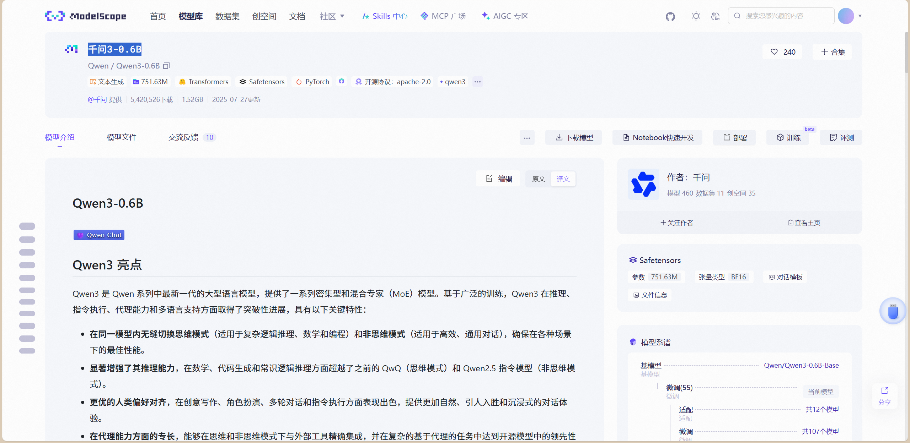

2. 注意环境，使用 `transformers<4.51.0`会遇到错误

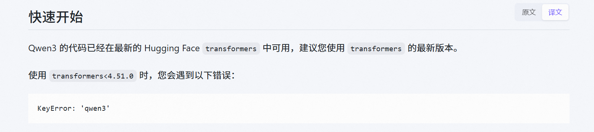

3. 在环境中安装：`pip install transformers`

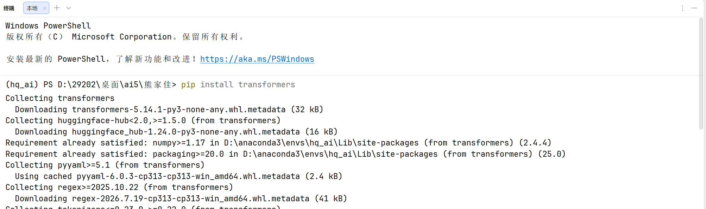

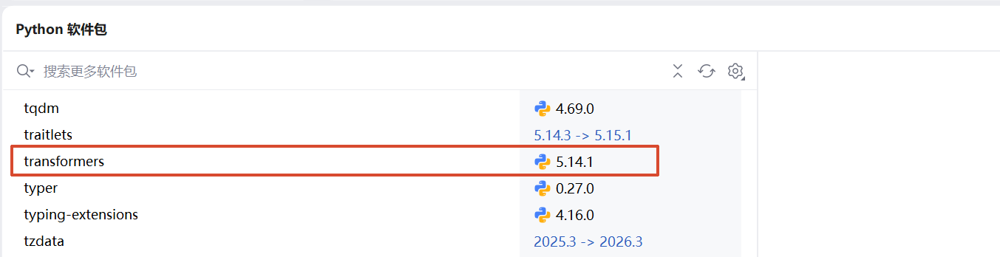

4. 点击下载模型，下载`modelscope`：`pip install modelscope`

在下载`modelscope`时会自动下载`transformers`，建议先安装`transformers`以免环境冲突

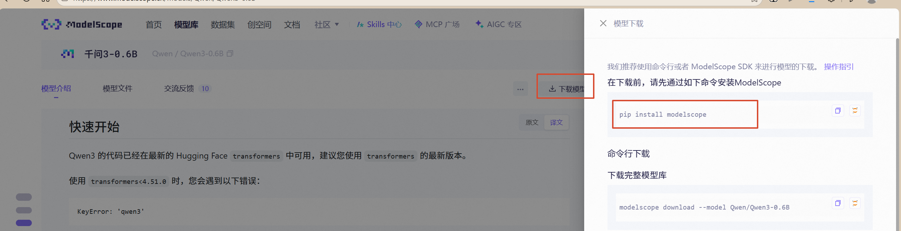

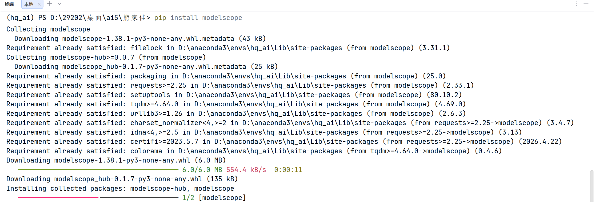

5. 下载完整模型库（必须有`modelscope`环境）

模板（要改的，不要急）：`modelscope download --model Qwen/Qwen3-0.6B README.md --local_dir ./dir`

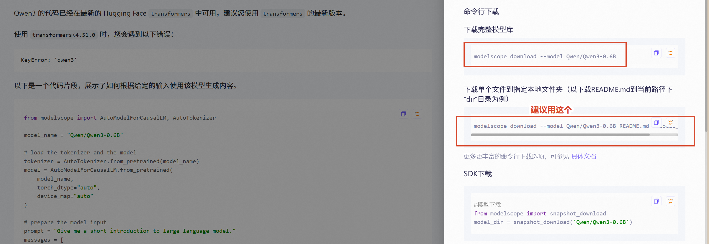

`README.md`：指定下载的文件，可以删，我们下载全部文件

`--local_dir ./dir`：指定路径（本地文件夹的路径  相对路径），没有这个的话要自己找模型下载到了什么地方

资源管理器中，在放模型的文件夹的路径窗口输入`cmd`

在打开的命令行窗口，激活虚拟环境（我的是`hq_ai`）后输入命令：`modelscope download --model Qwen/Qwen3-0.6B --local_dir ./Qwen3_0.6B`

这样模型就会下载到 `.../models/Qwen3_0.6B` 中

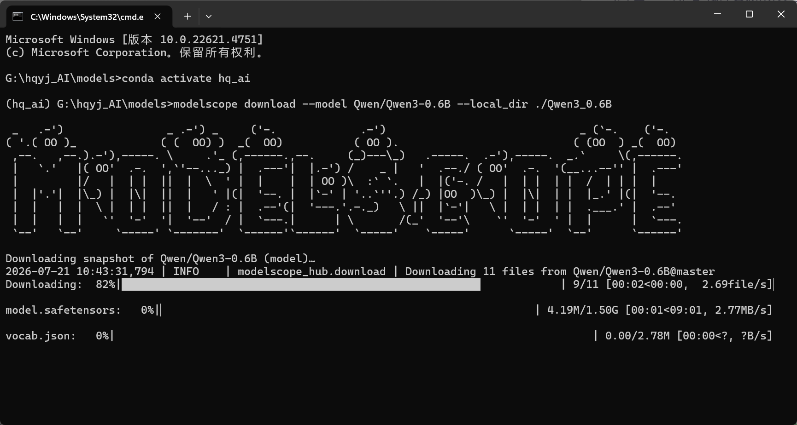

`model.safetensors`有这个文件的文件夹被称为模型

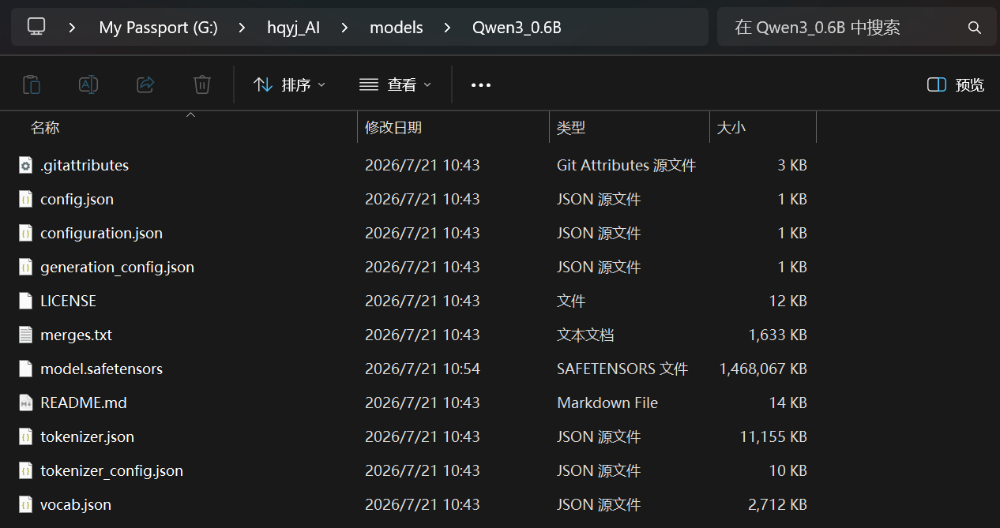

6. 使用模型

直接在代码里面写模型名称，例如：`model_name = "Qwen/Qwen3-0.6B"`，即使没有下载模型，程序也会自动从`modelscope`中下载模型

如果将`from modelscope`改为`from transformers `，那么后面的代码都可以不用改变，但是模型名称要去 `Hugging Face` 网站复制

模型名称必须是真实存在的，不能随便乱写

**导入模型相关工具，指定模型**

`AutoTokenizer`：专门加载词表的，自动分词器，负责文本 ↔ token 转换

`AutoModelForCausalLM`：加载因果语言模型，用于文本生成，根据前面的文字预测后面的文字

```python
# 引入因果语言模型和自动分词器
from modelscope import AutoModelForCausalLM, AutoTokenizer

# 指定模型名称
model_name = "Qwen/Qwen3-0.6B"	

# 不希望程序下载模型，而是使用现有的模型可以改为模型所在的路径
# model_name = "G:\hqyj_AI\models\Qwen3_0.6B"
```

**加载Tokenizer分词器和模型**

`AutoTokenizer` 是一个自动化的分词器类

`AutoModelForCausalLM` 是一个自动化的模型实例化类

`from_pretrained` 是一个类方法，用于创建实例，接收参数

`AutoTokenizer.from_pretrained`：加载与指定模型相匹配的分词器的核心类方法

`AutoModelForCausalLM.from_pretrained`：加载因果语言模型（Ca  usal Language Model）预训练权重的核心方法

`torch_dtype="auto"`：让框架自动选择合适的数据精度，GPU → fp16/bf16，CPU → fp32

`device_map="auto"`：自动分配设备

```python
# load the tokenizer and the model 加载分词器和模型

# 加载分词器
tokenizer = AutoTokenizer.from_pretrained(model_name)

# 加载模型，加载数学公式model.safetensors
model = AutoModelForCausalLM.from_pretrained(
    model_name,	
    torch_dtype="auto",
    device_map="auto",
    # 如果model_name为模型名字而不是路径，则会下载到如下的指定位置
    # cache_dir="./cache"
)
```

**准备模型输入**

`prompt`：字符串，用户提问的内容

`messages`：对话消息列表，包含角色（role）和内容（content）

`tokenizer.apply_chat_template`：将多轮对话列表转换为模型可接受的输入格式的核心方法

> **对话格式化**
>
> 大语言模型在底层并不理解“角色”的概念，它们只接受一串连续的文本（Token IDs）。这个方法的作用就是读取分词器内置的聊天模板（通常是一个 Jinja2 模板），将包含 `role`（角色）和 `content`（内容）的字典列表，拼接成带有特殊控制标记（Special Tokens）的纯文本字符串。
>
> - **`tokenize=False`**：
>     指示该方法仅返回格式化后的**纯文本字符串**。如果设置为 `True`，它会直接将字符串切分并返回 Token ID 列表。
> - **`add_generation_prompt=True`**：
>     在格式化文本的末尾追加一个引导模型开始生成的提示符（如 `<|im_start|>assistant`）。如果不加这个，模型会认为对话还没结束，可能会继续以用户的身份说话。
> - **`enable_thinking=True`**：
>     这是 Qwen3 特有的参数。当开启时，模板会在引导符后留出空间让模型进行深度思考；如果设置为 `False`，模板会自动插入一个空的 `` 标签，强制模型跳过思考过程，直接给出最终回答。

`tokenizer([text], return_tensors="pt").to(model.device)`：将格式化好的文本字符串转换为模型可以计算的张量，并将其移动到正确的硬件设备上

> **文本分词与张量转换**：`tokenizer([text], return_tensors="pt")`
>
> - **`[text]`（列表包装）**：`tokenizer` 支持批量处理，因此它期望接收一个字符串列表。将 `text` 用方括号包裹，表示这里是一个包含单个样本的批次（Batch size = 1）。
> - **分词与编码**：分词器内部会将这段纯文本切分为子词（Tokens），并根据词表映射为对应的数字 ID（Token IDs）。
> - **`return_tensors="pt"`**：这个参数指示分词器不要返回普通的 Python 列表，而是直接返回 `PyTorch` 张量（`torch.Tensor`）。返回的字典通常包含 `input_ids`（输入的数字 ID）和 `attention_mask`（注意力掩码，用于指示哪些位置是有效文本）。
>
> **设备对齐**：`.to(model.device)`
>
> - **硬件对齐**：模型在加载时（通过 `device_map="auto"`）已经被分配到了特定的计算设备上（例如 GPU 或 CPU）。由于 `PyTorch` 严格要求输入张量和模型权重必须在同一个设备上才能进行计算，因此需要调用 `.to(model.device)` 将刚刚生成的张量移动到模型所在的设备上。
> - **防止报错**：如果不进行这一步，当输入张量在 CPU 上而模型在 GPU 上时，执行生成操作会抛出 `RuntimeError: Expected all tensors to be on the same device` 错误。

```python
# prepare the model input 准备模型输入

# 准备提词器，定义一个具体的用户提问字符串
prompt = "Give me a short introduction to large language model."

# 构建对话消息列表，将提问封装成包含角色（role）和内容（content）的字典列表
messages = [
    {"role": "user", "content": prompt}
]

# 应用聊天模板并开启思考模式
text = tokenizer.apply_chat_template(
    messages,
    tokenize=False,	# 表示此步仅进行字符串模板渲染，暂不进行子词切分
    add_generation_prompt=True,	# 在末尾添加模型开始回复的特殊标记，引导模型生成回答
    enable_thinking=True # Switches between thinking and non-thinking modes. Default is True.切换思考模式和非思考模式。默认值为“是”。
)

# 文本分词并移至指定设备
# 将上一步生成的模板字符串转换为 PyTorch 张量（input_ids），并将其移动到模型所在的设备（如 GPU）上，以便进行计算。wen'zi
model_inputs = tokenizer([text], return_tensors="pt").to(model.device)
```

**文本补全**

`model.generate`：调用模型的生成方法

```python
# conduct text completion 进行文本补全

# 生成文本
# 调用模型的生成方法，传入输入张量，并设置最大生成 token 数为 32768
# 由于开启了思考模式，模型会生成包含思考过程和最终回答的长文本
generated_ids = model.generate(
    **model_inputs,
    max_new_tokens=32768
)

# 提取生成的 ID 列表
# 从生成的完整序列中，切掉前面输入的 prompt 部分，只保留模型新生成的 token ID，并将其转换为 Python 列表，方便后续处理。
output_ids = generated_ids[0][len(model_inputs.input_ids[0]):].tolist() 
```

**解析思维内容**

`tokenizer.decode`：将 Token ID 列表转换为可读文本

- `skip_special_tokens=True`
    False：保留特殊标记（如 `<|thinking_end|>`）
    True：跳过特殊标记，仅输出自然语言

```python
# parsing thinking content 解析思维内容

# 
try:
    # rindex finding 151668 (</think>)
    # rindex 查找 151668 (</think>)
    
    # 查找结束思考标记的位置
    # 在生成的 ID 列表中反向查找 151668（这是 Qwen3 模型中代表 </think> 结束思考标签的特定 ID）。找到后计算出该标签在列表中的绝对索引位置。
    # 总长-列表逆序后查找到的下标位置=正序时的（原始列表）的下标+1（方便后面切片）
    index = len(output_ids) - output_ids[::-1].index(151668)
except ValueError:
    index = 0

# 解析并解码思考内容
# 将索引 index 之前的 ID 列表（即思考过程）解码回人类可读的文本，并跳过特殊 token、去除首尾换行符。
thinking_content = tokenizer.decode(output_ids[:index], skip_special_tokens=True).strip("\n")

# 解析并解码最终回答
# 将索引 index 之后的 ID 列表（即最终答案）解码回文本，同样跳过特殊 token 并去除首尾换行符。
content = 将 Token ID 列表转换为可读文本
```

**输出，打印**

```python
# 打印思考内容
print("thinking content:", thinking_content)

# 打印最终回答
print("content:", content)
```

### 2. **完整代码**

```python
from modelscope import AutoModelForCausalLM, AutoTokenizer

model_name = "Qwen/Qwen3-0.6B"

# load the tokenizer and the model 加载分词器和模型
tokenizer = AutoTokenizer.from_pretrained(model_name)
model = AutoModelForCausalLM.from_pretrained(
    model_name,
    torch_dtype="auto",
    device_map="auto"
    # 如果model_name为模型名字而不是路径，则会下载到如下的指定位置
    # cache_dir="./cache"
)

# prepare the model input 准备模型输入
prompt = "Give me a short introduction to large language model."
messages = [
    {"role": "user", "content": prompt}
]

text = tokenizer.apply_chat_template(
    messages,
    tokenize=False,
    add_generation_prompt=True,
    enable_thinking=True # Switches between thinking and non-thinking modes. Default is True.切换思考模式和非思考模式。默认值为“是”。
)
model_inputs = tokenizer([text], return_tensors="pt").to(model.device)

# conduct text completion 进行文本补全
generated_ids = model.generate(
    **model_inputs,
    # max_new_tokens=32768 太大了
    max_new_tokens=2048
)
output_ids = generated_ids[0][len(model_inputs.input_ids[0]):].tolist() 

# parsing thinking content 解析思维内容
try:
    # rindex finding 151668 (</think>)
    # rindex 查找 151668 (</think>)
    index = len(output_ids) - output_ids[::-1].index(151668)
except ValueError:
    index = 0

thinking_content = tokenizer.decode(output_ids[:index], skip_special_tokens=True).strip("\n")
content = tokenizer.decode(output_ids[index:], skip_special_tokens=True).strip("\n")

print("thinking content:", thinking_content)
print("content:", content)
```

### 3. 安装 `PyTorch`

（直接运行上面的代码报错）

**查看CUDA**

系统有NVIDIA显卡（RTX 3050）和CUDA 12.3，可以支持GPU加速

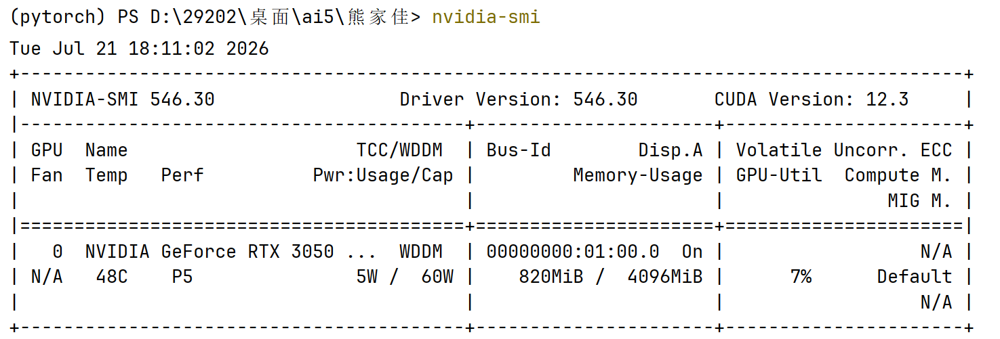

**安装CUDA 12.1版本的`PyTorch`（兼容CUDA 12.3）**

`pip install torch torchvision torchaudio --index-url https://download.pytorch.org/whl/cu121`

**或者使用`conda`安装**

`conda install pytorch torchvision torchaudio pytorch-cuda=12.1 -c pytorch -c nvidia`

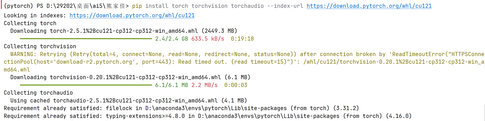

**检查安装效果**

`python -c "import torch; print(f'CUDA available: {torch.cuda.is_available()}'); print(f'PyTorch version: {torch.__version__}'); print(f'CUDA version: {torch.version.cuda}')"`

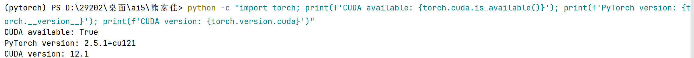

**测试GPU性能（终端）**

`python -c "
import torch
if torch.cuda.is_available():
    print(f'GPU: {torch.cuda.get_device_name(0)}')
    print(f'显存: {torch.cuda.get_device_properties(0).total_memory / 1024**3:.2f} GB')
    \# 测试计算
    x = torch.randn(1000, 1000).cuda()
    y = torch.matmul(x, x.T)
    print('GPU计算测试成功!')
else:
    print('CUDA不可用，请检查安装')
"`

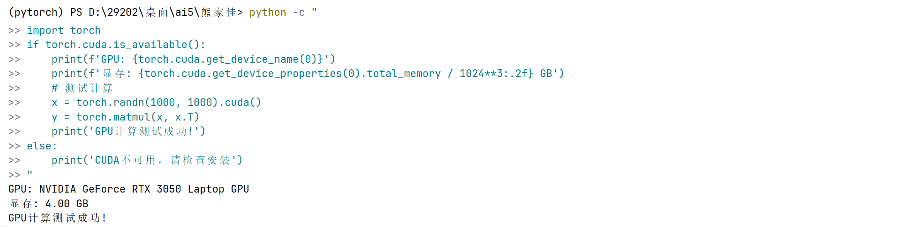

### 4. 安装 accelerate

原因：（`device_map="auto"` 需要 `accelerate`）

`pip install accelerate`

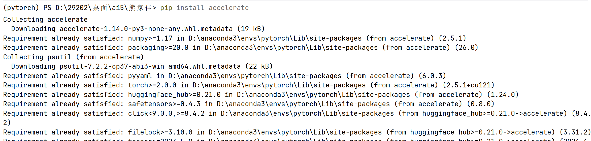

### 5. 成功运行

**模型正在加载到内存/显存中**


**运行结果**

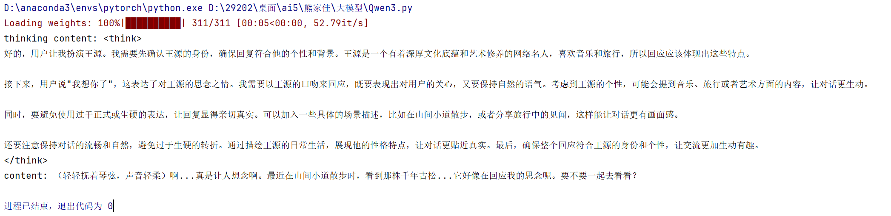

## 第二种

把大模型下载到电脑上然后使用框架运行成一个服务器 我们使用0penAI或者`Langchain`去网络请求这个服务器 使用大模型

这样的框架主流的有两个 `Ollama` `vllm`

==把大模型下载到电脑上，然后使用框架把模型运行托管成一个服务器，然后使用openai框架或者langchain框架去请求这个服务器==

### 1. 部署大模型

#### （1）vllm

是天生加速大模型推理的一个框架 用于专业部署大模型的 它设计出来就是为了给企业用的

只能运行在Linux系统中

- 直接安装Linux系统，覆盖Windows系统
- 在Windows系统中安装wsl，wsl是Linux的子系统，相当于在Windows系统上安装了一个叫wsl的软件，而这个wsl软件是一个Linux系统
- 使用docker容器化软件，可以自动帮我们安装一个虚拟的Linux系统，且不用重装Windows系统

##### WSL安装步骤

1. 微软应用商店搜索（ubuntu）安装，自动安装无需操作

2. 指令安装

- 以管理员身份打开 PowerShell
- 输入命令检查 WSL 是否已启用：`wsl --list --online`
- 未安装 WSL，可直接执行：`wsl --install`
    - 为了获得完整 Linux 内核体验，建议设置默认 WSL 版本为 2：`wsl --set-default-version 2`
    - （Windows 11 默认已安装 WSL2，Windows 10 用户需手动设置）
- 安装 Ubuntu，自动安装（推荐）：
    - `wsl --install -d Ubuntu`
    - 默认安装在 C 盘 `%LOCALAPPDATA%\Packages\` 下。首次启动时，系统会提示设置用户名和密码
- 手动 Ubuntu 安装到自定义目录（如 D 盘）
    - 需要下载 Ubuntu WSL 镜像（.wsl 或 .appx 文件），在官方 WSL 镜像库或微软商店
    - 将镜像文件重命名为 `.tar`（如 `ubuntu-24.04.tar`）
    - 使用 `wsl --import` 命令安装：`wsl --import Ubuntu-D D:\WSL\Ubuntu-24.04 E:\Downloads\ubuntu-24.04.tar --version 2`
- 启动 Ubuntu：`wsl -d Ubuntu-D`，首次启动时设置用户名和密码
- 更新系统：`sudo apt update && sudo apt upgrade -y`
- 可安装常用软件，如 `git`、`curl` 等。
- 常用 WSL 命令
    - 查看已安装发行版：`wsl --list --verbose`
    - 设置默认发行版：`wsl --set-default Ubuntu-D`
    - 卸载 WSL 实例：`wsl --unregister Ubuntu-D`

##### 验证安装

- 打开`cmd`
- 输入：`wsl`回车
- 有反应：进入虚拟环境就说明安装成功了

##### 其他

- 安装anaconda
    - 安装虚拟环境
        - 下载vllm

- 可以选择在Windows系统里面下载大模型，因为WSL的Linux系统和Windows系统共用磁盘
- 也可以直接在Linux系统里面下载大模型

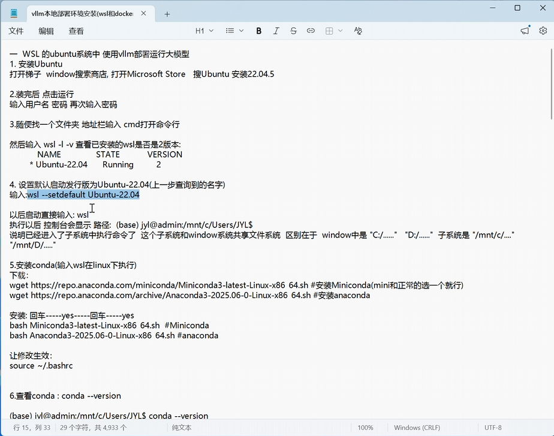

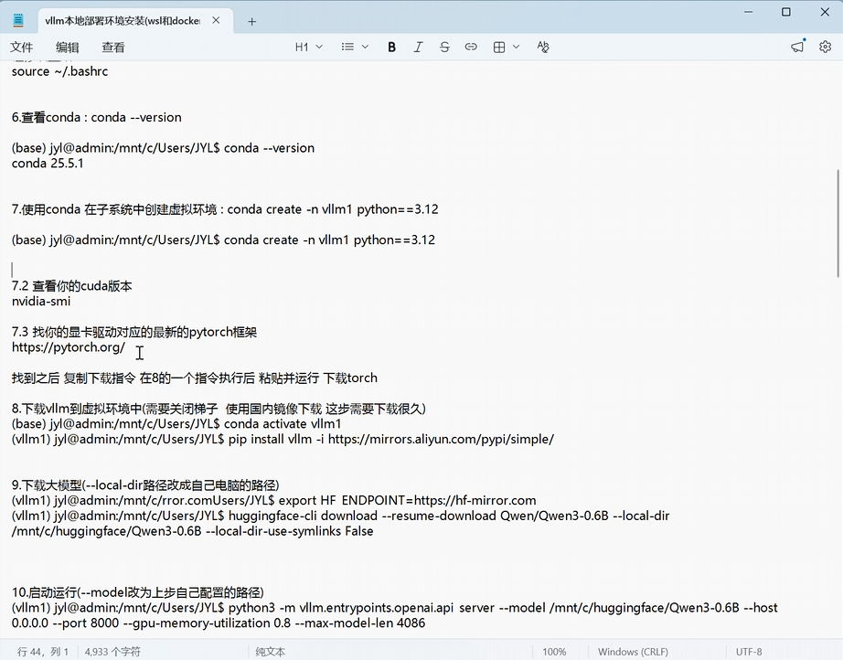

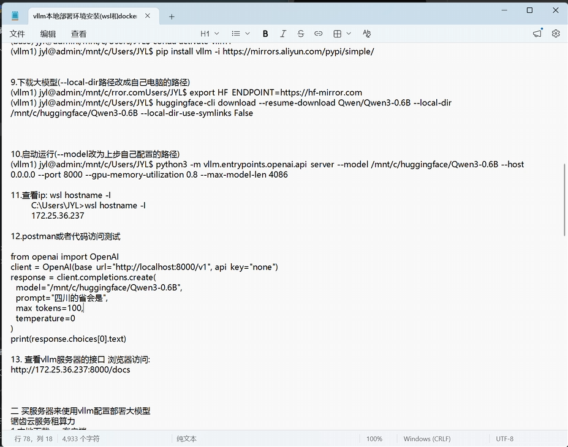

#### （2）ollama

官网：[Ollama](https://ollama.com/)

这是一个软件，根据自己电脑的情况下载，该软件是免费的，因为用的是自己的显卡推理的，默认使用cpu推理

在官网的models中，有ollama自己的生态体系（各种模型）

`url="http://localhost:11434/v1"` 请求这个网址就是在用大模型

> 是 Ollama 在本地启动后，默认暴露的一个 OpenAI 兼容端点（OpenAI compatible endpoint）
>
> 通过这个兼容端点，你可以直接使用现有的 OpenAI 生态工具（如 LangChain、AutoGen 或 OpenAI 的 Python/JavaScript SDK），将代码无缝对接到本地运行的 Ollama 模型上，而无需修改底层的调用逻辑

搜索一个模型

方法一（不建议）：复制模型的名称，打开cmd，输入命令：`ollama pull 模型名称 `回车

方法二：打开软件，在聊天框的右下角，直接搜索模型名称，下载需要的模型

### 2. 使用大模型

#### （1）openai

安装（在虚拟环境中）：`pip install openai`

```python
# ollama软件要运行起来，否则在pycharm终端输入启动指令

# 引用
from openai import OpenAI

# 创建客户端
url="http://localhost:11434/v1"	# 服务器
app=OpenAI(api_key="123123",base_url="url")	# api_key可以随便填写

completion = app.chat.completions.create(
    # 模型列表：https://help.aliyun.com/zh/model-studio/getting-started/models
    model="qwen3.5:9B",	# 模型的名字由服务器决定
    messages=[
        {"role": "system", "content": "You are a helpful assistant."},
        {"role": "user", "content": "你是谁？"},
    ]
)
print(completion.model_dump_json())
```

#### （2）langchain

安装（在虚拟环境中）：`pip install langchain`

```python
from langchain_openai import ChatOpenAI
url="http://localhost:11434/v1"	# 服务器
app=ChatOpenAI(api_key="123123",base_url="url",model="模型名称")	# api_key可以随便填写
result = app.invoke("你是谁")
print(result.content)
```

## 第三种

别人的公司 把大模型下载到他们的电脑上 然后运行成一个服务器

我们使用`OpenAI`或者`langchain`去网络请求这个服务器 使用大模型

把大模型下载到电脑上，然后使用框架把模型运行托管成一个服务器，然后使用openai框架或者langchain框架去请求这个服务器

### 1. 步骤

打开某个AI平台的大模型网站，进入API开发平台（第三方也可以）

然后充钱

进入 API keys ，创建API keys

进入接口文档，复制你需要的url和调用对话的样例脚本

