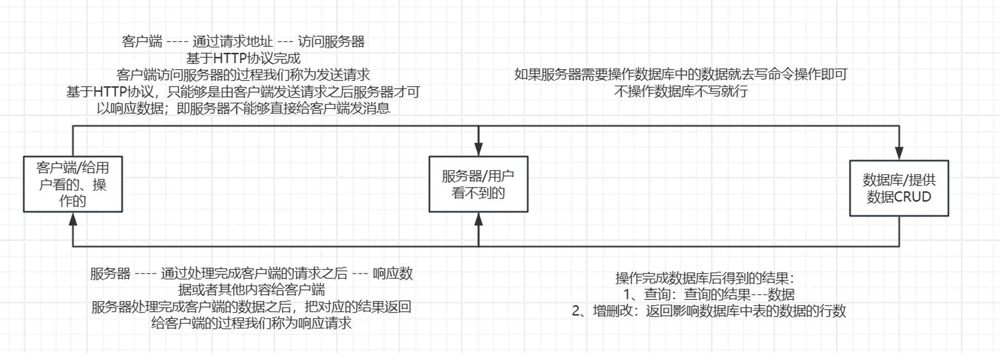
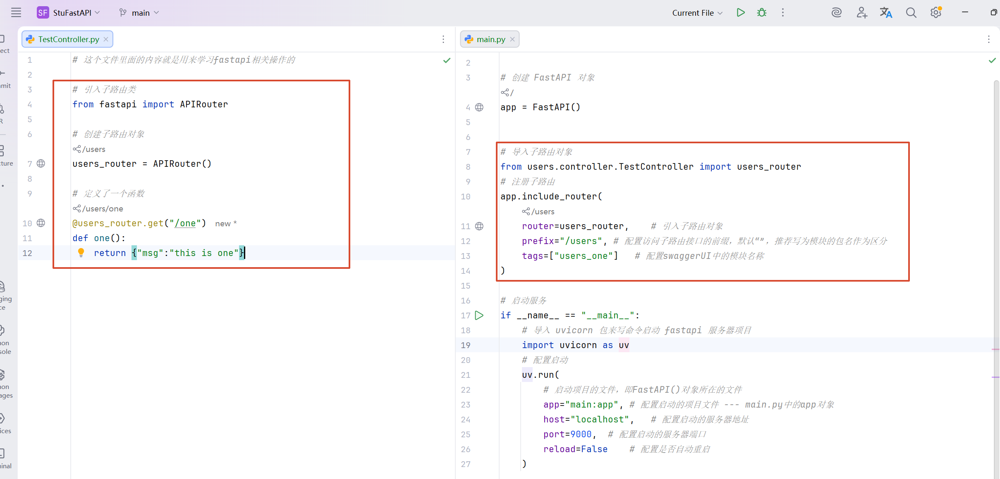
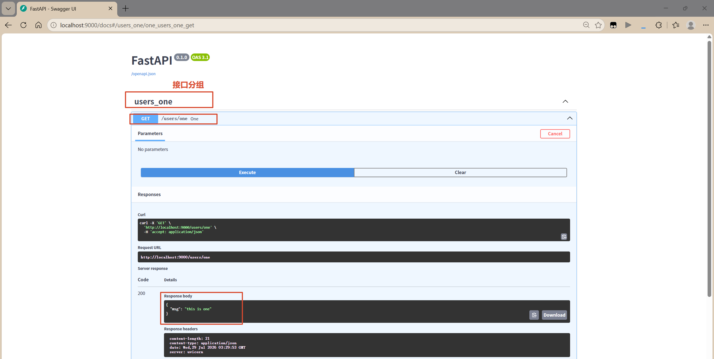

# 一、服务器

## （一）概念

生活中无处不在：

- 如果存在需要下载客户端后再使用，一般都是基于C/S模式【C/S -- 客户端/服务器模式】
- 如果不需要下载客户端就可以使用，一般都是基于B/S模式【B/S -- 浏览器/服务器模式】

我们项目中做的就是web【通过构造网页来实现项目中的内容和功能的展示】应用开发，是基于B/S模式来实现的

服务器开发的重点：

- **只有通过服务器我们才可以操作数据库中的内容**
- **注意服务器开发的时候分包的思想**
- **注意服务器开发的时候的术语【即通过一个内容可以有不同的称呼】**



## （二）python中服务器开发框架

- django：服务器开发框架
- flask：服务器开发框架
- **fastapi：服务器开发框架【选型】**

## （三）fastapi

网址：https://fastapi.tiangolo.com/zh/

### 1. 报错

| 报错                      | 常见原因                         |
| ------------------------- | -------------------------------- |
| 404 Not Found             | 接口不存在、路径错误、未注册路由 |
| 405 Method Not Allowed    | 请求方式错误（GET/POST 不匹配）  |
| 422 Unprocessable Entity  | 请求参数校验失败                 |
| 500 Internal Server Error | 接口内部代码异常                 |
| ModuleNotFoundError       | 模块不存在或依赖未安装           |
| ImportError               | 导入对象错误                     |
| Address already in use    | 端口已被占用                     |
| Connection Refused        | 服务未启动或地址错误             |
| NameError                 | 变量或对象未定义                 |

## （四）接口术语

**服务器中的接口指的就是提供给客户端实现某个功能的函数，这个函数和python中的普通函数定义没有任何区别，只是会多上一个请求路径配置【请求路径配置：告诉客户端通过什么请求地址才能访问到这个函数】**

接口函数不能够像调用普通函数一样的方式去调用，需要通过请求地址去访问 -- 常用工具：

- apipost：接口测试工具

- postman：接口测试工具

在 fastapi 里面可以不用上面的 2 个工具，因为 fastapi 中对 swagger ui 做了集成，直接通过 xxx/docs 地址就可以去到测试的界面，在界面上直接测试

## （五）安装

直接激活虚拟环境，输入命令：

`pip install fastapi "uvicorn[standard]" -i https://repo.huaweicloud.com/repository/pypi/simple/`

## （六）创建fastapi项目

现在的项目不是一个普通的项目，创建方式有一点区别


## （七）配置启动方式

方式一：


方式二：


## （八）接口相关的内容

### 1. 接口的定义格式

接口定义分为：

- 第一种：直接在 main.py 中定义接口
- 第二种：在其他文件中定义接口【项目中使用的方案】

请求方式：即规定客户端必须通过什么养的请求方式 + 请求地址来访问接口，常用表达式：

- get：最常见的，比如直接在浏览器地址栏中输入请求地址就属于get请求；通常情况下用于查询任务，客户端提交给服务器的参数信息会拼接在请求地址后面，客户端一表单格式传递参数


- post：客户端提交给服务器的参数信息包装在请求体里面，这里客户端需要以 json 格式传递参数，常用于新增、登录、参数内容过长等操作

关于接口返回数据据的时候：

- **都是以 json 格式作为返回值，但是我们不需要手动的通过 json.dumps 函数来转换，我们直接把返回值设置为一个字典即可自动完成转换**

定义接口名字、请求路径、接口客户端参数的形参的时候：

- 一般情况下，接口的名字满足 python 函数的命名规则，单词之间下划线隔开。比如 say_hello
- 请求路径按照小驼峰命名，比如 sayHello
- 形参：小驼峰命名规则

main.py 中直接定义接口：

```python
"""
定义一个接口 get 请求的接口：假设这个接口需要返回 msg:hello 给客户端
    1. 先直接定义一个函数 -- python 的普通函数
    2. 定义这个函数的访问路径，使之成为一个接口函数
    3. 设置函数的内容：比如逻辑处理、返回值设置、返回值等
"""

"""
@app:
    @       语法：固定
    app     FastAPI 对象
    get     设置请求方法，可选：get、post
    ()      语法，固定
    "/say"  设置访问这个接口的请求路径，这个路径需要拼接在服务器路径【http://localhost:9000】后面
"""

@app.get("/say")
def say():
    print("say 接口函数执行")
    # 设置返回值 -- 如果是返回数据直接就写入字典中即可，自动转json实现数据传递
    return {"msg": "hello"}

# post请求
@app.post("/say2")
def say2():
    print("say2 函数执行")
    return {"msg": "hello2"}
```

### 2. MVC思想

按照不同的项目模块和功能代码进行分包处理，降低代码耦合度，使得代码分层更清晰，测试更加方便，常见的分包方式：

- 模块划分包名：
    - 控制器包 contro11er ： 用于定义接口、接收客户端和响应客户端请求服务器包
    - 服务器包 service ：用于实现某个 controller 包下的接口的功能代码处理逻辑、返回值配置等，提供给 controller 调用
    - 数据库包 dao ：用于操作数据库的包，只操作数据库，不做任何逻辑处理，通常提供给 service 使用
    - 工具包 uti1s ： 用于抽取当前模块下的冗余代码形成工具
    - 实体包 entity ： 定义类作为实体【用于数据验证、接收客户端的 json 等定义类】
- 公共类型的代码 common ：很多模块都需要使用的二公局代码等，就放在 common 包下
- 同一个模块下，操作不同的业务选择创建不同的文件来实现，我们可以不需要创建类，直接定义函数接口【比如 chat 模块，既有聊天的业务、也有加载历史对话记录的业务，那么我们就创建 2 套文件，分别出来聊天业务和历史对话记录业务】
- 比如：针对于本次项目，实现 rag 对话我们可以按照以下格式分包
    - users： 用户模块
        - controller
        - service
        - dao
        - utils
        - entity
    - chat： 对话模块
        - controller
        - service
        - dao
        - utils
        - entity
    - common： 公共模块
    - ai： ai模块

### 3. 父子路由嵌套（重点）

我们由于采取分包分模块思想，那么我们定义的接口不是在main.py中，而是在对应的模块下的controller包下，那么在对应的模块下的controller包下就没有 FastAPI 的对象，因此定义不了直接给客户端访问的接口

这个时候，我们采取把对应的模块下的 controller 包下接口定义为子路由，然后在 main.py 中注册子路由即可



启动服务器后，进入docs：



- tags：用于为接口指定分组，仅影响 Swagger（/docs）中的接口分类显示，不影响接口的访问地址和功能。
- include_router(tags=[...])：为整个子路由设置默认分组；若接口自身也指定了 tags，则以接口上的 tags 为准。

### 4. 接口接收客户端请求参数信息【重要】

通常情况下分为以下三种情况：

- 表单格式数据【客户端设置的请求头中参数content-type: x-www-form-urlencoded】，配合 get 请求使用【通常情况下】；接
    收这个客户端参数的时候有以下几种办法：
    - 把请求参数通过k=v格式写在请求地址后面 --- 定义形参来接收
    - 把请求参数写在请求路径里面 --- 在请求路径中定义变量 + 接口方法形参来接收
- json格式数据【客户端设置的请求头中参数content-type: application/json】，配合 post 请求使用【通常情况下】；接收这个
    客户端参数的时候的办法：
    - 定义一个类，通过类的对象来接收
- file 文件类型【客户端设置的请求头中参数 content-type: multipart/form-data】，必须使用post 请求，接收的时候使用 UploadFile 对象来接收

明确前提：

- 无论选择什么样的方式传递数据给服务器，一定要满足 key 对的上【客户端和服务器交互数据的时候，基本都是通过 key : value 来实现，只能通过 key 找 value】

案例代码：

```python
"""
方式一：get请求+key = value数据
    直接用形参接收，形参的名字许哟啊和key相同，否则接收不到数据
"""
@users_router.get("/one")
def one(username: str,password:str):
    print(f"接收的数据：username={username}，password={password}")
    return{
        "code":200,
        "msg":"this is one",
        "data":{
            "u_n":username,
            "p_w":password
        }
    }


"""
方式二：get请求+参数直接在请求路径后面（没有key，只有value）
    需要现在接口的请求路径定义中，定义{变量}占位，然后在接口方法中定义和占位变量相同的名字的形参来接收，有顺序问题
    通常情况下，用于查询和删除操作
注意事项：
    接口函数的形参必须和请求路径中的占位符的名字一样，否则422报错
"""
@users_router.get("/two/{username}/{password}")
def teo(username: str, password: str):
    print(f"接收的数据：username={username}，password={password}")
    return{
        "code":200,
        "msg":"this is two",
        "data":{
            "u_n":username,
            "p_w":password
        }
    }


"""
方式三：post 请求 + json 格式数据【application/json】
    需要定义一个类来接收，类的属性的名字必须和json数据中key相同，比如：
        json --- {"username":"admin", "password":"111"}
        类 ---- username: str password: str
"""
from pydantic import BaseModel,Field
# 定义接收数据的类 -- 直接继承BaseModel即可
class tc(BaseModel):
    # 定义属性 -- Field(...,title="用户名") 关于这个属性的说明
    username: str = Field(..., title="用户名")
    password: str = Field(..., title="密码")
@users_router.post("/three")
def three(data: tc):
    print(f"接收的数据：username={data.username}，password={data.password}")
    print(data.username,data.password)
    return {
        "code":200,
        "msg":"this is three",
        "data":data
    }

"""
方式四：post 请求 + 文件 file
    file 类型的数据，必须用 post 请求
    通过接口形参来接收，形参用UploadFile类来接收
    file 以外的数据可以封装在From中，比如 username: str = Form(...) 就是接收变量username
"""
from fastapi import UploadFile,File,Form
import time
@users_router.post("/four")
def four(file: UploadFile = File(..., title="上传的文件"),username: str = Form(..., title="用户名")):
    print(f"接收的数据：username={username}，file={file.filename}")
    # 重定义文件名
    filename = str(int(time.time())) + file.filename.split(".")[-1]
    # 传入文件存储地址
    save_path= r"G:\GitHub\Stu_AI\StuFastAPI\static\upload"+filename
    # 读取并保存文件
    with open(save_path,"wb") as f:
        # 读取文件内容
        f.write(file.file.read())
    return {
        "code":200,
        "msg":"this is four",
        "data":{
            "file_name":filename
        }
    }
```

### 5. 流式输出

案例代码：

```python
"""
流式输出：StreamingResponse
    在 fastapi中，通过设置接口方法的返回值就可以实现流式输出
    参数1：content：一个迭代器（生成器）对象，直接通过yield作为函数的返回值即可创建出来迭代器（生成器）对象
    参数2：media_type: xxxx
"""
from starlette.responses import StreamingResponse

"""
流式输出方案一：直接把结果当前返回值返回，不做任何处理
    优点：服务器代码简单
    缺点：客户端代码非常难写
"""
@users_router.get("/stream_one")
def stream_one():
    # 设置模型返回值
    result = "程序员去医院体检，医生说：“你有点缺钙。”程序员点点头：“难怪最近老报错，原来不是代码有问题，是我这个‘运行环境’该升级了。”"
    # 定义生成器
    def generator():
        for i in result:
            yield f"{i}"
            time.sleep(0.05)
    # 返回结果
    return StreamingResponse(
        content=generator(),    # 迭代器对象
        media_type="text/event-stream",
    )

"""
流式输出方案二：客户端使用SSE请求，服务器必须把数据包装成data：数据内容\n\n 字符串格式，否则报错
    服务器中通常把数据内容转为json格式返回，便于客户处理，并且需要告诉客户但数据输出什么时候结束【给一个标识符】
    缺点：
"""
import json
@users_router.get("/stream_sse")
def stream_sse():
    result = "程序员去医院体检，医生说：“你有点缺钙。”程序员点点头：“难怪最近老报错，原来不是代码有问题，是我这个‘运行环境’该升级了。”"
    def generator():
        for i in result:
            yield f"data:{json.dumps({"content": i})}\n\n"
            time.sleep(0.05)
        yield f"data:{json.dumps({"content": "end_end"})}\n\n"
    return StreamingResponse(
        content=generator(),
        media_type="text/event-stream",
    )
```

## （四）作业

### 1. 封装加载 LLM 的工具函数

```python
# 在 ai 包下封装一个加载 LLM 的工具函数
# G:\GitHub\Stu_AI\StuFastAPI\ai\LoadLLM.py

from langchain_openai import ChatOpenAI
import os

# 创建模型对象
def create_model():
    return ChatOpenAI(
        api_key=os.getenv("DASHSCOPE_API_KEY"),
        base_url="https://dashscope.aliyuncs.com/compatible-mode/v1",
        model="qwen3.7-max",
        streaming=True,
    )
```

### 2. 实现 LLM 针对于问题生成回复并流式输出给客户端展示

```python
# main.py

from fastapi import FastAPI
# 创建 FastAPI 对象
app = FastAPI()

# 导入子路由对象
from users.controller.WorkController import work_router
# 注册子路由
app.include_router(
    router=work_router,
    prefix="/users",
    tags=["work"]
)

# 启动服务
if __name__ == "__main__":
    # 导入 uvicorn 包来写命令启动 fastapi 服务器项目
    import uvicorn as uv
    # 配置启动
    uv.run(
        # 启动项目的文件，即FastAPI()对象所在的文件
        app="main:app", # 配置启动的项目文件 --- main.py中的αpp对象
        host="localhost",   # 配置启动的服务器地址
        port=9000,  # 配置启动的服务器端口
        reload=False    # 配置是否自动重启
    )
```

```python
# 在 TestController 包下实现用户输入问题 --> LLM 针对于问题生成回复 --> 流式输出给客户端展示
# G:\GitHub\Stu_AI\StuFastAPI\users\controller\WorkController.py

# 引入子路由类
from fastapi import APIRouter
# 创建子路由对象
work_router = APIRouter()

# 引入 LLM 模型
from ai.LoadLLM import create_model
# 流式输出
from starlette.responses import StreamingResponse
# 引入json包
import json

@work_router.get("/stream")
def stream(question: str):
    # 创建模型对象
    llm = create_model()
    # 接收用户输入的问题
    print(f"接收的问题：question={question}")
    # 角色
    messages = [
        {"role": "system", "content": "You are a helpful assistant."},
        {"role": "user", "content": question}]
    # 创建生成器
    def generator():
        for chunk in llm.stream(messages):
            if chunk.content:
                yield f"data: {json.dumps({'content': chunk.content})}\n\n"
        yield f"data: {json.dumps({'content': 'end_end'})}\n\n"
    # 流式输出
    return StreamingResponse(

        content=generator(),
        media_type="text/event-stream",
    )
```

